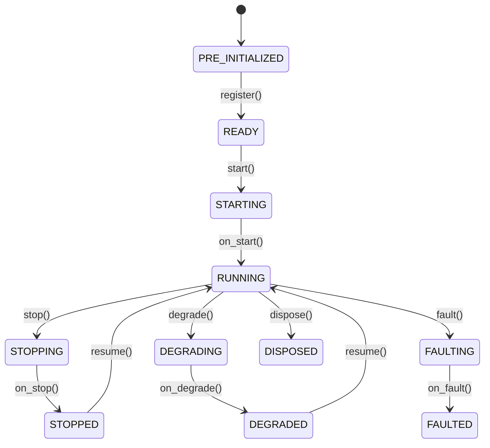

# Actor

`Actor` 负责接收数据、处理事件并管理状态。`Strategy` 类在 Actor 的基础上
扩展了订单管理能力。

**主要能力**：

- 数据订阅和请求（市场数据、自定义数据）。
- 事件处理和发布。
- 定时器和提醒。
- 缓存和投资组合访问。
- 日志记录。

## 基础示例

Actor 支持通过与策略类似的模式进行配置。

```python
from nautilus_trader.config import ActorConfig
from nautilus_trader.model import InstrumentId
from nautilus_trader.model import Bar, BarType
from nautilus_trader.common.actor import Actor


class MyActorConfig(ActorConfig):
    instrument_id: InstrumentId   # example value: "ETHUSDT-PERP.BINANCE"
    bar_type: BarType             # example value: "ETHUSDT-PERP.BINANCE-15-MINUTE[LAST]-INTERNAL"
    lookback_period: int = 10


class MyActor(Actor):
    def __init__(self, config: MyActorConfig) -> None:
        super().__init__(config)

        # Custom state variables
        self.count_of_processed_bars: int = 0

    def on_start(self) -> None:
        # Subscribe to bars matching the configured bar type
        self.subscribe_bars(self.config.bar_type)

    def on_bar(self, bar: Bar) -> None:
        self.count_of_processed_bars += 1
```

## Actor 配置与 ID

Actor 可以接收一个 `ActorConfig` 子类。基础配置中可以包含 `actor_id`；
如果提供了该字段，Actor 将以该 ID 注册。如果省略，系统会派生出一个
运行时 actor ID。

将配置视为 Actor 的构造数据。通过 `self.config` 读取用户提供的设置，
而将运行时状态保存在 Actor 自身上。

:::info Rust 实现
对于 Rust actor，生成或分配的运行时 ID 保存在 actor 核心上，而不是被写回
`DataActorConfig`。这与 Python 桥接路径不同，后者在从可导入的配置创建
Python 对象时，可能会将继承的配置字段复制到运行时状态中。

Rust 编写者实现 `DataActor`，并使用 `self` 上的外观（facade）方法。
`DataActorNative` 是仅限原生代码访问的接口，用于运行时接线（wiring）
和借用核心状态。仅在同一二进制文件内的性能敏感路径或内部运行时接线场景中导入它。
:::

## 生命周期

Actor 在其生命周期中遵循一个明确定义的状态机：



重写以下方法以挂钩生命周期事件：

| 方法          | 调用时机                                                         |
|-----------------|---------------------------------------------------------------------|
| `on_start()`    | Actor 正在启动（在此处订阅数据）。                         |
| `on_stop()`     | Actor 正在停止（取消定时器，清理资源）。              |
| `on_resume()`   | Actor 正从已停止状态恢复。                             |
| `on_reset()`    | 重置指标和内部状态（在多次回测运行之间调用）。 |
| `on_degrade()`  | Actor 正进入降级状态（部分功能可用）。         |
| `on_fault()`    | Actor 遇到了故障。                                      |
| `on_dispose()`  | Actor 正在被释放（最终清理）。                          |

## 定时器和提醒

Actor 可以访问一个时钟，用于调度：

```python
def on_start(self) -> None:
    # Set a recurring timer with a callback (fires every 5 seconds)
    self.clock.set_timer(
        "my_timer",
        timedelta(seconds=5),
        callback=self._on_timer,
    )

    # Set a one-time alert with a callback
    self.clock.set_time_alert(
        "my_alert",
        self.clock.utc_now() + timedelta(minutes=1),
        callback=self._on_alert,
    )

def on_stop(self) -> None:
    # Cancel timers to prevent resource leaks across stop/resume cycles
    self.clock.cancel_timer("my_timer")

def _on_timer(self, event: TimeEvent) -> None:
    self.log.info("Timer fired!")

def _on_alert(self, event: TimeEvent) -> None:
    self.log.info("Alert triggered!")
```

传入一个 `callback`，将 `TimeEvent` 对象定向到你自己的方法。如果
省略回调，事件将改为传递给 `on_event`。

## 系统访问

Actor 可以访问核心系统组件：

| 属性          | 说明                                              |
|-------------------|----------------------------------------------------------|
| `self.cache`      | 金融工具、订单、仓位等的共享状态。    |
| `self.portfolio`  | 投资组合状态和计算。                        |
| `self.clock`      | 当前时间以及定时器/提醒的调度。                 |
| `self.log`        | 结构化日志记录。                                      |
| `self.msgbus`     | 发布/订阅自定义消息。                    |

关于组件之间的自定义消息传递，请参阅[消息总线（Message Bus）](message_bus.md)指南。

## 数据处理与回调

系统根据数据是历史数据还是实时数据，使用不同的回调处理器。
理解数据*请求/订阅*与其处理器之间的关系至关重要。

### 历史数据 vs 实时数据

系统区分两种数据流：

1. **历史数据**（来自*请求*）：
   - 通过 `request_bars()`、`request_quote_ticks()` 等方法获得。
   - 通过 `on_historical_data()` 处理器处理。
   - 用于初始数据加载和历史分析。

2. **实时数据**（来自*订阅*）：
   - 通过 `subscribe_bars()`、`subscribe_quote_ticks()` 等方法获得。
   - 通过 `on_bar()`、`on_quote_tick()` 等特定处理器处理。
   - 用于实时数据处理。

### 回调处理器

不同的数据操作映射到以下处理器：

| 操作                            | 类别   | 处理器                  | 用途                                           |
|--------------------------------------|------------|--------------------------|---------------------------------------------------|
| `subscribe_data()`                   | 实时  | `on_data()`              | 实时数据更新。                                |
| `subscribe_instrument()`             | 实时  | `on_instrument()`        | 实时金融工具定义更新。               |
| `subscribe_instruments()`            | 实时  | `on_instrument()`        | 实时金融工具定义更新（针对交易场所）。   |
| `subscribe_order_book_deltas()`      | 实时  | `on_order_book_deltas()` | 实时订单簿差量。                           |
| `subscribe_order_book_depth()`       | 实时  | `on_order_book_depth()`  | 实时订单簿深度快照。                  |
| `subscribe_order_book_at_interval()` | 实时  | `on_order_book()`        | 按固定间隔的实时订单簿快照。           |
| `subscribe_quote_ticks()`            | 实时  | `on_quote_tick()`        | 实时报价更新。                               |
| `subscribe_trade_ticks()`            | 实时  | `on_trade_tick()`        | 实时成交更新。                               |
| `subscribe_mark_prices()`            | 实时  | `on_mark_price()`        | 实时标记价格更新。                          |
| `subscribe_index_prices()`           | 实时  | `on_index_price()`       | 实时指数价格更新。                         |
| `subscribe_bars()`                   | 实时  | `on_bar()`               | 实时 K 线更新。                                 |
| `subscribe_funding_rates()`          | 实时  | `on_funding_rate()`      | 实时资金费率更新。                        |
| `subscribe_instrument_status()`      | 实时  | `on_instrument_status()` | 实时金融工具状态更新。                   |
| `subscribe_instrument_close()`       | 实时  | `on_instrument_close()`  | 实时金融工具收盘更新。                    |
| `subscribe_option_greeks()`          | 实时  | `on_option_greeks()`     | 实时期权希腊值更新。                       |
| `subscribe_option_chain()`           | 实时  | `on_option_chain()`      | 实时期权链切片快照。                |
| `request_data()`                     | 历史 | `on_historical_data()`   | 历史数据处理。                       |
| `request_order_book_deltas()`        | 历史 | `on_historical_data()`   | 历史订单簿差量。                     |
| `request_order_book_depth()`         | 历史 | `on_historical_data()`   | 历史订单簿深度。                      |
| `request_order_book_snapshot()`      | 历史 | `on_historical_data()`   | 历史订单簿快照。                   |
| `request_instrument()`               | 历史 | `on_instrument()`        | 金融工具定义。                            |
| `request_instruments()`              | 历史 | `on_instrument()`        | 金融工具定义（多个）。                            |
| `request_quote_ticks()`              | 历史 | `on_historical_data()`   | 历史报价处理。                     |
| `request_trade_ticks()`              | 历史 | `on_historical_data()`   | 历史成交处理。                     |
| `request_bars()`                     | 历史 | `on_historical_data()`   | 历史 K 线处理。                       |
| `request_aggregated_bars()`          | 历史 | `on_historical_data()`   | 历史聚合 K 线（即时计算）。          |
| `request_funding_rates()`            | 历史 | `on_historical_data()`   | 历史资金费率处理。              |

### 示例

此示例同时展示了历史数据和实时数据的处理：

```python
from nautilus_trader.common.actor import Actor
from nautilus_trader.config import ActorConfig
from nautilus_trader.core.data import Data
from nautilus_trader.model import Bar, BarType
from nautilus_trader.model import ClientId, InstrumentId


class MyActorConfig(ActorConfig):
    instrument_id: InstrumentId  # example value: "AAPL.XNAS"
    bar_type: BarType            # example value: "AAPL.XNAS-1-MINUTE-LAST-EXTERNAL"


class MyActor(Actor):
    def __init__(self, config: MyActorConfig) -> None:
        super().__init__(config)
        self.bar_type = config.bar_type

    def on_start(self) -> None:
        # Request historical data - will be processed by on_historical_data() handler
        self.request_bars(
            bar_type=self.bar_type,
            # Many optional parameters
            start=None,                # pd.Timestamp | None
            end=None,                  # pd.Timestamp | None
            callback=None,             # Callable[[UUID4], None] | None
            update_catalog_mode=None,  # UpdateCatalogMode | None
            params=None,               # dict[str, Any] | None
        )

        # Subscribe to real-time data - will be processed by on_bar() handler
        self.subscribe_bars(
            bar_type=self.bar_type,
            # Many optional parameters
            client_id=None,  # ClientId, optional
            params=None,     # dict[str, Any], optional
        )

    def on_historical_data(self, data: Data) -> None:
        # Handle historical data (from requests)
        if isinstance(data, Bar):
            self.log.info(f"Received historical bar: {data}")

    def on_bar(self, bar: Bar) -> None:
        # Handle real-time bar updates (from subscriptions)
        self.log.info(f"Received real-time bar: {bar}")
```

当 `validate_data_sequence=True` 时，请通过 `request_bars()` 的
`callback`（而不是单独调用 `subscribe_bars()`）来订阅实时 K 线，
以确保数据流仅在历史数据加载完成后才开始；参见
[使用 K 线：请求 vs. 订阅](data/index.md#working-with-bars-request-vs-subscribe)。

将历史数据处理器和实时数据处理器分开，使你可以根据上下文
应用不同的处理逻辑。例如：

- 使用历史数据初始化指标或建立基线指标。
- 对实时数据应用不同的处理逻辑，用于实盘交易决策。
- 对历史数据和实时数据应用不同的校验或日志记录方式。

:::tip
在调试数据流问题时，请确认你查看的处理器与你的数据来源相匹配。
如果你没有在 `on_bar()` 中看到数据，但看到了关于接收到 K 线的日志消息，
请检查 `on_historical_data()`，因为该数据可能来自请求而不是订阅。
:::

## 订单事件订阅

需要订单生命周期事件的 Actor 可以直接订阅消息总线。可用于
监控成交、撤单，或某个策略的所有订单事件，而无需添加专门的
Actor 回调方法。

在 `on_start()` 中订阅，并在 `on_stop()` 中使用相同的处理器取消订阅。
这样可以使直接的消息总线订阅与 actor 生命周期保持一致。

常见的订单事件主题：

| 主题模式                           | 接收内容                                 |
|-----------------------------------------|------------------------------------------|
| `events.order_filled.{instrument_id}`   | 某个金融工具的成交事件。          |
| `events.order_canceled.{instrument_id}` | 某个金融工具的撤单事件。        |
| `events.order.{strategy_id}`            | 路由给某个策略的所有订单事件。 |
| `events.order.*`                        | 所有已路由到策略的订单事件。        |

### 金融工具的成交和撤单事件

```python
from nautilus_trader.common.actor import Actor
from nautilus_trader.config import ActorConfig
from nautilus_trader.model import InstrumentId
from nautilus_trader.model.events import OrderCanceled
from nautilus_trader.model.events import OrderFilled


class MyActorConfig(ActorConfig):
    instrument_id: InstrumentId  # example value: "ETHUSDT-PERP.BINANCE"


class FillMonitorActor(Actor):
    def __init__(self, config: MyActorConfig) -> None:
        super().__init__(config)
        self.fill_count = 0
        self.total_volume = 0.0

    def on_start(self) -> None:
        instrument_id = self.config.instrument_id
        self.msgbus.subscribe(
            topic=f"events.order_filled.{instrument_id}",
            handler=self._on_order_filled,
        )
        self.msgbus.subscribe(
            topic=f"events.order_canceled.{instrument_id}",
            handler=self._on_order_canceled,
        )

    def on_stop(self) -> None:
        instrument_id = self.config.instrument_id
        self.msgbus.unsubscribe(
            topic=f"events.order_filled.{instrument_id}",
            handler=self._on_order_filled,
        )
        self.msgbus.unsubscribe(
            topic=f"events.order_canceled.{instrument_id}",
            handler=self._on_order_canceled,
        )

    def _on_order_filled(self, event: OrderFilled) -> None:
        self.fill_count += 1
        self.total_volume += float(event.last_qty)

        self.log.info(
            f"Fill received: {event.order_side} {event.last_qty} @ {event.last_px}, "
            f"Total fills: {self.fill_count}, Volume: {self.total_volume}"
        )

    def _on_order_canceled(self, event: OrderCanceled) -> None:
        self.log.info(f"Cancel received: {event.client_order_id}")
```

### 策略订单生命周期事件

```python
from nautilus_trader.common.actor import Actor
from nautilus_trader.config import ActorConfig
from nautilus_trader.model import StrategyId
from nautilus_trader.model.events import OrderEvent


class MyActorConfig(ActorConfig):
    strategy_id: StrategyId  # example value: "EMA-CROSS-001"


class StrategyOrderMonitorActor(Actor):
    def __init__(self, config: MyActorConfig) -> None:
        super().__init__(config)
        self.order_event_count = 0

    def on_start(self) -> None:
        self._order_topic = f"events.order.{self.config.strategy_id}"
        self.msgbus.subscribe(
            topic=self._order_topic,
            handler=self._on_strategy_order_event,
        )

    def on_stop(self) -> None:
        self.msgbus.unsubscribe(
            topic=self._order_topic,
            handler=self._on_strategy_order_event,
        )

    def _on_strategy_order_event(self, event: OrderEvent) -> None:
        self.order_event_count += 1

        self.log.info(
            f"Order event received: {type(event).__name__}, "
            f"Total events: {self.order_event_count}"
        )
```

:::note
直接的消息总线订阅不会发送数据引擎命令。它们只会接收发布到
匹配主题上的消息，直到你取消订阅该处理器为止。
:::

## 相关指南

- [策略（Strategies）](strategies.md) - 策略在 Actor 的基础上扩展了订单管理能力。
- [数据（Data）](data/) - Actor 可用的数据类型和订阅方式。
- [消息总线（Message Bus）](message_bus.md) - Actor 用于通信的消息传递系统。
