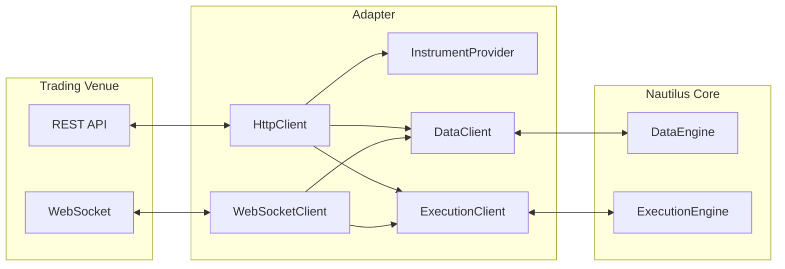

# 适配器（Adapters）

适配器（Adapters）将数据提供方和交易场所（trading venues）集成到 NautilusTrader 中。
它们位于顶层的 `adapters` 子包中。

一个适配器通常包含以下组件：



| 组件                  | 用途                                                    |
|----------------------|------------------------------------------------------------|
| `HttpClient`         | REST API 通信。                                    |
| `WebSocketClient`    | 实时流式连接。                            |
| `InstrumentProvider` | 从交易场所加载并解析金融工具定义。    |
| `DataClient`         | 处理市场数据的订阅和请求。            |
| `ExecutionClient`    | 处理订单提交、修改和撤销。  |

## 金融工具提供方（Instrument providers）

金融工具提供方（Instrument providers）将交易场所 API 的响应解析为 Nautilus 的 `Instrument` 对象。

`InstrumentProvider` 服务于两种使用场景：

- 独立发现可用于研究或回测的金融工具
- 在 `sandbox` 或 `live` [环境上下文（environment context）](architecture.md#environment-contexts)
  中为 actor 和策略进行运行时加载

### 研究和回测

以下是发现 Binance 期货测试网当前金融工具的示例：

```python
import asyncio
import os

from nautilus_trader.adapters.binance.common.enums import BinanceAccountType
from nautilus_trader.adapters.binance.common.enums import BinanceEnvironment
from nautilus_trader.adapters.binance import get_cached_binance_http_client
from nautilus_trader.adapters.binance.futures.providers import BinanceFuturesInstrumentProvider
from nautilus_trader.common.component import LiveClock


async def main():
    clock = LiveClock()

    client = get_cached_binance_http_client(
        clock=clock,
        account_type=BinanceAccountType.USDT_FUTURES,
        api_key=os.getenv("BINANCE_FUTURES_TESTNET_API_KEY"),
        api_secret=os.getenv("BINANCE_FUTURES_TESTNET_API_SECRET"),
        environment=BinanceEnvironment.TESTNET,
    )

    provider = BinanceFuturesInstrumentProvider(
        client=client,
        account_type=BinanceAccountType.USDT_FUTURES,
    )

    await provider.load_all_async()

    # Access loaded instruments
    instruments = provider.list_all()
    print(f"Loaded {len(instruments)} instruments")


if __name__ == "__main__":
    asyncio.run(main())
```

### 实盘交易

各个集成对此处理方式不同。`TradingNode` 内部的 `InstrumentProvider`
通常提供两种加载行为：

- 启动时加载所有金融工具：

```python
from nautilus_trader.config import InstrumentProviderConfig

InstrumentProviderConfig(load_all=True)
```

- 仅加载配置中指定的金融工具：

```python
InstrumentProviderConfig(load_ids=["BTCUSDT-PERP.BINANCE", "ETHUSDT-PERP.BINANCE"])
```

订阅本身不会加载金融工具。在策略订阅实时数据之前，需要配置
提供方在启动时加载该金融工具，或显式请求该金融工具并等待其
进入缓存。

## 数据客户端（Data clients）

数据客户端（Data clients）处理某个交易场所的市场数据订阅和请求。它们连接到交易场所的
API，并将传入的数据规范化为 Nautilus 类型。

### 请求数据

Actor 和策略可以使用内置方法请求数据。数据通过回调返回：

```python
from nautilus_trader.model import Instrument, InstrumentId
from nautilus_trader.trading.strategy import Strategy


class MyStrategy(Strategy):
    def on_start(self) -> None:
        # Request an instrument definition
        self.request_instrument(InstrumentId.from_str("BTCUSDT-PERP.BINANCE"))

        # Request historical bars
        self.request_bars(BarType.from_str("BTCUSDT-PERP.BINANCE-1-HOUR-LAST-EXTERNAL"))

    def on_instrument(self, instrument: Instrument) -> None:
        self.log.info(f"Received instrument: {instrument.id}")

    def on_historical_data(self, data) -> None:
        self.log.info(f"Received historical data: {data}")
```

### 订阅数据

对于实时数据，使用订阅方法：

```python
def on_start(self) -> None:
    # Assumes the instrument has already been loaded into the cache
    # Subscribe to live trade updates
    self.subscribe_trade_ticks(InstrumentId.from_str("BTCUSDT-PERP.BINANCE"))

    # Subscribe to live bars
    self.subscribe_bars(BarType.from_str("BTCUSDT-PERP.BINANCE-1-MINUTE-LAST-EXTERNAL"))

def on_trade_tick(self, tick: TradeTick) -> None:
    self.log.info(f"Trade: {tick}")

def on_bar(self, bar: Bar) -> None:
    self.log.info(f"Bar: {bar}")
```

:::tip
有关可用的请求与订阅方法及其对应回调的完整参考，请参阅
[Actors](actors.md) 文档。
:::

## 执行客户端（Execution clients）

执行客户端（Execution clients）处理某个交易场所的订单管理。它们将 Nautilus 订单命令
转换为特定交易场所的 API 调用，并将执行报告处理为 Nautilus 事件返回。

主要职责：

- 提交、修改和撤销订单。
- 处理成交（fills）和执行报告。
- 与交易场所核对（reconcile）订单状态。
- 处理账户和仓位更新。

`ExecutionEngine` 会根据订单所属的交易场所，将命令路由到相应的
执行客户端。有关从策略角度看订单管理的详细信息，请参阅
[执行（Execution）](execution.md)指南。

:::tip
关于构建自定义适配器，请参阅[适配器开发者指南](../developer_guide/adapters.md)。
:::

## 相关指南

- [实盘交易（Live Trading）](live.md) - 使用适配器配置和运行实盘交易。
- [执行（Execution）](execution.md) - 通过适配器执行订单。
- [数据（Data）](data/) - 由适配器提供的市场数据。
