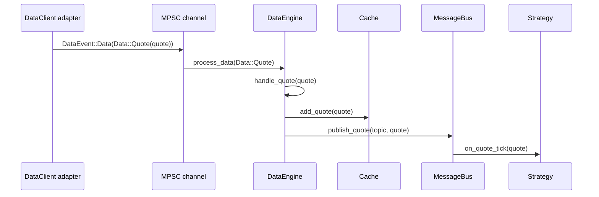
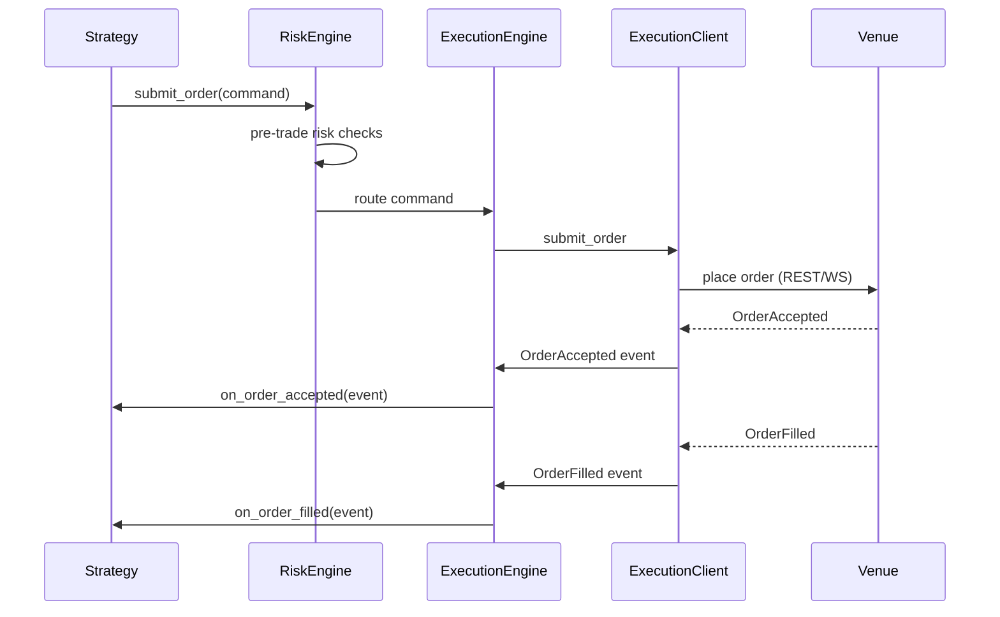
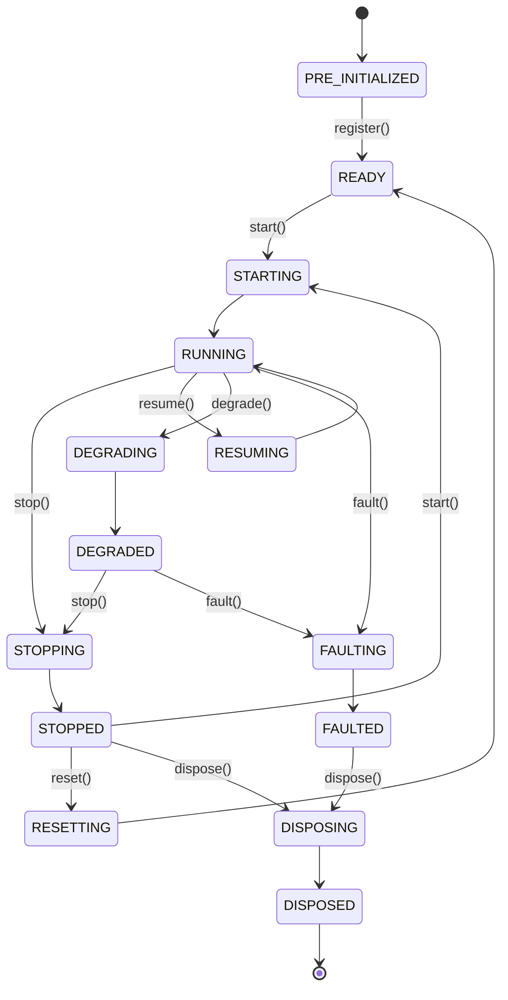
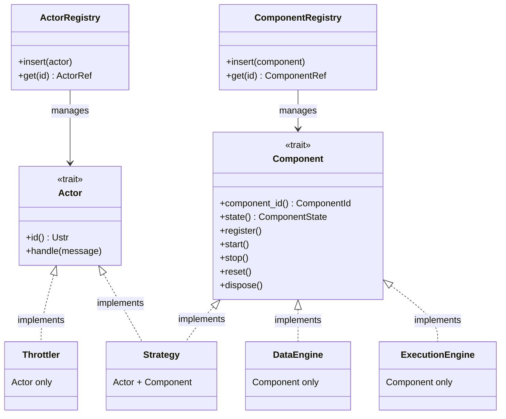
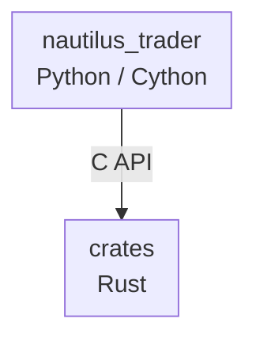
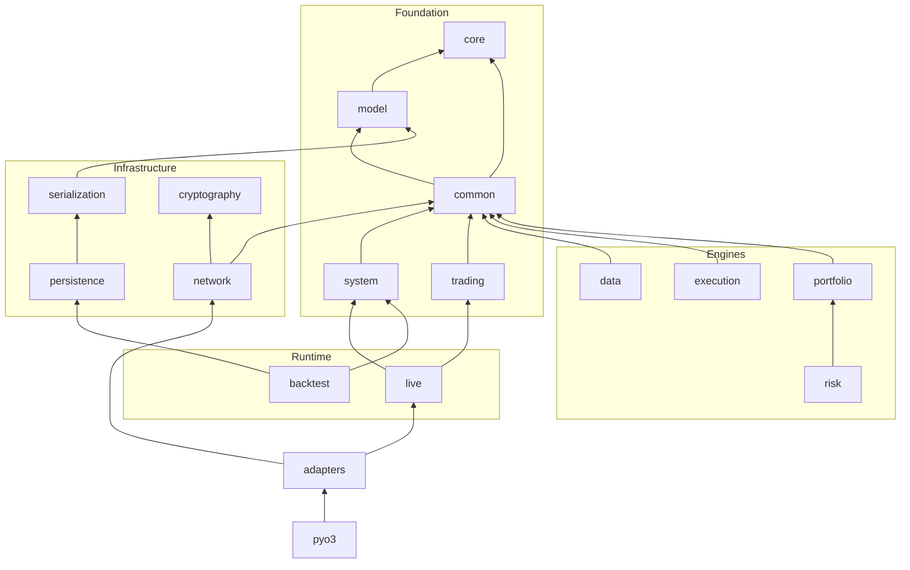

# 架构（Architecture）

本指南介绍 NautilusTrader 的架构原则和结构：

- 设计理念和质量属性。
- 核心组件及其交互方式。
- 环境上下文（backtest、sandbox、live）。
- 框架组织和代码结构。

:::note
在本文档中，术语 *“Nautilus 系统边界（system boundary）”* 指的是单个 Nautilus 节点
（也称为“交易实例”）运行时内部的操作。
:::

## 设计理念

NautilusTrader 采用的主要架构技术和设计模式包括：

- [领域驱动设计（DDD）](https://en.wikipedia.org/wiki/Domain-driven_design)
- [事件驱动架构（Event-driven architecture）](https://en.wikipedia.org/wiki/Event-driven_programming)
- [消息传递模式（Messaging patterns）](https://en.wikipedia.org/wiki/Messaging_pattern)（发布/订阅、请求/响应、点对点）
- [端口与适配器（Ports and adapters）](https://en.wikipedia.org/wiki/Hexagonal_architecture_(software))
- [仅崩溃式设计（Crash-only design）](#crash-only-design)

这些技术有助于实现某些架构质量属性。

### 质量属性

架构决策通常需要在相互竞争的优先事项之间做权衡。
以下质量属性指导设计和架构决策，大致按权重排序：

- 可靠性（Reliability）
- 性能（Performance）
- 模块化（Modularity）
- 可测试性（Testability）
- 可维护性（Maintainability）
- 可部署性（Deployability）

### 保证驱动的工程实践（Assurance-driven engineering）

NautilusTrader 正在逐步采用高保证（high-assurance）思维方式：关键代码
路径应携带可执行的不变式（invariants），以验证行为是否符合业务需求。
实际上这意味着我们会：

- 识别故障影响范围最大的组件（核心领域类型、风险和执行流程），
  并用平实的语言写下它们的不变式。
- 将这些不变式编码为可执行的检查（单元测试、属性测试、
  模糊测试、静态断言），并在 CI 中运行，以保持反馈循环轻量化。
- 优先使用 Rust 内置的零成本安全技术（所有权、`Result`
  接口、`panic = abort`），仅在有明显收益的地方添加专门的形式化工具。
- 与功能开发一起跟踪“保证债务（assurance debt）”，
  确保新的集成是在扩展安全网，而不是绕过它。

这种方法在保持平台交付节奏的同时，为高风险流程提供了所需的额外审查。

延伸阅读：[High Assurance Rust](https://highassurance.rs/)。

### 仅崩溃式设计（Crash-only design）

NautilusTrader 借鉴了[仅崩溃式设计（crash-only design）](https://en.wikipedia.org/wiki/Crash-only_software)
的原则，尤其是在处理不可恢复故障方面。其核心洞见在于：能够从崩溃中干净恢复的系统，
比那些拥有独立（且很少被测试）的优雅关闭路径的系统更为稳健。

关键原则：

- **统一的恢复路径** - 启动和崩溃恢复共享同一条代码路径，确保它得到充分测试。
- **外部化状态** - 在配置的情况下，关键状态会持久化到外部，以降低数据丢失的风险；持久性取决于底层存储。
- **快速重启** - 系统设计为在崩溃后能够快速重启，最大限度地减少停机时间。
- **幂等操作** - 操作被设计为可以在重启后安全地重试。
- **对不可恢复错误快速失败** - 数据损坏或违反不变式会触发立即终止，而不是尝试在受损状态下继续运行。

:::note
系统在正常运行时确实提供了优雅的关闭流程（`stop`、`dispose`）。这些流程会
拆除客户端、持久化状态并刷新写入器（writer）。仅崩溃式理念专门适用于
*不可恢复的故障*，在这种情况下，尝试优雅清理可能会造成进一步的损害。
:::

这种设计与[快速失败策略（fail-fast policy）](#data-integrity-and-fail-fast-policy)相辅相成，
在该策略下，不可恢复的错误会导致进程立即终止。

**参考资料：**

- [Crash-Only Software](https://www.usenix.org/conference/hotos-ix/crash-only-software) - Candea & Fox, HotOS 2003（原始研究论文）
- [Microreboot: A technique for cheap recovery](https://www.usenix.org/events/osdi04/tech/candea.html) - Candea et al., OSDI 2004
- [The properties of crash-only software](https://brooker.co.za/blog/2012/01/22/crash-only.html) - Marc Brooker 的博客
- [Crash-only software: More than meets the eye](https://lwn.net/Articles/191059/) - LWN.net 文章
- [Recovery-Oriented Computing (ROC) Project](http://roc.cs.berkeley.edu/) - 加州大学伯克利分校/斯坦福大学研究项目

### 数据完整性与快速失败策略

NautilusTrader 在交易操作中将数据完整性置于可用性之上。系统对算术运算和数据处理
采取严格的快速失败策略，以防止可能导致错误交易决策的静默数据损坏。

#### 快速失败原则

当遇到以下情况时，系统会快速失败（panic 或返回错误）：

- 对时间戳、价格或数量的运算发生超出有效范围的算术溢出或下溢。
- 反序列化期间出现无效数据，包括市场数据或配置中的 NaN、Infinity 或超出范围的值。
- 类型转换失败，例如只允许正值的字段（时间戳、数量）出现负值。
- 价格、时间戳或精度值的输入解析格式错误。

理由：

在交易系统中，损坏的数据比没有数据更糟糕。一个错误的价格、时间戳或数量
可能会在系统中层层传导，导致：

- 仓位规模或风险计算错误。
- 订单以错误的价格下单。
- 回测产生误导性结果。
- 静默的资金损失。

通过在遇到无效数据时立即崩溃，NautilusTrader 旨在提供：

1. **无静默损坏** - 快速失败策略旨在防止无效数据传播；这依赖于覆盖输入的检查。
2. **即时反馈** - 问题在开发和测试阶段被发现，而不是在生产环境中。
3. **审计追踪** - 崩溃日志清晰地标明了无效数据的来源。
4. **确定性行为** - 在具有确定性顺序和配置的情况下，相同的无效输入应触发相同的故障；非确定性来源可能导致结果不同。

#### 快速失败适用的场景

Panic（恐慌）用于：

- 程序员错误（逻辑缺陷、API 使用不当）。
- 违反基本不变式的数据（负的时间戳、NaN 价格）。
- 会静默产生错误结果的算术运算。

`Result` 或 `Option` 用于：

- 预期中的运行时故障（网络错误、文件 I/O）。
- 业务逻辑校验（订单约束、风险限额）。
- 用户输入校验。
- 暴露给下游 crate 的库 API，调用方需要显式的错误处理而不是依赖 panic 来控制流程。

#### 示例场景

```rust
// CORRECT: Panics on overflow - prevents data corruption
let total_ns = timestamp1 + timestamp2; // Panics if result > u64::MAX

// CORRECT: Rejects NaN during deserialization
let price = serde_json::from_str("NaN"); // Error: "must be finite"

// CORRECT: Explicit overflow handling when needed
let total_ns = timestamp1.checked_add(timestamp2)?; // Returns Option<UnixNanos>
```

该策略贯穿整个核心类型（`UnixNanos`、`Price`、`Quantity` 等）实现，
帮助 NautilusTrader 为生产交易维持较强的数据正确性。

在生产部署中，系统通常在发布构建（release build）中配置为 `panic = abort`，
确保任何 panic 都会导致进程干净地终止，从而可以由进程监督器
或编排系统进行处理。这与[仅崩溃式设计](#crash-only-design)原则一致，
即不可恢复的错误会导致立即重启，而不是尝试在可能已损坏的状态下继续运行。

## 系统架构

NautilusTrader 代码库实际上既是一个用于组合交易
系统的框架，也是一组可以在各种[环境上下文（environment contexts）](#environment-contexts)
中运行的默认系统实现。


### 核心组件

多个核心组件协同工作，共同构成交易系统：

#### `NautilusKernel`

中央编排组件，负责：

- 初始化和管理所有系统组件。
- 配置消息基础设施。
- 维护特定于环境的行为。
- 协调共享资源和生命周期管理。
- 为系统操作提供统一的入口点。

#### `MessageBus`

组件间通信的骨干，实现了：

- **发布/订阅模式**：用于向多个消费者广播事件和数据。
- **请求/响应通信**：用于需要确认的操作。
- **命令/事件消息传递**：用于触发操作和通知状态变化。
- **可选的状态持久化**：使用 Redis 实现持久性和重启能力。

#### `Cache`

高性能内存存储系统，具备以下能力：

- 存储金融工具、账户、订单、仓位等数据。
- 为交易组件提供高性能的数据获取能力。
- 在整个系统中维护一致的状态。
- 支持采用优化访问模式的读写操作。

#### `DataEngine`

处理并路由整个系统中的市场数据：

- 处理多种数据类型（报价、成交、K 线、订单簿、自定义数据等）。
- 根据订阅关系将数据路由给相应的消费者。
- 管理数据从外部数据源到内部组件的流动。

#### `ExecutionEngine`

管理订单生命周期和执行：

- 将交易命令路由到相应的适配器客户端。
- 跟踪订单和仓位状态。
- 与风险管理系统进行协调。
- 处理来自交易场所的执行报告和成交。
- 处理外部执行状态的核对（reconciliation）。

#### `RiskEngine`

提供风险管理：

- 交易前风险检查和校验。
- 仓位和敞口监控。
- 实时风险计算。
- 可配置的风险规则和限额。

### 环境上下文（Environment contexts）

NautilusTrader 中的环境上下文（environment context）定义了你所使用的数据类型和交易场所类型。
理解这些上下文对于回测、开发和实盘交易都至关重要。

以下是可用的环境类型：

- `Backtest`：历史数据与模拟交易场所。
- `Sandbox`：实时数据与模拟交易场所。
- `Live`：实时数据与真实交易场所（模拟交易账户或真实账户）。

### 通用核心

该平台的设计目标是在回测、sandbox 和实盘交易系统之间尽可能共享公共代码。
这在 `system` 子包中得到了正式落实，你可以在其中找到 `NautilusKernel` 类，
它提供了一个通用核心系统“内核（kernel）”。

*端口与适配器（ports and adapters）* 架构风格使模块化组件能够集成到
核心系统中，为用户自定义或定制的组件实现提供了各种挂钩点（hooks）。

### 数据与执行流转模式

理解数据和执行在系统中如何流转，有助于更好地使用该平台。

#### 数据流转：一个报价 tick 的生命周期

以下追踪展示了一个 `QuoteTick` 从网络到达你的策略所经历的每一个步骤。
成交（trades）和 K 线（bars）遵循相同的“先缓存后发布”路径，只是处理器名称不同。
订单簿差量（deltas）和深度快照（depth snapshots）走的是不同的路径
（见下方步骤后的提示）。



**逐步说明：**

1. **适配器接收原始数据。** 特定于交易场所的 `DataClient`（例如 Binance、Bybit）
   接收一条 WebSocket 消息，对其解析并构造出一个 `QuoteTick`。
2. **适配器发送数据事件。** 适配器通过 MPSC 通道发送
   `DataEvent::Data(Data::Quote(quote))`。在实盘模式下，
   这是一个异步无界通道；在回测中，引擎会直接馈入数据。
3. **DataEngine 处理该事件。** 通道接收方将该事件路由到
   `DataEngine::process_data`，后者再分发给 `handle_quote`。
4. **Cache 存储该报价。** `handle_quote` 通过
   `cache.add_quote(quote)` 将该报价写入 `Cache`，使其可以通过
   `self.cache.quote_tick(instrument_id)` 被任何组件访问。
5. **MessageBus 发布。** 引擎在一个根据金融工具 ID 派生出的主题上
   发布该报价（例如 `data.quotes.BINANCE.BTCUSDT-PERP`）。
   `MessageBus` 找出所有订阅了该主题的处理器。
6. **策略处理器触发。** 每个已订阅策略的 `on_quote_tick(quote)`
   在单线程内核上运行。在处理器执行之前，该报价已经存在于缓存中，
   因此 `self.cache.quote_tick(instrument_id)` 会返回相同的报价。

:::tip
对于报价、成交和 K 线，先缓存后发布的顺序意味着你的策略
处理器总能从缓存中读取到最新的值。订单簿差量和
深度快照是直接发布的；订单簿状态是通过 `BookUpdater` 订阅
单独维护的。
:::

#### 执行流转：一个订单的生命周期

当策略提交一个订单时，它会依次经过校验、路由，
再以执行事件的形式返回：



1. **策略创建命令。** 策略调用 `self.submit_order(order)`。
2. **RiskEngine 进行校验。** 运行交易前检查（仓位限额、
   名义金额限额、下单速率）。如果检查失败，策略会收到
   `OrderDenied`，且订单永远不会到达交易场所。
3. **ExecutionEngine 路由。** 该命令被路由到目标交易场所对应的
   `ExecutionClient`。
4. **ExecutionClient 提交。** 适配器通过 REST 或 WebSocket
   将订单发送到交易场所。
5. **事件流回。** 交易场所会返回确认和成交信息。
   每个事件（Accepted、Filled、Canceled、Rejected、Expired）都会
   经由 `ExecutionEngine` 流回，后者会更新 `Cache` 中的订单状态，
   并将该事件传递给策略的处理器。成交事件还会触发仓位和
   投资组合的更新。

#### 组件状态管理

所有组件都遵循一种有限状态机模式。`ComponentState` 枚举同时定义了
稳定状态和过渡状态：



**稳定状态：**

- **PRE_INITIALIZED**：组件已实例化，但尚未准备好履行其规范。
- **READY**：组件已完成配置，可以启动。
- **RUNNING**：组件正常运行，能够履行其规范。
- **STOPPED**：组件已成功停止。
- **DEGRADED**：组件已降级，可能无法完全满足其规范。
- **FAULTED**：组件因检测到故障而关闭。
- **DISPOSED**：组件已关闭并释放了其全部资源。

**过渡状态：**

- **STARTING**：组件正在执行其 `start` 时的动作。
- **STOPPING**：组件正在执行其 `stop` 时的动作。
- **RESUMING**：组件在初次启动之后再次被启动。
- **RESETTING**：组件正在执行其 `reset` 时的动作。
- **DISPOSING**：组件正在执行其 `dispose` 时的动作。
- **DEGRADING**：组件正在执行其 `degrade` 时的动作。
- **FAULTING**：组件正在执行其 `fault` 时的动作。

过渡状态是状态转换过程中出现的短暂中间状态。组件不应长时间停留在过渡状态。

#### Actor 与 Component trait

在 Rust 实现层面，系统区分了两个互补的 trait：



**`Actor` trait** - 消息分发：

- 提供 `handle` 方法，用于接收通过 actor 注册表分发的消息。
- 支持按 actor ID 进行类型安全的查找和消息分发。
- 供需要接收定向消息的组件使用（策略、节流器 throttler）。

**`Component` trait** - 生命周期管理：

- 管理状态转换（`start`、`stop`、`reset`、`dispose`）。
- 提供向系统内核的注册（`register`）。
- 通过上述有限状态机跟踪组件状态。
- 供所有需要生命周期管理的系统组件使用。

:::note
所有组件都可以直接通过 `MessageBus` 发布和订阅消息——这与 `Actor` trait 无关。
`Actor` trait 专门支持基于注册表的消息分发模式，在该模式下消息会通过 ID 路由到某个特定的 actor。
:::

这种分离带来了以下好处：

- **仅 Actor**：没有生命周期的轻量级消息处理器（例如 `Throttler`）。
- **仅 Component**：具有生命周期但使用直接 MessageBus 发布/订阅的系统基础设施（例如 `DataEngine`、`ExecutionEngine`）。
- **两者兼具**：既需要生命周期管理又需要定向消息分发的交易策略。

这些 trait 由不同的注册表分别管理，以支持它们不同的访问模式——生命周期方法按顺序调用，
而消息处理器在回调期间可能会被重入调用。

### 消息传递

为了实现模块化和松耦合，一个高效的 `MessageBus` 在组件之间传递消息（数据、命令和事件）。

#### 线程模型

在一个节点内部，*内核（kernel）* 在单个线程上消费和分发消息。该内核包含：

- `MessageBus` 及 actor 回调分发。
- 策略逻辑和订单管理。
- 风险引擎检查和执行协调。
- 缓存的读写操作。

这种单线程核心提供了确定性的事件顺序，有助于保持回测与实盘的一致性，
不过实盘输入和延迟仍可能导致行为差异。组件以*类似于*
[actor 模型](https://en.wikipedia.org/wiki/Actor_model)的模式同步消费消息。

:::note
值得关注的是 LMAX 交易所架构，它在单线程上运行却实现了屡获殊荣的性能。
你可以在 Martin Fowler 的[这篇有趣的文章](https://martinfowler.com/articles/lmax.html)
中了解他们基于 *disruptor* 模式的架构。
:::

后台服务使用独立的线程或异步运行时：

- **网络 I/O** - WebSocket 连接、REST 客户端和异步数据源。
- **持久化** - 通过多线程 Tokio 运行时执行 DataFusion 查询和数据库操作。
- **适配器** - 通过线程池执行器执行异步适配器操作。

这些服务通过 `MessageBus` 将结果传回内核。总线本身是线程局部的（thread-local），
因此每个线程都有自己的实例，跨线程通信通过通道进行，
最终将事件送达单线程核心。

## 框架组织

代码库按抽象层次组织，分组为若干个概念内聚的子包（subpackages）。
你可以从左侧导航菜单进入每个子包对应的文档。

### 核心 / 底层

- `core`：贯穿整个框架使用的常量、函数和底层组件。
- `common`：用于组装框架中各类组件的通用部分。
- `network`：网络客户端使用的底层基础组件。
- `serialization`：序列化基础组件及序列化器实现。
- `model`：定义了一个丰富的交易领域模型。

### 组件

- `accounting`：不同的账户类型和账户管理机制。
- `adapters`：平台的集成适配器，包括经纪商和交易所。
- `analysis`：与交易绩效统计和分析相关的组件。
- `cache`：提供通用的缓存基础设施。
- `data`：平台的数据栈和数据工具。
- `execution`：平台的执行栈。
- `indicators`：一组高效的指标和分析器。
- `persistence`：数据存储、编目和检索，主要用于支持回测。
- `portfolio`：投资组合管理功能。
- `risk`：风险相关的组件和工具。
- `trading`：交易领域特定的组件和工具。

### 系统实现

- `backtest`：回测组件以及回测引擎和节点实现。
- `live`：实盘引擎和客户端实现，以及用于实盘交易的节点。
- `system`：在 `backtest`、`sandbox`、`live` [环境上下文](#environment-contexts) 之间通用的核心系统内核。

## 代码结构

代码库的基础是 `crates` 目录，其中包含一系列 Rust crate，包括由 `cbindgen`
生成的 C 外部函数接口（FFI）。

大部分生产代码位于 `nautilus_trader` 目录中，该目录包含一系列
Python/Cython 子包和模块。

Rust 核心的 Python 绑定是通过在编译时将 Rust 库静态链接到由
Cython 生成的 C 扩展模块中来提供的（实质上是扩展了 CPython API）。

### 依赖流向



### Rust crate

`crates/` 目录包含 Rust 实现，组织为若干个边界清晰的聚焦 crate。
功能标志（Feature flags）控制可选功能——例如 `streaming` 为基于 catalog 的数据
流式传输启用持久化，而 `cloud` 启用云存储后端（S3、Azure、GCP）。

依赖流向（箭头指向被依赖项）：



**crate 分类：**

| 分类       | Crate                                                    | 用途                                                  |
|----------------|-----------------------------------------------------------|----------------------------------------------------------|
| 基础     | `core`、`model`、`common`、`system`、`trading`            | 原语、领域模型、内核、actor 与策略基类。 |
| 引擎        | `data`、`execution`、`portfolio`、`risk`                  | 核心交易引擎组件。                          |
| 基础设施 | `serialization`、`network`、`cryptography`、`persistence` | 编码、网络、签名、存储。                  |
| 运行时       | `live`、`backtest`                                        | 特定于环境的节点实现。               |
| 外部       | `adapters/*`                                              | 交易场所与数据集成。                              |
| 绑定       | `pyo3`                                                    | Python 绑定。                                          |

**功能标志：**

| 功能     | Crate                     | 效果                                                     |
|-------------|----------------------------|------------------------------------------------------------|
| `streaming` | `data`、`system`、`live`   | 为 catalog 流式传输启用 `persistence` 依赖。    |
| `cloud`     | `persistence`              | 启用云存储后端（S3、Azure、GCP、HTTP）。     |
| `python`    | 大多数 crate                | 启用 PyO3 绑定（自动启用 `streaming`、`cloud`）。 |
| `defi`      | `common`、`model`、`data`  | 启用 DeFi/区块链数据类型。                        |

:::note
Rust 和 Cython 都是构建期依赖。构建产生的二进制 wheel 在运行时不需要
安装 Rust 或 Cython。
:::

### 类型安全

该平台的设计优先考虑软件的正确性和安全性。

`crates/` 下的 Rust 代码依赖 `rustc` 编译器对安全代码的保证。
任何 `unsafe` 代码块都是显式的例外情况，我们必须自行维护所需的不变式
（参见[开发者指南](../developer_guide/rust.md)中的 Rust 部分）；总体的内存和类型安全
依赖于这些不变式是否成立。

Cython 在编译期和运行期都在 C 层面提供类型安全：

:::info
如果你向一个使用 Cython 实现、且带有类型化参数的模块传递了一个类型无效的参数，
你将在运行时收到一个 `TypeError`。
:::

如果某个函数或方法的参数没有被显式声明为可接受 `None`，那么传入 `None`
将在运行时产生 `ValueError`。

:::warning
上述例外情况没有被明确地写入文档，以避免文档字符串（docstring）过度膨胀。
:::

### 错误与异常

本文档旨在涵盖 NautilusTrader 代码可能引发的所有异常，
以及触发这些异常的条件。

:::warning
可能还存在一些未记录的异常，它们可能由 Python 标准库
或第三方库依赖引发。
:::

### 进程与线程

:::warning[每个进程一个节点]
由于全局单例状态的存在，不支持在同一进程中**并发**运行多个 `TradingNode` 或 `BacktestNode` 实例：

- **回测强制停止标志** - `_FORCE_STOP` 全局标志在进程中的所有引擎之间共享。
- **日志模式和时间戳** - 日志子系统使用全局状态；回测会在静态模式和实时模式之间切换。
- **运行时单例** - 全局 Tokio 运行时、回调注册表以及其他 `OnceLock` 实例是进程范围的。

**顺序执行**多个节点（一个接一个运行，且在各次运行之间进行适当的释放）是完全支持的，
并且在测试套件中也是这样使用的。

对于生产部署，请在**单个 TradingNode** 内的一个进程中添加多个策略。
如需并行执行或工作负载隔离，请让每个节点运行在各自独立的进程中。
:::

### 内存分配

事件驱动的核心以高频率分配和释放小对象：消息总线分发、
订单事件处理和订单簿维护都会在每个事件上访问堆内存。默认的
系统分配器在这种模式下表现不佳；性能剖析显示，在订单流工作负载下，
在 Windows CRT 堆和 glibc malloc 上，分配器开销接近热循环时间的一半。

因此，Python wheel 和 `nautilus` CLI 二进制文件对 Rust 分配
使用 [mimalloc](https://github.com/microsoft/mimalloc)。
根据工作负载的不同，回测引擎基准测试运行速度大约提升了 3% 到 44%，
其中订单流密集型路径受益最大。代价是由于 mimalloc 的段缓存（segment caching）
而带来的常驻内存的适度增加。

一个 Rust 二进制文件只会链接一个全局分配器，而库并不会强加某个分配器，
因此 NautilusTrader 的 crate 保持了分配器中立。当直接基于这些 crate 构建时，
可以在你自己的二进制文件中选择性启用（参见 [Rust 指南](rust.md#memory-allocator)）。

## 相关指南

- [概览（Overview）](overview.md) - NautilusTrader 的高层介绍。
- [消息总线（Message Bus）](message_bus.md) - 核心消息基础设施。
