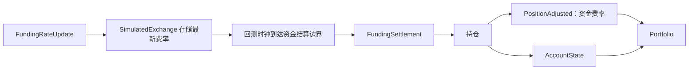

# 回测账户与保证金

## 资金费率（Funding）

回测会根据 `FundingRateUpdate` 数据在资金费率结算时点（funding boundary）结算永续合约的资金费用。当更新
包含 `next_funding_ns` 时，模拟交易所会存储最新费率，并在该时间戳处由回测时钟发出一个
`FundingSettlement` 事件。若没有 `next_funding_ns`，交易所仅在 `ts_event` 落在 `interval` 边界上时才会
结算。没有对应结算边界的更新仍会作为策略数据处理，不会产生资金费用支付。



`PositionAdjusted` 仍然是持仓会计事件。正的资金费率会向多头持仓借记（扣款），向空头持仓贷记（入账）。
由此产生的调整会改变已实现盈亏（realized PnL），并且相应的账户余额更新会记录这笔现金流动。

## 账户

每个回测交易场所（venue）都会附带以下三种 `account_type` 之一：`CASH`、`MARGIN` 或 `BETTING`。有关完整
的数据模型、查询 API 和保证金模型参考，请参见 [账户体系（Accounting）](../accounting.md)。

为回测交易场所添加 `CASH` 账户的示例：

```python
from nautilus_trader.adapters.binance import BINANCE_VENUE
from nautilus_trader.backtest.engine import BacktestEngine
from nautilus_trader.model.currencies import USDT
from nautilus_trader.model.enums import OmsType, AccountType
from nautilus_trader.model import Money, Currency

# 初始化回测引擎
engine = BacktestEngine()

# 为交易场所添加 CASH 账户
engine.add_venue(
    venue=BINANCE_VENUE,  # 创建或引用一个 Venue 标识符
    oms_type=OmsType.NETTING,
    account_type=AccountType.CASH,
    starting_balances=[Money(10_000, USDT)],
)
```

## 保证金模型

保证金模型决定了模拟交易所在回测运行中如何为订单和持仓预留抵押品（collateral）。模型类型
（`StandardMarginModel` 与 `LeveragedMarginModel`）、其计算公式、默认行为以及自定义模型的编写方式，均在
专门的 [账户体系（Accounting）](../accounting.md#margin-models) 指南中说明。

本节仅介绍与回测相关的特定配置。

### 回测交易场所配置

通过 `MarginModelConfig` 在 `BacktestVenueConfig` 上指定保证金模型：

```python
from nautilus_trader.backtest.config import BacktestVenueConfig
from nautilus_trader.backtest.config import MarginModelConfig

venue_config = BacktestVenueConfig(
    name="SIM",
    oms_type="NETTING",
    account_type="MARGIN",
    starting_balances=["1_000_000 USD"],
    margin_model=MarginModelConfig(model_type="standard"),  # 可选值："standard"、"leveraged"
)
```

可用的 `model_type` 取值：

- `"leveraged"`：保证金按杠杆比例减少（默认）。
- `"standard"`：固定百分比（传统经纪商模式）。
- 自定义模型的完全限定类路径：
  `"my_package.my_module:MyMarginModel"`。

### 高层级回测 API

使用高层级 API 时，可以用相同方式附加保证金模型：

```python
from nautilus_trader.backtest.config import BacktestVenueConfig
from nautilus_trader.backtest.config import MarginModelConfig
from nautilus_trader.config import BacktestRunConfig

venue_config = BacktestVenueConfig(
    name="SIM",
    oms_type="NETTING",
    account_type="MARGIN",
    starting_balances=["1_000_000 USD"],
    margin_model=MarginModelConfig(
        model_type="standard",  # 传统经纪商模拟
    ),
)

config = BacktestRunConfig(
    venues=[venue_config],
    # ... 其他配置
)
```

带参数的自定义模型：

```python
margin_model=MarginModelConfig(
    model_type="my_package.my_module:CustomMarginModel",
    config={
        "risk_multiplier": 1.5,
        "use_leverage": False,
        "volatility_threshold": 0.02,
    },
)
```

该模型会在回测执行期间被应用于模拟交易所。
