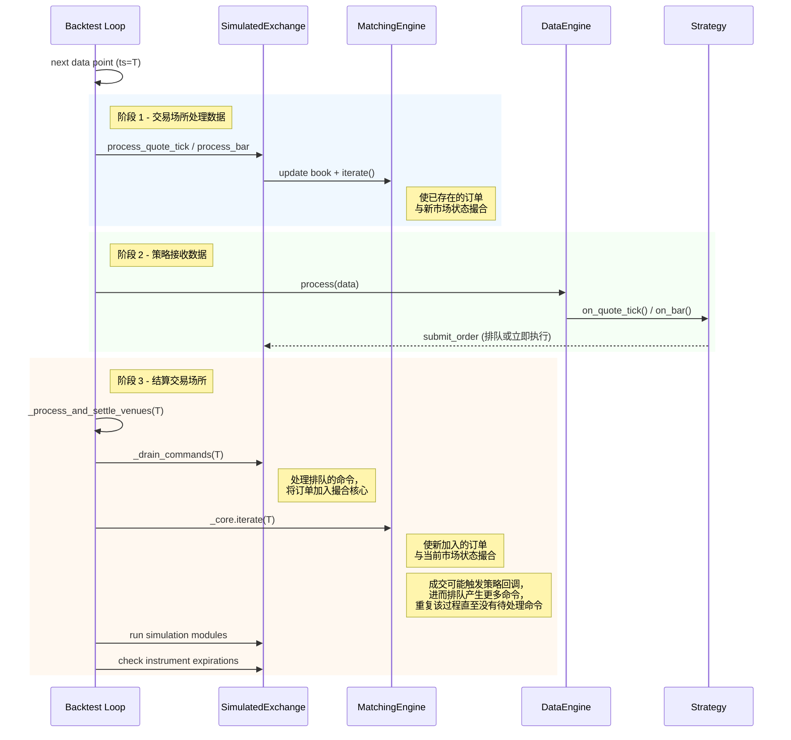

# 回测执行流程

## 数据与消息排序

在主回测循环中，新的市场数据会先被处理用于订单执行，然后才通过数据引擎分发给 actors/策略。

### 主循环流程

对于每个数据点，引擎会执行以下三个阶段：

- **交易场所处理数据。** 模拟交易所根据到来的市场数据更新其订单簿，并驱动撮合引擎迭代。这会使任何
  已存在、且此刻与新市场状态相匹配的订单成交。
- **策略接收数据。** 数据引擎通过回调函数（例如 `on_quote_tick`、`on_bar`）将该数据点分发给 actors
  和策略。策略可以在这些回调中提交、取消或修改订单。
- **结算交易场所。** 引擎会清空所有排队的交易场所命令，然后迭代撮合引擎以成交新提交的订单。此循环会
  重复进行，直到不再有待处理的命令为止，因此级联订单（例如在 `on_order_filled` 中提交的对冲单）能够
  在同一时间戳内完成结算。

计时器事件使用相同的结算机制，但会按时间戳进行批处理：时间戳 T 处的所有回调会先全部执行，然后再对
T 时刻进行交易场所结算，之后才推进到 T+1。有关内部聚合 K 线所使用的计时器行为，请参见
[内部 K 线聚合时机](bar-execution.md#internal-bar-aggregation-timing)。

### 命令结算

当一次订单成交触发了策略回调，进而提交了额外的订单（例如在 `on_order_filled` 中提交的止损单）时，
这些级联命令会在同一时间戳/事件周期内完成结算。引擎会反复清空交易场所的命令队列以及任何新生成的
命令，直到当前时间戳不再有待处理命令为止。仿真模块（simulation module）每个周期只运行一次，且是在所有
命令都结算完毕之后运行。

当配置了 `LatencyModel`（延迟模型）时，命令会被放入交易场所的在途队列（inflight queue）中，并带有
一个由模拟延迟推算出的未来时间戳。结算循环会将当前时间戳已到期的在途命令视为待处理命令，因此即使配置
零延迟或与当前 tick 相同的延迟，仍然能够正确结算。带有未来时间戳的命令则会被推迟，直到引擎到达该时间
时再处理。

### 关闭语义

`BacktestEngine::end()` 与 [回测 API 与重复运行](apis-and-runs.md#shutdown-on-error) 中的
`shutdown_on_error` 配置是相互独立的。它会调用每个策略的 `on_stop` 处理程序，清空并结算该处理程序
产生的所有命令（例如 `close_all_positions`、`cancel_all_orders`），然后停止引擎。

- `on_stop` 产生的命令会使用正常的交易场所排队和延迟机制，不会比更早的在途命令拥有更高的优先级。
- 如果一笔停止前的订单在 `on_stop` 的取消命令到达交易场所之前就已到达，它仍可能成交。此后的
  reduce-only（仅减仓）平仓单若因该成交改变了净敞口，则可能被拒绝。
- 需要确定性平仓（deterministic flattening）的策略，应在停止之前进入仅平仓状态，并在取消和平仓命令
  处于在途状态期间避免提交新的开仓订单。
- 由此产生的事件不会触发策略的事件处理程序：此时策略已处于 `Stopped` 状态，因此
  `OrderFilled` 等事件会被记录日志，但不会调用 `on_order_filled` 等回调。需要对成交作出反应的逻辑
  必须在 `on_stop` 返回之前运行完毕。
- 仿真模块在关闭时不会重新运行。`SimulationModule::process` 每个时间戳只运行一次；重复调用会导致
  诸如外汇展期利息（FX rollover interest）之类的副作用被重复应用。
- `LatencyModel` 会为收尾命令（即在最后一个数据 tick 上或在 `on_stop` 中产生的命令）附加其配置的
  延迟。关闭流程会将引擎时钟推进到最后一批在途命令的到达时间戳，以确保这些命令在引擎停止之前完成结算。

## 仅计时器回测

回测引擎支持在没有市场数据、仅有计时器的情况下运行。这对于按计划执行的操作或测试基于计时器的逻辑非常
有用。计时器按时间顺序触发，计时器回调可以通过 `add_data_iterator()` 动态添加数据，这些数据会按顺序
被处理。

:::warning
计时器回调在起始时间点添加的数据，其时间戳应**晚于**起始时间。引擎会在处理起始时间的计时器之前先读取
第一个数据点，因此动态添加的、时间戳等于或早于起始时间的数据可能不会按预期顺序被处理。
:::

## 确定性成交 ID

模拟交易所（backtest 和沙盒执行均使用）会为每笔生成的成交发出一个确定性的 `TradeId`（成交 ID）。该
ID 的格式为 `T-{hash:016x}-{count:03d}`，其中 16 位十六进制字符串是对 `(venue, raw_id, ts_init)`
计算出的 FNV-1a 哈希值，末尾的计数器用于区分同一 `ts_init` 上的多笔成交（例如由 K 线驱动的成交所产生
的多个成交腿）。

**特性：**

- 跨运行确定性：相同的重放数据每次都会产生相同的 `TradeId`，因此下游的去重和黄金输出对比
  （golden-output comparison）能够保持稳定。
- 跨重置无冲突：`ts_init` 在回测数据中是固定的，在实盘/沙盒环境中是单调递增的，因此
  `BacktestEngine.reset()`（或在有持久化订单的沙盒中重置内存中的 `IdsGenerator`）不会生成与缓存
  中已有 `TradeId` 冲突的新 ID。
- 长度受限：无论交易场所名称多长，该哈希都能确保标识符长度不超过 `TradeId` 的 36 字符上限。

`use_random_ids` 这一交易场所标志仍然控制着 `VenueOrderId` 和 `PositionId` 的生成方式，但
`TradeId` 始终是确定性的，不受该标志影响。
