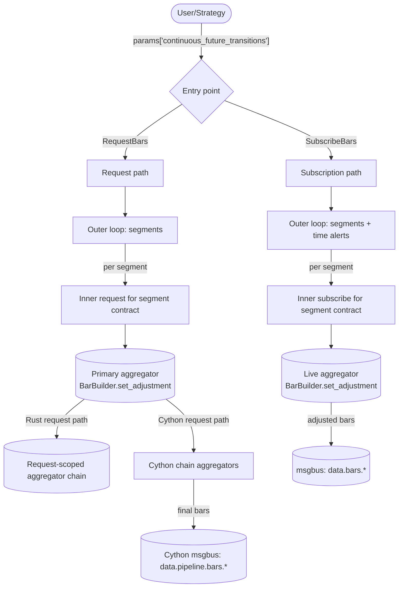
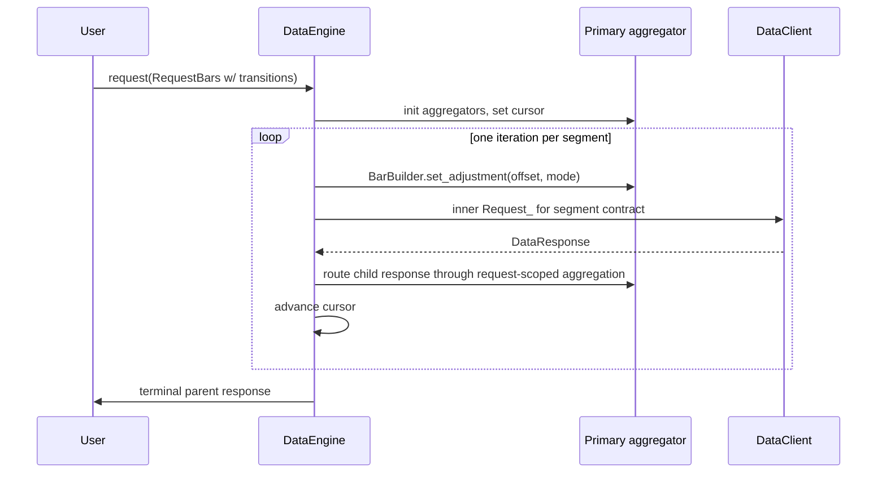
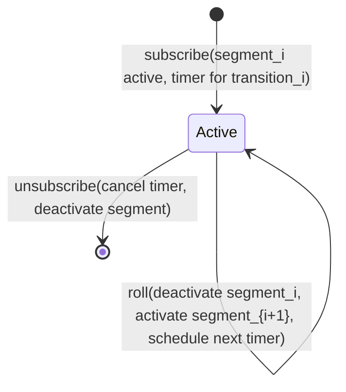
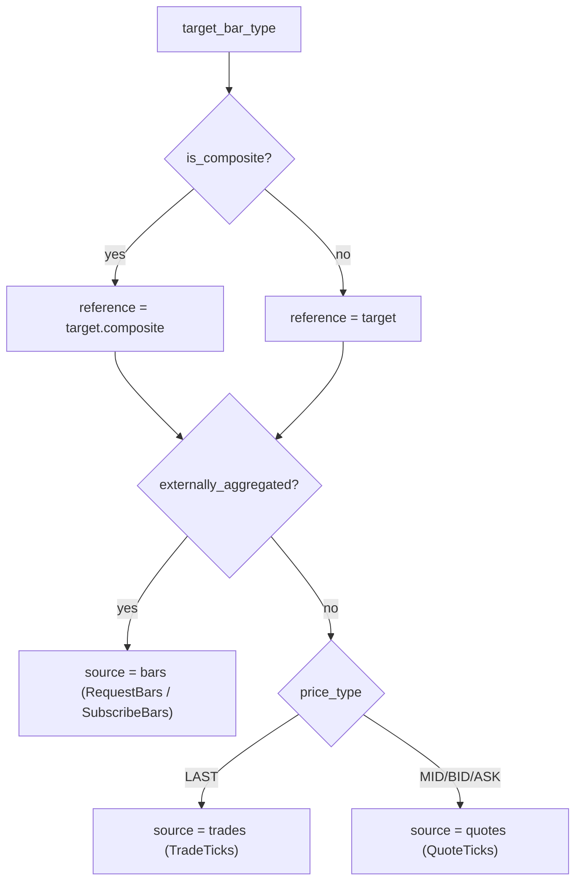
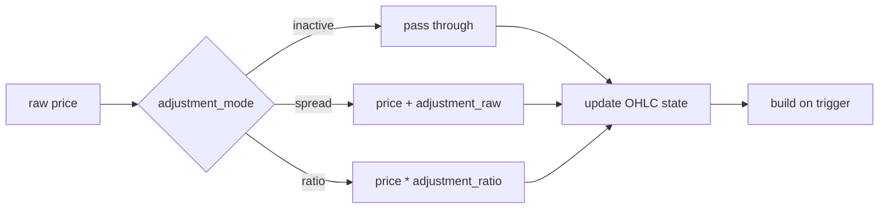

# 连续期货（Continuous Futures）

连续期货是一个派生序列，它将连续的期货合约拼接为一条经过调整的
价格流。每个标的合约都会到期；连续序列通过在过渡点展期到下一份合约，
并将历史价格平移到新合约的坐标系中来保持活跃，从而使产生的序列
不会出现由展期引起的跳跃。

Nautilus 将连续期货建模为一个目标 `BarType`，加上通过请求或订阅参数
提供的一份显式展期过渡（roll transitions）列表。数据引擎依次处理
各个合约区段（per-contract segments），计算每个区段的累计价格调整量，
并将调整后的源数据通过常规的 K 线聚合路径送入系统。

## 调整模式

`ContinuousFutureAdjustmentType` 将方向（向后或向前）与操作
（加减或比率）相组合：

| 模式              | 操作       | 锚定区段       |
|-------------------|-----------------|----------------------|
| `BACKWARD_SPREAD` | 加法        | 最近的合约 |
| `FORWARD_SPREAD`  | 加法        | 第一份合约       |
| `BACKWARD_RATIO`  | 乘法  | 最近的合约 |
| `FORWARD_RATIO`   | 乘法  | 第一份合约       |

在 `N` 个过渡中的第 `k` 段处，累计调整量为：

```text
BACKWARD_SPREAD: sum over i in [k, N) of (post_i - pre_i)
FORWARD_SPREAD:  sum over i in [0, k) of (pre_i - post_i)
BACKWARD_RATIO:  product over i in [k, N) of (post_i / pre_i)
FORWARD_RATIO:   product over i in [0, k) of (pre_i / post_i)
```

加减模式（Spread modes）累加加法偏移量。比率模式（Ratio modes）累乘
乘法因子，且要求价格严格为正。

## 输入

连续期货请求或订阅是指任何在 `params` 中携带了
`continuous_future_transitions` 条目的 `RequestBars` 或 `SubscribeBars`：

```python
params = {
    "continuous_future_transitions": [
        {
            "transition_time_ns": 1773671460000000000,  # when ESH26 rolls to ESM26
            "pre_instrument_id": "ESH26.XCME",
            "post_instrument_id": "ESM26.XCME",
            "pre_price": "6001.00",                     # last ESH26 price pre-roll
            "post_price": "5995.50",                    # first ESM26 price post-roll
        },
        # ... more transitions ...
    ],
    "continuous_future_adjustment_mode": ContinuousFutureAdjustmentType.BACKWARD_SPREAD,
    # Optional: cap the upper end of cumulative adjustment at the transition whose
    # post_instrument_id matches (the backward-mode anchor).
    # "last_post_instrument_id": "ESM26.XCME",
    # Optional: cap the lower end of cumulative adjustment at the transition whose
    # pre_instrument_id matches (the forward-mode anchor).
    # "first_pre_instrument_id": "ESM26.XCME",
}
```

请求或命令上的 `bar_type` 是**目标**连续 K 线类型，例如
`"ES.XCME-1-MINUTE-LAST-INTERNAL@1-MINUTE-EXTERNAL"`。根标识符（`ES.XCME`）
是连续期货的“根”，不是一份真实合约。每个区段的原始源数据来自
展期过渡列表中的真实合约。

连续期货的目标 K 线类型必须是**内部聚合**的。外部聚合的 K 线不能
作为连续期货的目标，但可以作为每个区段的数据源。

### 有界链

两个可选的边界限制了展期过渡表中生效的部分：

- `last_post_instrument_id` 将上界限定在第一个 `post_instrument_id` 匹配的
  过渡处。向后模式将其用作锚点（锚定区段的累计调整量为零）；
  向前模式用它来限定较晚合约累积调整的范围。
- `first_pre_instrument_id` 将下界限定在第一个 `pre_instrument_id` 匹配的
  过渡处。向前模式将其用作锚点；向后模式用它来限定较早合约
  累积调整的范围。

这使调用方可以传入一个较宽的展期过渡表，同时将调整后的序列锚定在
任意一侧的特定合约上。

## 校验

Rust 请求路径（`crates/data/src/engine/requests.rs`）以及 Cython 请求和
订阅路径（`engine.pyx::_continuous_future_validate_transitions`）会在分配
任何聚合器之前校验展期过渡参数：

- `continuous_future_adjustment_mode` 必须能解析为一个有效的 `ContinuousFutureAdjustmentType`。
- `continuous_future_transitions` 必须是一个由字典行组成的列表或元组。
- 每一行必须包含一个非负整数 `transition_time_ns`，且过渡时间必须
  严格递增。
- 每个 `pre_instrument_id` 和 `post_instrument_id` 必须能解析为一个有效的
  `InstrumentId`，且其交易场所必须等于目标交易场所。
- 该链必须是连续的：第 `i` 行的 `post_instrument_id` 必须等于第 `i + 1`
  行的 `pre_instrument_id`。
- 每一行必须包含有限的 `pre_price` 和 `post_price`。比率模式还要求
  两个价格都为正。
- 如果调用方提供了 `last_post_instrument_id`，它必须能解析为一个
  `InstrumentId`，与目标交易场所匹配，并作为某个过渡的 `post_instrument_id`
  出现在展期过渡列表中。`first_pre_instrument_id` 也是同样的要求。

校验失败时，Rust 请求会在分配任何子区段状态之前返回一个错误。
Cython 请求处理器会调用 `_abort_request` 来丢弃已经开始建立的工作流状态；
Cython 订阅路径会记录一条特定的错误日志并返回。

## 目标金融工具自动合成

连续期货的“根”（例如 `ES.XCME`）是一个合成 ID，本身没有任何市场数据，
但下游消费者（聚合器、缓存查询、序列化）仍然期望在缓存中存在一个
对应的 `Instrument`。在校验完成后，Rust 请求路径以及 Cython 请求和
订阅路径会确保目标金融工具存在：

- 如果目标 ID 已经存在于缓存中，则目标设置为空操作。调用方可以
  预先注册一个自定义的连续金融工具，引擎会尊重该设置。
- 否则，目标设置会从缓存中获取第一个区段的金融工具并克隆它，
  仅覆盖 `id`、`raw_symbol`，并将 `activation_ns` 和 `expiration_ns` 清零
  为 `0`。其他所有字段（货币、精度、增量、乘数、最小交易单位、标的、
  手续费、保证金、交易所、tick 方案、信息）都沿用自该区段。
- 如果第一个区段尚未存在于缓存中，或者不是 `FuturesContract`，
  该设置会记录一条警告并返回。此时调用方必须手动注册该连续金融工具。

## 架构概览



该设计有两个入口点、一种外层循环结构（遍历各个区段）、
两种获取每个区段数据的方式（历史子请求或实时子订阅），
以及一种调整机制（在每个区段边界调用 `BarBuilder.set_adjustment`）。

## 区段（Segments）

**区段（segment）** 是由一份真实合约拥有的一段连续时间片。展期过渡
划分了各个区段。给定 `transitions[0..N)`：

- 区段 0：位于 `transitions[0].pre_instrument_id` 上的 `(-inf, transitions[0].time)`。
- 区段 k（`k` 属于 `[1, N)`）：位于 `transitions[k].pre_instrument_id` 上的
  `[transitions[k-1].time, transitions[k].time)`。
- 区段 N：位于 `transitions[N-1].post_instrument_id` 上的
  `[transitions[N-1].time, +inf)`。

请求和订阅路径会返回从 `cursor_ns` 开始、限定在 `end_ns` 以内的
下一个区段。

## 请求流程

请求路径在上一层镜像了 `_handle_long_request`：每次迭代都会为一个区段
的数据发出一次内部请求，内部请求完成的回调会推进游标（cursor）。



如果调用方在参数中设置了 `time_range_generator` 和 `durations_seconds`，
内部请求会继承它们，并自身成为一个长请求（long request），
将该区段的时间范围切分为 N 个进一步的子子请求。外层的连续期货循环
会忽略内部的这种切分：每个内部请求仍然只会返回恰好一个合并的响应，
从而触发外层循环处理下一个区段。

### 链式聚合器

如果调用方为多级内部聚合设置了 `bar_types = (bar_type_1, bar_type_2)`，
该设置会创建以 `parent.id` 为键的所有聚合器。Rust 请求路径将区段
源数据的响应路由到主连续期货目标，然后将产生的 K 线转发给
匹配的、限定于该请求的下游聚合器。Cython 路径在各级之间连接了
管道主题，使链条自动向上传递。只有主构建器（primary builder）会被调用
`set_adjustment`；在两条路径中，更高层级都是对已经调整过的数据
再次进行聚合。

## 订阅流程

一个小型状态机通过单个待处理的时间提醒驱动每个活跃的订阅：



当一个过渡触发时，引擎会停用当前区段（取消订阅源数据）、
激活下一个区段（解析新的数据源、应用新的偏移量、发起订阅），
并为下一次过渡重新设置定时器。

## 数据源解析

对于任何连续期货目标 `BarType`，馈入主聚合器的原始数据存在于
**区段合约**上，而不是连续期货 ID 上。目标的结构决定了数据源类型：



## BarBuilder 的调整

构建器（builder）在**入口处**对每次 `update(price, ...)` 和
`update_bar(bar, ...)` 调用应用调整。运行中的 OHLC 状态始终处于
调整后（统一）的坐标系中，因此在 K 线进行到一半时发生的调整变化
只会影响后续的价格。无需对部分 K 线进行缓冲。



`BarBuilder` 只关心比率与加减的区别，以决定是做加法还是乘法。
引擎会在调用 `set_adjustment` 之前，将方向信息折叠为累计偏移量的
符号和大小。`reset()` 方法会为该序列中的下一根 K 线清除逐 K 线的
OHLCV 状态，但有意保留了调整配置：展期发生的频率远低于 K 线重置，
因此调整被视为区段范围的状态。

## K 线中途的展期边界

如果一次展期落在一根尚未完成的目标 K 线内部，构建器会保留当前的
OHLC 状态，只对后续的更新应用新的调整。边界之前的部分保持旧的
偏移量；边界之后的部分使用新的偏移量。这是有意为之的策略：
在每次展期时都重写运行中的 OHLC，将需要按区段缓冲原始输入，
这会增加成本，却不会改变常见情形下的调整结果——在这种情形下，
调整后的区段是跨越边界无缝构建出来的。

## 局限性

- 该功能需要调用方提供展期过渡元数据。引擎不会自行发现展期、
  选择合约或推断展期价格：这是调用方的责任。
- 比率调整在热路径中通过 `float` 计算（`price_as_f64 * ratio` 然后
  转回 `price_new`）。对于高精度金融工具，舍入可能导致结果的原始值
  相较于等价的 `Decimal` 乘法偏移 1 个最小精度单位（ULP）。加减模式
  是精确的，因为它直接作用于 `PriceRaw`（int64/int128）。
