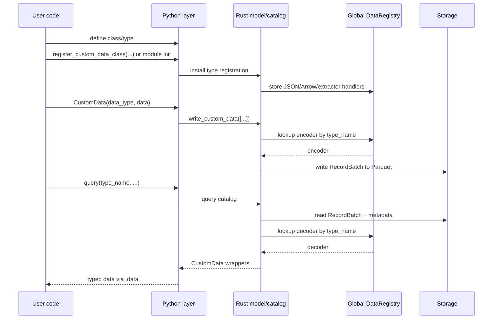
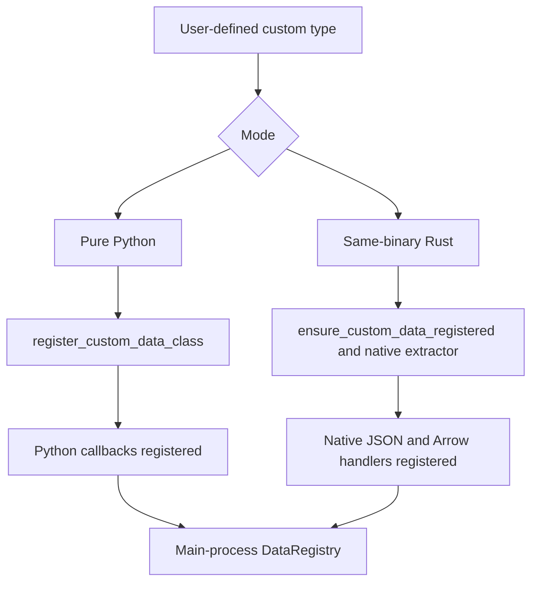
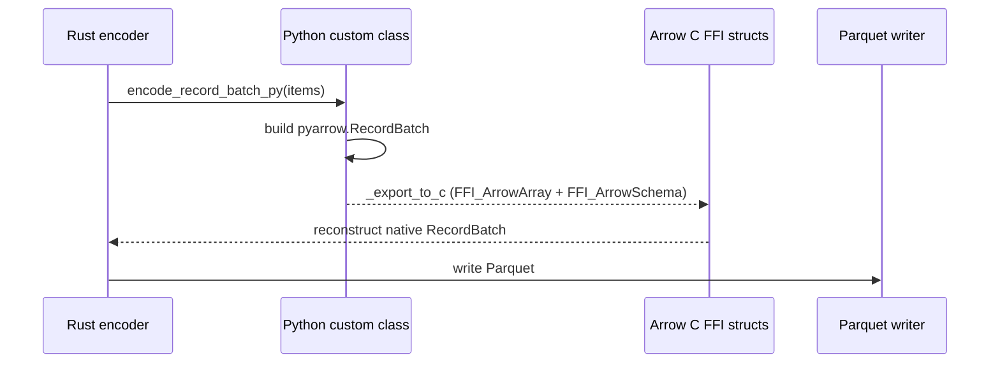

# 自定义数据（Custom Data）

Nautilus Trader 支持用 Python 和 Rust 编写的自定义数据，并将该数据
通过平台其余部分所使用的同一套运行时、持久化和查询管道传递。

本文档解释了自定义数据是如何：

- 在运行时被注册的。
- 跨越 Python/Rust 边界被包装的。
- 序列化到 Arrow/Parquet 及从中反序列化的。
- 通过 actor 和策略路由的。

## 目标

自定义数据架构满足以下要求：

- 让用户能够用纯 Python 定义自定义数据，无需编写 Rust 代码。
- 让 Rust 中定义的自定义数据能够使用原生 Rust 的 JSON 和 Arrow 处理器。
- 在 PyO3 边界处保留一个统一的、面向用户的 `CustomData` 包装器。
- 支持使用动态类型注册（而不是硬编码模式）在 `ParquetDataCatalog` 中持久化。
- 使自定义数据能够通过常规的数据引擎、actor 和策略订阅流程进行路由。

## 高层模型

支持两种编写模式：

| 模式              | 示例                                            | 注册路径                                       | 编码/解码路径              | 包装器后端           |
|-------------------|----------------------------------------------------|-----------------------------------------------------------|----------------------------------|---------------------------|
| 纯 Python       | `@customdataclass_pyo3` 类                      | `register_custom_data_class(...)`                       | Python 回调 + Arrow C FFI   | `PythonCustomDataWrapper` |
| 同一二进制文件内的 Rust  | `#[custom_data]` 或 `#[custom_data(pyo3)]` 类型    | `ensure_custom_data_registered::<T>()` 和原生提取器 | 原生 Rust                 | 原生 Rust 载荷（payload）       |

两种模式最终都会汇聚到同一个外层 PyO3 `CustomData` 包装器，
以及同一个 `DataType` 身份模型上。

## 端到端流程

## 核心组件

### `DataRegistry`

`crates/model/src/data/registry.rs` 是主进程中自定义数据的中央
运行时注册表模块。注册使用原子的 `DashMap::entry()`，因此并发的
`register_*` 和 `ensure_*` 调用不会产生竞争。

该模块包含若干个通过 `OnceLock` 初始化的 `DashMap` 单例：

- 以 `type_name` 为键的 JSON 反序列化器。
- 以 `type_name` 为键的 Arrow 模式、编码器和解码器。
- 将 Python 对象转换为 `Arc<dyn CustomDataTrait>` 的 Python 提取器。
- 为同一二进制文件内的类型生成 Python 提取器的 Rust 提取器工厂。

Nautilus 并不将每种类型硬编码进主二进制文件，而是在运行时使用
存储在 `DataType` 和 Parquet 元数据中的 `type_name` 来解析处理器。

### `CustomData`

外层的 PyO3 `CustomData` 包装器是跨越 FFI 边界的通用容器。

构造函数签名：`CustomData(data_type, data)`，先是 `DataType`，
然后是内部载荷。

它包含：

- 一个 `DataType`。
- 一个实现了 `CustomDataTrait`（包装在 `Arc<dyn CustomDataTrait>` 中）的
  内部自定义载荷。

时间戳（`ts_event`、`ts_init`）委托给内部的 `CustomDataTrait` 实现，
并作为该包装器的属性暴露出来。

在 Python 一侧，`CustomData` 暴露值语义：实现了 `__eq__` 和
`__repr__`（相等性判断使用 Rust 的 `PartialEq` 逻辑）。
实例被有意设计为不可哈希，以使相等性判断始终与内部载荷的
比较保持一致。

该包装器在两种自定义数据模式之间共享。用户代码只需与一个 API 交互，
即使底层的载荷可能是：

- 一个由 Python 支撑的包装器。
- 一个同一二进制文件内的 Rust 值。

#### `CustomData` JSON 信封（Envelope）

当序列化为 JSON 时（例如用于 `to_json_bytes` / `from_json_bytes`、SQL
缓存或 Redis），`CustomData` 使用一个单一的规范信封（envelope），
使反序列化不依赖于用户载荷的字段名：

- `type`：自定义类型名（来自 `CustomDataTrait::type_name`）。
- `data_type`：一个包含 `type_name`、`metadata` 以及可选 `identifier`
  的对象。
- `payload`：仅内部载荷本身（`CustomDataTrait::to_json` 的结果，解析为一个值）。
  已注册的反序列化器在 `from_json` 中只会接收这个值，因此用户结构体
  可以使用任意字段名（包括 `value`），不会与包装器的元数据冲突。

该信封由 Rust 的 `CustomData` 序列化生成，并在 `DataRegistry`
从 JSON 反序列化自定义数据时被消费。

### `DataType`

`DataType` 为路由和持久化标识自定义数据。

构造函数：`DataType(type_name, metadata=None, identifier=None)`。

它包括：

- `type_name`。
- 可选的 `metadata`。
- 可选的 `identifier`（仅用于 catalog 路径，不用于路由或相等性判断）。

相等性、哈希和主题路由仅由 `type_name` 和 `metadata` 派生。两个
具有相同类型名和元数据但不同 `identifier` 的 `DataType` 值比较结果
相等，并会发布到同一个消息总线主题上。`identifier` 只影响
`data/custom/<type_name>/<identifier...>` 下的存储路径。

自定义数据的存储和查询使用 `DataType`，而不仅仅是裸露的 Rust/Python
类名。这使得相同的逻辑类型可以以不同的元数据或标识符存储，
同时仍然通过同一个已注册的处理器解码。

## 注册架构

注册在 Python 对象与 Rust trait 对象之间架起了桥梁。

### 纯 Python 注册

当 Python 代码调用 `register_custom_data_class(MyType)` 时：

1. 该类型会在 Python 序列化层中注册，以支持 JSON 和 Arrow。
2. Rust 会注册一个 Python 提取器，将 Python 实例包装为
   `PythonCustomDataWrapper`。
3. Rust 会在 `DataRegistry` 中注册 Arrow 模式/编码/解码回调。

这条路径灵活且对用户友好，但 Arrow 编码和重构依赖于 Python 回调。

### 同一二进制文件内的 Rust 注册

对于在 Nautilus 内部定义的 Rust 类型：

1. `#[custom_data]` 或 `#[custom_data(pyo3)]` 会生成所需的 trait、
   JSON 和 Arrow 实现。
2. `ensure_custom_data_registered::<T>()` 会将原生的模式/编码器/解码器
   处理器插入 `DataRegistry`。
3. 对于暴露给 PyO3 的类型，可以使用一个原生提取器将 Python 实例
   转换回具体的 Rust 类型，而不是使用 Python 回退包装器。

这条路径在编码/解码方面始终保持在 Rust 中原生完成。

### 注册优先级

`register_custom_data_class(...)` 按以下顺序解析类型：

1. 同一二进制文件内的原生 Rust 注册。
2. 纯 Python 回退注册。

该顺序为主二进制文件已原生支持的类型保留了最快的可用路径。

## 包装器后端

在内部，外层的 `CustomData` 包装器可以持有不同的载荷实现。

### `PythonCustomDataWrapper`

用于纯 Python 自定义数据。

职责：

- 存储对 Python 对象的引用。
- 缓存 `ts_event`、`ts_init` 和 `type_name`。
- 实现 `CustomDataTrait`。
- 在 GIL 之下调用 Python 方法完成 JSON 和 Arrow 相关操作。

当主进程没有该类型的原生 Rust 表示时，这是回退路径。

### 同一二进制文件内的原生 Rust 载荷

对于编译进 Nautilus 的 Rust 类型，内部载荷就是具体的 Rust 类型本身，
可以直接从 `Arc<dyn CustomDataTrait>` 向下转型（downcast）。

序列化或解码不需要任何 Python 回调路径。

## 持久化架构

### 为何需要动态 Arrow 注册

内置的 Nautilus 数据类型的模式和编码器是 Rust 二进制文件静态已知的。
自定义数据则不是。因此持久化层使用已注册的 `type_name`
动态解析自定义数据。

### Catalog 写入流程

`ParquetDataCatalog` 期望自定义写入以 `CustomData` 值的形式传入。

自定义数据写入路径：

1. 从 `DataType` 中提取 `type_name`、`metadata` 和 `identifier`。
2. 在 `DataRegistry` 中查找 Arrow 编码器。
3. 将这些值编码为一个 `RecordBatch`。
4. 附加一列包含已持久化 `DataType` 的 `data_type` 列。
5. 将 `type_name` 和元数据附加到 Arrow 模式中。
6. 将该批次写入自定义数据路径下的 Parquet 文件。

路径布局为：

- `data/custom/<type_name>/<identifier...>`

标识符在成为路径片段之前会被规范化。

### Catalog 读取流程

在查询时：

1. catalog 读取匹配的 Parquet 文件。
2. 从模式元数据中提取 `type_name`。
3. 向 `DataRegistry` 请求已注册的解码器。
4. 将 `RecordBatch` 解码为 `Vec<Data>`。
5. 使用原始的 `DataType` 重构 `CustomData`。

这使得自定义数据的查询解析过程与写入时的注册过程是对称的。
在将 Feather 数据流转换为 Parquet 时（例如回测之后），自定义数据分支
会解码批次，并通过 `write_custom_data_batch` 将其写入，以确保通过
Feather 写入器写入的自定义数据能够被正确转换为 Parquet。

## Arrow C FFI 桥接

纯 Python 自定义数据无法直接提供原生 Rust Arrow 编码逻辑。
对于这些类型，Nautilus 使用 Arrow C FFI 接口在 Python 和 Rust 之间
传递 `RecordBatch` 数据，而无需序列化开销。

### 纯 Python 编码路径

对于纯 Python 类：

1. Rust 获取 GIL。
2. Rust 在 Python 类上调用 `encode_record_batch_py(...)`。
3. Python 将对象转换为一个 `pyarrow.RecordBatch`。
4. Python 通过 `_export_to_c` 将该批次导出为 Arrow C FFI 结构体。
5. Rust 从 FFI 结构体重构出一个原生的 `RecordBatch` 并写入。

### 纯 Python 解码路径

对于反方向的操作：

1. Rust 将其 `RecordBatch` 转换为 Arrow C FFI 结构体。
2. Python 通过 `RecordBatch._import_from_c` 导入该批次。
3. Python 在该类上调用 `decode_record_batch_py(metadata, batch)`。
4. Rust 将返回的 Python 对象包装到 `PythonCustomDataWrapper` 中。

### 原生路径

对于同一二进制文件内的 Rust 自定义数据，不使用 Arrow C FFI 桥接。
这些类型使用注册在主进程中的原生 Rust 编码/解码处理器。

## 查询时的重构

当自定义数据从 catalog 中重新加载时，重构方式取决于后端：

- 同一二进制文件内的 Rust 类型会直接解码为原生的 Rust 值。
- 纯 Python 类型会通过已注册的 Python 类，使用 `from_dict` 或
  `from_json` 重构。

无论哪种情况，调用方在 PyO3 API 边界处收到的都是相同的外层
`CustomData` 包装器。

## 运行时集成

自定义数据不仅仅是一个持久化特性。它同样参与 Nautilus 的
运行时路由。

相关的集成包括：

- `crates/data/src/engine/mod.rs` 通过消息总线发布 `CustomData`。
- `crates/common/src/msgbus/switchboard.rs` 根据 `DataType` 派生出
  自定义主题。
- `crates/common/src/actor/*` 将自定义数据路由到 actor 订阅中。
- `crates/trading/src/python/strategy.rs` 将自定义数据暴露给 Python
  策略的 `on_data`。
- `crates/backtest/src/engine.rs` 将 `Data::Custom` 视为
  由数据引擎交付的输入，而不是通过交易所路由的数据。

一个已注册的自定义类型可以通过与其他数据族相同的运行时接口
被持久化、查询、订阅和消费。

## SQL 缓存与数据库集成

SQL 缓存/数据库层也支持 `CustomData`。

当前行为：

- PostgreSQL 将自定义数据存储在 `custom` 表中。
- 存储的记录包括 `data_type`、`metadata`、`identifier` 和完整的
  JSON 载荷。
- 读取时使用 `CustomData::from_json_bytes(...)` 重构 `CustomData`。
- Python SQL 绑定暴露了 `add_custom_data` 和 `load_custom_data`。
- Redis 缓存将自定义数据存储在键
  `custom:<ts_init_020>:<uuid>` 下，值为完整的 `CustomData` JSON。
- Redis 的 `add_custom_data` 和 `load_custom_data` 按 `DataType`
  （type_name、metadata、identifier）过滤，并返回按 `ts_init` 排序的
  结果；这通过 PyO3 的 `RedisCacheDatabase` API 暴露出来。

## Cython 自定义数据

Cython 的 `@customdataclass` 系统与本架构是分开的。
本文档描述的是 PyO3 自定义数据系统：

- PyO3 `CustomData`。
- 动态运行时注册。
- Arrow/Parquet 持久化。
- 原生 Rust 执行路径。

## 实践影响

这一架构为 Nautilus 带来了两个重要的特性：

1. 面向只想编写 Python 代码的用户的 Python 优先可扩展性。
2. 面向内置或已编译自定义类型的原生 Rust 性能。

最终的结果是一个拥有两种后端的、概念统一的自定义数据系统，
而不是分别针对纯 Python 数据类型和纯 Rust 数据类型的孤立功能。
