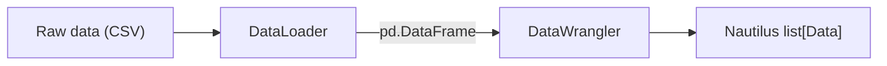

# 数据

NautilusTrader 主要基于细粒度的订单簿（order book）数据运行，以在执行模拟中获得最高的真实性。
根据所需的模拟精细程度，回测（backtest）也可以在任何支持的市场数据类型上运行。

## 内置数据类型

主要的内置市场数据类型涵盖订单簿状态、盘口顶部（top-of-book）更新、成交、K 线、
衍生品参考价格、资金费率以及金融工具生命周期事件。每种类型都有专门的指南，介绍其字段、
行为以及构造示例。

| 数据类型                                      | 类别             | 说明                                          |
|------------------------------------------------|----------------------|------------------------------------------------------|
| [`OrderBookDelta`](order_book_delta.md)        | 订单簿           | 单次订单簿增量变化。                |
| [`OrderBookDeltas`](order_book_deltas.md)      | 订单簿           | 一组相关联的订单簿 delta 批次。                  |
| [`OrderBookDepth10`](order_book_depth10.md)    | 订单簿           | 固定的前 10 档买卖盘位。                     |
| [`QuoteTick`](quote_tick.md)                   | 盘口顶部          | 最优买卖价格及数量。                   |
| [`TradeTick`](trade_tick.md)                   | 成交               | 单次交易场所成交或撮合事件。                   |
| [`Bar`](bar.md)                                | 聚合          | 特定 `BarType` 的 OHLCV K 线。                  |
| [`MarkPriceUpdate`](mark_price_update.md)      | 衍生品参考价格 | 衍生品金融工具的标记价格。             |
| [`IndexPriceUpdate`](index_price_update.md)    | 衍生品参考价格 | 衍生品市场使用的指数价格。            |
| [`FundingRateUpdate`](funding_rate_update.md)  | 衍生品参考价格 | 资金费率及下次资金结算相关元数据。              |
| [`OptionGreeks`](option_greeks.md)             | 期权              | 交易场所提供的希腊字母和隐含波动率。        |
| [`InstrumentStatus`](instrument_status.md)     | 金融工具事件     | 交易、报价及暂停状态变化。           |
| [`InstrumentClose`](instrument_close.md)       | 金融工具事件     | 收盘、结算或其他交易场所收盘价事件。 |

当数据流经消息总线（message bus）时，可按主题寻址的数据都位于 `data` 根路径下。实时数据流
使用 `data.<kind>...`；数据处理管线路径使用 `data.pipeline.<kind>...`。参见
[消息总线](../message_bus.md#topic-hierarchy) 了解主题层级结构。

## 订单簿

Nautilus 提供了一个用 Rust 实现的高性能订单簿，用于根据提供的数据维护订单簿状态。

`OrderBook` 实例按金融工具分别维护，适用于回测和实盘交易，支持以下订单簿类型：

- `L3_MBO`：三级逐单（market-by-order，MBO）数据。使用每个价格档位上的每一条订单簿事件，
  以订单 ID 为键。
- `L2_MBP`：二级逐价（market-by-price，MBP）数据。按价格档位聚合订单簿事件。
- `L1_MBP`：一级逐价（market-by-price，MBP）盘口顶部数据，也称为最优买卖报价（BBO）。
  仅捕获顶层更新。

:::note
报价、成交和 K 线数据（`QuoteTick`、`TradeTick` 和 `Bar`）在回测中也可以驱动 `L1_MBP` 订单簿。
:::

### Delta 标志位与事件边界

每个 `OrderBookDelta` 都携带一个 `flags` 字段，使用 `RecordFlag` 位掩码值向
`DataEngine` 标示事件边界：

- `F_LAST`：标记逻辑事件组中的最后一个 delta。当启用 `buffer_deltas` 时，
  `DataEngine` 会累积 delta，只有在遇到 `F_LAST` 时才发布给订阅者。每个事件组
  **必须**以带有 `F_LAST` 标志位的 delta 结束。
- `F_SNAPSHOT`：标记属于快照（snapshot，与增量更新相对）的 delta。快照序列以
  `Clear` 动作开始，随后是一系列重建完整订单簿状态的 `Add` delta。快照中的最后一个
  delta 会同时设置 `F_SNAPSHOT | F_LAST`。

:::warning
如果事件组中最后一个 delta 缺少 `F_LAST` 标志位，会导致使用缓冲的消费者无限期累积
delta 而不发布数据。这一点无论是对增量更新还是快照都适用，包括只发出一个 `Clear`
delta 的空订单簿快照。
:::

## 金融工具

所有市场数据都归属于某个金融工具（instrument）。金融工具的定义提供了标识、精度、价格和数量
增量、限制、货币以及合约语义，这些信息使数据具有实际意义。

参见 [Instruments](../instruments/) 了解金融工具的分类及各类型指南。

## K 线与聚合

### K 线简介

*K 线*（bar，也称为蜡烛图或 candlestick）是一种表示特定时间段内价格和成交量信息的数据结构，包括：

- 开盘价
- 最高价
- 最低价
- 收盘价
- 成交量（或以成交笔数作为成交量的替代指标）

系统使用*聚合方法*（aggregation method）按特定条件对数据分组，从而生成 K 线。

### 数据聚合的目的

NautilusTrader 中的数据聚合将细粒度的市场数据转换为结构化的 K 线或蜡烛图，原因如下：

- 为技术指标和策略开发提供数据。
- 因为时间聚合数据（如分钟 K 线）对许多策略而言已经足够。
- 相比高频订单簿市场数据，可以降低成本。

### 聚合方法

平台实现了多种聚合方法：

| 名称               | 说明                                                                | 类别     |
|:-------------------|:---------------------------------------------------------------------------|:-------------|
| `TICK`             | 按一定数量的 tick 进行聚合。                                          | 阈值    |
| `TICK_IMBALANCE`   | 按 tick 的买卖失衡（imbalance）进行聚合。                            | 阈值    |
| `TICK_RUNS`        | 按连续同向 tick 序列（runs）进行聚合。                                  | 信息  |
| `VOLUME`           | 按成交量进行聚合。                                              | 阈值    |
| `VOLUME_IMBALANCE` | 按成交量的买卖失衡进行聚合。                    | 阈值    |
| `VOLUME_RUNS`      | 按连续同向成交量序列进行聚合。                  | 信息  |
| `VALUE`            | 按成交名义价值进行聚合（也称为"美元 K 线"）。 | 阈值    |
| `VALUE_IMBALANCE`  | 按名义价值的买卖失衡进行聚合。        | 阈值    |
| `VALUE_RUNS`       | 按连续同向名义价值成交序列进行聚合。      | 信息  |
| `RENKO`            | 按固定价格变动幅度（以 tick 为单位的砖块大小）进行聚合。          | 阈值    |
| `MILLISECOND`      | 按毫秒粒度的时间区间进行聚合。                | 时间         |
| `SECOND`           | 按秒粒度的时间区间进行聚合。                     | 时间         |
| `MINUTE`           | 按分钟粒度的时间区间进行聚合。                     | 时间         |
| `HOUR`             | 按小时粒度的时间区间进行聚合。                       | 时间         |
| `DAY`              | 按天粒度的时间区间进行聚合。                        | 时间         |
| `WEEK`             | 按周粒度的时间区间进行聚合。                       | 时间         |
| `MONTH`            | 按月粒度的时间区间进行聚合。                      | 时间         |
| `YEAR`             | 按年粒度的时间区间进行聚合。                       | 时间         |

### 信息驱动型 K 线

信息驱动型 K 线（information-driven bar）根据市场活动动态调整采样频率，而不是使用固定的时间
间隔。它们基于*主动方*（aggressor side，即成交发起方是买方还是卖方）这一概念，分为两大类：
**失衡（imbalance）**和**同向序列（runs）**。

**失衡 K 线**在*净*买卖活动达到某个阈值时收线。每笔成交都贡献一个带符号的值：买方主动的成交为
正值，卖方主动的成交为负值。当失衡的绝对值达到配置的步长（step）时，K 线收线。这意味着方向
相反的成交会相互抵消，因此在均衡市场中失衡 K 线的形成速度会较慢，而在方向性行情中则会形成得
更快。

**同向序列 K 线**在来自*同一*主动方的*连续*活动达到某个阈值时收线。与失衡 K 线不同，当主动方
发生变化时，同向序列 K 线会重置计数器。这使得它们对持续的单边压力更为敏感，而不是对净失衡敏感。

这两大类各有三种变体，取决于测量的对象：

| 变体 | 失衡（Imbalance）          | 同向序列（Runs）          | 测量对象                          |
|:--------|:-------------------|:--------------|:------------------------------------------|
| Tick    | `TICK_IMBALANCE`   | `TICK_RUNS`   | 成交笔数（每笔成交计为 1）             |
| Volume  | `VOLUME_IMBALANCE` | `VOLUME_RUNS` | 成交量（数量）                  |
| Value   | `VALUE_IMBALANCE`  | `VALUE_RUNS`  | 名义价值（价格 x 数量）         |

:::note
信息驱动型 K 线需要 `TradeTick` 数据，因为它们需要 `aggressor_side` 字段来对每笔成交进行分类。
仅凭 `QuoteTick` 数据无法聚合出这类 K 线。
:::

### 聚合类型

NautilusTrader 实现了三种不同的数据聚合方式：

1. **成交到 K 线聚合（Trade-to-bar）**：从 `TradeTick` 对象（已执行的成交）创建 K 线。
   - 使用场景：适用于分析成交价格的策略，或直接处理成交数据的场景。
   - K 线规格（bar specification）中始终使用 `LAST` 价格类型。

2. **报价到 K 线聚合（Quote-to-bar）**：从 `QuoteTick` 对象（买卖报价）创建 K 线。
   - 使用场景：适用于关注买卖价差或市场深度分析的策略。
   - K 线规格中使用 `BID`、`ASK` 或 `MID` 价格类型。

3. **K 线到 K 线聚合（Bar-to-bar）**：从更小周期的 `Bar` 对象创建更大周期的 `Bar` 对象。
   - 使用场景：适用于将已有的较小周期 K 线（如 1 分钟）重采样为更大周期（如 5 分钟、小时线）。
   - 规格中始终需要 `@` 符号。

### K 线类型

NautilusTrader 基于以下组成部分定义唯一的*K 线类型*（`BarType` 类）：

- **金融工具 ID**（`InstrumentId`）：指定 K 线所属的具体金融工具。
- **K 线规格**（`BarSpecification`）：
  - `step`：定义每根 K 线的间隔或频率。
  - `aggregation`：指定用于数据聚合的方法（参见上表）。
  - `price_type`：表示 K 线的价格基准（例如买价、卖价、中间价、最新价）。
- **聚合来源**（`AggregationSource`）：表示该 K 线是内部聚合（在 Nautilus 内部）还是外部聚合
  （由交易场所或数据提供商聚合）。

:::note
`BarSpecification` 会校验固定子单位时间聚合，以确保 K 线能够与其上级时钟或日历单位整齐对齐。
`MILLISECOND` 的步长必须能整除 1000 且小于 1000；`SECOND` 和 `MINUTE` 的步长必须能整除 60
且小于 60；`HOUR` 的步长必须能整除 24 且小于 24；`MONTH` 的步长必须能整除 12 且小于 12。
当步长等于上级单位时，请使用更大的聚合单位，例如使用 `1-HOUR` 而不是 `60-MINUTE`。
`DAY`、`WEEK`、`YEAR`、阈值型、信息驱动型以及 `RENKO` K 线不受此固定子单位规则的限制。

未来版本将允许高级用户覆盖此校验，以支持不与时钟或日历边界对齐的任意 K 线周期。
:::

K 线类型还可以分为*标准*（standard）或*复合*（composite）两种：

- **标准**：从细粒度市场数据（如报价 tick 或成交 tick）生成。
- **复合**：通过对更高粒度的 K 线类型进行子采样（subsampling）派生而来（例如 5 分钟 K 线由
  1 分钟 K 线聚合而来）。

### 聚合来源

K 线数据的聚合方式可以是*内部*（internal）或*外部*（external）：

- `INTERNAL`：K 线在本地 Nautilus 系统边界内部聚合。
- `EXTERNAL`：K 线在本地 Nautilus 系统边界之外聚合（通常由交易场所或数据提供商完成）。

对于 K 线到 K 线聚合而言，目标 K 线类型始终是 `INTERNAL`（因为聚合是在 NautilusTrader 内部
完成的），但源 K 线可以是 `INTERNAL` 或 `EXTERNAL`，即你既可以聚合外部提供的 K 线，也可以
聚合已经在内部聚合过的 K 线。

### 使用*字符串语法*定义 K 线类型

#### 标准 K 线

可以使用以下约定，通过字符串定义标准 K 线类型：

`{instrument_id}-{step}-{aggregation}-{price_type}-{INTERNAL | EXTERNAL}`

例如，为纳斯达克（XNAS）上的 AAPL 成交（最新价）定义一个 `BarType`，使用由 Nautilus 在本地
从成交聚合而来的 5 分钟周期：

```python
bar_type = BarType.from_str("AAPL.XNAS-5-MINUTE-LAST-INTERNAL")
```

#### 复合 K 线

复合 K 线是通过对更高粒度的 K 线进行聚合派生出目标 K 线类型。要定义复合 K 线，请使用以下约定：

`{instrument_id}-{step}-{aggregation}-{price_type}-INTERNAL@{step}-{aggregation}-{INTERNAL | EXTERNAL}`

**说明**：

- 派生出的 K 线类型必须使用 `INTERNAL` 聚合来源（因为这是该 K 线的聚合方式）。
- 被采样的 K 线类型必须比派生出的 K 线类型具有更高的粒度。
- 被采样的金融工具 ID 会被推断为与派生出的 K 线类型一致。
- 复合 K 线可以从 `INTERNAL` 或 `EXTERNAL` 聚合来源聚合而来。

例如，为纳斯达克（XNAS）上的 AAPL 成交（最新价）定义一个 `BarType`，使用由 Nautilus 在本地
聚合的 5 分钟周期，源数据来自外部聚合的 1 分钟周期 K 线：

```python
bar_type = BarType.from_str("AAPL.XNAS-5-MINUTE-LAST-INTERNAL@1-MINUTE-EXTERNAL")
```

### 聚合语法示例

`BarType` 字符串格式同时编码了目标 K 线类型以及（可选的）源数据类型：

```
{instrument_id}-{step}-{aggregation}-{price_type}-{source}@{step}-{aggregation}-{source}
```

`@` 符号之后的部分是可选的，仅用于 K 线到 K 线聚合：

- **不带 `@`**：从 `TradeTick` 对象聚合（当 price_type 为 `LAST` 时）或从 `QuoteTick` 对象
  聚合（当 price_type 为 `BID`、`ASK` 或 `MID` 时）。
- **带 `@`**：从已有的 `Bar` 对象聚合（需指定源 K 线类型）。

#### 成交到 K 线示例

```python
def on_start(self) -> None:
    # Define a bar type for aggregating from TradeTick objects
    # Uses price_type=LAST which indicates TradeTick data as source
    bar_type = BarType.from_str("6EH4.XCME-50-VOLUME-LAST-INTERNAL")
    start = self.clock.utc_now() - timedelta(days=30)

    # Request historical data (will receive bars in on_historical_data handler)
    self.request_bars(bar_type, start=start)

    # Subscribe to live data (will receive bars in on_bar handler)
    self.subscribe_bars(bar_type)
```

#### 报价到 K 线示例

```python
def on_start(self) -> None:
    # Create 1-minute bars from ASK prices (in QuoteTick objects)
    bar_type_ask = BarType.from_str("6EH4.XCME-1-MINUTE-ASK-INTERNAL")

    # Create 1-minute bars from BID prices (in QuoteTick objects)
    bar_type_bid = BarType.from_str("6EH4.XCME-1-MINUTE-BID-INTERNAL")

    # Create 1-minute bars from MID prices (middle between ASK and BID prices in QuoteTick objects)
    bar_type_mid = BarType.from_str("6EH4.XCME-1-MINUTE-MID-INTERNAL")
    start = self.clock.utc_now() - timedelta(days=30)

    # Request historical data and subscribe to live data
    self.request_bars(bar_type_ask, start=start)  # Historical bars processed in on_historical_data
    self.subscribe_bars(bar_type_ask)  # Live bars processed in on_bar
```

#### K 线到 K 线示例

```python
def on_start(self) -> None:
    # Create 5-minute bars from 1-minute bars (Bar objects)
    # Format: target_bar_type@source_bar_type
    # Note: price type (LAST) is only needed on the left target side, not on the source side
    bar_type = BarType.from_str("6EH4.XCME-5-MINUTE-LAST-INTERNAL@1-MINUTE-EXTERNAL")
    start = self.clock.utc_now() - timedelta(days=30)

    # Request historical data by providing the dependency-ordered aggregation chain
    self.request_aggregated_bars([bar_type], start=start)

    # Subscribe to live updates (processed in on_bar(...) handler)
    self.subscribe_bars(bar_type)
```

#### 进阶 K 线到 K 线示例

你可以创建复杂的聚合链，从已经聚合过的 K 线继续进行聚合：

```python
# First create 1-minute bars from TradeTick objects (LAST indicates TradeTick source)
primary_bar_type = BarType.from_str("6EH4.XCME-1-MINUTE-LAST-INTERNAL")

# Then create 5-minute bars from 1-minute bars
# Note the @1-MINUTE-INTERNAL part identifying the source bars
intermediate_bar_type = BarType.from_str("6EH4.XCME-5-MINUTE-LAST-INTERNAL@1-MINUTE-INTERNAL")

# Then create hourly bars from 5-minute bars
# Note the @5-MINUTE-INTERNAL part identifying the source bars
hourly_bar_type = BarType.from_str("6EH4.XCME-1-HOUR-LAST-INTERNAL@5-MINUTE-INTERNAL")
```

### 使用 K 线：请求（request）与订阅（subscribe）

NautilusTrader 提供了两种不同的操作来使用 K 线：

- **`request_bars()`**：为标准 `BarType` 获取历史数据，由 `on_historical_data()` 处理程序
  处理。
- **`request_aggregated_bars()`**：为按依赖顺序排列的一组 K 线类型获取历史数据，并即时构建
  内部 K 线。
- **`subscribe_bars()`**：建立实时数据流，由 `on_bar()` 处理程序处理。要求该 `BarType`
  对应的金融工具已经加载到缓存（cache）中。

同样的缓存前置条件也适用于报价、成交、订单簿及其他实时订阅。

这些方法通常在典型工作流中协同使用：

1. 首先，`request_bars()` 加载历史数据，用以过去的市场行为初始化策略的指标或状态。
2. 然后，`subscribe_bars()` 确保策略在实时中持续接收新形成的 K 线。

:::tip[请求与订阅的顺序]

当 `validate_data_sequence=True`（在如 Interactive Brokers 等实盘适配器中较为常见）时，
在 `request_bars()` 之后立即调用 `subscribe_bars()` 可能引发竞态条件：实时 K 线可能在历史
批次到达之前先到达，导致验证器丢弃较早的预热（warmup）K 线。为避免此问题，请在
`request_bars()` 中传入一个 `callback`，并在其中进行订阅，如下方示例所示。

:::

在 `on_start()` 中的用法示例：

```python
def on_start(self) -> None:
    # Define bar type
    bar_type = BarType.from_str("6EH4.XCME-5-MINUTE-LAST-INTERNAL")
    start = self.clock.utc_now() - timedelta(days=30)

    # Register indicators before requesting history so they receive historical updates too
    self.register_indicator_for_bars(bar_type, self.my_indicator)

    # Request historical data to initialize indicators
    # These bars will be delivered to the on_historical_data(...) handler in strategy
    # Subscribe to real-time bars as a callback to the request so the live stream
    # only starts once history is loaded (see tip above)
    # New live bars will be delivered to the on_bar(...) handler in strategy
    self.request_bars(
        bar_type,
        start=start,
        callback=lambda _: self.subscribe_bars(bar_type),
    )
```

策略中接收数据所需的处理程序：

```python
def on_historical_data(self, data):
    # Processes historical Data objects from request_bars() or request_aggregated_bars()
    # Note: indicators registered with register_indicator_for_bars
    # are updated automatically with historical data
    pass

def on_bar(self, bar):
    # Processes individual bars in real-time from subscribe_bars()
    # Indicators registered with this bar type will update automatically and they will be updated before this handler is called
    pass
```

### 带聚合的历史数据请求

在为回测或初始化指标而请求历史 K 线时，标准 K 线类型使用 `request_bars()`，即时聚合则使用
`request_aggregated_bars()`：

```python
start = self.clock.utc_now() - timedelta(days=30)

# Request raw 1-minute bars (aggregated from TradeTick objects as indicated by LAST price type)
self.request_bars(
    BarType.from_str("6EH4.XCME-1-MINUTE-LAST-EXTERNAL"),
    start=start,
)

# Request bars that are aggregated from historical trade ticks
self.request_aggregated_bars(
    [BarType.from_str("6EH4.XCME-100-VOLUME-LAST-INTERNAL")],
    start=start,
)

# Request 5-minute bars aggregated from 1-minute bars
self.request_aggregated_bars(
    [BarType.from_str("6EH4.XCME-5-MINUTE-LAST-INTERNAL@1-MINUTE-EXTERNAL")],
    start=start,
)
```

### 常见陷阱

**在请求数据之前注册指标**：确保在请求历史数据之前先注册指标，这样指标才能得到正确更新。

```python
start = self.clock.utc_now() - timedelta(days=30)

# Correct order
self.register_indicator_for_bars(bar_type, self.ema)
self.request_bars(bar_type, start=start)

# Incorrect order
self.request_bars(bar_type, start=start)  # Indicator won't receive historical data
self.register_indicator_for_bars(bar_type, self.ema)
```

### 性能考量

K 线聚合器（bar aggregator）通过定点 `Price` 类型跟踪 OHLC 价格。tick 和成交量聚合器
（包括其失衡和同向序列变体）的阈值比较使用整数运算，而基于名义价值的聚合器（value、
value imbalance、value runs）目前使用 `f64` 进行名义价值和带符号累加运算（这部分正在
迁移到定点整数运算）。聚合方法的选择对单次更新的开销有一定影响：

- **时间 K 线（Time bars）**在处理高吞吐量数据时效率最高。聚合器在每次更新时累积
  OHLCV 状态；K 线的生成由定时器驱动，而不是逐 tick 触发的逻辑。
- **阈值型 K 线（Threshold bars）**（tick、volume、value）在每次更新时增加一个轻量级
  计数器或累加器检查。当单笔大额成交超过剩余阈值时，volume 和 value K 线可能会将该笔
  成交拆分到多根 K 线中。
- **信息驱动型 K 线（Information-driven bars）**（imbalance、runs）需要在每次更新时跟踪
  主动方并进行带符号累加。其开销略高于阈值型 K 线，但仍然很小。
- **Renko K 线**由价格驱动，单次大幅价格变动可能会产生多根 K 线。除此之外，其单次更新
  成本与阈值型 K 线相当。
- 当较小周期的 K 线已经可用时，**复合 K 线（K 线到 K 线）**是生成更大周期 K 线最高效的
  方式，因为每个输入 K 线代表的是一个已经聚合完成的周期，而不是单个 tick。

### 时间 K 线配置

时间 K 线的行为通过 `DataEngineConfig` 控制。以下选项适用于所有基于时间的聚合
（从毫秒到年）：

| 选项                              | 类型   | 默认值       | 说明                                                                                                                                     |
|:------------------------------------|:-------|:--------------|:------------------------------------------------------------------------------------------------------------------------------------------------|
| `time_bars_interval_type`           | `str`  | `"left-open"` | `"left-open"`：不含起始点，含结束点。`"right-open"`：含起始点，不含结束点。                                                      |
| `time_bars_timestamp_on_close`      | `bool` | `True`        | 为 `True` 时，`ts_event` 为 K 线收线时间；为 `False` 时，`ts_event` 为 K 线开盘时间。                                                   |
| `time_bars_skip_first_non_full_bar` | `bool` | `False`       | 当聚合在区间中途开始时跳过发出该 K 线，避免启动时产生不完整的 K 线。                                                     |
| `time_bars_build_with_no_updates`   | `bool` | `True`        | 为 `True` 时，即使该区间内没有市场更新到达，也会生成 K 线。                                                            |
| `time_bars_origin_offset`           | `dict` | `None`        | 将 `BarAggregation` 类型映射到 `pd.Timedelta` 或 `pd.DateOffset` 值，用于偏移 K 线对齐点（例如对齐到 09:30 开盘时间）。          |
| `time_bars_build_delay`             | `int`  | `0`           | 生成 K 线前的延迟（微秒）。在回测中很有用，可确保 K 线边界时间戳处的数据在计时器触发前得到处理。 |

```python
from nautilus_trader.data.config import DataEngineConfig

config = DataEngineConfig(
    time_bars_timestamp_on_close=True,
    time_bars_build_with_no_updates=False,
    time_bars_skip_first_non_full_bar=True,
)
```

## 时间戳

平台使用两个基础时间戳字段，它们出现在包括市场数据、订单和事件在内的许多对象中。
这两个时间戳分别服务于不同的目的，帮助在整个系统中维持精确的时序信息：

- `ts_event`：UNIX 时间戳（纳秒），表示某个事件实际发生的时间。
- `ts_init`：UNIX 时间戳（纳秒），表示 Nautilus 创建代表该事件的内部对象的时间。

### 示例

| **事件类型**   | **`ts_event`**                                        | **`ts_init`** |
| -----------------| ------------------------------------------------------| --------------|
| `TradeTick`      | 成交在交易所发生的时间。             | Nautilus 接收到成交数据的时间。 |
| `QuoteTick`      | 报价在交易所发生的时间。             | Nautilus 接收到报价数据的时间。 |
| `OrderBookDelta` | 订单簿更新在交易所发生的时间。 | Nautilus 接收到该订单簿更新的时间。 |
| `Bar`            | K 线的收盘时间（精确到分钟/小时）。        | 对于内部 K 线，是 Nautilus 生成该 K 线的时间；对于外部 K 线，是 Nautilus 接收到该 K 线数据的时间。 |
| `DefiData`       | 区块或流动性池事件发生的时间。                | Nautilus 根据链上数据创建该对象的时间。 |
| `OrderFilled`    | 订单在交易所成交的时间。           | Nautilus 接收并处理该成交确认的时间。 |
| `OrderCanceled`  | 撤单在交易所处理的时间。 | Nautilus 接收并处理该撤单确认的时间。 |
| `NewsEvent`      | 新闻发布的时间。                     | 该事件对象在 Nautilus 中被创建（如为内部事件）或接收（如为外部事件）的时间。 |
| 自定义事件     | 事件条件实际发生的时间。         | 该事件对象在 Nautilus 中被创建（如为内部事件）或接收（如为外部事件）的时间。 |

:::note
`ts_init` 字段所代表的概念比单纯的事件"接收时间"更为宽泛。它表示某个对象
（例如一个数据点或一条命令）在 Nautilus 内部被初始化的时间戳。这一区别很重要，
因为 `ts_init` 并不仅限于"已接收的事件"，它适用于任何内部初始化过程。

例如，`ts_init` 字段也用于命令（command），而命令并不存在"接收"这一概念。这一更宽泛
的定义确保了系统中各类对象的初始化时间戳能够保持一致的处理方式。
:::

### 延迟分析

双时间戳系统使平台内的延迟分析成为可能：

- 延迟可以通过 `ts_init - ts_event` 计算得出。
- 该差值代表系统总延迟，包括网络传输时间、处理开销以及任何排队延迟。
- 需要注意的是，产生这些时间戳的时钟很可能并未同步。

### 特定环境下的行为

#### 回测环境

- 数据使用稳定排序（stable sort）按 `ts_init` 排序。
- DeFi 数据（`DefiData`）在 `ts_init` 相同时，会按链上位置（区块号、交易索引、日志索引）
  打破平局，使同一区块内的事件按规范的链上顺序回放。
- 这种行为确保了确定性的处理顺序，并模拟了包括延迟在内的真实系统行为。

#### 实盘交易环境

- 系统在数据到达时即进行处理，以最小化延迟并支持实时决策。
  - 对于源自交易场所的数据，`ts_init` 通常是 Nautilus 在接收到更新后创建本地对象的时间。
  - `ts_event` 反映事件在外部实际发生的时间，从而能够准确比较外部事件时间与系统接收时间。
- 我们可以利用 `ts_init` 与 `ts_event` 之间的差值来检测网络或处理延迟。

### 其他说明与注意事项

- 对于来自外部来源的数据，`ts_init` 通常是本地接收或归一化的时间，但由于时钟偏差，
  无法保证它一定大于或等于 `ts_event`。
- 对于在 Nautilus 内部创建的数据，`ts_init` 和 `ts_event` 可以相同，因为该对象是在事件
  发生的同一时刻被初始化的。
- 并非每个具有 `ts_init` 字段的类型都一定具有 `ts_event` 字段。这反映了以下情形：
  - 对象的初始化与事件本身同时发生。
  - 不存在外部事件时间的概念。

#### 持久化数据

`ts_init` 字段保留了原始的初始化时间戳。对于交易场所数据，这通常是接收时间；对于内部创建的
数据，则是该对象的创建时间。

## 数据流

从 `DataEngine` 开始，无论处于哪种[环境上下文](../architecture.md#environment-contexts)
（回测、沙盒、实盘），数据都遵循相同的处理路径。在实盘和沙盒模式下，交易场所适配器会创建
一个归一化的数据对象并通过通道发送；在回测中，引擎则直接输入数据。无论哪种方式，
`DataEngine` 都会将其存储在 `Cache`（针对可缓存的类型）中，并通过 `MessageBus` 发布给
已订阅的处理程序。若需查看带有序列图的分步跟踪说明，参见
[数据流：一条报价 tick 的生命周期](../architecture.md#data-flow-life-of-a-quote-tick)。

对于需要更高灵活性的用户，平台还支持创建自定义数据类型。有关如何实现用户自定义数据类型的
详情，请参见下方的[自定义数据](#custom-data)一节。

## 加载数据

NautilusTrader 支持数据加载和转换，主要用于以下三种场景：

- 为 `BacktestEngine` 提供数据以运行回测。
- 将数据持久化为 Nautilus 专用的 Parquet 格式，供数据目录（data catalog）通过
  `ParquetDataCatalog.write_data(...)` 使用，之后可与 `BacktestNode` 配合使用。
- 用于研究目的（确保研究与回测之间的数据一致性）。

无论最终用途是什么，处理流程都是一致的：将多种外部数据格式转换为 Nautilus 数据结构。

为实现这一点，需要以下两个主要组件：

- 一种 DataLoader（通常针对具体的原始数据源/格式），能够读取数据并返回符合所需
  Nautilus 对象所需架构（schema）的 `pd.DataFrame`。
- 一种 DataWrangler（针对具体数据类型），接收该 `pd.DataFrame` 并返回 Nautilus 对象的
  `list[Data]`。

### 数据加载器（Data loaders）

数据加载器组件通常针对特定的原始数据源/格式以及具体集成而实现。例如，Binance 的订单簿数据
以其原始的 CSV 文件形式存储，其格式与
[Databento Binary Encoding（DBN）](https://databento.com/docs/knowledge-base/new-users/dbn-encoding/getting-started-with-dbn)
文件完全不同。

### 数据整理器（Data wranglers）

数据整理器针对每种具体的 Nautilus 数据类型实现，可以在 `nautilus_trader.persistence.wranglers`
模块中找到。常见的 v1 整理器包括：

- `OrderBookDeltaDataWrangler`
- `QuoteTickDataWrangler`
- `TradeTickDataWrangler`
- `BarDataWrangler`

对于 Arrow v2 / PyO3 工作流，v2 模块还提供了 `OrderBookDepth10DataWranglerV2`。

:::warning
存在多个 **DataWrangler v2** 组件，它们通常接收具有不同固定宽度的 Nautilus Arrow v2
架构的 `pd.DataFrame`，并输出 PyO3 Nautilus 对象，这些对象只兼容目前正在开发中的新版本
Nautilus 内核。

**这些 PyO3 数据对象与需要 v1 旧版 Cython 对象的场景不兼容（例如直接添加到
`BacktestEngine` 中）。**
:::

### 定点精度与原始值

NautilusTrader 对 `Price` 和 `Quantity` 类型使用定点算术（fixed-point arithmetic），以实现
精确的金融计算，避免浮点误差。在创建数据或使用数据目录时，理解原始值（raw value）的工作方式
是必不可少的。

#### 原始值要求

在使用 `from_raw()` 构造 `Price` 或 `Quantity` 时，原始值**必须**是给定精度对应比例因子
（scale factor）的有效倍数。有效的原始值应来自以下来源：

- 访问已有值的 `.raw` 字段（例如 `price.raw`）。
- 使用 Nautilus 的定点转换函数。
- 来自 Nautilus 生成的 Arrow 数据的值。

:::warning
不是有效倍数的原始值会导致程序 panic。原始值必须能被 `10^(FIXED_PRECISION - precision)`
整除，其中 `FIXED_PRECISION` 在标准模式下为 9，在高精度模式下为 16。
:::

#### 原始值的自动修正

数据目录中的数据可能包含由浮点精度误差引起的原始值问题。这种情况发生在原始值是通过
`int(value * FIXED_SCALAR)` 而不是精度感知的转换方式生成时：

```python
int(value * FIXED_SCALAR)             # Introduces floating-point errors
round(value * 10**precision) * scale  # Correct precision-aware conversion
```

例如，`int(0.67068 * 1e9)` 产生的结果是 `670680000000001`，而不是期望的
`670680000000000`。

Arrow 解码路径会自动将这些值修正为最接近的有效倍数，因此受影响的数据目录无需数据迁移即可正常
使用。

:::note
这种修正会在数据解码过程中增加少量开销。
:::

### 转换流水线

**处理流程**：

1. 原始数据（例如 CSV）输入到流水线中。
2. DataLoader 处理原始数据并将其转换为 `pd.DataFrame`。
3. DataWrangler 进一步处理该 `pd.DataFrame`，生成 Nautilus 对象列表。
4. Nautilus 的 `list[Data]` 是数据加载过程的最终输出。

下图展示了原始数据如何被转换为 Nautilus 数据结构：



具体来说，这会涉及：

- `BinanceOrderBookDeltaDataLoader.load(...)`：从磁盘读取 Binance 提供的 CSV 文件，并返回
  一个 `pd.DataFrame`。
- `OrderBookDeltaDataWrangler.process(...)`：接收该 `pd.DataFrame` 并返回
  `list[OrderBookDelta]`。

以下示例展示了如何在 Python 中完成上述过程：

```python
from nautilus_trader import TEST_DATA_DIR
from nautilus_trader.adapters.binance.loaders import BinanceOrderBookDeltaDataLoader
from nautilus_trader.persistence.wranglers import OrderBookDeltaDataWrangler
from nautilus_trader.test_kit.providers import TestInstrumentProvider


# Load raw data
data_path = TEST_DATA_DIR / "binance" / "btcusdt-depth-snap.csv"
df = BinanceOrderBookDeltaDataLoader.load(data_path)

# Set up a wrangler
instrument = TestInstrumentProvider.btcusdt_binance()
wrangler = OrderBookDeltaDataWrangler(instrument)

# Process to a list `OrderBookDelta` Nautilus objects
deltas = wrangler.process(df)
```

## 数据目录

数据目录（data catalog）是 Nautilus 数据的中央存储，以 [Parquet](https://parquet.apache.org)
文件格式持久化。它是回测和实盘交易场景下的主要数据管理系统，为市场数据提供高效的存储、检索和
流式访问能力。

### 概述与架构

NautilusTrader 数据目录基于双后端架构构建，结合了 Rust 的高性能与 Python 的灵活性：

**核心组件：**

- **ParquetDataCatalog**：数据操作的主要 Python 接口。
- **Rust 后端**：面向核心数据类型（`OrderBookDelta`、`OrderBookDeltas`、
  `OrderBookDepth10`、`QuoteTick`、`TradeTick`、`Bar`、`MarkPriceUpdate`）以及注册在
  同一二进制文件中的 Rust 自定义数据的高性能查询引擎。
- **PyArrow 后端**：针对自定义数据类型和高级过滤场景提供灵活的回退方案。
- **fsspec 集成**：支持本地和云存储（S3、GCS、Azure 等）。

**主要优势**：

- **性能**：Rust 后端为核心市场数据类型提供优化的查询性能。
- **灵活性**：PyArrow 后端处理自定义数据类型和复杂的过滤场景。
- **可扩展性**：高效的压缩和列式存储降低了存储成本并提升了 I/O 性能。
- **云原生**：通过 fsspec 内置对云存储提供商的支持。
- **无依赖**：无需外部数据库或服务的自包含解决方案。

**存储格式优势：**

- 相比 CSV/JSON/HDF5，具有更高的压缩比和读取性能。
- 列式存储支持高效的过滤和聚合。
- 支持数据模型变化的架构演进（schema evolution）。
- 跨语言兼容性（Python、Rust、Java、C++ 等）。

用于 Parquet 格式的 Arrow 架构定义在两个位置：面向核心市场数据类型的 Rust `model` 和
`persistence` crate，以及面向其他类型的 Python `serialization/arrow/schema.py` 模块。

### 初始化

数据目录可以通过 `NAUTILUS_PATH` 环境变量初始化，也可以通过显式传入一个类似路径的对象来初始化。

:::note[NAUTILUS_PATH 环境变量]
`NAUTILUS_PATH` 环境变量应指向包含你 Nautilus 数据的**根**目录。数据目录会自动在该路径后
追加 `/catalog`。

例如：

- 若 `NAUTILUS_PATH=/home/user/trading_data`。
- 则数据目录将位于 `/home/user/trading_data/catalog`。

这是使用 `ParquetDataCatalog.from_env()` 时的常见模式——请确保你的 `NAUTILUS_PATH` 指向
父目录，而不是数据目录本身。
:::

以下示例展示了如何在给定路径下已存在预写数据的情况下初始化数据目录。

```python
from pathlib import Path
from nautilus_trader.persistence.catalog import ParquetDataCatalog


CATALOG_PATH = Path.cwd() / "catalog"

# Create a new catalog instance
catalog = ParquetDataCatalog(CATALOG_PATH)

# Alternative: Environment-based initialization
catalog = ParquetDataCatalog.from_env()  # Uses NAUTILUS_PATH environment variable
```

### 文件系统协议与存储选项

数据目录通过 fsspec 集成支持多种文件系统协议，可跨本地和云存储系统工作。

#### 支持的文件系统协议

**本地文件系统（`file`）：**

```python
catalog = ParquetDataCatalog(
    path="/path/to/catalog",
    fs_protocol="file",  # Default protocol
)
```

**Amazon S3（`s3`）：**

```python
catalog = ParquetDataCatalog(
    path="s3://my-bucket/nautilus-data/",
    fs_protocol="s3",
    fs_storage_options={
        "key": "your-access-key-id",
        "secret": "your-secret-access-key",
        "endpoint_url": "https://s3.amazonaws.com",  # Optional custom endpoint
    }
)
```

**Google Cloud Storage（`gcs`）：**

```python
catalog = ParquetDataCatalog(
    path="gcs://my-bucket/nautilus-data/",
    fs_protocol="gcs",
    fs_storage_options={
        "project": "my-project-id",
        "token": "/path/to/service-account.json",  # Or "cloud" for default credentials
    }
)
```

**Azure Blob Storage：**

`abfs` 协议

```python
catalog = ParquetDataCatalog(
    path="abfs://container@account.dfs.core.windows.net/nautilus-data/",
    fs_protocol="abfs",
    fs_storage_options={
        "account_name": "your-storage-account",
        "account_key": "your-account-key",
        # Or use SAS token: "sas_token": "your-sas-token"
    }
)
```

`az` 协议

```python
catalog = ParquetDataCatalog(
    path="az://container/nautilus-data/",
    fs_protocol="az",
    fs_storage_options={
        "account_name": "your-storage-account",
        "account_key": "your-account-key",
        # Or use SAS token: "sas_token": "your-sas-token"
    }
)
```

#### 基于 URI 的初始化

为方便起见，你可以使用能够自动解析协议和存储选项的 URI 字符串：

```python
# Local filesystem
catalog = ParquetDataCatalog.from_uri("/path/to/catalog")

# S3 bucket
catalog = ParquetDataCatalog.from_uri("s3://my-bucket/nautilus-data/")

# With storage options
catalog = ParquetDataCatalog.from_uri(
    "s3://my-bucket/nautilus-data/",
    fs_storage_options={
        "access_key_id": "your-key",
        "secret_access_key": "your-secret"
    }
)
```

### 写入数据

使用 `write_data()` 方法将数据存储到数据目录中。所有 Nautilus 内置的 `Data` 对象都受支持，
任何继承自 `Data` 的数据都可以写入。

```python
# Write a list of data objects
catalog.write_data(quote_ticks)

# Write with custom timestamp range
catalog.write_data(
    trade_ticks,
    start=1704067200000000000,  # Optional start timestamp override (UNIX nanoseconds)
    end=1704153600000000000,    # Optional end timestamp override (UNIX nanoseconds)
)

# Skip disjoint check for overlapping data
catalog.write_data(bars, skip_disjoint_check=True)
```

### 文件命名与数据组织

数据目录会根据所写入数据的时间戳范围自动生成文件名。文件按
`{start_timestamp}_{end_timestamp}.parquet` 的模式命名，其中每个时间戳都是一个 ISO 8601
值，通过将 `:` 和 `.` 替换为 `-` 转换为对文件名安全的形式。

数据按数据类型和标识符（金融工具 ID、K 线类型或自定义标识符）组织在目录中。标识符会通过移除
`/` 变为对 URI 安全的形式：

```
catalog/
├── data/
│   ├── quote_ticks/
│   │   └── EURUSD.SIM/
│   │       └── 2024-01-01T00-00-00-000000000Z_2024-01-01T23-59-59-999999999Z.parquet
│   └── trade_ticks/
│       └── BTCUSD.BINANCE/
│           └── 2024-01-01T00-00-00-000000000Z_2024-01-01T23-59-59-999999999Z.parquet
```

**Rust 后端数据类型（增强性能）：**

以下数据类型使用优化的 Rust 实现：

- `OrderBookDelta`。
- `OrderBookDeltas`。
- `OrderBookDepth10`。
- `QuoteTick`。
- `TradeTick`。
- `Bar`。
- `MarkPriceUpdate`。

:::warning
默认情况下，重叠的写入操作会引发 `ValueError` 以维护数据完整性。如有需要，可在
`write_data()` 中使用 `skip_disjoint_check=True` 绕过该检查。
:::

### 读取数据

使用 `query()` 方法从数据目录中读回数据：

```python
from nautilus_trader.model import QuoteTick, TradeTick

# Query quote ticks for a specific instrument and time range
quotes = catalog.query(
    data_cls=QuoteTick,
    identifiers=["EUR/USD.SIM"],
    start="2024-01-01T00:00:00Z",
    end="2024-01-02T00:00:00Z"
)

# Query trade ticks for a specific instrument and time range
trades = catalog.query(
    data_cls=TradeTick,
    identifiers=["BTC/USD.BINANCE"],
    start="2024-01-01",
    end="2024-01-02",
)
```

### `BacktestDataConfig` — 回测的数据规格

`BacktestDataConfig` 类是在回测启动前指定数据需求的主要机制。它定义了应从数据目录中加载哪些
数据，以及在回测执行过程中应如何对其进行过滤和处理。

#### 核心参数

**必需参数：**

- `catalog_path`：数据目录目录的路径。
- `data_cls`：数据类型类（例如 QuoteTick、TradeTick、OrderBookDelta、Bar）。

**可选参数：**

- `catalog_fs_protocol`：文件系统协议（'file'、's3'、'gcs' 等）。
- `catalog_fs_storage_options`：特定于存储的选项（凭据、区域等）。
- `catalog_fs_rust_storage_options`：Rust 后端所需的特定于存储的选项。
- `instrument_id`：要为其加载数据的特定金融工具。
- `instrument_ids`：金融工具列表（可作为单个 instrument_id 的替代方案）。
- `start_time`：数据过滤的开始时间（ISO 字符串或 UNIX 纳秒）。
- `end_time`：数据过滤的结束时间（ISO 字符串或 UNIX 纳秒）。
- `filter_expr`：额外的 PyArrow 过滤表达式。
- `client_id`：用于自定义数据类型的客户端 ID。
- `metadata`：数据查询的额外元数据。
- `bar_spec`：K 线数据的 K 线规格（例如 `"1-MINUTE-LAST"`）。当与 `instrument_id` 或
  `instrument_ids` 组合使用时，会构建出 `...-EXTERNAL` 形式的 K 线标识符。
- `bar_types`：完整 K 线类型的显式列表。用于 `INTERNAL` K 线或复合 K 线。
- `optimize_file_loading`：在受支持的情况下加载整个目录而非单个文件。

#### 基本用法示例

**加载报价 tick：**

```python
from nautilus_trader.config import BacktestDataConfig
from nautilus_trader.model import QuoteTick, InstrumentId

data_config = BacktestDataConfig(
    catalog_path="/path/to/catalog",
    data_cls=QuoteTick,
    instrument_id=InstrumentId.from_str("EUR/USD.SIM"),
    start_time="2024-01-01T00:00:00Z",
    end_time="2024-01-02T00:00:00Z",
)
```

**加载多个金融工具：**

```python
data_config = BacktestDataConfig(
    catalog_path="/path/to/catalog",
    data_cls=TradeTick,
    instrument_ids=["BTC/USD.BINANCE", "ETH/USD.BINANCE"],
    start_time="2024-01-01T00:00:00Z",
    end_time="2024-01-02T00:00:00Z",
)
```

**加载 K 线数据：**

```python
data_config = BacktestDataConfig(
    catalog_path="/path/to/catalog",
    data_cls=Bar,
    instrument_id=InstrumentId.from_str("AAPL.NASDAQ"),
    bar_spec="5-MINUTE-LAST",  # Loads AAPL.NASDAQ-5-MINUTE-LAST-EXTERNAL
    start_time="2024-01-01",
    end_time="2024-01-31",
)
```

#### 进阶配置示例

**带自定义过滤的云存储：**

```python
data_config = BacktestDataConfig(
    catalog_path="s3://my-bucket/nautilus-data/",
    catalog_fs_protocol="s3",
    catalog_fs_storage_options={
        "key": "your-access-key",
        "secret": "your-secret-key",
        "region": "us-east-1"
    },
    data_cls=OrderBookDelta,
    instrument_id=InstrumentId.from_str("BTC/USD.COINBASE"),
    start_time="2024-01-01T09:30:00Z",
    end_time="2024-01-01T16:00:00Z",
)
```

**带客户端 ID 的自定义数据：**

```python
data_config = BacktestDataConfig(
    catalog_path="/path/to/catalog",
    data_cls="my_package.data.NewsEventData",
    client_id="NewsClient",
    metadata={"source": "reuters", "category": "earnings"},
    start_time="2024-01-01",
    end_time="2024-01-31",
)
```

#### 与 BacktestRunConfig 的集成

`BacktestDataConfig` 对象通过 `BacktestRunConfig` 整合到回测框架中：

```python
from nautilus_trader.config import BacktestRunConfig, BacktestVenueConfig

# Define multiple data configurations
data_configs = [
    BacktestDataConfig(
        catalog_path="/path/to/catalog",
        data_cls=QuoteTick,
        instrument_id="EUR/USD.SIM",
        start_time="2024-01-01",
        end_time="2024-01-02",
    ),
    BacktestDataConfig(
        catalog_path="/path/to/catalog",
        data_cls=TradeTick,
        instrument_id="EUR/USD.SIM",
        start_time="2024-01-01",
        end_time="2024-01-02",
    ),
]

# Create backtest run configuration
run_config = BacktestRunConfig(
    venues=[BacktestVenueConfig(name="SIM", oms_type="HEDGING")],
    data=data_configs,  # List of data configurations
    start="2024-01-01T00:00:00Z",
    end="2024-01-02T00:00:00Z",
)
```

#### 数据加载流程

回测运行时，`BacktestNode` 会处理每个 `BacktestDataConfig`：

1. **数据目录加载**：根据配置创建一个 `ParquetDataCatalog` 实例。
2. **查询构建**：根据配置属性构建查询参数。
3. **数据检索**：使用相应的后端执行数据目录查询。
4. **金融工具加载**：如有需要，加载金融工具定义。
5. **引擎集成**：将数据以正确的排序方式添加到回测引擎中。

系统自动处理：

- 金融工具 ID 的解析和校验。
- 数据类型的校验和转换。
- 针对大型数据集的内存高效流式处理。
- 错误处理与日志记录。

### DataCatalogConfig — 即时数据加载

`DataCatalogConfig` 类为即时数据加载场景提供配置，尤其适用于潜在金融工具数量庞大的回测场景。
与在回测前预先指定数据的 `BacktestDataConfig` 不同，`DataCatalogConfig` 支持在运行时灵活访问
数据目录。以这种方式定义的数据目录也可用于请求历史数据。

#### 核心参数

**必需参数：**

- `path`：数据目录目录的路径。

**可选参数：**

- `fs_protocol`：文件系统协议（'file'、's3'、'gcs'、'azure' 等）。
- `fs_storage_options`：特定协议的存储选项。
- `fs_rust_storage_options`：Rust 后端所需的特定协议存储选项。
- `name`：数据目录配置的可选名称标识符。

#### 基本用法示例

**本地数据目录配置：**

```python
from nautilus_trader.persistence.config import DataCatalogConfig

catalog_config = DataCatalogConfig(
    path="/path/to/catalog",
    fs_protocol="file",
    name="local_market_data"
)

# Convert to catalog instance
catalog = catalog_config.as_catalog()
```

**云存储配置：**

```python
catalog_config = DataCatalogConfig(
    path="s3://my-bucket/market-data/",
    fs_protocol="s3",
    fs_storage_options={
        "key": "your-access-key",
        "secret": "your-secret-key",
        "region": "us-west-2",
        "endpoint_url": "https://s3.us-west-2.amazonaws.com"
    },
    name="cloud_market_data"
)
```

#### 与实盘交易的集成

`DataCatalogConfig` 常用于实盘交易配置中，以访问历史数据：

```python
from nautilus_trader.config import TradingNodeConfig
from nautilus_trader.persistence.config import DataCatalogConfig

# Configure catalog for live system
catalog_config = DataCatalogConfig(
    path="/data/nautilus/catalog",
    fs_protocol="file",
    name="historical_data"
)

# Use in trading node configuration
node_config = TradingNodeConfig(
    # ... other configurations
    catalogs=[catalog_config],  # Enable historical data access
)
```

#### 流式配置

要在实盘交易或回测期间将数据流式写入数据目录，请使用 `StreamingConfig`：

```python
from nautilus_trader.persistence.config import StreamingConfig, RotationMode
import pandas as pd

streaming_config = StreamingConfig(
    catalog_path="/path/to/streaming/catalog",
    fs_protocol="file",
    flush_interval_ms=1000,  # Flush every second
    replace_existing=False,
    rotation_mode=RotationMode.INTERVAL,
    rotation_interval=pd.Timedelta(hours=1),
    max_file_size=1024 * 1024 * 100,  # 100MB max file size
)
```

#### 使用场景

**历史数据分析：**

- 在实盘交易期间加载历史数据用于策略计算。
- 访问参考数据以查询金融工具信息。
- 检索过去的表现指标。

**动态数据加载：**

- 根据运行时条件加载数据。
- 实现自定义的数据加载策略。
- 支持多个数据目录来源。

**研究与开发：**

- 在 Jupyter notebook 中进行交互式数据探索。
- 临时性的分析与回测。
- 数据质量校验与监控。

### 查询系统与双后端架构

数据目录的查询系统使用双后端架构，根据数据类型和查询参数选择相应的查询引擎。

#### 后端选择逻辑

**Rust 后端（高性能）：**

- **支持的类型**：OrderBookDelta、OrderBookDeltas、OrderBookDepth10、QuoteTick、TradeTick、
  Bar、MarkPriceUpdate。
- **条件**：当 `files` 参数为 None（自动发现文件）时使用。
- **优势**：优化的性能、内存效率以及原生的 Arrow 集成。已注册的同一二进制文件中的 Rust
  自定义数据也可以使用该路径。

**PyArrow 后端（灵活）：**

- **支持的类型**：包括自定义数据类在内的所有数据类型。
- **条件**：用于自定义数据类型，或指定了 `files` 参数时使用。
- **优势**：高级过滤、自定义数据支持以及复杂的查询表达式。

#### 查询方法与参数

**核心查询参数：**

```python
catalog.query(
    data_cls=QuoteTick,                    # Data type to query
    identifiers=["EUR/USD.SIM"],           # Instrument identifiers
    start="2024-01-01T00:00:00Z",         # Start time (various formats supported)
    end="2024-01-02T00:00:00Z",           # End time
    files=None,                           # Leave unset for automatic file discovery
)
```

- `where=` 用于向 Rust 支持的查询传递 DataFusion SQL 谓词。
- `filter_expr=` 用于向 PyArrow 支持的查询传递已解析的 PyArrow 数据集表达式。

**支持的时间格式：**

- ISO 8601 字符串：`"2024-01-01T00:00:00Z"`。
- UNIX 纳秒：`1704067200000000000`（或 ISO 格式：`"2024-01-01T00:00:00Z"`）。
- Pandas 时间戳：`pd.Timestamp("2024-01-01", tz="UTC")`。
- Python datetime 对象（建议带时区信息）。

**过滤说明：**

- 对于 Rust 支持的内置市场数据查询，使用 `where=`。
- 对于 PyArrow 支持的查询（包括自定义数据以及通过 `files=` 强制走 PyArrow 路径的查询），
  使用 `filter_expr=`。

### 数据目录操作

数据目录提供了若干用于维护和组织数据文件的操作函数。这些操作有助于优化存储、提升查询性能以及
维护数据完整性。

#### 重置文件名

将 parquet 文件名重置为与其实际内容时间戳相匹配。这确保了基于文件名的过滤能够正常工作。

**重置数据目录中的所有文件：**

```python
# Reset all parquet files in the catalog
catalog.reset_all_file_names()
```

**重置特定数据类型：**

```python
# Reset filenames for all quote tick files
catalog.reset_data_file_names(QuoteTick)

# Reset filenames for specific instrument's trade files
catalog.reset_data_file_names(TradeTick, "BTC/USD.BINANCE")
```

#### 合并数据目录

将多个小的 parquet 文件合并为更大的文件，以提升查询性能并降低存储开销。

**合并整个数据目录：**

```python
# Consolidate all files in the catalog
catalog.consolidate_catalog()

# Consolidate files within a specific time range
catalog.consolidate_catalog(
    start="2024-01-01T00:00:00Z",
    end="2024-01-02T00:00:00Z",
    ensure_contiguous_files=True
)
```

**合并特定数据类型：**

```python
# Consolidate all quote tick files
catalog.consolidate_data(QuoteTick)

# Consolidate specific instrument's files
catalog.consolidate_data(
    TradeTick,
    identifier="BTC/USD.BINANCE",
    start="2024-01-01",
    end="2024-01-31"
)
```

#### 按周期合并数据目录

将数据文件拆分为固定的时间周期，以实现标准化的文件组织。

**按周期合并整个数据目录：**

```python
import pandas as pd

# Consolidate all files by 1-day periods
catalog.consolidate_catalog_by_period(
    period=pd.Timedelta(days=1)
)

# Consolidate by 1-hour periods within time range
catalog.consolidate_catalog_by_period(
    period=pd.Timedelta(hours=1),
    start="2024-01-01T00:00:00Z",
    end="2024-01-02T00:00:00Z"
)
```

**按周期合并特定数据：**

```python
# Consolidate quote data by 4-hour periods
catalog.consolidate_data_by_period(
    data_cls=QuoteTick,
    period=pd.Timedelta(hours=4)
)

# Consolidate specific instrument by 30-minute periods
catalog.consolidate_data_by_period(
    data_cls=TradeTick,
    identifier="EUR/USD.SIM",
    period=pd.Timedelta(minutes=30),
    start="2024-01-01",
    end="2024-01-31"
)
```

#### 删除数据范围

删除特定数据类型和金融工具在指定时间范围内的数据。此操作会永久删除数据，并智能处理文件交叉
重叠的情况。

**删除整个数据目录的范围：**

```python
# Delete all data within a time range across the entire catalog
catalog.delete_catalog_range(
    start="2024-01-01T00:00:00Z",
    end="2024-01-02T00:00:00Z"
)

# Delete all data from the beginning up to a specific time
catalog.delete_catalog_range(end="2024-01-01T00:00:00Z")
```

**删除特定数据类型：**

```python
# Delete all quote tick data for a specific instrument
catalog.delete_data_range(
    data_cls=QuoteTick,
    identifier="BTC/USD.BINANCE"
)

# Delete trade data within a specific time range
catalog.delete_data_range(
    data_cls=TradeTick,
    identifier="EUR/USD.SIM",
    start="2024-01-01T00:00:00Z",
    end="2024-01-31T23:59:59Z"
)
```

:::warning
删除操作会永久移除数据，且无法撤销。与删除范围部分重叠的文件会被拆分，以保留范围之外的数据。
:::

### Feather 流式写入与转换

数据目录支持在回测期间将数据流式写入临时的 feather 文件，之后可将其转换为永久的 parquet
格式以便高效查询。

**示例：期权希腊字母流式写入**

```python
from option_trader.greeks import GreeksData
from nautilus_trader.persistence.config import StreamingConfig

# 1. Configure streaming for custom data
streaming = StreamingConfig(
    catalog_path=catalog.path,
    include_types=[GreeksData],
    flush_interval_ms=1000,
)

# 2. Run backtest with streaming enabled
engine_config = BacktestEngineConfig(streaming=streaming)
results = node.run()

# 3. Convert streamed data to permanent catalog
catalog.convert_stream_to_data(
    results[0].instance_id,
    GreeksData,
)

# 4. Query converted data
greeks_data = catalog.query(
    data_cls=GreeksData,
    start="2024-01-01",
    end="2024-01-31",
    where="delta > 0.5",
)
```

### 数据目录总结

NautilusTrader 数据目录提供了完整的市场数据管理能力：

**核心特性**：

- **双后端**：Rust 性能 + Python 灵活性。
- **多协议**：本地、S3、GCS、Azure 存储。
- **流式写入**：Feather -> Parquet 转换流水线。
- **操作能力**：重置文件名、合并数据、基于周期的组织方式。

**主要使用场景**：

- **回测**：通过 BacktestDataConfig 预先配置数据加载。
- **实盘交易**：通过 DataCatalogConfig 按需访问数据。
- **维护**：文件合并与组织操作。
- **研究**：交互式查询与分析。

## 数据迁移

NautilusTrader 在 `nautilus_model` crate 中定义了内部数据格式。这些模型被序列化为 Arrow
record batch 并写入 Parquet 文件。使用这些 Nautilus 格式的 Parquet 文件时，Nautilus 回测
效率最高。

不过，在[精度模式](../../getting_started/installation.md#precision-mode)之间迁移数据模型
以及处理架构变更可能会比较有挑战性。本指南介绍如何使用我们的工具来处理数据迁移。

### 迁移工具

`nautilus_persistence` crate 提供了两个关键工具：

#### `to_json`

在保留元数据的同时，将 Parquet 文件转换为 JSON：

- 会创建两个文件：

  - `<input>.json`：包含反序列化后的数据
  - `<input>.metadata.json`：包含架构元数据和行组（row group）配置

- 会根据文件名自动检测数据类型：

  - `OrderBookDelta`（文件名包含 "deltas" 或 "order_book_delta"）
  - `QuoteTick`（文件名包含 "quotes" 或 "quote_tick"）
  - `TradeTick`（文件名包含 "trades" 或 "trade_tick"）
  - `Bar`（文件名包含 "bars"）

#### `to_parquet`

将 JSON 转换回 Parquet 格式：

- 读取数据 JSON 文件和元数据 JSON 文件。
- 保留原始元数据中的行组大小。
- 使用 ZSTD 压缩。
- 生成 `<input>.parquet`。

### 迁移流程

以下迁移示例均使用成交（trades）数据（其他数据类型也可按相同方式迁移）。所有命令都应在
`persistence` crate 目录的根路径下运行。

#### 从标准精度（64 位）迁移到高精度（128 位）

此示例描述了从标准精度架构迁移到高精度架构的场景。

:::note
如果你要迁移的数据目录之前使用的是 `Int64` 和 `UInt64` Arrow 数据类型来表示价格和数量，
在编译写入初始 JSON 的代码**之前**，请务必查看提交
[e284162](https://github.com/nautechsystems/nautilus_trader/commit/e284162cf27a3222115aeb5d10d599c8cf09cf50)。
:::

**1. 将标准精度 Parquet 转换为 JSON**：

```bash
cargo run --bin to_json trades.parquet
```

这会创建 `trades.json` 和 `trades.metadata.json` 文件。

**2. 将 JSON 转换为高精度 Parquet**：

添加 `--features high-precision` 标志，以将数据写为高精度（128 位）架构的 Parquet。

```bash
cargo run --features high-precision --bin to_parquet trades.json
```

这会创建一个包含高精度架构数据的 `trades.parquet` 文件。

#### 迁移架构变更

此示例描述了从一个架构版本迁移到另一个架构版本的场景。

**1. 将旧架构 Parquet 转换为 JSON**：

如果源数据使用的是高精度（128 位）架构，请添加 `--features high-precision` 标志。

```bash
cargo run --bin to_json trades.parquet
```

这会创建 `trades.json` 和 `trades.metadata.json` 文件。

**2. 切换到新架构版本**：

```bash
git checkout <new-version>
```

**3. 将 JSON 转换回新架构的 Parquet**：

```bash
cargo run --features high-precision --bin to_parquet trades.json
```

这会创建一个具有新架构的 `trades.parquet` 文件。

### 最佳实践

- 始终先用小数据集测试迁移。
- 保留原始文件的备份。
- 迁移后验证数据完整性。
- 在应用到生产数据之前，先在预发布（staging）环境中执行迁移。

## 自定义数据

由于 Nautilus 设计的模块化特性，可以搭建具有高度灵活数据流的系统，包括自定义的用户定义数据
类型。本指南介绍该功能的一些可能使用场景。

可以在 Nautilus 系统内创建自定义数据类型。首先，你需要通过继承 `Data` 来定义你的数据。

:::info
由于 `Data` 不持有任何状态，因此并非严格需要调用 `super().__init__()`。
:::

```python
from nautilus_trader.core import Data


class MyDataPoint(Data):
    """
    This is an example of a user-defined data class, inheriting from the base class `Data`.

    The fields `label`, `x`, `y`, and `z` in this class are examples of arbitrary user data.
    """

    def __init__(
        self,
        label: str,
        x: int,
        y: int,
        z: int,
        ts_event: int,
        ts_init: int,
    ) -> None:
        self.label = label
        self.x = x
        self.y = y
        self.z = z
        self._ts_event = ts_event
        self._ts_init = ts_init

    @property
    def ts_event(self) -> int:
        """
        UNIX timestamp (nanoseconds) when the data event occurred.

        Returns
        -------
        int

        """
        return self._ts_event

    @property
    def ts_init(self) -> int:
        """
        UNIX timestamp (nanoseconds) when the object was initialized.

        Returns
        -------
        int

        """
        return self._ts_init
```

`Data` 抽象基类在系统中充当一份契约，要求所有数据类型都提供两个属性：`ts_event` 和
`ts_init`。它们分别代表事件发生时间和对象被初始化时间的 UNIX 纳秒时间戳。

满足该契约的推荐方式是将 `ts_event` 和 `ts_init` 赋值给对应的支持字段（backing field），
然后为每个字段实现如上所示的 `@property`（为完整起见，文档字符串复制自 `Data` 基类）。

:::info
这些时间戳使 Nautilus 能够在回测中使用单调递增的 `ts_init` UNIX 纳秒时间戳，从而正确地对
数据流进行排序。
:::

现在我们可以在回测和实盘交易中使用这种数据类型了。例如，我们可以创建一个能够解析并创建此类型
对象的适配器（adapter）——并将其发送回 `DataEngine`，供订阅者消费。

你可以在 actor/策略中通过消息总线以如下方式发布自定义数据类型：

```python
self.publish_data(
    DataType(MyDataPoint, metadata={"some_optional_category": 1}),
    MyDataPoint(...),
)
```

`metadata` 字典可以选择性地添加更细粒度的信息，用于消息总线发布数据时的主题名称。

额外的元数据信息也可以传递给 `BacktestDataConfig` 配置对象，以便在回测场景中丰富和描述所使用
的自定义数据对象：

```python
from nautilus_trader.config import BacktestDataConfig

data_config = BacktestDataConfig(
    catalog_path=str(catalog.path),
    data_cls=MyDataPoint,
    metadata={"some_optional_category": 1},
)
```

你可以在 actor/策略中通过以下方式订阅自定义数据类型：

```python
self.subscribe_data(
    data_type=DataType(MyDataPoint,
    metadata={"some_optional_category": 1}),
    client_id=ClientId("MY_ADAPTER"),
)
```

`client_id` 提供了一个标识符，用于将该数据订阅路由到特定的客户端。

这将使你的 actor/策略把接收到的这些 `MyDataPoint` 对象传递给你的 `on_data` 方法。你需要检查
类型，因为该方法作为所有自定义数据的灵活处理程序。

```python
def on_data(self, data: Data) -> None:
    # First check the type of data
    if isinstance(data, MyDataPoint):
        # Do something with the data
```

### 发布与接收信号数据

以下是使用 actor 或策略中的 `MessageBus` 发布和接收信号（signal）数据的示例。信号是一种自动
生成的自定义数据，通过一个名称来标识，仅包含一个基本类型的值（str、float、int、bool 或
bytes）。

```python
self.publish_signal("signal_name", value, ts_event)
self.subscribe_signal("signal_name")

def on_signal(self, signal):
    print("Signal", signal)
```

### 期权希腊字母示例

此示例演示了如何为期权希腊字母（具体为 delta）创建自定义数据类型。通过以下步骤，你可以创建
自定义数据类型、订阅它们、发布它们，并将其存储在 `Cache` 或 `ParquetDataCatalog` 中以便高效
检索。

```python
import msgspec
from nautilus_trader.core import Data
from nautilus_trader.core.datetime import unix_nanos_to_iso8601
from nautilus_trader.model import DataType
from nautilus_trader.serialization.base import register_serializable_type
from nautilus_trader.serialization.arrow.serializer import register_arrow
import pyarrow as pa

from nautilus_trader.model import InstrumentId
from nautilus_trader.core.datetime import dt_to_unix_nanos, unix_nanos_to_dt, format_iso8601


class GreeksData(Data):
    def __init__(
        self, instrument_id: InstrumentId = InstrumentId.from_str("ES.GLBX"),
        ts_event: int = 0,
        ts_init: int = 0,
        delta: float = 0.0,
    ) -> None:
        self.instrument_id = instrument_id
        self._ts_event = ts_event
        self._ts_init = ts_init
        self.delta = delta

    def __repr__(self):
        return (f"GreeksData(ts_init={unix_nanos_to_iso8601(self._ts_init)}, instrument_id={self.instrument_id}, delta={self.delta:.2f})")

    @property
    def ts_event(self):
        return self._ts_event

    @property
    def ts_init(self):
        return self._ts_init

    def to_dict(self):
        return {
            "instrument_id": self.instrument_id.value,
            "ts_event": self._ts_event,
            "ts_init": self._ts_init,
            "delta": self.delta,
        }

    @classmethod
    def from_dict(cls, data: dict):
        return GreeksData(InstrumentId.from_str(data["instrument_id"]), data["ts_event"], data["ts_init"], data["delta"])

    def to_bytes(self):
        return msgspec.msgpack.encode(self.to_dict())

    @classmethod
    def from_bytes(cls, data: bytes):
        return cls.from_dict(msgspec.msgpack.decode(data))

    def to_catalog(self):
        return pa.RecordBatch.from_pylist([self.to_dict()], schema=GreeksData.schema())

    @classmethod
    def from_catalog(cls, table: pa.Table):
        return [GreeksData.from_dict(d) for d in table.to_pylist()]

    @classmethod
    def schema(cls):
        return pa.schema(
            {
                "instrument_id": pa.string(),
                "ts_event": pa.int64(),
                "ts_init": pa.int64(),
                "delta": pa.float64(),
            }
        )
```

#### 发布与接收数据

以下是使用 actor 或策略中的 `MessageBus` 发布和接收数据的示例：

```python
register_serializable_type(GreeksData, GreeksData.to_dict, GreeksData.from_dict)

def publish_greeks(self, greeks_data: GreeksData):
    self.publish_data(DataType(GreeksData), greeks_data)

def subscribe_to_greeks(self):
    self.subscribe_data(DataType(GreeksData))

def on_data(self, data):
    if isinstance(data, GreeksData):
        print("Data", data)
```

#### 使用缓存写入和读取数据

以下是使用 actor 或策略中的 `Cache` 写入和读取数据的示例：

```python
def greeks_key(instrument_id: InstrumentId):
    return f"{instrument_id}_GREEKS"

def cache_greeks(self, greeks_data: GreeksData):
    self.cache.add(greeks_key(greeks_data.instrument_id), greeks_data.to_bytes())

def greeks_from_cache(self, instrument_id: InstrumentId):
    return GreeksData.from_bytes(self.cache.get(greeks_key(instrument_id)))
```

#### 使用数据目录写入和读取数据

要将自定义数据流式写入 feather 文件，或写入数据目录中的 parquet 文件（需要使用
`register_arrow`）：

```python
register_arrow(GreeksData, GreeksData.schema(), GreeksData.to_catalog, GreeksData.from_catalog)

from nautilus_trader.persistence.catalog import ParquetDataCatalog
catalog = ParquetDataCatalog('.')

catalog.write_data([GreeksData()])
```

### 自动创建自定义数据类

`@customdataclass` 装饰器可以创建具有上述所有功能默认实现的自定义数据类。

如有需要，每个方法都可以被覆盖。以下是其用法示例：

```python
from nautilus_trader.model.custom import customdataclass


@customdataclass
class GreeksTestData(Data):
    instrument_id: InstrumentId = InstrumentId.from_str("ES.GLBX")
    delta: float = 0.0


GreeksTestData(
    instrument_id=InstrumentId.from_str("CL.GLBX"),
    delta=1000.0,
    ts_event=1,
    ts_init=2,
)
```

#### 面向 PyO3 数据目录的纯 Python 自定义数据

要在 Rust 支持的数据目录（`nautilus_pyo3` 中的 `ParquetDataCatalog`）中使用自定义数据，请使用
`@customdataclass_pyo3()` 装饰器，而不是 `@customdataclass`。该装饰器会添加 Rust 数据目录所
期望的方法（JSON 和 Arrow IPC 序列化）。定义好类后，只需注册一次。你可以传入**类型**
（推荐）或**样本实例**：

```python
from nautilus_trader.core.nautilus_pyo3 import ParquetDataCatalog
from nautilus_trader.core.nautilus_pyo3.model import CustomData
from nautilus_trader.core.nautilus_pyo3.model import DataType
from nautilus_trader.core.nautilus_pyo3.model import register_custom_data_class
from nautilus_trader.model.custom import customdataclass_pyo3


@customdataclass_pyo3()
class MarketTickPython:
    symbol: str = ""
    price: float = 0.0
    volume: int = 0


# Register by type (no instance needed; call once, e.g. at startup)
register_custom_data_class(MarketTickPython)

catalog = ParquetDataCatalog("/path/to/catalog")
data_type = DataType("MarketTickPython", metadata={"exchange": "NASDAQ"})
wrapped = [
    CustomData(
        data_type,
        MarketTickPython(ts_event=1, ts_init=1, symbol="AAPL", price=150.5, volume=1000),
    ),
]
catalog.write_custom_data(wrapped)
result = catalog.query("MarketTickPython")
ticks = [item.data for item in result]
```

详情参见 `nautilus_trader.model.custom.customdataclass_pyo3`。

#### 自定义数据类型存根（stub）

为了获得更好的 IDE 代码建议，你可以为自定义数据类型创建一个 `.pyi` 存根文件，其中包含正确的
构造函数签名以及属性的类型提示。当构造函数是在运行时动态生成时，这一点尤其有用，因为它能让
IDE 识别并为该类的方法和属性提供建议。

例如，如果你在 `greeks.py` 中定义了一个自定义数据类，你可以创建对应的 `greeks.pyi` 文件，
其中包含以下构造函数签名：

```python
from nautilus_trader.core import Data
from nautilus_trader.model import InstrumentId


class GreeksData(Data):
    instrument_id: InstrumentId
    delta: float

    def __init__(
        self,
        ts_event: int = 0,
        ts_init: int = 0,
        instrument_id: InstrumentId = InstrumentId.from_str("ES.GLBX"),
        delta: float = 0.0,
  ) -> GreeksData: ...
```

## 相关指南

- [Instruments](../instruments/) - 数据所引用的金融工具。
- [Options](../options.md) - 期权金融工具、期权链订阅以及行权价过滤。
- [Greeks](../greeks.md) - 交易场所提供以及本地计算的期权希腊字母。
- [Cache](../cache.md) - 数据存储与检索。
