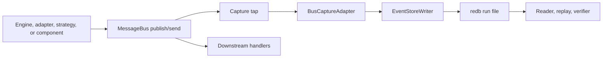
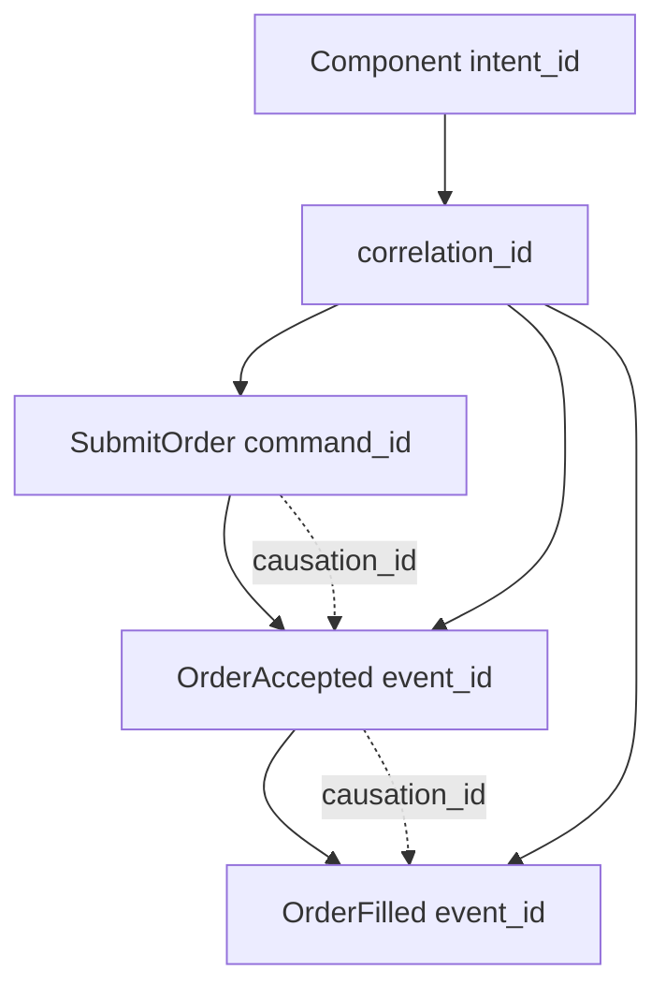
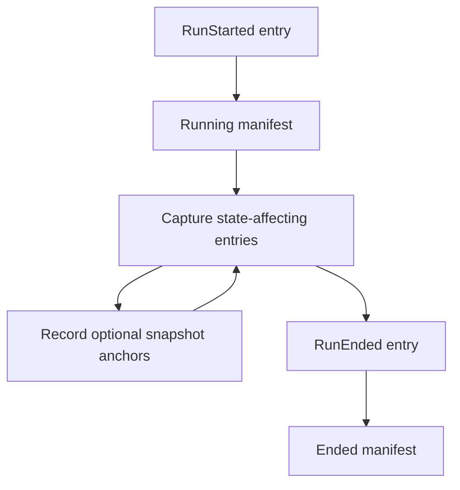
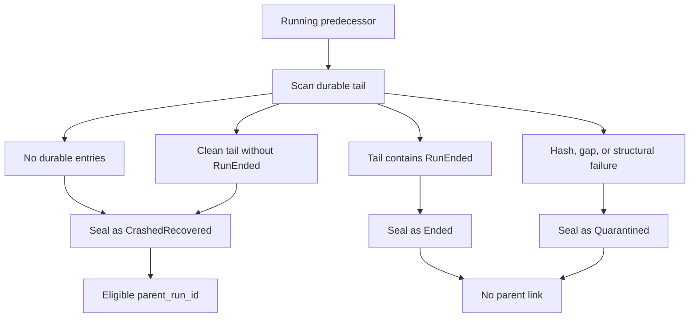
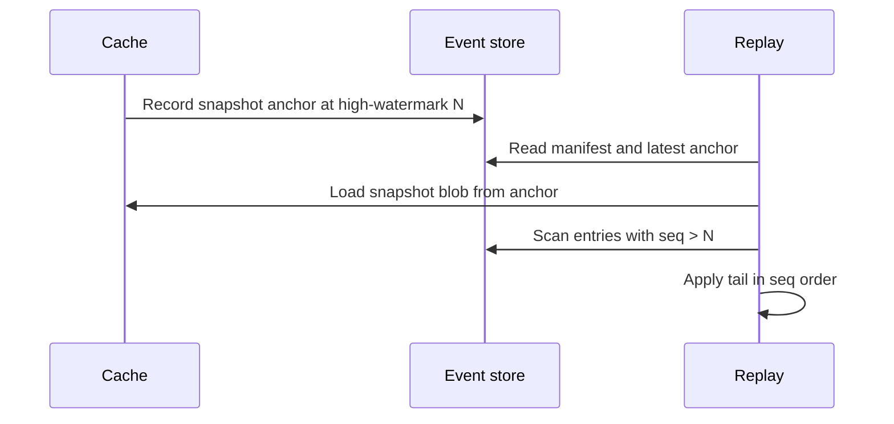

# 事件溯源（Event Sourcing）

事件溯源（event sourcing）为 NautilusTrader 提供了一份持久化的、有序的、记录了
改变引擎状态的消息的日志。事件存储（event store）在系统边界处记录这些消息，
随后读取器、重放工具和验证器使用同一份日志来重构发生过的事情，
并重建状态。

**核心理念**：

- 事件存储是影响状态的历史记录的持久化权威来源。
- 缓存是一个直写式（write-through）投影，而不是事实的来源。
- 缓存重放通过将已捕获的历史应用到缓存所拥有的状态来重建状态。
- 市场数据保留在数据 catalog 中；事件存储记录的是影响状态的消息。
- 只有当 Nautilus 将外部 I/O 捕获为命令、原始报告或其他影响状态的输入时，
  它才会变得可重放。

:::note
事件存储的捕获、重放、验证、恢复和保留规划都有针对性的测试覆盖，
但 API 接口仍在演进中。请将本文中的概念视为当前开发的设计契约，
最新的 API 详情请参阅该 crate 的 README。
:::

## 为什么需要事件溯源

缓存回答的是“现在是什么状态”。事件存储回答的是“Nautilus 是如何走到这一步的”。
它为读取器、重放工具和验证器提供了一份限定在某次运行范围内的历史，
无需依赖策略逻辑、交易场所查询或实时缓存来解释过去的状态。

事件存储为 Nautilus 提供了一个持久化的基础，用于：

- 在重放或归档之前，证明一次已封存（sealed）的运行是否“干净”。
- 检查某个订单或组件意图背后确切的命令、报告和事件序列。
- 从已捕获的历史（包括一个快照锚点加上该次运行的尾部数据）重建缓存状态。
- 通过某个意图之后跟随的引擎侧消息追踪该意图。
- 在进程退出或写入器停止后、下一次运行开始之前，封存过期的运行文件。

## 术语

- Run（运行）：针对一个实例、一个二进制文件和一份配置的一次内核会话。
- Entry（条目）：一条已捕获的消息加上重放元数据。
- `seq`：由写入器分配的、限定在单次运行范围内的顺序号，用作重放顺序。
- 高水位线（High-watermark）：后端持久确认过的最大 `seq`。
- 快照锚点（Snapshot anchor）：随缓存快照一起记录的高水位线。
- Headers（头部）：随已捕获消息传播的关联和因果元数据。

## 存储记录的内容

事件存储为一个交易实例的一次运行记录影响状态的消息总线流量。
一次运行从内核启动时开始，到进程干净停止或崩溃时结束。

**捕获的条目包括**：

- 执行命令，例如提交、修改和撤销。
- 定义 actor 或策略观测窗口的数据订阅命令。
- 已触发的时间事件，以及生成的订单、仓位和账户事件。
- 在核对（reconciliation）综合生成派生事件之前的原始交易场所执行报告。
- 由这些原始报告产生的核对输出。
- 跨越总线并影响状态的请求和响应消息，或它们与审计相关的元数据。
- 运行生命周期条目，例如 `RunStarted` 和 `RunEnded`。

该存储不会取代数据 catalog。市场数据观测值仍保留在 Feather 流式
catalog 中。事件存储记录的是命令流、原始报告、生成的事件，以及
重放引擎如何对该世界做出反应所需的元数据。

## 边界

事件存储的设计有意保持狭窄：

- 它不取代数据 catalog。
- 它不提供分析或 OLAP 查询。
- 它不会将多个交易者实例聚合为一个共识日志。
- 它目前尚未定义脱敏（redaction）、静态加密（encryption-at-rest）或防篡改证据。

## 捕获流程

捕获发生在消息总线分发边界处，先于下游处理器观察到该消息。这一位置
很重要，因为任何能够改变状态的处理器都应该只看到事件存储已经接受过的消息。



**操作步骤如下**：

- 生产者发布或发送一条影响状态的消息。
- 总线捕获钩子（tap）在下游处理器运行之前构建一个事件存储条目。
- 写入器分配下一个 `seq`，写入一个批次，并在后端确认持久性之后
  推进高水位线。
- 处理器在被捕获的条目到达写入器边界之后运行。
- 读取器扫描已封存或正在运行的后端，而不暴露追加操作。

写入器使用一个有界通道。如果写入器阻塞超过其配置的阈值，Nautilus
会停止运行，而不是丢弃条目或允许未经审计的状态变化。

有些消息合理地会跨越不止一个可被钩子观察到的边界：执行引擎会向
投资组合端点发送一个订单事件，并在其策略主题上发布同一个事件，
而交易命令则从策略跳转到风险再到执行。捕获适配器会根据注册的消息
身份（事件 ID、命令 ID）去重，因此每条逻辑消息恰好成为一条条目，
重放永远不会将同一个事件应用两次。

## 生命周期选项

`EventStoreConfig` 仍然是可序列化的运行策略。进程本地的构造策略
位于 `EventStoreLifecycleOptions` 中，高级调用方通过
`EventStoreLifecycle::boot_with_options(...)` 传递它。

默认情况下，生命周期会打开 `RedbBackend` 并安装默认的编码器注册表。
调用方可以使用生命周期选项来：

- 在总线钩子开始捕获之前提供一个自定义编码器注册表。
- 提供一个后端打开器，为新的一次运行返回任意 `EventStore` 实现。

后端打开器是内存捕获的仿真安全路径。一个 DST 测试装置或有针对性的
测试可以通过正常的生命周期打开 `MemoryBackend`，保持相同的总线钩子和
写入器语义，并在封存之后进程内读取已捕获的条目。在 `cfg(madsim)` 下，
写入器同步提交每次提交，因此捕获的 `seq` 顺序是确定性的。使用
`MemoryBackend` 打开器时，捕获不需要 `redb` 运行文件。

## 条目模型

每个事件存储条目都是一条被捕获的消息加上元数据：

- `seq`：单次运行范围内重放顺序的权威依据。
- `ts_init`：被捕获消息上的领域时间戳。
- `ts_publish`：该顺序细节重要时，总线接受该消息的时间。
- `topic`：总线主题或逻辑端点。
- `payload_type`：编码后的消息类型。
- `payload`：编码后的消息字节。
- `headers`：关联和因果元数据。
- `entry_hash`：该条目内容上的规范哈希。

`seq` 决定重放顺序。时间戳有助于解释这次运行，但它们不会覆盖 `seq`。

当前的二级索引支持按 `client_order_id` 和 `venue_order_id` 查找。
当有具体的检查调用方需要该查找模式时，可以添加一个 `correlation_id`
索引；在此之前，关联扫描可以遍历已捕获的数据流。

## 关联模型

Nautilus 记录了三个身份级别，使读取器能够回答范围、谱系和消息身份方面的问题。

- `correlation_id`：逻辑上的工作流或链条。组件的 `intent_id` 在分发边界处
  会被记录到该字段中。
- `causation_id`：导致该消息产生的直接父消息。
- `command_id`、`event_id` 或 `report_id`：该特定消息本身的身份。



这使操作人员能够提出两个常见的问题：

- “显示这个工作流中的一切”：按 `correlation_id` 过滤或扫描。
- “解释这个事件为什么发生”：沿 `causation_id` 回溯到直接的父消息。

## 运行文件与清单（Manifests）

默认的后端是 `redb`。它为每次运行在以下路径下存储一个文件：

```text
<base>/<instance_id>/<run_id>.redb
```

每个运行文件包含：

- 按 `seq` 键控的条目。
- 用于订单标识符的二级索引。
- 一份在运行开始时写入、在运行结束时封存的清单。
- 一个用于缓存恢复的可选快照锚点。

清单记录了运行身份和可重现性输入：

- 运行身份：
  - `run_id`
  - `parent_run_id`
  - `instance_id`

- 构建身份：
  - `binary_hash`
  - `crate_versions`
  - `feature_flags`
  - 适配器版本

- 配置身份：
  - `config_hash`
  - 已注册的组件
  - 可选的种子（seed）

- 生命周期状态：
  - `start_ts_init`
  - `end_ts_init`
  - `high_watermark`
  - 状态

运行状态是 `Running`、`Ended`、`CrashedRecovered` 或 `Quarantined` 之一。

## 运行生命周期



在操作层面：

- `RunStarted` 是一次全新运行的第一条条目。在同一进程中重复调用
  `open()` 会在开始新的运行之前封存当前会话。
- 当清单处于 `Running` 状态时，总线钩子会记录影响状态的条目，
  缓存快照可以针对持久化的高水位线记录锚点。
- 干净的关闭、内核释放或重置/重新运行的封存会追加 `RunEnded` 并将
  清单封存为 `Ended`。
- 一次故障停止（被停止）的会话会跳过进程内封存；下一次启动的恢复扫描
  负责处理它。停止信号的作用域限定在触发它的那次运行上：稍后的
  `open()` 会重新激活一个全新的信号，因此一次停止不会毒害同一进程中
  后续的运行。

## 恢复封存

前驱运行（predecessor）是指同一实例较早的一个运行文件，其清单仍
显示为 `Running`。这意味着上一个进程没有完成正常的生命周期，
或者写入器在清单封存完成之前停止了。



启动恢复会扫描每个处于 `Running` 状态的前驱运行，并根据持久化的尾部
数据选择最终的清单状态。没有 `RunEnded` 的干净尾部会被封存为
`CrashedRecovered`，以 `RunEnded` 结尾的尾部会被封存为 `Ended`，
而哈希不匹配、间隙或结构性损坏会被封存为 `Quarantined`。

该扫描过程永远不会因为一个运行文件损坏而使交易者无法启动。一个被
强行终止的进程（SIGKILL、OOM kill、断电）会留下一个 redb 拒绝以
只读方式打开的文件；列举过程会回退到以可写方式打开，这会在恢复继续
之前执行 redb 的修复步骤。一个仍然无法打开、或缺少清单的文件会被跳过，
并记录一条错误，在下一次启动时重试，因此恢复和保留会继续对健康的
运行进行处理。

只有 `CrashedRecovered` 的前驱运行才会成为 `parent_run_id`。一个已配置的
`replay_from_run_id` 会在验证之后覆盖恢复出的父运行。只读验证器是
独立的：它可以在不修改的情况下检查一次已封存的运行，并报告
`quarantine=not-performed`。

## 重放模式

重放遵循一条排序规则：按 `seq` 顺序应用事件存储条目。`ts_init` 和
`ts_publish` 解释了消息发生的时间，但 `seq` 是持久化的重放顺序。

Rust 重放输入 API 将规划与执行分开：

- 仅事件存储的重放输入只返回条目。
- 与 catalog 连接的重放输入添加了调用方选择的 catalog 切片，用于上下文分析。

Catalog 规划器接受明确的 `CatalogSliceSelector` 值和一个只读的
`ReplayCatalog`。规划过程会从事件存储扫描中解析 catalog 的时间边界，
除非选择器提供了明确的边界，它还会报告缺失的 catalog 切片，
并将 `seq` 保留为条目排序的权威依据。加载会返回 `ReplayInputs`：
按 `seq` 顺序排列的事件存储条目，加上按所选切片分组的 catalog 记录。

Rust 调用方可以启用默认关闭的 `persistence` 功能，并使用
`nautilus_event_store::ParquetReplayCatalog` 包装一个
`ParquetDataCatalog`，以规划选定的 catalog 文件和从文件名派生的时间区间。
该桥接层可以将 `quotes`、`trades` 和 `bars` 加载为类型化的
`CatalogReplayRecord` 值。

:::note
持久化桥接层是只读的：它使用 catalog 的发现和查询 API，但**不会写入
catalog**。不受支持的 catalog 类会在重放为该类添加类型化载荷契约之前
一直加载失败。
:::

## 数据标记旁路组件（Data marker sidecar）

:::note
标记旁路组件位于 `crates/event_store/src/markers/` 中。它通过
`EventStoreConfig.data_markers`（`crates/system/src/event_store.rs`）
选择性启用，默认关闭。
:::

准确的数据交付顺序不是从 catalog 时间戳推断出来的。标记旁路组件
记录在消息总线分发边界处观察到的数据，与事件存储运行并存，
但不会将完整的市场数据载荷写入 `EventStoreEntry` 行。

该旁路组件支持一项审计声明：当启用标记捕获时，Nautilus 在该次运行的
总线边界处按 `marker_seq` 顺序观察到了数据交付，且每个标记都携带了
足够的身份信息，可以关联回候选的 catalog 行。它无法证明仅凭 catalog
时间戳就能定义总线顺序，也无法在 catalog 行缺失或已更改时重建某个
数据点，无法证明 Nautilus 观察到该消息之前的交易场所发送顺序，
对于禁用了标记捕获的运行也无法说明任何情况。

标记不消耗事件存储的 `seq` 值，也不会在条目表中产生间隙。每个标记
都有自己单调递增的 `marker_seq`，加上 `event_seq_before`（在观察到
该标记之前分配的最大事件存储 `seq`）。一个已封存运行的分析器可以
从 `event_seq_before + 1` 推导出某个标记之后的下一个事件存储条目；
共享相同 `event_seq_before` 的标记按 `marker_seq` 排序。对于影响状态的
条目，事件存储的 `seq` 仍然是重放顺序的权威依据。

该旁路组件有两种标记：

- **游标快照（Cursor snapshots）**（`DataCursorSnapshot`）：默认的捕获模式。
  每个快照记录 `marker_seq`、`event_seq_before`、`ts_init`，以及自上一次快照
  以来推进过的 `StreamCursor` 条目。一个 `StreamCursor` 携带流的 `slot`、
  该 slot 中观察到的最大 `ts_init`（`ts_init_hi`），以及记录 `count`。
  一个 `StreamDictEntry` 将每个 `slot` 映射到其 `data_cls`（`BookDeltas`、
  `BookDepth10`、`Quote`、`Trade`、`Bar`）和金融工具 `identifier`。
- **高保真标记（High-fidelity markers）**（`HiFiMarker`）：通过
  `DataMarkerConfig.high_fidelity` 按金融工具选择性启用。每个标记记录
  `marker_seq`、`event_seq_before`、`slot`、`ts_event`、`ts_init`、
  `same_ts_ordinal`，以及针对规范类型化行字段的 32 字节
  `record_fingerprint`。

`same_ts_ordinal` 和 `record_fingerprint` 用于消除相同时间戳的重复数据的
歧义，而无需存储价格、数量、规模或 MessagePack 载荷。如果两个 catalog
行对于相同的键和时间戳字节完全相同，该旁路组件可以证明 Nautilus 以
特定的标记顺序观察到了两次交付；但在 catalog 压缩重写了行顺序之后，
它无法指出某个唯一的物理 catalog 行。

稳定的契约是标记模式、选择性启用的捕获和读取原语、无间隙的标记验证，
以及 catalog 连接规则。分析工具可以基于该契约来选择时间窗口、解释
特定于交易场所的数据、对标记进行排序或聚类、呈现报告，以及打包运行
数据包。

在禁用标记捕获的情况下，不会安装数据标记写入器。缓存重放和实盘重启
不会读取这个旁路组件：快照尾部重放仍然按 `seq` 顺序应用事件存储条目，
实盘重启仍然从缓存拥有的状态加上事件存储的父链接启动。

这些 API **不会**：

- 打开实盘交易场所客户端
- 运行策略或 actor
- 重新运行核对
- 删除文件
- 重放时钟的注册/取消生命周期

由内核管理的重放使用 `EventStoreConfig::replay_from_run_id`。设置后，
内核会从已封存的运行中恢复缓存状态，将该运行记录为新子运行的父运行，
并跳过实盘引擎、客户端、启动和交易场所核对。

缓存重放加载器仅负责状态。它恢复缓存拥有的快照，按 `seq` 顺序扫描
事件存储的尾部数据，解码受支持的、影响缓存的载荷，并将它们直接应用到
`Cache`。受支持的载荷包括：

- 已综合生成的账户、订单和仓位事件
- 已捕获的订单列表
- 针对金融工具、报价、成交、资金费率和 K 线的完整数据响应

它**不会**：

- 将重放的条目发布到实盘消息总线
- 运行策略或 actor 代码
- 查询交易场所
- 运行核对
- 再次推导标识符
- 重新激活时钟

已触发的 `TimeEvent` 和原始交易场所报告在此路径上只是检查用的记录；
重放会应用在该次运行中稍后被综合生成的订单、仓位和账户事件。

## 基于快照锚定的恢复

缓存快照由缓存拥有。事件存储只存储快照锚点：即快照时的高水位线，
加上一个指向快照 blob 的内容寻址（content-addressed）引用。



恢复情形按消息推进的程度排序：

- 入队之前：该消息从未到达写入器，因此生产者重试策略适用。
- 入队之后、提交之前：这个在途批次尚未持久化，因此高水位线不会推进。
- 提交之后、快照锚点之前：恢复会加载先前的快照并重放尾部数据。
- 快照锚点之后：恢复会加载最新的快照，并重放锚点之后的条目。

:::info
实盘重启仍然使用“快照加核对”的方式。只有在捕获覆盖率和重放规则
覆盖了每一条影响状态的路径之后，事件存储恢复才会成为实盘重启路径。
:::

重放的正确性依赖于四项检查：

- 条目由不可变的 `seq` 值寻址。
- 写入会拒绝乱序提交。
- 读取器会检测高水位线内的间隙。
- 快照重放规划会拒绝指向超出持久化高水位线之外的锚点。

## 保留规划

保留（retention）以整个运行文件作为回收单位。事件存储暴露了一个
非破坏性的规划器，它列出已封存的运行清单，检查它们最新的快照锚点状态，
并返回候选的运行文件，供之后的监督进程或操作人员回收。

该规划器支持三种模式：

- `Full`：保留每一次已封存的运行，不返回任何回收候选。
- `Bounded { keep_last }`：保留最新的若干次已封存运行，同时至少保留
  一个已知良好的恢复点。
- `SnapshotAnchored`：只回收早于最新已知良好恢复点的已封存运行。

一个已知良好的恢复点是一次已封存、非 `Quarantined` 的运行，拥有一个
有效的快照锚点，其高水位线不超过该次运行持久化的高水位线（即磁盘上
实际存在的最后一条条目，而不是清单中记录的值，因此一个被截尾的运行
无法伪装成恢复点）。`Running` 状态的运行永远不会被列为已封存运行，
也不会被选为回收候选。缺失、损坏或无效的快照锚点不算作恢复点，
因此当规划器无法证明至少存在一个可用的恢复点时，它不会返回任何候选。

## 验证覆盖范围

事件存储测试套件为当前的 alpha 接口固定了具有支撑意义的正确性保证：

- 默认编码器注册表覆盖了已审计的影响状态的捕获接口。
- 已触发的 `TimeEvent` 通过 `TimeEventHandler::run` 命中已安装的事件存储钩子。
- 在有界背压下写入器会停止，而不是丢弃已接受的条目。
- 条目哈希验证能够检测字节级的载荷损坏。
- 进程隔离的验证能够将被截断或尾部全零的运行文件报告为损坏。
- 对于生成的已捕获事件流，缓存重放能重建出与实时缓存相同的
  已观察账户、订单和仓位状态。
- 跨越多个总线边界分发的同一个订单事件只会被捕获一次。
- 无法解码或指向超出持久化高水位线之外的快照锚点，会作为验证器发现项
  呈现出来，而不是被验证为干净。
- 与 catalog 连接的重放输入规划覆盖了已选切片、缺失切片、时间边界，
  以及事件存储的 `seq` 排序。
- 崩溃恢复会根据持久化的尾部数据，将处于 `Running` 状态的前驱运行封存为
  `Ended`、`CrashedRecovered` 或 `Quarantined`，只有 `CrashedRecovered`
  的运行会成为父运行。
- 启动恢复会修复严重崩溃的运行文件，跳过无法读取的文件，而不是让整个
  扫描失败。

## 完整性与验证

每个条目都携带一个覆盖其全部内容的规范哈希。读取器和验证器会重新计算
该哈希并报告不匹配的情况。验证器还会检查清单/高水位线状态，
根据条目表验证二级索引，并报告无法解码或指向超出持久化高水位线之外的
快照锚点，因此恢复路径已损坏的运行无法被验证为干净。

运行验证是进程隔离的。这一点很重要，因为某些损坏的 `redb` 文件在打开
或首次读取时可能会 panic，而 release 构建使用 `panic = "abort"`。
验证器在一个工作子进程中运行该扫描，因此一个损坏的文件只会终止该
工作进程，而不会终止调用方。

验证一个已封存的运行文件：

```bash
cargo run -p nautilus-event-store --bin verify -- /path/to/run.redb
```

干净的输出如下所示：

```text
clean run_id=1700000000-cafe0001 status=Ended high_watermark=3 entries_scanned=3
```

损坏的输出包括 `quarantine=not-performed`：

```text
corrupt run_id=1700000000-cafe0001 status=Ended high_watermark=3 entries_scanned=3 findings=1 quarantine=not-performed
- hash mismatch at seq 2
```

退出码：

- `0`：该运行是干净的。
- `1`：该运行存在损坏发现项，或工作进程中止或超时。
- `2`：验证器无法打开或针对请求的文件运行。

:::note
验证器报告损坏，但不会修改运行文件。隔离（Quarantine）是操作人员或
监督进程的策略。
:::

## 当前的运维使用方式

当前的 alpha 使用场景专注于对运行文件进行本地检查和验证。

在复制或恢复某次运行之后进行验证：

```bash
cargo run -p nautilus-event-store --bin verify -- ./event_store/trader-001/1700000000-cafe0001.redb
```

针对一次大型已封存运行提高验证器超时时间：

```bash
env NAUTILUS_EVENT_STORE_VERIFY_TIMEOUT_SECS=120 \
    cargo run -p nautilus-event-store --bin verify -- ./event_store/trader-001/1700000000-cafe0001.redb
```

从 Rust 读取一次已封存的运行：

```rust
use nautilus_event_store::{EventStoreReader, RedbBackend, ScanDirection};

fn inspect_run() -> Result<(), Box<dyn std::error::Error>> {
    let backend =
        RedbBackend::open_sealed_file("./event_store/trader-001/1700000000-cafe0001.redb")?;
    let reader = EventStoreReader::new(backend);
    let high_watermark = reader.high_watermark()?;

    for entry in reader.scan_range(1, high_watermark, ScanDirection::Forward) {
        let entry = entry?;
        println!("{} {}", entry.seq, entry.topic);
    }

    Ok(())
}
```

验证器是只读检查。它报告损坏而不改变运行文件，因此隔离决策仍然
在该命令路径之外。

## 与 DST 的关系

事件存储和确定性仿真测试（DST）解决的是重放的不同部分。

- 事件存储提供已捕获的输入历史。
- DST 控制调度、时间、带种子的随机性，以及其他在范围内的非确定性。
- 两者结合起来，使一次运行能够在确定性仿真范围内重现引擎行为，
  该范围由以下几项标识：
  - `seed`
  - `binary_hash`
  - `config_hash`
  - `schema_version`
  - `log`

在 `cfg(madsim)` 下，写入器同步提交，而不是生成其写入器线程。当一个
仿真测试装置通过生命周期选项提供一个 `MemoryBackend` 打开器时，
捕获会保持在进程内，不需要 `redb` 文件。在该高级选项路径之外，
Redb 仍然是默认的持久化后端。

除非 Nautilus 捕获了相关的原始输入，并通过确定性接口路由它们，
否则适配器的网络 I/O 仍然处于字节级一致重放的范围之外。
