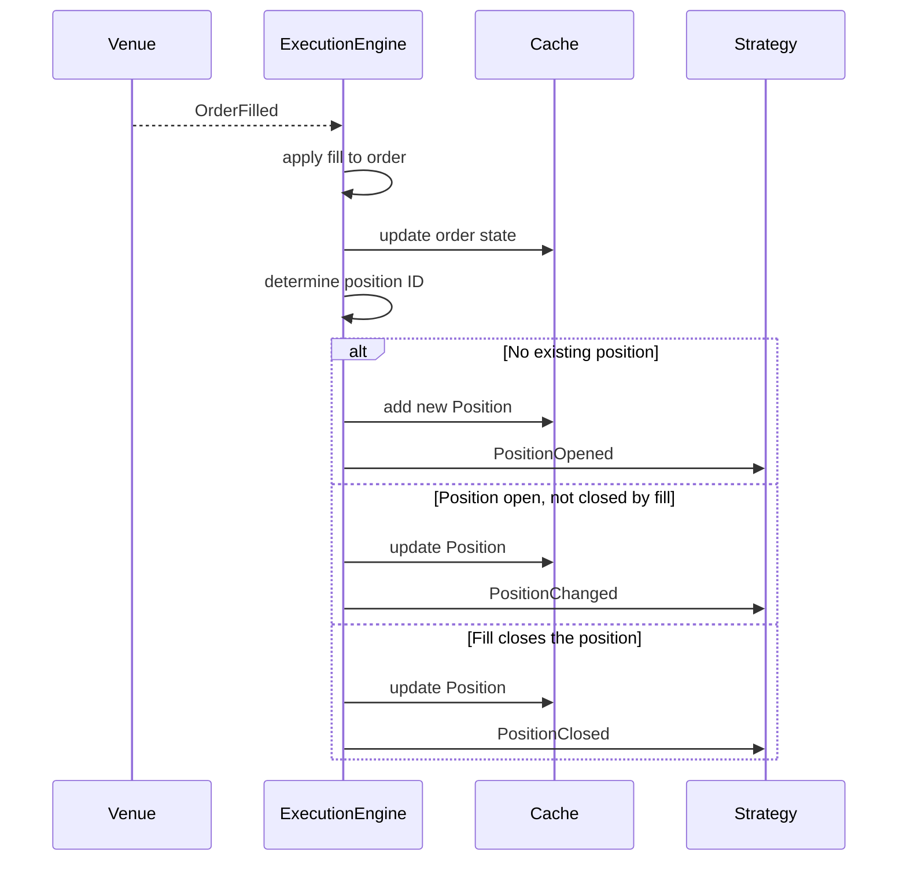

# 事件（Events）

Nautilus 是事件驱动（event-driven）的：系统中的每一次状态变化都由一个事件对象表示，
该对象通过 `MessageBus` 流转到策略（strategy）与执行者（actor）的处理器（handler）。
本指南介绍事件类型、它们是如何被分发的，以及订单成交（fill）如何产生持仓（position）事件。

## 事件分类

| 类别 | 示例                                             | 来源                             |
|------|--------------------------------------------------|----------------------------------|
| 订单 | `OrderAccepted`、`OrderFilled`、`OrderCanceled` | `ExecutionEngine`（来自交易场所） |
| 持仓 | `PositionOpened`、`PositionChanged`             | `ExecutionEngine`（来自成交）     |
| 账户 | `AccountState`                                  | `ExecutionClient` / `Portfolio` |
| 时间 | `TimeEvent`                                     | `Clock`（定时器与提醒）           |

## 处理器分发

当事件到达策略时，系统会按固定的优先级顺序调用处理器。第一个匹配的处理器先运行，然后是
下一级别，因此你可以按照所需的任意粒度处理事件。

### 订单事件

1. 特定处理器（例如 `on_order_filled`）
2. `on_order_event`（接收所有订单事件）
3. `on_event`（接收所有事件）

### 持仓事件

1. 特定处理器（例如 `on_position_opened`）
2. `on_position_event`（接收所有持仓事件）
3. `on_event`（接收所有事件）

### 时间事件

定时器（timer）和提醒（alert）会产生 `TimeEvent` 对象。在调用 `set_timer` 或
`set_time_alert` 时传入 `callback`，可将事件定向到你自己的方法。如果省略回调，事件将
改为投递给 `on_event`。

## 订单事件

每个订单事件都对应于[订单状态机](../orders/index.md#order-state-flow)中的一次状态转换。
`ExecutionEngine` 将事件应用到订单上，更新 `Cache`，并将其发布到 `MessageBus`。下表展示了
主要的状态转换；部分成交（partially filled）和已触发（triggered）的订单还支持其他状态转换，
详见完整的[订单状态流](../orders/index.md#order-state-flow)。

| 事件                                               | 主要转换                                   | 处理器                      |
|-----------------------------------------------------|---------------------------------------------|------------------------------|
| [`OrderInitialized`](order_initialized.md)          | （在本地创建）                              | `on_order_initialized`      |
| [`OrderDenied`](order_denied.md)                    | Initialized -> Denied                       | `on_order_denied`           |
| [`OrderEmulated`](order_emulated.md)                | Initialized -> Emulated                     | `on_order_emulated`         |
| [`OrderReleased`](order_released.md)                | Emulated -> Released                        | `on_order_released`         |
| [`OrderSubmitted`](order_submitted.md)              | Initialized/Released -> Submitted           | `on_order_submitted`        |
| [`OrderAccepted`](order_accepted.md)                | Submitted -> Accepted                       | `on_order_accepted`         |
| [`OrderRejected`](order_rejected.md)                | Submitted -> Rejected                       | `on_order_rejected`         |
| [`OrderTriggered`](order_triggered.md)              | Accepted -> Triggered                       | `on_order_triggered`        |
| [`OrderPendingUpdate`](order_pending_update.md)     | Accepted -> PendingUpdate                   | `on_order_pending_update`   |
| [`OrderPendingCancel`](order_pending_cancel.md)     | Accepted -> PendingCancel                   | `on_order_pending_cancel`   |
| [`OrderUpdated`](order_updated.md)                  | PendingUpdate -> previous status            | `on_order_updated`          |
| [`OrderModifyRejected`](order_modify_rejected.md)   | PendingUpdate -> previous status            | `on_order_modify_rejected`  |
| [`OrderCancelRejected`](order_cancel_rejected.md)   | PendingCancel -> previous status            | `on_order_cancel_rejected`  |
| [`OrderCanceled`](order_canceled.md)                | PendingCancel/Accepted -> Canceled          | `on_order_canceled`         |
| [`OrderExpired`](order_expired.md)                  | Accepted -> Expired                         | `on_order_expired`          |
| [`OrderFilled`](order_filled.md)                    | Accepted -> Filled/PartiallyFilled          | `on_order_filled`           |
| [`OrderFillVoided`](order_fill_voided.md)           | Filled -> Voided/Accepted/PartiallyFilled   | `on_order_fill_voided`      |

### 通用订单事件字段

所有订单事件都共享以下字段：

| 字段              | 说明                                       |
|-------------------|--------------------------------------------|
| `trader_id`       | 交易者（Trader）实例标识符。               |
| `strategy_id`     | 提交该订单的策略。                         |
| `instrument_id`   | 该订单对应的金融工具（instrument）。       |
| `client_order_id` | 客户端分配的订单标识符。                   |
| `venue_order_id`  | 交易场所（venue）分配的订单标识符。        |
| `account_id`      | 该订单所属的账户。                         |
| `reconciliation`  | 是否在对账（reconciliation）期间生成。     |
| `event_id`        | 唯一事件标识符。                           |
| `ts_event`        | 事件发生时的时间戳。                       |
| `ts_init`         | 事件被创建时的时间戳。                     |

每个订单事件页面都会列出除这些通用字段之外该类型特有的字段，以及哪些可选的通用字段会被
填充。例如，[`OrderFilled`](order_filled.md) 增加了 `last_qty`、`last_px`、`trade_id` 和
`commission`。[`OrderFillVoided`](order_fill_voided.md) 标识被修正的成交，并携带其累计的
作废数量（voided quantity）。

:::tip
重写 `on_order_event` 可以在一处统一处理所有订单事件。特定的处理器会先触发，因此你可以
将两种方式结合使用。
:::

## 持仓事件

持仓事件是成交事件的直接结果。`ExecutionEngine` 处理每个 `OrderFilled`，更新或创建持仓，
并发出相应的持仓事件。

`OrderFillVoided` 会根据其生效的成交历史重建缓存中的持仓（position），它不会发出反向成交，
也不会合成持仓事件。

| 事件                                    | 触发时机                                   | 处理器                |
|------------------------------------------|---------------------------------------------|------------------------|
| [`PositionOpened`](position_opened.md)   | 第一笔成交创建了新持仓。                    | `on_position_opened`  |
| [`PositionChanged`](position_changed.md) | 后续成交改变了数量或方向（side）。          | `on_position_changed` |
| [`PositionClosed`](position_closed.md)   | 成交将数量减少至零。                        | `on_position_closed`  |

### 从成交到持仓：因果链

下面的图示展示了一个单一的 `OrderFilled` 事件如何产生一个持仓事件。这是订单管理与持仓
跟踪之间的关键联系。



**逐步说明：**

1. **成交到达。** `ExecutionEngine` 从交易场所适配器（venue adapter）接收一个
   `OrderFilled` 事件。
2. **订单状态更新。** 引擎将该成交应用到订单对象，并将更新后的订单写入 `Cache`。
3. **解析持仓 ID。** 引擎根据 OMS 类型和策略配置，确定该成交属于哪个持仓。
4. **创建或更新持仓。** 有三种可能的结果：
   - **该 ID 不存在持仓**：引擎根据该成交创建一个 `Position`，将其加入 `Cache`，并发出
     `PositionOpened`。
   - **持仓存在，且在该成交后仍保持开仓（open）**：引擎将该成交应用到持仓，更新
     `Cache`，并发出 `PositionChanged`。
   - **持仓存在，且被平仓**（数量降为零）：引擎应用该成交，更新 `Cache`，并发出
     `PositionClosed`。
5. **反向（flip）情形。** 当一笔成交使持仓方向反转（例如多头 10 手被卖出 15 手成交）时，
   引擎会将该成交拆分为两部分：一部分用于平掉原有持仓（`PositionClosed`），另一部分用于
   开出新持仓（`PositionOpened`）。

### 持仓事件字段

每个持仓事件都暴露以下所有字段（它们定义在 `PositionEvent` 基类上）。对勾表示该字段在该
事件中携带有意义的值；短横线表示该字段保持在其零值或默认值（例如在持仓关闭之前的
`avg_px_close` 和 `duration_ns`）。

| 字段                | Opened | Changed | Closed | 说明                       |
|----------------------|--------|---------|--------|-----------------------------------|
| `trader_id`          | ✓      | ✓       | ✓      | 交易者实例标识符。                 |
| `strategy_id`        | ✓      | ✓       | ✓      | 拥有该持仓的策略。                 |
| `instrument_id`      | ✓      | ✓       | ✓      | 该持仓对应的金融工具。             |
| `position_id`        | ✓      | ✓       | ✓      | 唯一持仓标识符。                   |
| `account_id`         | ✓      | ✓       | ✓      | 该持仓所属的账户。                 |
| `opening_order_id`   | ✓      | ✓       | ✓      | 开仓该持仓的订单。                 |
| `closing_order_id`   | -      | -       | ✓      | 平仓该持仓的订单。                 |
| `entry`              | ✓      | ✓       | ✓      | 开仓成交的方向。                   |
| `side`               | ✓      | ✓       | ✓      | 当前持仓方向。                     |
| `signed_qty`         | ✓      | ✓       | ✓      | 带符号数量（负数表示空头）。       |
| `quantity`           | ✓      | ✓       | ✓      | 无符号持仓数量。                   |
| `peak_qty`           | ✓      | ✓       | ✓      | 曾达到的最大数量。                 |
| `last_qty`           | ✓      | ✓       | ✓      | 最近一笔成交的数量。               |
| `last_px`            | ✓      | ✓       | ✓      | 最近一笔成交的价格。               |
| `currency`           | ✓      | ✓       | ✓      | 结算货币。                         |
| `avg_px_open`        | ✓      | ✓       | ✓      | 平均开仓价格。                     |
| `avg_px_close`       | -      | ✓       | ✓      | 平均平仓价格。                     |
| `realized_return`    | -      | ✓       | ✓      | 以比率表示的已实现收益率。         |
| `realized_pnl`       | ✓      | ✓       | ✓      | 已实现盈亏（PnL）。               |
| `unrealized_pnl`     | -      | ✓       | ✓      | 未实现盈亏。                       |
| `duration_ns`        | -      | -       | ✓      | 持仓时长（纳秒）。                 |
| `ts_opened`          | ✓      | ✓       | ✓      | 持仓开仓时的时间戳。               |
| `ts_closed`          | -      | -       | ✓      | 持仓平仓时的时间戳。               |
| `event_id`           | ✓      | ✓       | ✓      | 唯一事件标识符。                   |
| `ts_event`           | ✓      | ✓       | ✓      | 触发该事件的成交发生时的时间戳。   |
| `ts_init`            | ✓      | ✓       | ✓      | 事件创建时的时间戳。               |

### 在订单与持仓之间追溯

`Cache` 提供了在订单与持仓之间导航的方法：

```python
# From a position, find all orders that contributed fills
orders = self.cache.orders_for_position(position.id)

# From an order, find the position it belongs to
position = self.cache.position_for_order(order.client_order_id)

# The opening order is stored directly on the position
opening_order_id = position.opening_order_id
```

## 账户事件

`AccountState` 事件表示余额与保证金的快照。它在以下情况触发：

- 交易场所报告了账户更新（通过执行客户端）。
- `Portfolio` 在持仓更新后重新计算账户状态（适用于启用了
  `calculate_account_state` 的保证金账户）。

账户状态包含余额、保证金、账户类型和基础货币。`Portfolio` 会在内部订阅这些事件，以维护
风险敞口（exposure）与余额跟踪。完整字段列表请参见
[`AccountState`](account_state.md)。

## 事件订阅

除了策略处理器之外，执行者（actor）还可以订阅其并未交易的金融工具的特定事件流。这些订阅
直接使用 `MessageBus`，不涉及 `DataEngine`。

| 主题模式（Topic pattern）                | 接收内容                                   |
|--------------------------------------------|----------------------------------------------|
| `events.order_filled.{instrument_id}`      | 单个金融工具的成交事件。                     |
| `events.order_canceled.{instrument_id}`    | 单个金融工具的取消事件。                     |
| `events.order.{strategy_id}`               | 路由到单个策略的所有订单事件。               |
| `events.order.*`                           | 所有按策略路由的订单事件。                   |

这对于监控执行质量或跨策略成交率、而无需参与订单管理的监控型执行者（actor）非常有用。

详细信息与示例，请参见
[订单事件订阅](../actors.md#order-event-subscriptions)。

## 相关指南

- [订单（Orders）](../orders/) - 订单类型与状态机。
- [持仓（Positions）](../positions.md) - 持仓生命周期与盈亏。
- [执行（Execution）](../execution.md) - 执行流程与风险检查。
- [策略（Strategies）](../strategies.md) - 策略中的处理器实现。
- [架构（Architecture）](../architecture.md) - 数据与执行流程模式。
