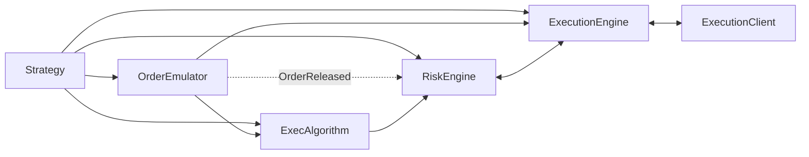

# 执行（Execution）

NautilusTrader 可以同时（每个实例）处理多个策略和交易场所的交易执行和
订单管理。执行过程涉及多个相互作用的组件，因此理解执行消息（命令和事件）
可能的流转路径非常重要。

主要的执行相关组件包括：

- `Strategy`
- `ExecAlgorithm`（执行算法）
- `OrderEmulator`
- `RiskEngine`
- `ExecutionEngine` 或 `LiveExecutionEngine`
- `ExecutionClient` 或 `LiveExecutionClient`

## 执行流程

`Strategy` 基类继承自 `Actor`，包含所有公共数据方法。
它还提供了用于管理订单和交易执行的方法：

- `submit_order(...)`
- `submit_order_list(...)`
- `modify_order(...)`
- `cancel_order(...)`
- `cancel_orders(...)`
- `cancel_all_orders(...)`
- `close_position(...)`
- `close_all_positions(...)`
- `query_account(...)`
- `query_order(...)`

这些方法创建必要的执行命令，并通过消息总线（点对点方式）将它们发送到
相关组件。它们还会发布诸如 `OrderInitialized` 之类的事件。

并非每个命令都遵循单一的线性路径：

- `submit_order(...)` 对于模拟订单会路由到 `OrderEmulator`，当设置了
  `exec_algorithm_id` 时会路由到某个 `ExecAlgorithm`，否则会路由到
  `RiskEngine`。
- `submit_order_list(...)` 根据是否模拟以及 `exec_algorithm_id` 遵循相同的
  分支行为。
- `modify_order(...)` 对于模拟订单会路由到 `OrderEmulator`，否则会路由到
  `RiskEngine`。
- 撤销和查询命令可以根据命令和订单状态，直接路由到 `OrderEmulator`、
  `ExecAlgorithm` 或 `ExecutionEngine`。

对于新订单提交，典型的流程如下：

`Strategy` -> `OrderEmulator` 或 `ExecAlgorithm` 或 `RiskEngine`

从那里开始，下游流程通常是：

`OrderEmulator` -> `ExecAlgorithm` 或 `ExecutionEngine`

`ExecAlgorithm` -> `RiskEngine` -> `ExecutionEngine` -> `ExecutionClient`

下图展示了消息（命令和事件）在 Nautilus 执行组件之间的流转。



## 成交更正

有些交易场所可能会在事后减少或使某笔成交失效。Nautilus 会将其记录为一个
[`OrderFillVoided`](events/order_fill_voided.md) 事件，而不是记录为反方向的
成交。该事件标识了原始成交，并携带累计的失效数量和手续费更正信息。

执行引擎会重建受影响的订单和仓位，并在向策略和执行算法发布该更正之前，
刷新投资组合的仓位和盈亏缓存。已迁移的交易场所适配器会在失效之后请求
一次权威的账户刷新。一次更正会保留任何已经在进行中的订单剩余部分，
但只有当交易场所通过 `is_reopened=true` 提供了确凿证据时，更正后的数量才会
变为可执行。之前的撤销或过期状态仍然是终止状态。

## 订单拒绝原因

一次本地拒绝（`OrderDenied`）携带一个标准化的 `CATEGORY_CONDITION` 原因代码，
后面跟着 `key=value` 上下文信息，例如
`QUANTITY_EXCEEDS_MAXIMUM: effective_quantity=15, max_quantity=10`。
下表涵盖了由风险引擎和执行引擎发出的本地拒绝。这些代码是本地拒绝订单的
事实来源；交易场所拒绝（`OrderRejected`）会原样透传交易场所自身的文本。

<!-- Generated from the `OrderDeniedReason` enum (crates/model). Regenerate with: cargo test -p nautilus-model regenerate_order_denied_reasons_doc -- --ignored -->
<!-- BEGIN GENERATED: order-denied-reasons -->

| 代码                                  | 说明                                                                       |
| ------------------------------------- | --------------------------------------------------------------------------------- |
| `CLIENT_VENUE_MISMATCH`               | 该执行客户端不处理该订单的交易场所。                             |
| `CUM_MARGIN_EXCEEDS_FREE_BALANCE`     | 累计初始保证金超过了账户可用余额。                   |
| `CUM_NOTIONAL_EXCEEDS_FREE_BALANCE`   | 累计订单名义金额超过了账户可用余额。                 |
| `EXPIRE_TIME_IN_PAST`                 | 该订单的过期时间是过去的时间。                                           |
| `INSTRUMENT_NOT_FOUND`                | 在缓存中未找到该金融工具。                                        |
| `INVALID_CLIENT_ORDER_ID`             | 客户端订单 ID 对该交易场所来说无效。                                     |
| `INVALID_MAX_NOTIONAL_PER_ORDER`      | 配置的每笔订单最大名义金额无效。                             |
| `INVALID_ORDER_SIDE`                  | 该操作的订单方向无效。                                     |
| `INVALID_POSITION_ID`                 | 提交订单时提供的仓位 ID 无效。                     |
| `MARGIN_EXCEEDS_FREE_BALANCE`         | 该订单的初始保证金超过了账户可用余额。                        |
| `MISSING_EXPIRE_TIME`                 | 一个 GTD 订单缺少其过期时间。                                           |
| `MISSING_TRAILING_OFFSET`             | 该订单缺少必需的跟踪偏移量。                                  |
| `MISSING_TRAILING_OFFSET_TYPE`        | 该订单缺少必需的跟踪偏移量类型。                                  |
| `MISSING_TRIGGER_TYPE`                | 该订单缺少必需的触发类型。                                     |
| `NOTIONAL_BELOW_MINIMUM`              | 该订单的名义金额低于金融工具的最小值。                               |
| `NOTIONAL_EXCEEDS_FREE_BALANCE`       | 该订单的名义金额超过了账户可用余额。                              |
| `NOTIONAL_EXCEEDS_MAXIMUM`            | 该订单的名义金额超过了金融工具的最大值。                                |
| `NOTIONAL_EXCEEDS_MAX_PER_ORDER`      | 该订单的名义金额超过了配置的每笔订单最大值。                      |
| `NO_EXECUTION_CLIENT`                 | 未找到该路由命令对应的执行客户端。                             |
| `ORDER_LIST_DENIED`                   | 该订单因其订单列表未通过风险检查而被拒绝。                             |
| `ORDER_LIST_INCOMPLETE`               | 该订单列表在缓存中缺少部分订单。                             |
| `POSITION_NOT_FOUND`                  | 未找到某个仅减仓（reduce‑only）订单所引用的仓位。                               |
| `QUANTITY_BELOW_MINIMUM`              | 有效订单数量低于金融工具的最小值。                     |
| `QUANTITY_CONVERSION_FAILED`          | 该订单数量无法为风险检查完成转换。                        |
| `QUANTITY_EXCEEDS_MAXIMUM`            | 有效订单数量超过了金融工具的最大值。                          |
| `RATE_LIMIT_EXCEEDED`                 | 超出了下单速率限制。                                     |
| `REDUCE_ONLY_WOULD_INCREASE_POSITION` | 一个仅减仓订单会增加该仓位。                                  |
| `STREAM_RECONCILING`                  | 重连后的数据流核对正在进行中；请等待其完成后重试。   |
| `SUBMIT_FAILED`                       | 向执行客户端提交该订单失败。                              |
| `TRADING_HALTED`                      | 交易已暂停；新订单被拒绝。                                         |
| `TRADING_STATE_REDUCING`              | 交易处于缩减状态；该订单会增加敞口。                           |
| `TRAILING_STOP_CALC_FAILED`           | 无法计算跟踪止损触发价格。                          |
| `UNSUPPORTED_ORDER_LIST`              | 该交易场所不支持所请求的订单列表。                              |
| `UNSUPPORTED_ORDER_TYPE`              | 该交易场所不支持该订单类型。                                     |
| `UNSUPPORTED_TIME_IN_FORCE`           | 该订单的有效期不受支持。                                       |
| `UNSUPPORTED_TP_SL`                   | 该交易场所不支持所请求的止盈/止损参数。        |
| `UNSUPPORTED_TRAILING_OFFSET_TYPE`    | 该订单的跟踪偏移量类型不受支持。                                |
| `VALIDATION_FAILED`                   | 该订单在提交前未通过适配器校验。                            |

<!-- END GENERATED: order-denied-reasons -->

## 订单管理系统（OMS）

订单管理系统（OMS）类型指的是将订单分配给仓位并跟踪某个金融工具仓位的
方法。OMS 类型同时适用于策略和交易场所（模拟和真实）。即使某个交易场所
没有明确说明其所使用的方法，OMS 类型也始终在生效。可以使用 `OmsType`
枚举来指定某个组件的 OMS 类型。

`OmsType` 枚举有三个变体：

- `UNSPECIFIED`：OMS 类型根据其应用的位置默认取值（详见下文）。
- `NETTING`：每个金融工具 ID 的仓位被合并为单一仓位。
- `HEDGING`：每个金融工具 ID 支持多个仓位（多头和空头都支持）。

下表描述了不同的配置组合及其适用场景。当策略和交易场所的 OMS 类型不同时，
`ExecutionEngine` 会通过覆盖或分配 `position_id` 值来处理收到的
`OrderFilled` 事件。“虚拟仓位”指的是在 Nautilus 系统内存在、但在交易场所
实际上不存在的仓位 ID。

| 策略 OMS | 交易场所 OMS | 说明                                                                                                                                                 |
|:-------------|:----------|:------------------------------------------------------------------------------------------------------------------------------------------------------------|
| `NETTING`    | `NETTING` | 策略使用交易场所的原生 OMS 类型，每个金融工具 ID 对应一个仓位 ID。                                                                                 |
| `HEDGING`    | `HEDGING` | 策略使用交易场所的原生 OMS 类型，每个金融工具 ID 可以有多个仓位 ID（包括 `LONG` 和 `SHORT`）。                                      |
| `NETTING`    | `HEDGING` | 策略**覆盖**了交易场所的原生 OMS 类型。交易场所跟踪每个金融工具 ID 的多个仓位，但 Nautilus 维护单一仓位 ID。 |
| `HEDGING`    | `NETTING` | 策略**覆盖**了交易场所的原生 OMS 类型。交易场所跟踪每个金融工具 ID 的单一仓位，但 Nautilus 维护多个仓位 ID。 |

:::note
分别为策略和交易场所配置 OMS 类型会增加平台的复杂性，但能支持广泛的
交易风格和偏好（见下文）。
:::

OMS 配置示例：

- 大多数加密货币交易所使用 `NETTING` OMS 类型，每个市场表示为单一仓位。
  交易者可能希望为一个策略跟踪多个“虚拟”仓位。
- 一些外汇 ECN 或经纪商使用 `HEDGING` OMS 类型，同时跟踪多个 `LONG` 和
  `SHORT` 仓位。交易者可能只关心每个货币对的净仓位。

:::info
Nautilus 目前尚不支持交易场所侧的对冲模式，例如 Binance 的 `BOTH` 与
`LONG/SHORT` 模式（其中交易场所按方向进行净额化）。建议将 Binance 账户
配置保持为 `BOTH`，以便单一仓位被净额化。
:::

### OMS 配置

如果未通过 `oms_type` 配置选项显式设置策略的 OMS 类型，它将默认为
`UNSPECIFIED`。这意味着 `ExecutionEngine` 不会覆盖任何交易场所的
`position_id`，OMS 类型将遵循交易场所自身的 OMS 类型。

:::tip
在配置回测时，你可以为该交易场所指定 `oms_type`。为了准确性，
请使该配置与交易场所实际使用的 OMS 类型保持一致。
:::

### 自定义仓位 ID 与 NETTING

自定义仓位 ID 仅在 `HEDGING` OMS 下有效。在 `NETTING` 下，根据定义，
每个（金融工具，策略）组合只有单一仓位，引擎会为其分配一个形式为
`{instrument_id}-{strategy_id}` 的确定性 ID。

`ExecutionEngine` 会在提交时强制执行这一规则。如果有效的 OMS 解析为
`NETTING`，而 `submit_order`（或 `submit_order_list`）被调用时传入的
`position_id` 与 `{instrument_id}-{strategy_id}` 不匹配，该订单会被拒绝，
并附带一个说明不匹配情况的 `OrderDenied` 事件。

这条规则仍然允许常见的平仓惯用法：`Strategy.close_position(position)`
会转发 `position.id`，在 `NETTING` 下这恰好就是那个确定性的 ID，
因此会被接受。要用任意 ID 来标记或划分仓位，请将策略配置为
`oms_type=HEDGING`。

对于 `submit_order_list`，无论 OMS 如何，只要提供了 `position_id`，
引擎还会额外拒绝任何跨金融工具的混合列表。一个仓位只属于单一金融工具，
因此这种组合会被拒绝，并附带明确的 `OrderDenied` 原因。有关更广泛的
跨金融工具混合注意事项，请参见[订单列表](orders/advanced.md#order-lists)。

## 风险引擎

`RiskEngine` 是每个 Nautilus 系统（包括回测、sandbox 和实盘环境）的
一个组件。它位于提交和修改路径上，并且还会从 `OrderEmulator` 接收诸如
`OrderReleased` 之类的订单事件。撤销和查询命令会直接路由到其他执行组件，
不经过 `RiskEngine`。

除非在 `RiskEngineConfig` 中特意绕过，否则该引擎会校验：

- 金融工具的价格和触发价格精度。
- 价格为正，除非该金融工具允许负价格（期权、期货价差、期权价差和
  现货商品）。
- 数量精度以及基础数量的最小/最大边界。
- GTD 订单尚未过期。
- `reduce_only` 订单不会增加其所引用的仓位。
- 引擎级别的 `max_notional_per_order` 限制和金融工具的 `max_notional` 限制。
- 对非保证金账户，现金账户余额的影响。
- 提交和修改的速率限制。
- 交易状态限制（`ACTIVE`、`HALTED`、`REDUCING`）。

如果提交时的风险检查失败，系统会生成一个带有标准化
[原因代码](#order-denied-reasons)的 `OrderDenied` 事件。如果修改时的风险
检查失败，会生成一个 `OrderModifyRejected` 事件。

### 交易状态

此外，Nautilus 系统当前的交易状态也会影响订单流转。

`TradingState` 枚举有三个变体：

- `ACTIVE`：提交和修改命令正常运行。
- `HALTED`：新的提交和修改命令被拒绝。撤销命令仍然可以通过。
- `REDUCING`：允许撤销，只有不会增加敞口的提交或修改命令才会被接受。

更多详情请参阅 [`RiskEngineConfig` API 参考文档](/docs/python-api-latest/config.html#nautilus_trader.risk.config.RiskEngineConfig)。

## 执行算法

该平台支持自定义执行算法组件，并提供了诸如 TWAP（时间加权平均价格）
之类的内置算法。

### TWAP（时间加权平均价格）

TWAP 算法在指定的时间范围内均匀地分散执行。它接收一个代表总规模和方向的
主订单，然后按固定间隔生成执行的较小子订单。

这通过将交易量随时间分散来减小整笔订单规模对市场的冲击。

该算法会立即提交第一笔订单，并在该时间范围结束时提交最后一笔订单，
即主订单本身。

以 TWAP 算法为例（位于 `nautilus_trader/examples/algorithms/twap.py`），
本示例演示了如何初始化并直接向一个 `BacktestEngine` 注册一个 TWAP
执行算法（假设该引擎已经初始化）：

```python
from nautilus_trader.examples.algorithms.twap import TWAPExecAlgorithm

# `engine` is an initialized BacktestEngine instance
exec_algorithm = TWAPExecAlgorithm()
engine.add_exec_algorithm(exec_algorithm)
```

对于这个特定的算法，必须指定两个参数：

- `horizon_secs`
- `interval_secs`

`horizon_secs` 参数决定了该算法将在多长的时间范围内执行，而
`interval_secs` 参数则设置了各次订单执行之间的时间间隔。这些参数决定了
一笔主订单如何被拆分为一系列生成的订单。

```python
from decimal import Decimal
from nautilus_trader.model.data import BarType
from nautilus_trader.test_kit.providers import TestInstrumentProvider
from nautilus_trader.examples.strategies.ema_cross_twap import EMACrossTWAP, EMACrossTWAPConfig

# Configure your strategy
config = EMACrossTWAPConfig(
    instrument_id=TestInstrumentProvider.ethusdt_binance().id,
    bar_type=BarType.from_str("ETHUSDT.BINANCE-250-TICK-LAST-INTERNAL"),
    trade_size=Decimal("0.05"),
    fast_ema_period=10,
    slow_ema_period=20,
    twap_horizon_secs=10.0,   # execution algorithm parameter (total horizon in seconds)
    twap_interval_secs=2.5,    # execution algorithm parameter (seconds between orders)
)

# Instantiate your strategy
strategy = EMACrossTWAP(config=config)
```

或者，你也可以按订单动态指定这些参数，根据实际市场状况来确定它们。
在这种情况下，可以将策略配置参数提供给一个执行模型，由它来决定
horizon 和 interval。

:::info
你可以创建的执行算法参数数量没有限制。这些参数必须是一个键为字符串、
值为基础类型（可以通过网络序列化的值，例如 int、float 和字符串）的字典。
:::

### 编写执行算法

要构建一个自定义执行算法，需要定义一个继承自 `ExecAlgorithm` 的类。

执行算法是一种 `Actor`，因此它具备以下能力：

- 请求和订阅数据。
- 访问 `Cache`。
- 使用 `Clock` 设置时间提醒和/或定时器。

此外，它还可以：

- 访问中央 `Portfolio`。
- 从收到的主（原始）订单生成次级订单。

一旦某个执行算法被注册，且系统正在运行，它就会从消息总线接收
通过 `exec_algorithm_id` 订单参数寻址到其 `ExecAlgorithmId` 的订单。
该订单还可能携带 `exec_algorithm_params`，其类型为 `dict[str, Any]`。

:::warning
由于 `exec_algorithm_params` 字典的灵活性，彻底校验所有键值对
对于算法的正确运行非常重要（首先要确保该字典不是 `None`，
且所有必要的参数确实存在）。
:::

收到的订单会通过以下 `on_order(...)` 方法到达。当被某个执行算法处理时，
这些收到的订单被称为“主”（原始）订单。

```python
from nautilus_trader.model.orders.base import Order

def on_order(self, order: Order) -> None:
    # Handle the order here
```

当算法准备好生成一个次级订单时，可以使用以下方法之一：

- `spawn_market(...)`（生成一个 `MARKET` 订单）
- `spawn_market_to_limit(...)`（生成一个 `MARKET_TO_LIMIT` 订单）
- `spawn_limit(...)`（生成一个 `LIMIT` 订单）

:::note
未来版本会根据需要实现更多的订单类型。
:::

这些方法各自都以主（原始）`Order` 作为第一个参数。默认情况下，
主订单的数量会被生成的 `quantity` 减少。可以通过传入
`reduce_primary=False` 来禁用该行为。

:::warning
当 `reduce_primary=True` 时，生成的数量不得超过主订单的 `leaves_qty`
（剩余未成交数量）。
:::

:::note
如果一个生成的订单在被接受之前被拒绝或否决，被扣除的数量会自动
恢复到主订单上。一旦被交易场所接受，该扣减就被视为已提交生效。
:::

一个执行算法可以持续生成次级订单、提交剩余的主订单，或者根据其设计
两者兼而有之。内置的 TWAP 示例会在最后一个时间间隔提交剩余的主订单。

### 生成的订单

从一个执行算法生成的所有次级订单都会携带一个 `exec_spawn_id`，
即主（原始）订单的 `ClientOrderId`，且其 `client_order_id` 按以下约定
从该原始标识符派生而来：

- `exec_spawn_id`（主订单的 `client_order_id` 值）
- `spawn_sequence`（生成订单的序号）

```
{exec_spawn_id}-E{spawn_sequence}
```

例如 `O-20230404-001-000-E1`（第一个生成的订单）

:::note
选择“主（primary）”和“次级/生成（secondary/spawn）”这两个术语，
是为了专门避免与“父（parent）”和“子（child）”或有订单术语产生冲突或
混淆（一个执行算法也可能处理或有订单）。
:::

### 管理执行算法订单

`Cache` 提供了几种方法来帮助管理（跟踪）某个执行算法的活动。调用以下方法
将返回符合给定查询过滤条件的所有执行算法订单。

```python
def orders_for_exec_algorithm(
    self,
    exec_algorithm_id: ExecAlgorithmId,
    venue: Venue | None = None,
    instrument_id: InstrumentId | None = None,
    strategy_id: StrategyId | None = None,
    side: OrderSide = OrderSide.NO_ORDER_SIDE,
    account_id: AccountId | None = None,
) -> list[Order]:
```

以及更具体地查询某个执行系列/生成组的订单。调用以下方法将返回
给定 `exec_spawn_id` 的所有订单（如果找到）。

```python
def orders_for_exec_spawn(self, exec_spawn_id: ClientOrderId) -> list[Order]:
```

:::note
这也包括主（原始）订单。
:::

## 自有订单簿

自有订单簿是仅跟踪你自己（用户）订单、按价格档位组织的 L3 订单簿，
与交易场所的公共订单簿分开维护。

### 用途

自有订单簿有以下几个用途：

- 实时监控你的订单在交易场所公共订单簿中的状态。
- 在提交之前，通过检查各价格档位的可用流动性来校验下单。
- 通过识别你自己的订单已经存在的价格档位，帮助防止自成交（self-trading）。
- 支持依赖于队列位置的高级订单管理策略。
- 在实盘交易期间支持内部状态与交易场所状态之间的核对。

### 生命周期

自有订单簿按金融工具维护，并随着订单在其生命周期中的转换而自动更新。
订单在提交或被接受时被添加，在被修改时被更新，在成交、撤销、拒绝或
过期时被移除。

只有带价格的订单才能在自有订单簿中被表示。市价单和其他没有明确价格的
订单类型被排除在外，因为它们无法被定位到特定的价格档位。

### 安全的撤销查询

在查询自有订单簿以获取要撤销的订单时，请使用**排除** `PENDING_CANCEL`
的 `status` 过滤器，以避免处理已经在撤销中的订单。

:::warning
在状态过滤器中包含 `PENDING_CANCEL` 可能导致：

- 对同一订单的重复撤销尝试。
- 未平仓订单计数虚高（处于 `PENDING_CANCEL` 状态的订单在被确认撤销之前
  仍算作“未平仓”）。
- 当多个策略尝试撤销相同订单时的订单状态爆炸。

:::

许多方法暴露的可选 `accepted_buffer_ns` 是一个基于时间的保护机制，
只返回其 `ts_accepted` 至少已经过去这么多纳秒的订单。当
`accepted_buffer_ns > 0` 时，你还必须提供 `ts_now`。尚未被交易场所接受的
订单其 `ts_accepted = 0`，因此一旦缓冲窗口过去，它们就会被包含在内。
要排除这些在途订单，你必须将该缓冲与一个明确的状态过滤器结合使用
（例如，限定为 `ACCEPTED` / `PARTIALLY_FILLED`）。

### 审计

在实盘交易期间，可以定期将自有订单簿与缓存的未平仓和在途订单索引进行
审计，以确保一致性。该审计会验证已关闭的订单已被移除，
以及在交易场所延迟窗口内，在途订单（已提交但尚未被接受）仍被跟踪。

可以使用实盘交易配置中的 `own_books_audit_interval_secs` 参数配置
审计间隔。

## 超额成交（Overfills）

当某个订单的累计成交数量超过原始订单数量时，就会发生超额成交。
例如，一笔 100 单位的订单收到了总计 110 单位的成交，就产生了 10 单位的
超额成交。

### 超额成交是如何发生的

超额成交可能由两种根本不同的原因导致：

- 重复的成交事件（网络/消息问题）。
- 撮合引擎处的真实超额成交（一个真实的执行结果）。

**撮合引擎处的真实超额成交**

在某些情况下，撮合引擎实际执行的数量确实超过了订单请求的数量。
这是一个真实的执行结果，而不是一个重复事件：

- **撮合引擎竞争条件**：在高并发的快速行情市场中，一个订单可能在被
  完全从订单簿中移除之前，几乎同时与多个对手方撮合。
- **最小交易单位限制**：如果一个订单的剩余数量低于交易场所的最小
  可交易单位，一些撮合引擎会依然成交这个最小单位，而不是留下一个
  无法交易的剩余部分。
- **DEX/AMM 机制**：使用自动做市商的去中心化交易所，其执行机制可能
  由于价格冲击计算而使实际成交数量与请求数量略有差异。
- **多笔成交原子性**：一些交易场所不保证跨部分执行的成交数量是原子性的，
  从而允许汇总的成交总量超过原始订单数量。

**重复的成交事件**

与真实的超额成交不同，同一个成交事件可能会被多次投递：

- WebSocket 重连重放先前已收到的事件。
- 交易场所内部的重试或投递保证机制。
- 交易场所执行报告中的 API 时序问题。

系统通过 `trade_id` 去重来处理重复事件（见下文），但具有不同
`trade_id` 值的重复成交需要超额成交处理。

**与核对之间的竞争条件**

在实盘交易期间，系统通过两条并行通道维护状态：

- 通过 WebSocket 到达的实时成交事件。
- 定期向交易场所轮询成交历史和仓位状态的核对。

如果同一笔成交在去重发生之前通过这两条通道以不同的标识符到达，
两者都可能被应用到该订单上。这种情况在以下场景中特别容易发生：

- 系统启动时，核对正在运行，而 WebSocket 连接正在建立。
- 网络不稳定导致在成交过程中重新连接。
- 高频交易中，成交到达的速度快于核对周期。

在以下情况下，核对竞争条件的可能性会增加：

- **阈值被降低**：`open_check_threshold_ms` 和 `inflight_check_threshold_ms`
  设置（默认都是 5,000 ms）定义了引擎在对差异采取行动之前等待多长时间。
  将这些值降低到低于你交易场所的往返延迟，会增加在实时事件到达之前
  通过核对处理某笔成交的可能性（反之亦然）。
- **核对频率被提高**：将 `open_check_interval_secs` 或
  `position_check_interval_secs` 设置为激进的值（例如 1-2 秒）会增加
  系统轮询交易场所的频率，从而增加了与实时事件之间产生竞争条件的机会。
- **启动延迟被降低**：`reconciliation_startup_delay_secs` 设置
  （默认 10 秒）为 WebSocket 连接在持续核对开始之前提供了稳定的时间。
  降低该值会增加在启动窗口期间出现重复成交的可能性。

配置详情请参阅[持续核对](../how_to/configure_live_trading.md#continuous-reconciliation)。

### 系统行为

`ExecutionEngine` 在应用每个成交事件之前，会通过比较该订单当前的
`filled_qty` 加上传入的 `last_qty`，与原始的 `quantity` 进行比较，
来检查潜在的超额成交。

`allow_overfills` 配置选项（默认：`False`）控制超额成交的处理方式：

| `allow_overfills` | 行为                                                                 |
|-------------------|--------------------------------------------------------------------------|
| `False`           | 记录并拒绝该成交，保留该订单当前的状态。         |
| `True`            | 记录一条警告，应用该成交，并在 `overfill_qty` 中跟踪超出的部分。 |

当允许超额成交时，该订单的 `overfill_qty` 字段会跟踪超出的数量。
该订单会转换为 `FILLED` 状态，`leaves_qty` 会被限定为零。

### 重复成交检测

`Order` 模型强制要求每个 `trade_id` 只能被应用一次。在 `Order.apply()`
内部，如果传入成交的 `trade_id` 已存在于该订单上，会触发一次硬性检查，
引发一个错误。这是防止重复计算执行的不变式。

**核心引擎路径（回测和实时事件处理）**

在核心 `ExecutionEngine` 中（用于回测和处理实时成交事件），在调用
`apply()` 之前，引擎会检查 `Order.is_duplicate_fill()`，该方法比较：

- `trade_id`
- `order_side`
- `last_px`
- `last_qty`

如果所有字段都与现有成交完全匹配，该事件会被优雅地跳过，并记录一条
警告日志。这避免了对良性的精确重放（例如来自 WebSocket 重连）引发错误。
如果 `trade_id` 匹配但其他字段不同（“有噪声的重放”），这个四字段检查
会通过，但 `Order.apply()` 会因重复的 `trade_id` 而引发一个错误。
引擎会捕获该错误，记录带有完整上下文的异常信息，并丢弃该笔成交——
而不会崩溃。

**实盘核对净化器（sanitizer）**

在实盘核对期间，`LiveExecutionEngine` 会在生成成交事件*之前*，
仅根据 `trade_id` 进行预过滤。这项检查先于上面描述的四字段检查运行。
如果一份成交报告到达时其 `trade_id` 已经存在于该订单上，无论价格或
数量是否不同，都会被跳过。当数据确实不同时，会记录一条警告日志，
以提醒操作人员潜在的交易场所数据质量问题。

这种预过滤确保了来自交易场所重放或核对竞争的“有噪声的重复项”，
在触发模型完整性错误之前就被过滤掉了。如果某个交易场所确实需要更正
成交数据，它应该使用正确的执行报告语义，而不是用相同的 `trade_id`
重新发送。

由核对生成的 `trade_id` 值是核对成交输入的确定性哈希，因此一次重放了
核对过程的重启会产生相同的 `trade_id`，会被这个净化器去重，
而不是被当作新的成交处理。

### 配置

对于实盘交易，可以在 `LiveExecEngineConfig` 中启用超额成交容忍度：

```python
from nautilus_trader.live.config import LiveExecEngineConfig

config = LiveExecEngineConfig(
    allow_overfills=True,  # Log warning instead of rejecting
)
```

:::tip
当在已知会发出重复成交的交易场所上交易，或者预期会出现仓位核对与
交易所成交事件之间的竞争时，请启用 `allow_overfills=True`。请监控日志中
的超额成交警告，以识别可能需要特定于交易场所处理的模式。
:::

:::warning
当 `allow_overfills=False`（默认值）时，被拒绝的成交可能会导致系统与
交易场所之间出现仓位差异。请使用[核对](live.md#execution-reconciliation)
功能来检测和解决此类差异。
:::

## 核对报告

执行引擎在实盘交易中消费适配器发出的四种核对报告变体。每种变体都有
不同的作用，以及在匹配的订单尚不在本地缓存中时不同的回退方式。

| 变体                | 使用场景                                                     | 订单在缓存中缺失时              |
|------------------------|--------------------------------------------------------------|---------------------------------------|
| `OrderStatusReport`    | 独立的订单状态更新。                               | 从该报告创建一个外部订单；如果状态为 `PartiallyFilled`/`Filled`，会根据 `avg_px`/`filled_qty` 综合出一次推断的成交。 |
| `FillReport`           | 独立的执行。                                        | 从该成交创建一个外部订单（`OrderType::Market`，数量为 `last_qty`）；然后应用真实的成交，以保留其 `trade_id` 和 `commission`。 |
| `OrderWithFills`       | 订单状态更新与产生它的成交捆绑在一起。 | 创建一个不带推断成交的外部订单；先应用提供的成交；`report.filled_qty` 与所提供 `last_qty` 之和之间的任何剩余差距，用一次推断的成交来弥合。 |
| `PositionStatusReport` | 来自交易场所的仓位快照。                            | 记录日志；仓位是从成交中推导出来的，而不是在此处引导（bootstrap）的。 |

### 何时使用每种变体

适配器会根据交易场所线路格式针对某个事件实际交付的内容来选择变体：

- 对于普通的订单生命周期更新（已接受、部分成交、已撤销、已过期），
  当成交详情通过不同的数据流单独到达时，使用 `OrderStatusReport`。
- 对于只会为交易场所发起的平仓展示成交、而从不为用户开立用户级订单的
  交易场所，使用 `FillReport`（典型例子是 Hyperliquid 的强平：
  用户会收到一条带有 `liquidation` 元数据的 `userFills` 条目，
  但在订单数据流上没有对应条目）。
- 当单个交易场所事件同时映射到一次状态更新和一笔或多笔成交，
  且适配器在同一时刻两者都可获得时，使用 `OrderWithFills`。
  捆绑在一起使引擎能够应用真实的成交元数据（`trade_id`、`commission`），
  只为剩余数量综合一次推断成交。Binance Futures 通过
  `dispatch_exchange_generated_fill` 为交易所生成的自动减仓（ADL）、
  强平和结算订单使用了这种方式。

### 外部订单创建

当一份报告引用了一个不在缓存中的订单（一次由交易场所发起的
ADL/强平/结算、由另一个进程下的订单，或一个本地尚未观察到的订单）时，
引擎会创建一个*外部订单*，并将其所有权路由到：

- 已通过 `register_external_order_claims` 认领了该金融工具的策略，或
- 作为默认回退的 `EXTERNAL` 策略。

外部订单的 `client_order_id` 会在报告中存在时取自该报告，否则从
`venue_order_id` 派生。该订单会被添加到缓存中，交易场所订单 ID 索引会
被注册，引擎会发出相应的生命周期事件（`OrderAccepted`、`OrderFilled`、
`OrderCanceled`、`OrderExpired`），使仓位通过正常的事件管道更新。

这意味着，无论是以单条 `FillReport` 形式到达的 Hyperliquid 强平，
还是以捆绑的 `OrderWithFills` 形式到达的 Binance ADL，都会更新本地
仓位，而无需任何策略侧的处理。

## 相关指南

- [事件（Events）](events/) - 订单和仓位事件类型及分发。
- [订单（Orders）](orders/) - 订单类型和管理。
- [仓位（Positions）](positions.md) - 从执行中跟踪仓位。
- [策略（Strategies）](strategies.md) - 从策略提交订单。
