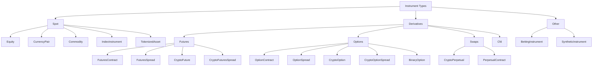

# 金融工具（Instruments）

金融工具（instrument）代表一种可交易资产、合约或本地合成市场（synthetic market）的规格说明。市场数据、订单、持仓、账务处理、组合计算，以及适配器（adapter）的符号体系（symbology），都会引用一个 `InstrumentId` 及其对应的工具定义。

NautilusTrader 向 Rust 和 Python 用户暴露同一套工具模型。Rust 示例使用 `nautilus_model`；Python 示例使用 `nautilus_trader.model.instruments`。

## 工具类型

| 工具类型                                                  | 类别               | 描述                                                  | 常见适配器                       |
|----------------------------------------------------------|--------------------|------------------------------------------------------|---------------------------------|
| [`Equity`](equity.md)                                    | 现货               | 在现金市场上交易的上市股票或 ETF。                    | Databento、Interactive Brokers。 |
| [`CurrencyPair`](currency_pair.md)                       | 现货               | 以基础/计价（base/quote）形式表示的法币外汇或加密货币现货对。 | Binance、Kraken、OKX、Tardis。   |
| [`Commodity`](commodity.md)                              | 现货               | 黄金或原油等现货商品。                                | Interactive Brokers。            |
| [`Cfd`](cfd.md)                                          | 差价合约           | 跟踪某标的资产的差价合约（Contract for Difference）。 | Interactive Brokers。            |
| [`IndexInstrument`](index_instrument.md)                 | 现货参考           | 参考指数，不可直接交易。                              | Interactive Brokers。            |
| [`TokenizedAsset`](tokenized_asset.md)                   | 代币化现货         | 加密货币交易场所上的代币化资产。                       | Kraken。                         |
| [`FuturesContract`](futures_contract.md)                 | 期货               | 可交割的期货合约。                                    | Databento、Interactive Brokers。 |
| [`FuturesSpread`](futures_spread.md)                     | 期货价差           | 交易所定义的多腿期货策略组合。                        | Databento、Interactive Brokers。 |
| [`CryptoFuture`](crypto_future.md)                       | 加密货币期货       | 有到期日的加密货币期货合约。                          | BitMEX、Bybit、Deribit、OKX。    |
| [`CryptoFuturesSpread`](crypto_futures_spread.md)        | 加密货币价差       | 交易所定义的加密货币期货价差。                        | Deribit、OKX。                   |
| [`CryptoPerpetual`](crypto_perpetual.md)                 | 永续合约           | 加密货币永续期货合约。                                | Binance、BitMEX、Bybit、dYdX。   |
| [`PerpetualContract`](perpetual_contract.md)             | 通用永续合约       | 适用于各资产类别的永续期货合约。                      | Architect AX。                   |
| [`OptionContract`](option_contract.md)                   | 期权               | 交易所交易的看跌或看涨期权。                          | Databento、Interactive Brokers。 |
| [`OptionSpread`](option_spread.md)                       | 期权价差           | 交易所定义的多腿期权策略组合。                        | Databento、Interactive Brokers。 |
| [`CryptoOption`](crypto_option.md)                       | 加密货币期权       | 以加密货币为标的的期权。                              | Bybit、Deribit、OKX、Tardis。    |
| [`CryptoOptionSpread`](crypto_option_spread.md)          | 加密货币价差       | 交易所定义的加密货币期权价差。                        | Deribit、OKX。                   |
| [`BinaryOption`](binary_option.md)                       | 二元结果           | 结算为 0 或 1 的二元工具。                            | Hyperliquid、OKX、Polymarket。   |
| [`BettingInstrument`](betting_instrument.md)             | 博彩市场           | 体育或博彩市场的选项（selection）。                   | Betfair。                        |
| [`SyntheticInstrument`](synthetic_instrument.md)         | 本地合成工具       | 由公式推导出的本地工具。                              | 仅限本地。                       |

## 分类体系

NautilusTrader 按所代表的市场结构对工具进行分组：



## 通用字段

大多数具体工具都拥有相同的核心结构。各具体类型的页面会列出该类型完整的构造函数与结构体字段。

| 字段                | 含义                                                                     |
|---------------------|---------------------------------------------------------------------------|
| `id`                | Nautilus 的 `InstrumentId`，由符号（symbol）和交易场所（venue）组成。      |
| `raw_symbol`        | Nautilus 规范化之前的原生交易场所符号。                                    |
| `price_precision`   | 价格允许的小数位数。                                                       |
| `size_precision`    | 数量允许的小数位数。                                                       |
| `price_increment`   | 最小有效价格步长。                                                         |
| `size_increment`    | 最小有效数量步长。                                                         |
| `multiplier`        | 用于名义金额和盈亏（PnL）计算的合约乘数。                                   |
| `lot_size`          | 交易场所公布的取整手数或标准手规模。                                        |
| `margin_init`       | 初始保证金率，以名义价值的小数比例表示。                                     |
| `margin_maint`      | 维持保证金率，以名义价值的小数比例表示。                                     |
| `maker_fee`         | 挂单方（maker）费率。负值表示返佣。                                        |
| `taker_fee`         | 吃单方（taker）费率。负值表示返佣。                                        |
| `max_quantity`      | 已知情况下的最大订单数量。                                                  |
| `min_quantity`      | 已知情况下的最小订单数量。                                                  |
| `max_notional`      | 已知情况下的最大订单名义价值。                                              |
| `min_notional`      | 已知情况下的最小订单名义价值。                                              |
| `max_price`         | 已知情况下的最大有效报价或订单价格。                                        |
| `min_price`         | 已知情况下的最小有效报价或订单价格。                                        |
| `info`              | 从交易场所或数据源保留下来的适配器元数据。                                  |
| `ts_event`          | 定义事件发生时刻的 UNIX 纳秒时间戳。                                       |
| `ts_init`           | Nautilus 初始化该对象时刻的 UNIX 纳秒时间戳。                              |
| `tick_scheme`       | 该类型支持时，所注册的可变最小报价单位方案（tick scheme）名称。             |

## 符号体系（Symbology）

每个工具都拥有一个唯一的 `InstrumentId`，由原生符号与交易场所以句点分隔组成。例如，Binance Futures 将以太坊永续合约表示为：

```text
ETHUSDT-PERP.BINANCE
```

原生符号在同一交易场所内理应唯一，但并非所有交易所都能保证这一点。`{symbol}.{venue}` 这一组合在 Nautilus 系统内部必须唯一。

:::warning
工具定义必须与市场数据及交易场所的订单语义相匹配。不正确的工具定义可能导致价格或数量被截断、使用错误的货币计算名义价值，或者使回测接受实际交易场所会拒绝的价格。
:::

## Rust 与 Python 接口

Rust 用户使用 `nautilus_model` 中的工具结构体以及 `InstrumentAny`：

```rust
use nautilus_model::instruments::{CurrencyPair, InstrumentAny};
```

Python 用户通常使用来自 `nautilus_trader.model` 的工具类：

```python
from nautilus_trader.model import CurrencyPair
```

两套接口表示的是同一个工具契约：标识、精度、步长、货币、限制、保证金、手续费、元数据和时间戳。

## 加载工具

可以通过 `TestInstrumentProvider` 实例化通用的测试工具：

```python
from nautilus_trader.test_kit.providers import TestInstrumentProvider

audusd = TestInstrumentProvider.default_fx_ccy("AUD/USD")
```

实盘集成适配器会暴露缓存工具定义的 `InstrumentProvider` 对象。若集成支持，可使用 `InstrumentProviderConfig(load_all=True)`；也可使用 `load_ids` 加载一组已知的工具。
订阅方法与下单方法都要求匹配的工具已经存在于缓存中。

## 查找工具

策略（strategy）和执行体（actor）从中央缓存中检索工具：

```rust tab="Rust"
use nautilus_model::identifiers::InstrumentId;

let instrument_id = InstrumentId::from("ETHUSDT-PERP.BINANCE");
let instrument = cache.instrument(&instrument_id);
```

```python tab="Python"
from nautilus_trader.model import InstrumentId

instrument_id = InstrumentId.from_str("ETHUSDT-PERP.BINANCE")
instrument = self.cache.instrument(instrument_id)
```

也可以订阅单个工具，或订阅某个交易场所的所有工具：

```python
self.subscribe_instrument(instrument_id)
self.subscribe_instruments(venue)
```

当 `DataEngine` 收到工具更新时，会将该对象传递给 `on_instrument()` 处理函数。

## 精度

精度定义了某个工具上价格和数量的标准小数位数。NautilusTrader 会严格执行由此产生的价格与数量网格，因为交易场所会验证相同的约束，回测也不应以生产环境中不可能存在的价格或数量成交订单。

| 字段              | 约束对象                             | 示例               |
|-------------------|--------------------------------------|-------------------|
| `price_precision` | 订单价格、触发价格、成交价格。       | `2` -> `50000.01` |
| `size_precision`  | 订单数量与成交数量。                 | `5` -> `1.00001`  |

步长精度必须与声明的精度相匹配。例如，`price_precision=2` 应搭配 `price_increment=Price(0.01, 2)`。

在生成订单价格与数量时，应使用工具的工厂方法：

```python
instrument = self.cache.instrument(instrument_id)

price = instrument.make_price(0.90500)
quantity = instrument.make_qty(150)
```

:::warning
`RiskEngine` 不会自动对数值进行取整。如果你为一个仅支持 2 位小数的工具创建了具有 5 位小数的 `Price`，该订单将被拒绝。请使用 `instrument.make_price()` 和 `instrument.make_qty()` 来显式取整。
:::

## 限制、保证金与手续费

交易场所和适配器定义可以包含以下可选限制：

- `max_quantity` 和 `min_quantity`。
- `max_notional` 和 `min_notional`。
- `max_price` 和 `min_price`。

`MarginAccount` 在计算初始保证金和维持保证金时，会使用 `margin_init`、`margin_maint` 以及吃单方费率。Nautilus 在所有适配器和回测中采用统一的费率约定：

- 正的费率表示佣金。
- 负的费率表示返佣。

有关更深入的账务处理行为，请参见 [账务处理（Accounting）](../accounting.md)。

## 元数据

`info` 字段以可 JSON 序列化的字典形式保留原始或适配器特定的元数据。当交易场所发布了一些不属于 Nautilus 统一工具 API 的有用细节时，可使用该字段。

## 相关指南

- [数据（Data）](../data/) 介绍了引用工具的市场数据类型。
- [订单（Orders）](../orders/) 介绍了引用工具的订单字段。
- [合成工具（Synthetics）](../synthetics.md) 介绍了本地公式推导出的工具。
- [Python API 参考](/docs/python-api-latest/model/instruments.html) 列出了 Python 的构造函数与成员。
</content>
