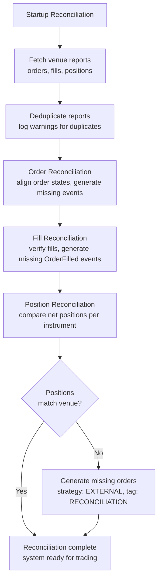

# 实盘交易（Live Trading）

NautilusTrader 可以在无需修改代码的情况下，将经过回测的策略部署到实盘市场。
相同的 actor、策略和执行算法既可以在回测引擎上运行，也可以在实盘交易
节点上运行。

:::warning
**实盘交易涉及真实的财务风险。在部署到生产环境之前，请务必理解
系统配置、节点操作、执行核对，以及回测与实盘交易之间的差异。**
:::

## 配置

有关配置结构体如何处理默认值、`T` 与 `Option<T>` 语义以及构建器模式，
请参阅[配置（Configuration）](configuration.md)概念指南。

有关 `TradingNodeConfig`、执行引擎选项、策略配置以及多交易场所接线的
分步设置，请参阅[配置实盘交易节点](../how_to/configure_live_trading.md)操作指南。

## 实盘执行策略

### 订单命令结果策略

实盘命令的结果是以下几种之一：

- 已被交易场所确认。
- 已被交易场所明确拒绝，或被交易场所 API 拒绝。
- 在提交离开系统边界之前，被 Nautilus 在本地拒绝。
- 在 Nautilus 向交易场所核实最终状态期间，被记录为未解决状态。

只有在命令结果明确的情况下才会出现拒绝事件，而不是在结果不明确的
失败情况下：

- `OrderRejected`。
- `OrderModifyRejected`。
- `OrderCancelRejected`。

在订单进入 `SUBMITTED` 状态之前，Nautilus 可以在本地拒绝一次提交。
这些失败会以 `OrderDenied` 形式出现，不会发出 `OrderSubmitted` 事件。

在提交到达交易场所 API 之后，当订单响应证明交易场所未接受该订单时，
Nautilus 会发出 `OrderRejected`。这包括结构化的交易场所提交拒绝，
以及交易场所语义保证未接受的 API 拒绝，例如 HTTP 400、401、403 和
429 状态响应。只有在特定于交易场所的语义能够证明未接受时，
状态码才被视为明确的。

| 命令类型                         | 拒绝事件       | 出现时机                                                   |
|--------------------------------------|-----------------------|-------------------------------------------------------------------|
| 提交及提交订单列表         | `OrderRejected`       | 交易场所或 API 响应证明订单未被接受。         |
| 修改                               | `OrderModifyRejected` | 交易场所返回了针对该命令的修改拒绝。               |
| 撤销、全部撤销和批量撤销 | `OrderCancelRejected` | 交易场所返回了针对该命令或单个订单的撤销拒绝。  |

一个成功的响应仍然可能包含针对单个订单的失败字段，这些字段属于
明确的命令结果。如果整个请求失败但没有单个订单的结果，除非该目标命令
已被证明遭到拒绝，否则仍然属于未解决状态。

其他本地校验失败会以不同方式报告：

- 未通过本地检查的撤销、修改、全部撤销和批量撤销命令会记录警告，
  不会产生拒绝事件。

:::note[结果不明确的情况]
以下失败会使交易场所的结果保持未知：

- 传输错误、WebSocket 发送失败、请求超时和断开连接。
- 已取消的本地任务、缺失的确认和服务器错误。
- 请求可能已到达交易场所之后发生的解析失败。
- 没有单个订单结果的整批失败。
- `PENDING_UPDATE` 和 `PENDING_CANCEL` 的在途重试耗尽。
- 速率限制，但视为明确提交拒绝的下单 API 拒绝除外。

当结果未知时，Nautilus 会记录该失败，将订单保持在当前的在途状态，
并等待 WebSocket 更新、未平仓订单轮询、在途检查或启动核对来解析该状态。
:::

:::note[术语]
**在途订单（in‑flight order）** 是指正在等待交易场所确认的订单：

- `SUBMITTED` - 初次提交，等待接受/拒绝。
- `PENDING_UPDATE` - 已请求修改，等待确认。
- `PENDING_CANCEL` - 已请求撤销，等待确认。

这些订单会通过 WebSocket 更新、未平仓订单轮询、在途检查和启动核对
进行监控。
:::

对于从未被确认的提交，`LiveExecutionEngine` 的在途检查会向交易场所
发起查询。如果订单在超过 `inflight_check_retries` 之后仍未被确认，
引擎会将其解析为 `REJECTED`。待处理的撤销和修改结果，会一直保持未解决，
直到交易场所核对确认它们的最终状态。请参见下方的“运行时检查”表格。

## 执行核对

执行核对（execution reconciliation）使交易场所的实际订单和仓位状态，
与系统根据事件构建的内部状态保持一致。只有 `LiveExecutionEngine`
执行核对，因为回测同时控制双方的状态。

两种场景：

- **已存在缓存状态**：报告数据生成缺失的事件，以使状态对齐。
- **不存在缓存状态**：交易场所上的所有订单和仓位都从零开始生成。

:::tip
将所有执行事件持久化到缓存数据库。这可以减少对交易场所历史记录的
依赖，并使系统即使在回溯窗口较短的情况下也能完全恢复。
:::

### 核对配置

除非将 `reconciliation` 设置为 false，否则执行引擎会在启动时对每个
交易场所核对状态。`reconciliation_lookback_mins` 参数控制引擎请求
历史数据的回溯深度。

:::tip
保持 `reconciliation_lookback_mins` 不设置。这样引擎会请求交易场所
所提供的最大执行历史。
:::

:::warning
回溯窗口之前的执行仍会生成对齐事件，但会有一定的信息损失，
使用更长的窗口可以避免这种损失。有些交易场所也会过滤或丢弃较旧的
执行数据。将所有事件持久化到缓存数据库可以避免这两个问题。
:::

每个策略都可以通过 `external_order_claims` 配置参数，为某个金融工具 ID
认领来自交易场所的外部订单以及在核对过程中具体化的活动。这使得在
不存在缓存状态的情况下，策略可以恢复管理未平仓订单和仓位。

未被认领的外部订单使用策略 ID `EXTERNAL`，标签为 `VENUE`。在仓位核对
期间生成的未被认领的订单使用策略 ID `EXTERNAL`，标签为 `RECONCILIATION`。
已被认领的订单和成交使用认领策略的 ID，且没有外部/核对标签，
因此该策略可以继续管理已恢复的状态。

:::tip
要在你的策略中检测未被认领的外部订单，请检查
`order.strategy_id.value == "EXTERNAL"`。这些订单与其他任何订单一样，
参与投资组合计算和仓位跟踪。
:::

有关所有实盘交易选项，请参阅 `LiveExecEngineConfig`
[API 参考文档](/docs/python-api-latest/config.html#nautilus_trader.live.config.LiveExecEngineConfig)。

### 核对流程

所有适配器执行客户端遵循相同的核对流程，调用三个方法来生成一个
执行整体状态（mass status）：

- `generate_order_status_reports`
- `generate_fill_reports`
- `generate_position_status_reports`



系统会根据这些报告核对其状态，这些报告代表外部的真实情况：

- **重复检查**：
  - 对批次内的订单报告去重，并记录警告。
  - 将重复的成交 ID 记录为警告，以供调查。
- **订单核对**：
  - 生成并应用事件，将订单从缓存状态迁移到当前状态。
  - 为缺失的成交报告推断 `OrderFilled` 事件。
  - 为无法识别的客户端订单 ID，或缺失客户端订单 ID 的报告，生成外部订单事件。
  - 使用基于容差的价格和手续费比较，验证成交报告数据的一致性。
- **仓位核对**：
  - 使用金融工具精度，将每个账户和金融工具的净仓位与交易场所的仓位报告进行匹配。
  - 当订单核对结束后仍存在与交易场所不同的仓位时，生成外部订单事件。
  - 当 `generate_missing_orders` 启用时（默认：True），生成策略 ID 为
    `EXTERNAL`、标签为 `RECONCILIATION` 的订单以对齐差异。
  - 当同一账户和金融工具的 NETTING 所有权分散在多个策略之间时记录警告，
    因为交易场所的仓位报告是账户级别的净仓位。
  - 在生成核对订单时，遵循以下价格优先级：
    1. **计算得出的核对价格**（首选）：以正确的平均仓位为目标。
    2. **市场中间价**：使用当前买卖价的中点。
    3. **当前仓位均价**：使用现有仓位的平均价格。
    4. **市价单**（最后手段）：仅在没有任何价格数据时使用（没有仓位、没有市场数据）。
  - 当可以确定价格时（情形 1-3）使用限价单，以保持盈亏的准确性。
  - 在精度舍入后，跳过数量差异为零的情况。
- **部分窗口调整**：
  - 当设置了 `reconciliation_lookback_mins` 时，该窗口可能会遗漏开仓成交。
  - 系统使用生命周期分析来调整成交，以准确重建仓位：
    - 检测零点穿越（zero-crossings，仓位数量穿越 FLAT）以识别独立的生命周期。
    - 当最早的生命周期不完整时，添加合成的开仓成交。
    - 当当前生命周期与交易场所仓位匹配时，过滤掉已关闭的生命周期。
    - 当当前生命周期与交易场所不匹配时，用一个反映交易场所仓位的合成成交替换它。
  - 合成成交使用计算得出的核对价格，以正确的平均仓位为目标。
  - 详见[部分窗口调整场景](#partial-window-adjustment-scenarios)。
- **异常处理**：
  - 单个适配器的失败不会终止整个核对流程。
  - 在订单状态报告到达之前抵达的成交报告，会被延迟处理，直到订单状态可用。

如果核对失败，系统会记录一条错误并不会启动。

### 常见核对场景

下面的表格涵盖了启动核对（整体状态）和运行时检查（在途订单检查、
未平仓订单轮询、自有订单簿审计）。

#### 启动核对

| 场景                               | 说明                                                                     | 系统行为                                                                 |
|----------------------------------------|-----------------------------------------------------------------------------|-----------------------------------------------------------------------------------|
| **订单状态不一致**            | 本地状态与交易场所不同（例如本地为 `SUBMITTED`，交易场所为 `REJECTED`）。     | 更新本地订单以匹配交易场所状态，发出缺失的事件。                 |
| **遗漏的成交**                       | 交易场所已成交某订单，但引擎遗漏了该事件。                          | 生成缺失的 `OrderFilled` 事件。                                         |
| **多次成交**                     | 订单有部分成交，其中一些被引擎遗漏。                                | 从交易场所报告中重构完整的成交历史。                          |
| **外部订单**                    | 订单存在于交易场所，但不在本地缓存中。                                   | 创建策略 ID 为 `EXTERNAL`、标签为 `VENUE` 的未认领订单。           |
| **部分成交后被撤销**     | 订单被部分成交，随后被交易场所撤销。                                  | 将状态更新为 `CANCELED`，保留成交历史。                            |
| **成交数据不同**                | 交易场所报告的成交价格/手续费与缓存中的不同。                      | 保留缓存数据，记录差异日志。                                      |
| **被过滤的订单**                    | 通过配置标记为需要过滤的订单。                                         | 根据 `filtered_client_order_ids` 或金融工具过滤器跳过。               |
| **重复的订单报告**            | 多个订单共享同一个标识符。                                      | 去重并记录警告。                                                  |
| **仓位数量不匹配（多头）**  | 内部多头仓位与交易场所不同（例如 100 与 150）。                   | 当 `generate_missing_orders=True` 时，生成带计算价格的 BUY LIMIT 订单。  |
| **仓位数量不匹配（空头）** | 内部空头仓位与交易场所不同（例如 -100 与 -150）。                | 当 `generate_missing_orders=True` 时，生成带计算价格的 SELL LIMIT 订单。 |
| **仓位缩减**                 | 交易场所仓位小于内部仓位（例如内部多头 150，交易场所多头 100）。 | 生成带计算价格的反方向限价单。                      |
| **仓位方向翻转**                 | 内部仓位与交易场所方向相反（例如内部多头 100，交易场所空头 50）。  | 生成限价单以平掉内部仓位并开立外部仓位。             |
| **内部核对订单**     | 为对齐仓位差异而生成的订单。                               | 如已配置认领方则使用该策略；否则使用 `EXTERNAL` + `RECONCILIATION`。          |

#### 运行时检查

启动核对完成后，持续核对开始运行。它会：

- 监控在途订单是否超过配置的延迟阈值。
- 按配置的间隔与交易场所核对未平仓订单。
- 按配置的间隔与交易场所核对仓位状态。
- 审计内部*自有*订单簿与交易场所公共订单簿的一致性。

该循环会等待启动核对完成后才开始周期性检查。
`reconciliation_startup_delay_secs` 参数会在启动核对完成*之后*再增加一段
延迟，给系统一些时间来稳定下来。

| 场景                            | 说明                                                | 系统行为                                      |
|-------------------------------------|------------------------------------------------------------|--------------------------------------------------------|
| **明确的提交 API 拒绝**     | API 在接受之前拒绝了创建订单。                | 发出 `OrderRejected`。                               |
| **结果不明确的提交失败**        | 提交失败，但没有得到交易场所的明确拒绝。              | 记录失败并等待核对。           |
| **在途提交超时**        | `SUBMITTED` 状态在重试耗尽后仍未被确认。   | 解析为 `REJECTED`。                              |
| **在途撤销/修改超时** | `PENDING_CANCEL` 或 `PENDING_UPDATE` 超过了重试次数。  | 记录警告并保持未解决。                 |
| **未平仓订单检查不一致**   | 周期性轮询检测到交易场所状态发生变化。                | 确认状态并应用转换。               |
| **仓位检查不一致**      | 周期性轮询检测到仓位不匹配。                 | 在符合条件时生成核对事件。       |
| **自有订单簿审计不匹配**        | 自有订单簿与交易场所公共订单簿出现分歧。           | 审计并记录不一致之处。                     |

**在途订单超时解析**（交易场所在最大重试次数后仍未响应）：

| 当前状态   | 解析为  | 理由                             |
|------------------|--------------|---------------------------------------|
| `SUBMITTED`      | `REJECTED`   | 未收到交易场所的接受确认。    |
| `PENDING_UPDATE` | *未解决* | 修改结果仍未知。 |
| `PENDING_CANCEL` | *未解决* | 撤销结果仍未知。 |

**订单一致性检查**（当缓存状态与交易场所状态不同时）：

*未找到（Not found）* 行仅适用于全历史模式（`open_check_open_only=False`）；
仅未平仓模式是默认模式。

| 缓存状态       | 交易场所状态 | 解析方式   | 理由                                                           |
|--------------------|--------------|--------------|-----------------------------------------------------------------|
| `SUBMITTED`        | *未找到*  | `REJECTED`   | 订单从未得到交易场所的确认（例如在网络错误中丢失）。   |
| `ACCEPTED`         | *未找到*  | `REJECTED`   | 订单在交易场所不存在，很可能从未成功下单。 |
| `ACCEPTED`         | `CANCELED`   | `CANCELED`   | 交易场所撤销了该订单（用户操作或交易场所发起）。          |
| `ACCEPTED`         | `EXPIRED`    | `EXPIRED`    | 订单在交易场所达到了 GTD 过期时间。                              |
| `ACCEPTED`         | `REJECTED`   | `REJECTED`   | 交易场所在初次接受后拒绝了该订单（罕见但可能发生）。        |
| `PENDING_UPDATE`   | *未找到*  | *未解决* | 修改结果仍未知。                               |
| `PENDING_CANCEL`   | *未找到*  | *未解决* | 撤销结果仍未知。                               |
| `PARTIALLY_FILLED` | `CANCELED`   | `CANCELED`   | 订单在交易场所被撤销，同时保留了成交记录。                       |
| `PARTIALLY_FILLED` | *未找到*  | `CANCELED`   | 订单不存在，但曾有成交（核对其成交历史）。        |

:::note
**运行时核对注意事项：**

- **仅未平仓模式**：交易场所的“未平仓订单”接口在设计上会排除已关闭的
  订单，因此无法区分缺失的订单和最近关闭的订单。当缺失订单检查
  无法证明交易场所的最终状态时，待处理的撤销/修改订单将保持未解决状态。
- **近期订单保护**：引擎会跳过对最后事件落在 `open_check_threshold_ms`
  窗口内的订单进行核对。这可以防止因交易场所仍在处理而导致的竞争条件
  产生误报。
- **定向查询保护措施**：在应用一个终止性的“未找到”解析之前，引擎会向
  交易场所发出一次单订单查询。这可以捕获因批量查询限制或时序延迟
  导致的误报。
- **仓位报告失败**：如果某次仓位查询失败，引擎会在本轮周期中跳过该
  交易场所的缓存仓位，而不是将缺失的报告视为已平仓。
- **在交易场所“未找到”的 `FILLED` 订单**会被静默忽略。交易场所通常会从
  查询结果中丢弃已完成的订单。

:::

**重试协调。** 在途循环和未平仓订单循环共享同一个重试计数器
（`_recon_check_retries`），分别受 `inflight_check_retries` 和
`open_check_missing_retries` 的限制。对于可进行终止解析的状态，
较严格的限制优先，并避免对同一订单状态发出重复的交易场所查询。

当未平仓订单循环耗尽重试次数时，引擎会在应用终止状态或将模糊的
待处理撤销/修改标记为未解决之前，发出一次定向的
`GenerateOrderStatusReport` 探测。如果交易场所返回了该订单，核对会
继续进行，重试计数器会重置。

仓位检查按金融工具和账户使用独立的重试计数器。一次成功的仓位匹配
会清除该计数器，而反复出现的未解决差异会停止针对该组合的主动核对，
直到差异消除为止。

**单订单查询限流。** 引擎通过 `max_single_order_queries_per_cycle`
限制每个周期的单订单查询次数。剩余的订单会被推迟到下一个周期。
`single_order_query_delay_ms` 会拉开连续查询之间的间隔，以避免速率限制。
这可以在不使交易场所 API 过载的情况下，处理跨数百个订单的批量查询失败。

### 常见核对问题

- **成交报告缺失**：某些交易场所会过滤掉较旧的成交。请增大
  `reconciliation_lookback_mins`，或在本地缓存所有事件。
- **仓位不匹配**：早于回溯窗口的外部订单会导致仓位漂移。
  重启前先将账户清仓（flatten）以重置状态。
- **拆分的 NETTING 所有权**：多个策略可以为同一个账户和金融工具持有
  缓存中的仓位，但交易场所报告的是单一的账户级净仓位。在恢复外部状态时，
  建议每个 NETTING 账户/金融工具组合只由一个策略认领。
- **重复的订单 ID**：会去重并记录警告。频繁出现重复可能表明交易场所的
  数据完整性存在问题。
- **精度差异**：使用金融工具精度处理小的十进制差异。较大的差异可能表明
  订单缺失。
- **顺序错乱的报告**：在订单状态报告到达之前抵达的成交报告，会被延迟处理，
  直到订单状态可用。

:::tip
对于持续存在的问题，请在重启前清除缓存状态或将账户清仓。
:::

### 核对不变式

核对系统维护四个不变式：

1. **仓位数量**：最终数量在金融工具精度范围内与交易场所一致。
2. **平均入场价格**：仓位的平均入场价格在容差范围内（默认 0.01%）与交易场所报告的价格一致。
3. **盈亏完整性**：所有生成的成交（包括合成成交）都使用能保持正确未实现盈亏的计算价格。
4. **ID 确定性**：核对期间发出的合成 `trade_id` 和 `venue_order_id` 值是逻辑事件的确定性函数。相同的逻辑成交或仓位调整订单在多次重启之间产生相同的 ID，因此重放的核对事件会与之前的运行去重，而不是被当作新事件处理。

即使在以下情况下，这些不变式仍然成立：

- 核对窗口遗漏了完整的成交历史。
- 交易场所报告中缺失成交。
- 仓位的生命周期跨越了回溯窗口。
- 发生了多次零点穿越。

### 部分窗口调整场景

当 `reconciliation_lookback_mins` 限制了窗口范围时，系统会分析
来自成交的仓位生命周期，并进行调整以准确重建仓位。

| 场景                                   | 说明                                                                  | 系统行为                                                             |
|--------------------------------------------|--------------------------------------------------------------------------------|-------------------------------------------------------------------------------|
| **完整的生命周期**                     | 从开仓到当前状态的所有成交都被捕获。                        | 不进行调整。                                                              |
| **不完整的单一生命周期**            | 窗口遗漏了开仓成交，没有零点穿越。                              | 添加一个带计算价格的合成开仓成交。                          |
| **多个生命周期，当前匹配**   | 检测到零点穿越，当前生命周期与交易场所匹配。                    | 过滤掉旧的生命周期，只返回当前生命周期。                               |
| **多个生命周期，当前不匹配**  | 检测到零点穿越，当前生命周期与交易场所不同。               | 用一个合成成交替换当前生命周期。                    |
| **持平仓位**                          | 无论成交历史如何，交易场所都报告为 FLAT。                               | 不进行调整。                                                              |
| **无成交**                               | 窗口内没有任何成交报告。                                             | 不进行调整，返回空结果。                                                |

**关键概念：**

- **零点穿越（Zero-crossing）**：仓位数量穿越零点（FLAT），标志着一个生命周期的边界。
- **生命周期（Lifecycle）**：两次零点穿越之间的一系列成交，代表一个完整的开仓-平仓周期。
- **合成成交（Synthetic fill）**：一个计算得出的成交报告，代表缺失的活动，其定价旨在得到正确的平均仓位。
- **容差（Tolerance）**：仓位匹配使用可配置的价格容差（默认 0.0001 = 0.01%）来吸收微小的计算差异。

## Rust 实盘运行器指标

Rust 的 `LiveNode` 通过 `LiveNodeHandle::metrics_snapshot()` 暴露了原始的
运行器指标。在调用 `run()` 之前从节点获取该句柄，然后从另一个任务
轮询快照，并根据差值推导出速率或利用率。

```rust
use std::time::Duration;

use nautilus_common::enums::Environment;
use nautilus_live::node::{LiveNode, RunnerMetricsDelta};

let mut node = LiveNode::builder(trader_id, Environment::Live)?
    // Add clients, actors, and strategies here.
    .build()?;

let metrics_handle = node.handle();

tokio::spawn(async move {
    let mut prev = metrics_handle.metrics_snapshot();
    let mut interval = tokio::time::interval(Duration::from_secs(1));

    loop {
        interval.tick().await;

        let next = metrics_handle.metrics_snapshot();
        let delta = RunnerMetricsDelta::from_snapshots(prev, next);
        if delta.elapsed_ns == 0 {
            prev = next;
            continue;
        }

        let elapsed_s = delta.elapsed_ns as f64 / 1_000_000_000.0;
        let data_event_rate = delta.data_events as f64 / elapsed_s;
        let data_event_staleness_ns = if next.data_events.last_dispatch_at_ns == 0 {
            0
        } else {
            next.elapsed_ns
                .saturating_sub(next.data_events.last_dispatch_at_ns)
        };

        log::info!(
            "Runner metrics: data_event_rate={data_event_rate:.0} \
             data_event_staleness_ns={data_event_staleness_ns} \
             dispatch_utilization={:.6} loop_utilization={:.6} \
             mean_dispatch_ns={} data_queue_depth={}",
            delta.dispatch_utilization(),
            delta.loop_utilization(),
            delta.mean_dispatch_ns(),
            next.data_events.queue_depth,
        );

        prev = next;
    }
});

node.run().await?;
```

该快照涵盖启动之后的 `LiveNode::run` 通道分发过程，包括关闭宽限期内
的残余分发。`dispatch_busy_ns` 涵盖五个分发分支；`maintenance_busy_ns`
和 `external_msgbus_busy_ns` 涵盖非分发的循环工作。该快照不包括启动期间
的缓冲、启动刷新或循环结束后的最终排空。队列深度是节点运行期间
维护性 tick 的时点采样，在关闭宽限期内可能会过期。快照是无锁的，
可能不是各字段之间一致的视图；请根据连续快照之间的饱和差值推导速率。
当 `LiveNode::run` 进入稳定状态时计数器会重置。

## 出错时关闭

设置 `LiveNodeConfig.shutdown_on_error=True`，使一条 Rust 错误日志能够
请求关闭实盘节点。Rust 日志记录器会记录内核启动后发出的第一条
`log::error!`（包括来自其他线程的错误日志），内核会在实盘事件循环
下次检查关闭状态时发布一个 `ShutdownSystem` 命令。

该关闭请求遵循正常的实盘节点停止路径。节点会停止交易者、
等待停止后延迟、断开客户端连接，并停止各引擎。它不会中止进程。

```python
from nautilus_trader.live import LiveNodeConfig

config = LiveNodeConfig(shutdown_on_error=True)
```

被组件过滤器抑制或处于日志绕过模式的错误日志仍会请求关闭。
当新的内核运行开始时，该触发器会被清除并重新激活，因此一个进程
可以重启一个节点而无需重新初始化日志系统。每个引擎的
`graceful_shutdown_on_error` 选项已被移除；请改为在节点/内核级别
配置出错时关闭。出错时关闭观察的是 Rust 的 `log` 记录，而不是 Python 的
`logging.error(...)` 调用。

## 相关指南

- [配置实盘交易节点](../how_to/configure_live_trading.md) - 节点和引擎配置。
- [适配器（Adapters）](adapters.md) - 交易场所连接。
- [执行（Execution）](execution.md) - 实盘环境中的订单执行。
- [回测（Backtesting）](backtesting/) - 部署前的策略测试。
