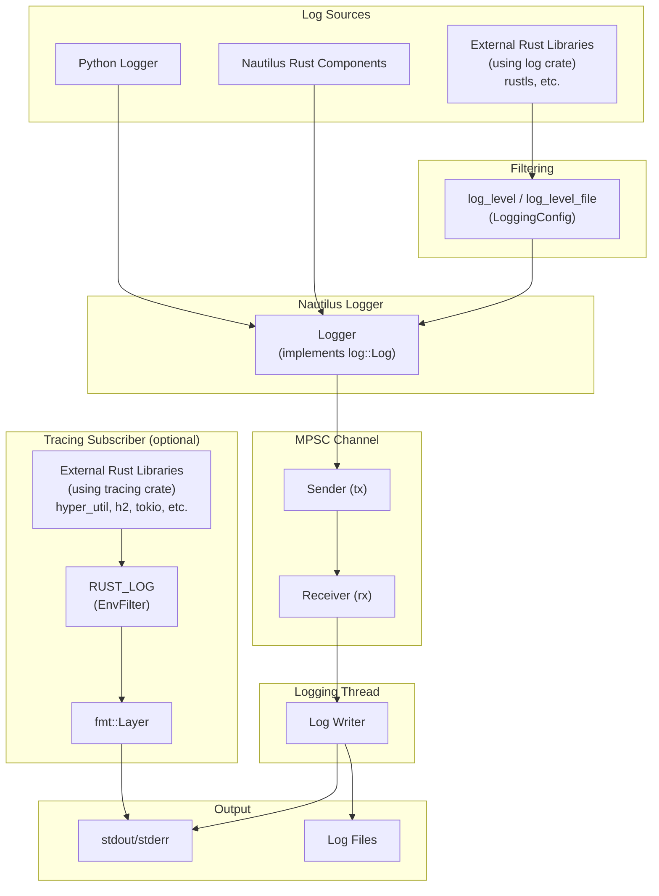

# 日志（Logging）

该平台使用一个用 Rust 实现的高性能日志子系统，为回测和实盘交易提供日志记录，
并通过 `log` crate 提供标准化的外观接口（facade）。

核心日志记录器（logger）运行在一个单独的线程中，使用多生产者单消费者
（MPSC）通道来接收日志消息。这种设计确保主线程保持高性能，
避免因日志字符串格式化或文件 I/O 操作而产生潜在的瓶颈。

日志输出是可配置的，支持：

- **stdout/stderr 写入器**用于控制台输出
- **文件写入器**用于日志的持久化存储

:::info
可以集成诸如 [Vector](https://github.com/vectordotdev/vector) 之类的基础设施，
用于在你的系统内收集和聚合事件。
:::

## 架构

日志子系统从多个来源捕获事件，并通过一个 MPSC 通道将它们路由到
一个专用的日志线程：



- **Python 和 Nautilus 组件**：直接通过 Nautilus Logger 记录日志。
- **使用外部 `log` crate 的用户**：由 `LoggingConfig` 中的 `log_level`/`log_level_file` 过滤。
- **使用外部 `tracing` crate 的用户**：启用后，输出会直接进入 stdout（与 Nautilus 日志分离），由 `RUST_LOG` 环境变量过滤。
- **日志线程**：所有 Nautilus 日志事件都通过一个 MPSC 通道发送到一个专用线程，确保主线程不会被 I/O 操作阻塞。

## 配置

可以通过导入 `LoggingConfig` 对象来配置日志。
默认情况下，'INFO' 级别及以上的 `LogLevel` 日志事件会写入 stdout/stderr。

日志级别（`LogLevel`）的取值包括以下几种（与标准的日志级别约定一致）。

支持以下日志级别：

- `OFF` - 禁用日志。
- `TRACE` - 最详细的级别；仅由 Rust 组件发出（无法从 Python 生成）。
- `DEBUG` - 详细的诊断信息。
- `INFO` - 一般的操作消息。
- `WARNING` - 不会阻止运行的潜在问题。
- `ERROR` - 可能影响功能的错误。

:::tip
你可以将过滤级别设置为 `TRACE`，以捕获来自 Rust 组件的跟踪日志，
即使 Python 代码本身无法直接发出该级别的日志。
:::

有关更多详情，请参阅 `LoggingConfig`
[API 参考文档](/docs/python-api-latest/config.html#nautilus_trader.common.config.LoggingConfig)。

日志可以通过以下方式配置：

- stdout/stderr 的最低 `LogLevel`。
- 日志文件的最低 `LogLevel`。
- 轮转日志文件之前的最大大小。
- 轮转时保留的最大备份日志文件数量。
- 自动使用日期或时间戳组成日志文件名，或使用自定义日志文件名。
- 写入日志文件的目录。
- 纯文本或 JSON 格式的日志文件。
- 按日志级别过滤单个组件。
- 日志行中的 ANSI 颜色。
- 完全绕过日志记录。
- 在初始化时将 Rust 配置打印到 stdout。
- 可选地通过 PyO3 桥接（`use_pyo3`）初始化日志，以捕获 Rust 组件发出的日志事件。
- 启动时如果已存在日志文件，则将其截断（`clear_log_file`）。

### 标准输出日志

日志消息通过 stdout/stderr 写入器写入控制台。可以使用 `log_level`
参数配置最低日志级别。

### 文件日志

默认情况下，日志文件会写入当前工作目录。命名约定和轮转行为
是可配置的，并遵循基于你设置的特定模式。

你可以使用 `log_directory` 指定自定义日志目录，和/或使用
`log_file_name` 指定自定义文件基础名。

**日志文件格式：**

- `None`（默认）- 使用 `.log` 扩展名的纯文本格式。
- `"json"` - 使用 `.json` 扩展名的 JSON 格式，适用于日志聚合工具。

有关日志文件命名约定和轮转行为的详细信息，请参阅下方的
[日志文件轮转](#log-file-rotation)和[日志文件命名约定](#log-file-naming-convention)部分。

#### 日志文件轮转

轮转行为取决于是否设置了大小限制，以及是否提供了自定义文件名：

- **基于大小的轮转**：
  - 通过指定 `log_file_max_size` 参数启用（例如，`100_000_000` 表示 100 MB）。
  - 当写入一条日志条目会使当前文件超过该大小时，该文件会被关闭并创建一个新文件。
- **基于日期的轮转（仅默认命名）**：
  - 当未指定 `log_file_max_size` 且未提供自定义 `log_file_name` 时适用。
  - 每次 UTC 日期变化（午夜）时，当前日志文件会被关闭并开始一个新文件，每个 UTC 日产生一个文件。
- **不轮转**：
  - 当提供了自定义 `log_file_name` 但未设置 `log_file_max_size` 时，日志会持续追加到同一个文件中。
  - 注意：基于大小的轮转优先——如果同时提供了自定义名称和大小限制，轮转仍会发生。
- **备份文件管理**：
  - 由 `log_file_max_backup_count` 参数控制（默认值：5），限制保留的已轮转文件总数。
  - 超出此限制时，最旧的备份文件会被自动移除。

#### 日志文件命名约定

默认的命名约定确保日志文件具有唯一可识别性并带有时间戳。
格式取决于是否启用了文件轮转：

**启用文件轮转时**：

- **格式**：`{trader_id}_{%Y-%m-%d_%H%M%S:%3f}_{instance_id}.{log|json}`
- **示例**：`TESTER-001_2025-04-09_210721:521_d7dc12c8-7008-4042-8ac4-017c3db0fc38.log`
- **组成部分**：
  - `{trader_id}`：交易者标识符（例如 `TESTER-001`）。
  - `{%Y-%m-%d_%H%M%S:%3f}`：符合 ISO 8601 标准、精度到毫秒的完整日期时间。
  - `{instance_id}`：一个唯一的实例标识符。
  - `{log|json}`：根据格式设置决定的文件后缀。

**未启用基于大小的轮转（默认命名）时**：

- **格式**：`{trader_id}_{%Y-%m-%d}_{instance_id}.{log|json}`
- **示例**：`TESTER-001_2025-04-09_d7dc12c8-7008-4042-8ac4-017c3db0fc38.log`
- **组成部分**：
  - `{trader_id}`：交易者标识符。
  - `{%Y-%m-%d}`：仅日期（YYYY-MM-DD）。
  - `{instance_id}`：一个唯一的实例标识符。
  - `{log|json}`：根据格式设置决定的文件后缀。
- **注意**：使用默认命名且未设置大小限制时，日志会在每天 UTC 午夜轮转。

**自定义命名**：

如果设置了 `log_file_name`（例如 `my_custom_log`）：

- 禁用轮转时：文件名将完全按提供的名称命名（例如 `my_custom_log.log`）。
- 启用轮转时：文件名将包含自定义名称和时间戳（例如 `my_custom_log_2025-04-09_210721:521.log`）。

### 组件日志过滤

`log_component_levels` 参数可用于分别为每个组件设置日志级别。
输入值应该是一个组件 ID 字符串到日志级别字符串的字典：`dict[str, str]`。

以下是一个包含上述部分选项的交易节点日志配置示例：

```python
from nautilus_trader.config import LoggingConfig
from nautilus_trader.config import TradingNodeConfig

config_node = TradingNodeConfig(
    trader_id="TESTER-001",
    logging=LoggingConfig(
        log_level="INFO",
        log_level_file="DEBUG",
        log_file_format="json",
        log_component_levels={ "Portfolio": "INFO" },
    ),
    ... # Omitted
)
```

对于回测，可以使用 `BacktestEngineConfig` 类代替 `TradingNodeConfig`，
因为它们提供了相同的选项。

### 通过环境变量配置

`NAUTILUS_LOG` 环境变量提供了一种使用分号分隔的规范字符串来配置日志的
替代方式。这对于纯 Rust 二进制文件，或者当你想在不修改代码的情况下
覆盖日志设置时，非常有用。

```bash
export NAUTILUS_LOG="stdout=Info;fileout=Debug;RiskEngine=Error;is_colored"
```

**支持的键：**

| 键                   | 类型      | 说明                                      |
|-----------------------|-----------|--------------------------------------------------|
| `stdout`              | 日志级别 | stdout 输出的最高级别。                 |
| `fileout`             | 日志级别 | 文件输出的最高级别。                   |
| `is_colored`          | 标志      | 启用 ANSI 颜色（默认：true）。              |
| `print_config`        | 标志      | 启动时将配置打印到 stdout。               |
| `log_components_only` | 标志      | 仅记录带有显式过滤器的组件。       |
| `<Component>`         | 日志级别 | 特定于组件的级别（精确匹配）。          |
| `<module::path>`      | 日志级别 | 特定于模块的级别（前缀匹配，仅限 Rust）。 |

标志通过其在规范字符串中的存在而启用（无需赋值）。日志级别不区分大小写：
`Off`、`Trace`、`Debug`、`Info`、`Warning`（或 `Warn`）、`Error`。

:::note
对于纯 Rust 二进制文件，设置 `NAUTILUS_LOG` 会在首次使用时启用日志子系统的
惰性初始化，无需显式调用 `init_logging()`。
:::

### 仅记录特定组件

当只关注一部分噪声较大的系统时，可以启用 `log_components_only`，
使日志只记录 `log_component_levels` 中显式列出的组件。所有其他组件
都会被抑制，无论全局的 `log_level` 或文件级别如何设置。

示例（Python 配置）：

```python
logging = LoggingConfig(
    log_level="INFO",
    log_component_levels={
        "RiskEngine": "DEBUG",
        "Portfolio": "INFO",
    },
    log_components_only=True,
)
```

如果通过环境变量使用 Rust 规范字符串配置，请将 `log_components_only`
与组件过滤器一起包含，例如：

```bash
export NAUTILUS_LOG="stdout=Info;log_components_only;RiskEngine=Debug;Portfolio=Info"
```

### 模块路径过滤（仅限 Rust）

当使用 `NAUTILUS_LOG` 环境变量时，除了按组件名过滤之外，你还可以
按 Rust 模块路径过滤。包含 `::` 的键被视为使用前缀匹配的模块路径
过滤器，而不含 `::` 的键则是使用精确匹配的组件过滤器。

```bash
# Filter all adapters to Warn, but allow Debug for OKX specifically
export NAUTILUS_LOG="stdout=Info;nautilus_okx=Warn;nautilus_okx::websocket=Debug"
```

最长的匹配前缀优先。在上面的示例中，`nautilus_okx::websocket::handler`
将使用 `Debug` 级别（更长的前缀），而 `nautilus_okx::data` 将使用 `Warn`。

:::tip
当未提供显式组件时，Rust 日志宏会自动捕获模块路径。这使得模块级别的
过滤能够与标准的日志调用配合工作。
:::

:::note
模块路径过滤仅能通过 `NAUTILUS_LOG` 环境变量使用。Python 的
`log_component_levels` 配置仅使用组件名匹配。
:::

:::warning
如果 `log_components_only=True`（或规范字符串中存在 `log_components_only`）
且 `log_component_levels` 为空，将不会有任何日志消息被输出到 stdout/stderr
或文件。请至少添加一个组件过滤器，或禁用仅组件日志记录。
:::

### 日志颜色

ANSI 颜色代码可以提高终端中日志的可读性。
在不支持 ANSI 颜色渲染的环境中（例如某些云环境或文本编辑器），
这些颜色代码可能不适用，因为它们会显示为原始文本。

为了应对这类场景，可以将 `LoggingConfig.log_colors` 选项设置为 `false`。
禁用 `log_colors` 将阻止在日志消息中添加 ANSI 颜色代码，
从而避免在不支持颜色的环境中出现原始转义代码。

## 直接使用日志记录器

可以直接使用 `Logger` 对象，它们可以在任何地方初始化
（与 Python 内置的 `logging` API 非常相似）。

如果你***没有***使用已经初始化了 `NautilusKernel`（及日志）的对象，
例如 `BacktestEngine` 或 `TradingNode`，那么你可以按以下方式激活日志：

```python
from nautilus_trader.common.component import init_logging
from nautilus_trader.common.component import Logger

log_guard = init_logging()
logger = Logger("MyLogger")
```

更多详情请参阅 [`init_logging` API 参考文档](/docs/python-api-latest/common.html)。

:::warning
每个进程只能通过一次 `init_logging` 调用初始化一个日志子系统。
可以同时存在多个 `LogGuard` 实例（最多 255 个），日志线程会一直保持活跃，
直到所有的 guard 都被释放。
:::

## LogGuard：管理日志生命周期

`LogGuard` 确保日志子系统在整个进程生命周期内保持活跃和可用。
它可以防止在同一进程中运行多个引擎时日志子系统被过早关闭。

### 引用计数实现

日志系统使用引用计数来跟踪活跃的 `LogGuard` 实例：

- **计数器递增**：当创建一个新的 `LogGuard` 时，原子计数器递增。
- **计数器递减**：当某个 `LogGuard` 被释放时，计数器递减。
- **日志线程终止**：当计数器归零（最后一个 `LogGuard` 被释放）时，日志线程会被正确地合并（join），以确保所有待处理的日志消息在进程终止之前都被写入。
- **最大 guard 数**：系统最多支持 255 个并发的 `LogGuard` 实例。尝试创建更多会引发 `RuntimeError`。

这一机制确保：

1. `LogGuard` 使日志线程保持存活，并在释放时刷新；突然的终止（崩溃、kill 信号）仍可能丢失缓冲的日志。
2. 只要存在任何 `LogGuard`，日志线程就会保持活跃。
3. 在优雅关闭时，所有缓冲的日志都会被正确地刷新到其目标位置。

### 为什么要使用 LogGuard？

如果没有 `LogGuard`，在同一进程中尝试依次运行多个引擎，可能会
导致类似以下的错误：

```
Error sending log event: [INFO] ...
```

这是因为当第一个引擎被释放时，日志子系统的底层通道和 Rust
`Logger` 会被关闭。因此，后续的引擎会失去对日志子系统的访问，
从而导致这些错误。

通过使用 `LogGuard`，你可以确保在同一进程中运行多次回测或引擎时，
日志行为保持一致。`LogGuard` 保留了日志子系统的资源，并确保即使
引擎被释放和重新初始化，日志仍能持续正常工作。

:::note
在同一进程中运行多个引擎时，需要使用 `LogGuard` 来保持一致的日志行为。
:::

## 运行多个引擎

以下示例演示了在同一进程中依次运行多个引擎时如何使用 `LogGuard`：

```python
log_guard = None  # Initialize LogGuard reference

for i in range(number_of_backtests):
    engine = setup_engine(...)

    # Assign reference to LogGuard
    if log_guard is None:
        log_guard = engine.get_log_guard()

    # Add actors and execute the engine
    actors = setup_actors(...)
    engine.add_actors(actors)
    engine.run()
    engine.dispose()  # Dispose safely
```

### 步骤

- **只初始化一次 LogGuard**：`LogGuard` 从第一个引擎获取（`engine.get_log_guard()`），并在整个进程中保留。这确保日志子系统保持活跃。
- **安全地释放引擎**：每个引擎在其回测完成后都会被安全地释放。`engine.dispose()` 之后 `LogGuard` 仍然有效——只有引擎本身被清理，日志子系统不会被清理。
- **复用 LogGuard**：后续的引擎复用同一个 `LogGuard` 实例，防止日志子系统被过早关闭。

### 注意事项

- **每个进程可有多个 LogGuard**：系统每个进程最多支持 255 个并发的 `LogGuard` 实例。每个 guard 在创建时递增引用计数，在释放时递减。
- **线程安全**：日志子系统（包括 `LogGuard`）是线程安全的，即使在多线程环境中也能保持一致的行为。
- **自动清理**：当最后一个 `LogGuard` 被释放（引用计数归零）时，日志线程会被正确地合并，以确保所有待处理的日志在进程终止之前都被写入。

## 用于外部 Rust 库的 tracing 订阅器

使用 `tracing` crate 的外部 Rust crate 可以通过启用 tracing 订阅器来显示
其日志输出。这在调试外部依赖，或集成编译为独立 PyO3 扩展的
自定义 Rust 组件（例如特征提取器或适配器）时非常有用。

### 启用订阅器

在 `LoggingConfig` 中设置 `use_tracing=True` 来启用 tracing 订阅器：

```python
from nautilus_trader.config import LoggingConfig
from nautilus_trader.config import TradingNodeConfig

config_node = TradingNodeConfig(
    trader_id="TESTER-001",
    logging=LoggingConfig(
        log_level="INFO",
        use_tracing=True,
    ),
    ... # Omitted
)
```

或者，直接调用 `init_tracing()`：

```python
from nautilus_trader.core import nautilus_pyo3

nautilus_pyo3.init_tracing()
```

### 使用 RUST_LOG 进行过滤

`RUST_LOG` 环境变量控制显示哪些 tracing 事件：

```bash
# Show debug logs from your crate, warn and above from hyper
RUST_LOG=my_feature_extractor=debug,hyper=warn python my_script.py
```

如果未设置 `RUST_LOG`，默认的过滤级别为 `warn`。

### 工作原理

tracing 订阅器使用一个带有自定义格式化器的 `tracing-subscriber` fmt 层，
直接输出到 stdout。这与 Nautilus 日志基础设施是分离的——tracing 输出
使用与 Nautilus 对齐的格式，带有纳秒级时间戳。

tracing 输出示例：

```
2026-01-24T05:51:42.809619000Z [DEBUG] hyper_util::client::legacy::connect::http: connecting to 104.18.5.240:443
2026-01-24T05:51:42.810543000Z [DEBUG] hyper_util::client::legacy::pool: pooling idle connection for ("https", api.example.com)
```

**与 Nautilus 日志的区别：**

- tracing 输出直接进入 stdout，不经过 Nautilus 日志线程。
- tracing 事件不会写入 Nautilus 日志文件。
- 过滤完全由 `RUST_LOG` 控制，与 `LoggingConfig` 无关。

对于使用 `log` crate 的外部库（例如 `rustls`），其事件会经过
Nautilus 日志记录器，并由 `LoggingConfig` 中的 `log_level`/`log_level_file`
过滤。

:::tip
`RUST_LOG` 只影响使用 `tracing` 的 crate。对于使用 `log` 的 crate，
请通过 `LoggingConfig` 或 `NAUTILUS_LOG` 环境变量（例如
`NAUTILUS_LOG=stdout=Debug`）配置日志详细程度。
:::

:::note
tracing 订阅器每个进程只能初始化一次。当在 `LoggingConfig` 中使用
`use_tracing=True` 时，后续的内核创建会安全地跳过重复初始化。
在已经初始化的情况下直接调用 `init_tracing()` 会引发错误。
:::

## 特定于平台的注意事项

### Windows 关闭行为

在 Windows 上，解释器关闭期间的非确定性垃圾回收有时可能会阻止
日志线程被正确合并。当最后一个 `LogGuard` 被释放时，日志子系统会
通知后台线程关闭，并合并该线程，以确保所有待处理的消息都被写入。
如果 Python 的垃圾回收器延迟释放该 guard，直到解释器关闭已经开始，
这一合并可能无法完成，从而导致日志被截断。

该问题被记录在 GitHub [issue #3027](https://github.com/nautechsystems/nautilus_trader/issues/3027) 中。
目前正在考虑一种更具确定性的关闭机制。

## 相关指南

- [架构（Architecture）](architecture.md) - 包括日志基础设施在内的系统架构。
