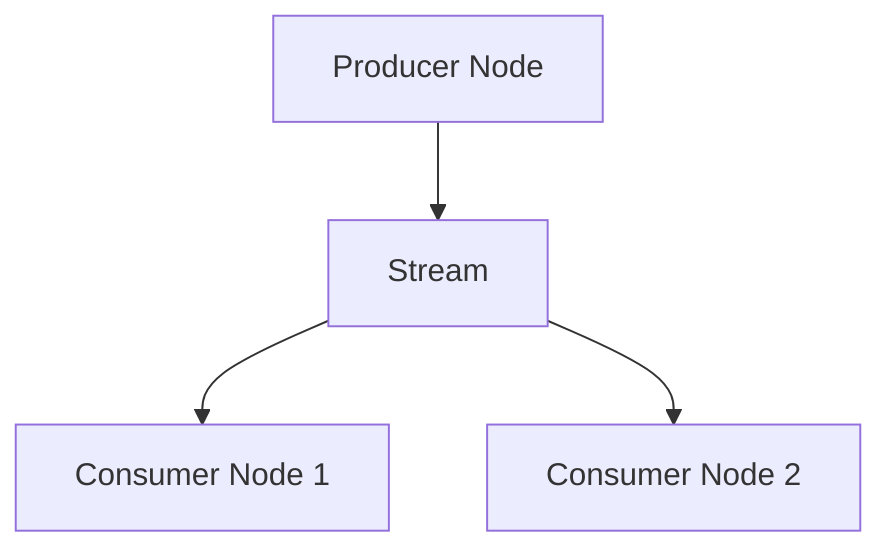

# 消息总线（Message Bus）

`MessageBus` 通过消息传递支持系统组件之间的通信。
这一设计创建了一个松耦合的架构，使组件可以在没有直接依赖关系的情况下
进行交互。

*消息传递模式（messaging patterns）* 包括：

- 点对点（Point-to-Point）
- 发布/订阅（Publish/Subscribe）
- 请求/响应（Request/Response）

通过 `MessageBus` 交换的消息分为三大类：

- 数据（Data）
- 事件（Events）
- 命令（Commands）

## 主题层次结构

Nautilus 将市场数据主题保留在 `data` 根下。实时数据发布使用直接的
`data.<kind>...` 主题，例如 `data.book.deltas.XCME.ESZ24`。

当被请求、被回放，或由工作流生成的数据以可按主题寻址的数据形式在
消息总线上流动时，`DataEngine` 会将其发布在 `data.pipeline.<kind>...` 下。
长请求（long requests）、分组请求（grouped requests）和聚合链
（aggregation chains）可以在父请求完成之前拆分、转换数据，并将数据重新
汇入。这些消息仍然是数据消息，但它们不具备与常规实时发布相同的实时
顺序和时序语义。例如，管道路径上的订单簿差量使用
`data.pipeline.book.deltas.XCME.ESZ24`。

关联的请求响应通过按关联 ID（correlation ID）键控的响应处理器传递。
`data.response` 主题是响应发布的捕获通道，而不是管道数据路径。

## 消息完整性

一条消息一旦被创建，其字段就不得被修改。这包括诸如 `params` 映射之类的
容器字段。组件可以读取一条消息并从中派生本地状态，但不得重写原始消息。

不可变消息确保每个消费者看到相同的输入，保留了消息发出时刻的真实状态，
并消除了一类共享状态竞争问题。回放、调试和审计都依赖于消息在分发之后
保持稳定。

由此产生了三条所有权规则：

- 调用方提供的请求选项保留在消息上。
- 返回给调用方的响应元数据保留在响应上。
- 组件的工作流状态（有界日期范围、分组状态、回放游标、计数器、
  处理标志）保留在按消息或请求 ID 键控的组件自有上下文中。

当某个组件需要一条派生消息时，它会创建一条带有所需值的新消息，
而不是重写原始消息。

## 数据和信号发布

虽然 `MessageBus` 是一个较底层的组件，用户通常间接与之交互，
但 `Actor` 和 `Strategy` 类在其之上提供了便捷的方法：

```python
def publish_data(self, data_type: DataType, data: Data) -> None:
def publish_signal(self, name: str, value, ts_event: int = 0) -> None:
```

这些方法使你能够高效地发布自定义数据和信号，而无需直接与
`MessageBus` 接口打交道。

## 直接访问

对于高级用户或特殊使用场景，`Actor` 和 `Strategy` 类内部可以通过
`self.msgbus` 引用直接访问消息总线，该引用提供了完整的消息总线接口。

要直接发布一条自定义消息，你可以指定一个 `str` 类型的主题，
以及任意 Python `object` 作为消息载荷，例如：

```python
self.msgbus.publish("MyTopic", "MyMessage")
```

## 消息传递风格

NautilusTrader 是一个**事件驱动**框架，各组件通过发送和接收消息进行通信。
理解不同的消息传递风格有助于构建交易系统。

本指南解释了 NautilusTrader 中三种主要的消息传递模式：

| **消息传递风格**                          | **用途**                                 | **最适用于**                                          |
|:---------------------------------------------|:--------------------------------------------|:------------------------------------------------------|
| **MessageBus - 按主题发布/订阅** | 对消息总线的底层、直接访问 | 自定义事件、系统级通信             |
| **基于 Actor - 发布/订阅数据**     | 结构化的交易数据交换            | 交易指标、指标数据、需要持久化的数据 |
| **基于 Actor - 发布/订阅信号**   | 轻量级通知                   | 简单的告警、标志、状态更新                  |

每种方式都服务于不同的目的。本节帮助你决定使用哪种模式。

### MessageBus 按主题发布/订阅

#### 概念

`MessageBus` 是 NautilusTrader 中所有消息的中央枢纽。它实现了一种
**发布/订阅**模式，组件可以将事件发布到**命名主题**上，其他组件可以
订阅以接收这些消息。这使组件解耦，允许它们通过消息总线间接交互。

#### 主要好处和使用场景

在你需要以下能力时，消息总线方式非常理想：

- 系统内的**跨组件通信**。
- 定义任意主题并发送任意类型载荷（任意 Python 对象）的**灵活性**。
- 发布者和订阅者之间**解耦**，彼此无需了解对方。
- **全局触达**，消息可以被多个订阅者接收。
- 处理不适合预定义 `Actor` 模型的事件。
- 需要完全控制消息传递的高级场景。

#### 需要注意的问题

- 你必须手动跟踪主题名称（拼写错误可能导致消息丢失）。
- 你必须手动定义处理器。

#### 快速概览代码

```python
from nautilus_trader.core.message import Event

# Define a custom event
class Each10thBarEvent(Event):
    TOPIC = "each_10th_bar"  # Topic name
    def __init__(self, bar):
        self.bar = bar

# Subscribe in a component (in Strategy)
self.msgbus.subscribe(Each10thBarEvent.TOPIC, self.on_each_10th_bar)

# Publish an event (in Strategy)
event = Each10thBarEvent(bar)
self.msgbus.publish(Each10thBarEvent.TOPIC, event)

# Handler (in Strategy)
def on_each_10th_bar(self, event: Each10thBarEvent):
    self.log.info(f"Received 10th bar: {event.bar}")
```

#### 完整示例

[MessageBus 示例](https://github.com/nautechsystems/nautilus_trader/tree/develop/examples/backtest/example_09_messaging_with_msgbus)

### 基于 Actor 的发布/订阅数据

#### 概念

这种方式提供了一种在系统中的 `Actor` 之间交换特定于交易的数据的方法
（注意：每个 `Strategy` 都继承自 `Actor`）。它继承自 `Data`，
确保了事件的正确时间戳和顺序——这对于正确的回测处理至关重要。

#### 主要好处和使用场景

在你需要以下能力时，Data 发布/订阅方式很有效：

- **交换结构化的交易数据**，例如市场数据、指标、自定义指标或期权希腊值。
- 通过内置的时间戳（`ts_event`、`ts_init`）实现**正确的事件排序**，
  这对回测的准确性至关重要。
- 通过 `@customdataclass` 装饰器实现**数据持久化和序列化**，
  与 NautilusTrader 的数据 catalog 系统集成。
- 系统组件之间**标准化的交易数据交换**。

#### 需要注意的问题

- 需要定义一个继承自 `Data` 或使用 `@customdataclass` 的类。

#### 继承 `Data` vs. 使用 `@customdataclass`

**继承 `Data` 类：**

- 定义了必须由子类实现的抽象属性 `ts_event` 和 `ts_init`。这些属性
  确保在回测中根据时间戳正确排序数据。

**`@customdataclass` 装饰器：**

- 如果尚不存在 `ts_event` 和 `ts_init` 属性，会添加它们。
- 提供序列化函数：`to_dict()`、`from_dict()`、`to_bytes()`、`to_arrow()` 等。
- 支持数据持久化和外部通信。

#### 快速概览代码

```python
from nautilus_trader.core.data import Data
from nautilus_trader.model.custom import customdataclass

@customdataclass
class GreeksData(Data):
    delta: float
    gamma: float

# Publish data (in Actor / Strategy)
data = GreeksData(delta=0.75, gamma=0.1, ts_event=1_630_000_000_000_000_000, ts_init=1_630_000_000_000_000_000)
self.publish_data(GreeksData, data)

# Subscribe to receiving data  (in Actor / Strategy)
self.subscribe_data(GreeksData)

# Handler (this is static callback function with fixed name)
def on_data(self, data: Data):
    if isinstance(data, GreeksData):
        self.log.info(f"Delta: {data.delta}, Gamma: {data.gamma}")
```

#### 完整示例

[基于 Actor 的数据示例](https://github.com/nautechsystems/nautilus_trader/tree/develop/examples/backtest/example_10_messaging_with_actor_data)

### 基于 Actor 的发布/订阅信号

#### 概念

**信号（Signals）** 是在 actor 框架内发布和订阅简单通知的一种轻量级方式。
这是最简单的消息传递方式，无需定义自定义类。

#### 主要好处和使用场景

在你需要以下能力时，信号消息传递方式很有效：

- **简单、轻量级的通知/告警**，例如“RiskThresholdExceeded”或“TrendUp”。
- **快速、临时的消息传递**，无需定义自定义类。
- 以基础类型数据（`int`、`float` 或 `str`）**广播告警或标志**。
- 通过直接了当的方法（`publish_signal`、`subscribe_signal`）实现**简单的 API 集成**。
- **多订阅者通信**，所有订阅者在信号发布时都会收到该信号。
- **最小化的设置开销**，无需定义类。

#### 需要注意的问题

- 每个信号只能包含**单个值**，类型为：`int`、`float` 和 `str`。这意味着
  不支持复杂数据结构或其他 Python 类型。
- 在 `on_signal` 处理器中，你只能通过 `signal.value` 来区分不同的信号，
  因为信号名称在处理器中不可访问。

#### 快速概览代码

```python
# Define signal constants for better organization (optional but recommended)
import types
from nautilus_trader.core.datetime import unix_nanos_to_dt
from nautilus_trader.common.enums import LogColor

signals = types.SimpleNamespace()
signals.NEW_HIGHEST_PRICE = "NewHighestPriceReached"
signals.NEW_LOWEST_PRICE = "NewLowestPriceReached"

# Subscribe to signals (in Actor/Strategy)
self.subscribe_signal(signals.NEW_HIGHEST_PRICE)
self.subscribe_signal(signals.NEW_LOWEST_PRICE)

# Publish a signal (in Actor/Strategy)
self.publish_signal(
    name=signals.NEW_HIGHEST_PRICE,
    value=signals.NEW_HIGHEST_PRICE,  # value can be the same as name for simplicity
    ts_event=bar.ts_event,  # timestamp from triggering event
)

# Handler (this is static callback function with fixed name)
def on_signal(self, signal):
    # IMPORTANT: We match against signal.value, not signal.name
    match signal.value:
        case signals.NEW_HIGHEST_PRICE:
            self.log.info(
                f"New highest price was reached. | "
                f"Signal value: {signal.value} | "
                f"Signal time: {unix_nanos_to_dt(signal.ts_event)}",
                color=LogColor.GREEN
            )
        case signals.NEW_LOWEST_PRICE:
            self.log.info(
                f"New lowest price was reached. | "
                f"Signal value: {signal.value} | "
                f"Signal time: {unix_nanos_to_dt(signal.ts_event)}",
                color=LogColor.RED
            )
```

#### 完整示例

[基于 Actor 的信号示例](https://github.com/nautechsystems/nautilus_trader/tree/develop/examples/backtest/example_11_messaging_with_actor_signals)

### 总结与决策指南

以下是帮助你决定使用哪种消息传递风格的快速参考：

#### 决策指南：如何选择风格？

| **使用场景**                                | **推荐方式**                                                        | **所需设置** |
|:--------------------------------------------|:--------------------------------------------------------------------------------|:-------------------|
| 自定义事件或系统级通信 | `MessageBus` + 按主题发布/订阅                                                 | 主题 + 处理器管理 |
| 结构化交易数据                     | `Actor` + 发布/订阅数据 + 如需序列化则可选 `@customdataclass` | 继承自 `Data` 的新类定义（处理器 `on_data` 已预定义） |
| 简单告警/通知                 | `Actor` + 发布/订阅信号                                                        | 仅需信号名称 |

## 外部出站与入站

`MessageBus` 可以将序列化后的消息写入外部数据流。本节描述了外部总线的
出站（egress）和入站（ingress）两端。Rust 原生的实盘节点使用注入的
`MessageBusExternalEgress` 和 `MessageBusExternalIngress` 接口，因此
核心节点不依赖于 Redis、消息代理、共享内存实现或套接字协议。

:::info
目前支持将 Redis 作为可序列化消息的外部后端之一。所需的最低 Redis
版本是 6.2，这是使用[流（streams）](https://redis.io/docs/latest/develop/data-types/streams/)
功能所必需的。
:::

当配置了外部出站时，传出的发布消息会先被分发给进程内订阅者，
然后再序列化为现有的 `BusMessage` 线路记录：

- `topic`：内部发布调用所使用的确切消息总线主题，例如
  `data.quotes.BINANCE.BTCUSDT` 或 `events.order.S-001`。
- `type`：规范的载荷类型名称，例如 `QuoteTick` 或 `OrderEventAny`。
- `encoding`：从消息总线编码策略中选定的载荷编码方式。
- `payload`：使用选定编码方式编码后的序列化字节。

外部出站以 `publish(BusMessage)` 的形式接收该记录。这一出站调用不得
阻塞节点的总线线程。有界出站实现会在队列已满时丢弃消息，而不是对
交易循环施加背压（back-pressure）。关闭消息总线会同时关闭已配置的
出站。

入站的外部数据流通过单独的 Rust `MessageBusExternalIngress` trait 暴露。
入站产生与出站相同形态的 `BusMessage { topic, payload_type, encoding, payload }`。
`republish_external_message` 解码受支持的入站消息，并在内部重新发布它们，
而不会将该消息再转发出去。入站载荷类型必须先在接收方消息总线上
注册为可流式传输的类型；未注册的类型会被跳过，不会被解码。

对于 Redis，消息通过一个多生产者单消费者（MPSC）通道传输给一个单独的
Rust 任务。该任务将消息写入 Redis 流。

将 I/O 卸载到单独的线程可以保持主线程不被阻塞。

使用 MessagePack 或 JSON 时，Rust 原生外部出站会转发可序列化的类型化
发布内容。这包括金融工具、报价、成交、K 线、订单簿差量、10 档深度快照、
标记/指数/资金费率更新、期权希腊值、账户状态、投资组合快照、订单事件、
仓位事件和自定义数据。在启用 `defi` 功能时，还包括 DeFi 区块、资金池、
流动性更新、手续费收取和闪电事件。完整的订单簿快照、希腊值数据、
期权链切片和 DeFi 资金池交换不会被转发，因为这些类型未实现 Serde 序列化。

使用 SBE 或 Cap'n Proto 时，Rust 原生外部出站会使用模式编解码器转发
内置的市场数据载荷：报价、成交、K 线、订单簿差量、10 档深度快照、
标记价格更新、指数价格更新、资金费率更新和期权希腊值。当选择了这些
模式编码方式时，其他载荷类型会被丢弃，并记录一条调试日志。

### 序列化

Nautilus 支持以下类型的序列化：

- 所有 Nautilus 内置类型（序列化为包含可序列化基础类型的字典 `dict[str, Any]`）。
- Python 基础类型（`str`、`int`、`float`、`bool`、`bytes`）。

你可以通过 `serialization` 子包注册自定义类型，为其添加序列化支持。

```python
def register_serializable_type(
    cls,
    to_dict: Callable[[Any], dict[str, Any]],
    from_dict: Callable[[dict[str, Any]], Any],
):
    ...
```

- `cls`：要注册的类型。
- `to_dict`：从对象实例化出一个基础类型字典的委托函数。
- `from_dict`：从一个基础类型字典实例化出对象的委托函数。

## 配置

消息总线的外部后端技术使用一个行为配置加上一个由具体技术拥有的
后端配置。`MessageBusConfig` 控制消息总线的行为。`RedisMessageBusConfig`
拥有 Redis 连接设置，并实现了 `MessageBusBackingFactory`。

```rust
use nautilus_common::{
    enums::SerializationEncoding,
    msgbus::{backing::MessageBusBackingFactory, config::MessageBusConfig},
};
use nautilus_infrastructure::redis::msgbus::RedisMessageBusConfig;

let config = MessageBusConfig {
    encoding: SerializationEncoding::Json,
    encoding_market_data: Some(SerializationEncoding::Sbe),
    timestamps_as_iso8601: true,
    buffer_interval_ms: Some(100),
    autotrim_mins: Some(30),
    use_trader_prefix: true,
    use_trader_id: true,
    use_instance_id: false,
    streams_prefix: "streams".to_string(),
    types_filter: Some(vec!["QuoteTick".to_string(), "TradeTick".to_string()]),
    ..Default::default()
};

let backing = RedisMessageBusConfig::default();
let message_bus_backing = backing.create(trader_id, instance_id, config.clone())?;
```

### 后端配置

使用内置的 Redis 后端时需要 `RedisMessageBusConfig`。对于本地回环
（local loopback）上的默认 Redis 设置，你可以传入
`RedisMessageBusConfig::default()`。

Redis 的选择在 Rust 类型中是显式的。该配置不使用诸如
`type = "redis"` 或 `backing_type = "redis"` 之类的面向用户的选择器。

注入 `MessageBusExternalEgress` 的 Rust 原生调用方，在构造该出站接口时
会传入具体的连接详情。对于注入式出站，核心消息总线不需要
`RedisMessageBusConfig`。

Rust 实盘运行时在 `MessageBusConfig` 中接受 `external_streams`，
并在调用方通过 `LiveNodeBuilder::with_external_ingress` 注入
`MessageBusExternalIngress` 时消费入站的 `BusMessage`。该配置命名了
外部流的键；注入的入站接口是具体的运行时数据源。从配置到后端的
Rust 原生工厂接线仍由调用方负责。

内置的 Redis 入站会从当前时间戳开始处理每个已配置的流，因此节点启动时
已经存在的条目不会被重放。启动后，它会为每个流推进最后已见的 ID，
并在连接重试期间保留这些 ID。当需要持久化的启动前重放时，请使用
缓存恢复或事件存储；`external_streams` 提供的是实时转发，而不是
消费者组积压（consumer-group backlog）。

### 编码

Rust 原生外部消息总线出站支持以下编码名称：

- JSON（`json`）
- MessagePack（`msgpack`）
- Cap'n Proto（`capnp`，需要 Rust `capnp` 功能）
- SBE（`sbe`，需要 Rust `sbe` 功能）

使用 `encoding` 配置选项来控制消息写入编码。
使用 `encoding_market_data` 来覆盖由外部总线二进制编解码器支撑的
市场数据载荷的编码方式。使用 `encoding_builtin` 来覆盖账户状态、
投资组合快照、订单事件和仓位事件载荷。自定义和未映射的载荷类型
始终使用 `encoding`。

`MessageBusConfig::validate` 要求默认的 `encoding` 支持自定义载荷，
因此它必须是 JSON 或 MessagePack。类别覆盖必须被该类别中每一种已发布
的载荷类型所支持。SBE 和 Cap'n Proto 目前只能用于 `encoding_market_data`，
且仅在启用了对应的 Rust 功能时才可用。在这些模式编解码器覆盖内置
事件类别之前，`encoding_builtin = "sbe"` 和 `encoding_builtin = "capnp"`
会校验失败。

传统的 Python/Cython Redis 序列化器和 Redis 缓存载荷路径支持
MessagePack 和 JSON。SBE 和 Cap'n Proto 是 Rust 原生外部消息总线出站的
模式载荷编码方式，不是 Redis 缓存编码方式。

:::tip
`json` 编码是默认使用的，以获得可读性和互操作性。
当载荷大小和序列化性能是主要考虑因素时，请使用 `msgpack`。
:::

### 时间戳格式

默认情况下，时间戳被格式化为 UNIX 纪元纳秒整数。你也可以通过将
`timestamps_as_iso8601` 设置为 `true` 来配置 ISO 8601 字符串格式。

### 消息流键

消息流键对于标识各个交易节点以及组织流中的消息至关重要。
它们可以根据你的特定需求和使用场景进行定制。在消息总线流的上下文中，
交易者键通常构造如下：

```
trader:{trader_id}:{instance_id}:{streams_prefix}
```

这些选项控制 Redis 流键。它们不会重写传给注入式
`MessageBusExternalEgress` 的 `topic`；该主题仍然是内部消息总线的
发布主题。当 `stream_per_topic` 为 `True` 时，Redis 出站会将主题附加到
流键上。当为 `False` 时，Redis 会将所有消息存储在基础流键上，
并将主题保留为消息字段。

以下选项可用于配置消息流键：

#### Trader 前缀

键是否应以 `trader` 字符串开头。

#### Trader ID

键是否应包含该节点的交易者 ID。

#### Instance ID

每个交易节点都被分配一个唯一的“实例 ID”，即 UUIDv4。当消息分布在
多个流中时，该实例 ID 有助于区分各个交易者。你可以通过将
`use_instance_id` 配置选项设置为 `True`，在交易者键中包含该实例 ID。
这在多节点交易系统中需要跨各个流跟踪和识别交易者时特别有用。

#### Streams 前缀

`streams_prefix` 字符串使你能够将单个交易者实例的所有流分组，
或组织多个实例的消息。可通过向 `streams_prefix` 配置选项传入一个字符串
来配置，同时确保其他前缀设置为 false。

#### 每个主题一个流

指示生产者是否会为每个主题写入一个独立的流。这对于不支持在监听流时
使用通配符主题的 Redis 后端特别有用。如果设置为 False，所有消息将写入
同一个流。

:::info
Redis 不支持通配符流主题。为了更好地兼容 Redis，建议将该选项设置为
False。
:::

### 类型过滤

当消息在消息总线上发布时，如果为消息总线配置并启用了后端，
它们会被序列化并写入一个流。为了防止诸如高频报价之类的数据淹没该流，
你可以从外部发布中过滤掉某些类型的消息。

要启用这一过滤机制，请在消息总线配置的 `types_filter` 参数中传入一个
`type` 对象列表，指定应从外部发布中排除哪些类型的消息。

```python
from nautilus_trader.config import MessageBusConfig
from nautilus_trader.model.data import QuoteTick
from nautilus_trader.model.data import TradeTick

# Create a MessageBusConfig instance with types filtering
message_bus = MessageBusConfig(
    types_filter=[QuoteTick, TradeTick]
)
```

### 流自动修剪

`autotrim_maxlen` 选项仅在 v2 Rust/PyO3 `MessageBusConfig` 上可用。

使用 `autotrim_mins` 设置以分钟为单位的回溯窗口，使用 `autotrim_maxlen`
为每个 Redis 流设置一个近似的最大条目数。你可以配置其中一种策略，
也可以两者都配置。当两者都设置时，消息总线会移除超出时间窗口或
条目数阈值中任一限制的条目。

Redis 使用近似修剪来应用 `autotrim_maxlen`，以获得更好的写入性能，
因此一个流可能包含略多于配置阈值的条目。

:::info
当前的 Redis 实现会将 `autotrim_mins` 维持为一个最大宽度（外加大约一分钟，
因为流的修剪频率不超过每分钟一次），而不是基于当前挂钟时间的最大
回溯窗口。
:::

## 外部数据流

`TradingNode`（节点）内部的消息总线被称为“内部消息总线”。
生产者节点是指将消息发布到外部流上的节点（参见[外部出站与入站](#external-egress-and-ingress)）。
消费者节点监听外部流，以接收反序列化的消息载荷并将其发布到自己的
内部消息总线上。



:::tip
将 `LiveDataEngineConfig.external_clients` 设置为一份 `client_id` 列表，
用以表示外部流式客户端。`DataEngine` 会为这些客户端过滤掉订阅命令，
确保外部流式传输能够为对这些客户端的任何订阅提供所需数据。
当 Rust `DataEngine` 跳过某个外部客户端的订阅时，它会为该订阅对应的
流式载荷类型注册消息总线上的入站重新发布。
:::

### 示例配置

以下示例详细说明了一种流式传输设置：生产者节点将 Binance 数据对外发布，
下游消费者节点将这些数据消息发布到其内部消息总线上。

#### 生产者节点

我们将生产者节点的 `MessageBus` 配置为发布到一个 `"binance"` 流。
`use_trader_id`、`use_trader_prefix` 和 `use_instance_id` 都设置为 `false`，
以确保生成一个消费者节点可以据此注册的、简单可预测的流键。

```rust
let message_bus = MessageBusConfig {
    use_trader_id: false,
    use_trader_prefix: false,
    use_instance_id: false,
    streams_prefix: "binance".to_string(), // <---
    stream_per_topic: false,
    autotrim_mins: Some(30),
    ..Default::default()
};

let backing = RedisMessageBusConfig {
    connection_timeout: 2,
    response_timeout: 2,
    ..Default::default()
};
```

#### 消费者节点

我们将消费者节点的 `MessageBus` 配置为从同一个 `"binance"` 流接收消息。
当一个 `MessageBusExternalIngress` 被注入 `LiveNodeBuilder` 时，
该节点会监听外部流键，然后将这些消息发布到其内部消息总线上。
我们将客户端 ID `"BINANCE_EXT"` 声明为一个外部客户端，这样
`DataEngine` 就不会尝试向该客户端 ID 发送数据命令。

```rust
let data_engine = LiveDataEngineConfig {
    external_clients: Some(vec![ClientId::from("BINANCE_EXT")]),
    ..Default::default()
};

let message_bus = MessageBusConfig {
    external_streams: Some(vec!["binance".to_string()]), // <---
    ..Default::default()
};

let backing = RedisMessageBusConfig {
    connection_timeout: 2,
    response_timeout: 2,
    ..Default::default()
};
```

## 相关指南

- [Actor](actors.md) - Actor 使用消息总线进行事件处理。
- [架构（Architecture）](architecture.md) - 消息总线在系统架构中的角色。
