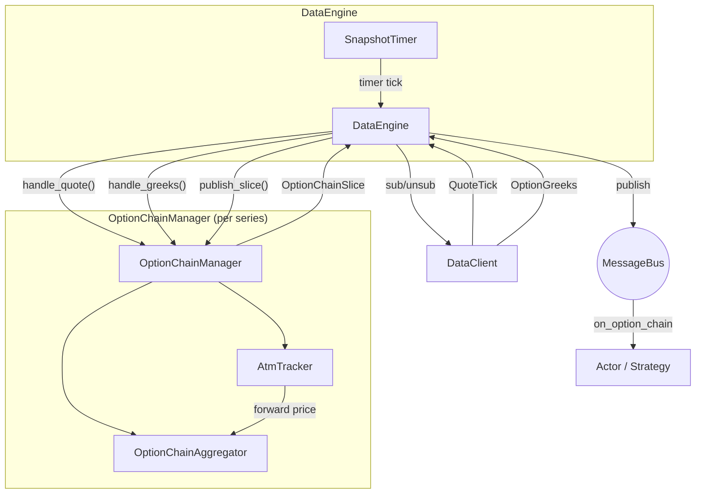

# 期权（Options）

Nautilus 为传统市场和加密货币市场的期权交易提供了一流的支持。这包括
特定于期权的金融工具类型、交易场所提供的希腊值流式推送、期权链聚合，
以及用于风险管理的本地 Black-Scholes 希腊值计算器。

## 期权金融工具类型

该平台定义了几种期权金融工具类型：

| 金融工具           | 说明                                                                  |
|----------------------|------------------------------------------------------------------------------|
| `OptionContract`     | 在交易所上市、具有行权价和到期日的标的期权。              |
| `OptionSpread`       | 交易所定义的多腿期权组合策略，以单一行整体表示。                      |
| `CryptoOption`       | 以加密货币计价/结算的加密货币期权；可以是反向或数量对冲（quanto）风格。         |
| `CryptoOptionSpread` | 加密货币期权组合，具有反向、结算货币和小数规模等属性。 |
| `BinaryOption`       | 固定赔付的期权，结算为 0 或 1。                                  |

希腊值相关的元数据因金融工具类型而异：

- `OptionContract`、`CryptoOption`：完整的希腊值计算输入，包括
  `strike_price`、`option_kind`（CALL/PUT）、`expiration_utc`、`underlying`、
  `multiplier`。
- `OptionSpread`、`CryptoOptionSpread`：最多由 4 条期权腿组合而成，
  每条腿都有一个权重比例。拥有 `underlying`、`expiration_utc` 和
  `strategy_type`（跨式、日历式、宽跨式等）。每条腿的 `strike_price`
  和 `option_kind` 存在于各自的 `OptionContract`/`CryptoOption` 中，
  而不是存在于组合本身。希腊值按每条腿单独计算再聚合。组合通常
  用于下单（交易所将其作为单一订单执行），而各条腿单独作为仓位出现。
  `CryptoOptionSpread` 还额外携带 `is_inverse` 和 `settlement_currency`，
  用于 Deribit 等交易场所。
- `BinaryOption`：拥有 `expiration_utc` 和 `outcome`/`description`，
  但没有 `strike_price`、`option_kind` 或 `underlying`。

## 订阅希腊值

Deribit、Bybit、OKX 等交易场所会随其期权市场发布实时希腊值。
Nautilus 提供两个订阅级别：

- **按金融工具的希腊值**：订阅单个期权合约。
- **期权链切片**：订阅整个期权系列的聚合视图。

### 按金融工具的希腊值

从 actor 或策略中订阅单个期权合约的交易场所提供希腊值：

```python
from nautilus_trader.model.identifiers import ClientId

client_id = ClientId("DERIBIT")
self.subscribe_option_greeks(instrument_id, client_id=client_id)
```

通过实现 `on_option_greeks` 处理器来处理传入的更新：

```python
def on_option_greeks(self, greeks) -> None:
    self.log.info(
        f"{greeks.instrument_id}: "
        f"delta={greeks.delta:.4f} gamma={greeks.gamma:.6f} "
        f"vega={greeks.vega:.4f} theta={greeks.theta:.4f} "
        f"mark_iv={greeks.mark_iv} underlying={greeks.underlying_price}"
    )
```

停止接收更新：

```python
self.unsubscribe_option_greeks(instrument_id, client_id=client_id)
```

### 期权链订阅

期权链订阅将某个期权系列中所有行权价的报价和希腊值聚合到
`OptionChainSlice` 快照中。`DataEngine` 会为每个系列创建一个 Rust
`OptionChainManager`，并拥有其生命周期：创建管理器、路由传入数据、
运行快照定时器，以及排空线路层订阅变更。

```python
from nautilus_trader.core import nautilus_pyo3

series_id = nautilus_pyo3.OptionSeriesId(...)  # identifies the series (venue, underlying, expiry)

# Subscribe to 5 strikes above and below ATM, snapshot every 1000ms
strike_range = nautilus_pyo3.StrikeRange.atm_relative(strikes_above=5, strikes_below=5)
self.subscribe_option_chain(
    series_id,
    strike_range=strike_range,
    snapshot_interval_ms=1000,
)
```

通过实现 `on_option_chain` 处理器来处理快照：

```python
def on_option_chain(self, chain) -> None:
    for strike in chain.strikes():
        call = chain.get_call(strike)
        put = chain.get_put(strike)
        if call and call.greeks:
            self.log.info(f"Call {strike}: delta={call.greeks.delta:.4f}")
```

### 行权价范围过滤

`StrikeRange` 控制哪些行权价在链式订阅中处于激活状态：

| 变体       | 说明                                         | 示例                                        |
|---------------|-----------------------------------------------------|------------------------------------------------|
| `Fixed`       | 订阅一组明确指定的行权价。            | `nautilus_pyo3.StrikeRange.fixed([...])`       |
| `AtmRelative` | 当前 ATM 行权价上方 N 个和下方 N 个行权价。 | `nautilus_pyo3.StrikeRange.atm_relative(5, 5)` |
| `AtmPercent`  | ATM 周围一定百分比区间内的所有行权价。    | `nautilus_pyo3.StrikeRange.atm_percent(0.10)`  |
| `Delta`       | 看涨或看跌 delta 接近某个目标值的行权价。   | `nautilus_pyo3.StrikeRange.delta(0.25, 0.05)`  |

对于基于 ATM 的变体，订阅会被延迟，直到 ATM 价格被确定为止。
ATM 是从交易场所提供的 `OptionGreeks` 更新中内嵌的远期价格
（`underlying_price` 字段）推导出来的。它也可以从通过 HTTP 获取的初始
远期价格进行预置（seed），从而在实时 WebSocket tick 到达之前实现
即时引导（bootstrap）。当 ATM 发生偏移时，活跃行权价集合会自动重新平衡。

`Delta` 由交易场所提供的希腊值解析得出：当某个行权价的看涨或看跌
delta 绝对值（看涨为正、看跌为负，按绝对值比较）落在 `target` 的
`tolerance` 范围内时，该行权价即处于活跃状态。一个典型的价外
（out-of-the-money）目标值，例如 `0.25`，会在 ATM 两侧各选出一个行权价。
在 ATM/远期价格已知之前，`Delta` 与其他基于 ATM 的范围一样会被延迟。
在 ATM 已知之后，如果没有任何活跃行权价的希腊值符合该区间
（包括在任何希腊值到达之前），`Delta` 会回退到 ATM 两侧各五个行权价的
ATM 相对窗口。在从该回退窗口切换到按 delta 选中的行权价之前，
聚合器会等待所有回退腿都拥有希腊值，以避免部分较早的更新丢失
相邻行权价。

### 快照模式 vs. 原始模式

`snapshot_interval_ms` 参数控制发布行为：

- **快照模式**（`snapshot_interval_ms=1000`）：报价和希腊值累积在
  缓冲区中，并按定时器周期作为 `OptionChainSlice` 发布。适用于
  周期性的投资组合再平衡或 UI 展示。
- **原始模式**（`snapshot_interval_ms=None`）：每次报价或希腊值更新都会
  立即发布一个切片。适用于对延迟敏感、需要对单个更新做出反应的策略。

## 期权链回测

期权链回测使用与实时订阅相同的 `OptionChainManager` 和
`OptionChainAggregator` 路径。前提条件是有一个已经包含期权金融工具
以及该链所需的按金融工具数据的 Nautilus Parquet catalog：

- 每个期权合约的 `QuoteTick` 记录，携带已回放的最优买卖报价。
- 每个期权合约的 `OptionGreeks` 记录，携带 delta、隐含波动率、
  计价单位约定，以及用于确定 ATM 的 `underlying_price`。
- 与相同金融工具 ID 对应的 `CryptoOption` 或 `OptionContract` 金融工具。

当期权订单簿快照或报价被写入为 `QuoteTick`，而 `option_summary` 消息
被写入为 `OptionGreeks` 时，Tardis 回放满足这一契约。该回测在运行期间
不会下载或请求缺失的 catalog 数据。

为该系列中的期权金融工具配置一个同时包含两个数据流的 `BacktestNode` 运行：

```python
data = [
    BacktestDataConfig(
        data_type="QuoteTick",
        catalog_path="/path/to/catalog",
        instrument_ids=option_instrument_ids,
    ),
    BacktestDataConfig(
        data_type="OptionGreeks",
        catalog_path="/path/to/catalog",
        instrument_ids=option_instrument_ids,
    ),
]
```

然后从策略中订阅：

```python
strike_range = StrikeRange.delta(0.25, 0.05)
self.subscribe_option_chain(
    series_id,
    strike_range=strike_range,
    snapshot_interval_ms=1000,
)
```

原始模式使用 `snapshot_interval_ms=None`。原始模式会在每次改变活跃链
的报价或希腊值更新之后发布一个切片。整数间隔用于稀疏快照。
稀疏模式会按金融工具累积最新的顶档报价（BBO）和希腊值，并按定时器
节奏发布该链，从而为大型链降低事件量。

每个 `OptionChainSlice` 都会按金融工具合并最新的 BBO 和希腊值，
然后按行权价和期权类型对结果分组。报价可能先于希腊值到达，
希腊值也可能先于报价到达；聚合器会保留最新的状态，在两者都可用时
将其附加在一起。`OptionGreeks` 中的 `underlying_price` 驱动 ATM 检测。

行权价的选择既可以在订阅范围中完成，也可以在策略内部完成：

- 按价值状态（Moneyness）：使用 `StrikeRange.atm_relative(...)` 或
  `StrikeRange.atm_percent(...)`。
- 按 Delta：使用 `StrikeRange.delta(target, tolerance)`，或在
  `on_option_chain` 中检查 `entry.greeks.delta`。
- 按行权价：使用 `StrikeRange.fixed([...])`，或读取 `chain.get_call(strike)`
  和 `chain.get_put(strike)`。

期权的撮合是由报价驱动的。市价单和可成交的限价单会作为吃单方
（taker）与对手方已回放的 BBO 成交。被动的限价单会挂在模拟订单簿上，
当后续的 BBO 更新穿过限价时，可以作为挂单方（maker）成交。该模型不会
为期权模拟二级（L2）队列位置。

结构化的期权手续费模型是在模拟交易场所上配置的，而不是从
交易场所名称推断得出：

```python
from decimal import Decimal

from nautilus_trader.execution import CappedOptionFeeModel
from nautilus_trader.execution import TieredNotionalOptionFeeModel

deribit_like = CappedOptionFeeModel(
    maker_rate=Decimal("0.0003"),
    taker_rate=Decimal("0.0003"),
)
okx_like = TieredNotionalOptionFeeModel(
    maker_rate=Decimal("0.0002"),
    taker_rate=Decimal("0.0005"),
)
```

在 `BacktestVenueConfig` 上将这些对象之一作为 `fee_model` 传入。
Rust 接口使用 `FeeModelAny::CappedOption(CappedOptionFeeModel::new(...))`
和 `FeeModelAny::TieredNotionalOption(TieredNotionalOptionFeeModel::new(...))`。

参见 `examples/backtest/tardis_option_chain.py`，以及 `crates/backtest/examples/`
中的 Rust `tardis-option-chain` 示例。

## 期权链架构

期权链系统是事件驱动的，围绕按系列隔离构建。`DataEngine` 会为每个
已订阅的期权系列创建一个 Rust `OptionChainManager`。该管理器包装了
`OptionChainAggregator` 和 `AtmTracker`，注册消息总线处理器，发布快照，
并将线路层订阅变更排队，供引擎排空处理。一个单独的 PyO3
`OptionChainManager` 将相同的聚合核心暴露给 Python。



### 各组件的职责

#### DataEngine

为每个活跃的 `OptionSeriesId` 持有一个 `OptionChainManager`。在
收到 `SubscribeOptionChain` 时，它会从缓存中解析金融工具，
为基于 ATM 的范围请求远期价格，创建管理器，将活跃的金融工具订阅到
数据客户端，并设置快照定时器。在每次定时器触发时，管理器会检查
是否需要再平衡，发布一份快照，并将任何线路层订阅变更排队，
供引擎排空处理。在收到 `UnsubscribeOptionChain` 或所有金融工具均已
到期时，它会拆除该管理器、取消定时器，并取消订阅线路层数据流。

#### OptionChainManager

这是围绕 `OptionChainAggregator` 和 `AtmTracker` 的按系列的 Rust
管理器。`DataEngine` 通过 `handle_quote()` 和 `handle_greeks()`
向其馈入市场数据。在快照模式下，定时器回调会调用 `publish_slice()`。
在原始模式下，每次活跃的报价或希腊值更新都会立即调用 `publish_slice()`。
面向 Python 的管理器拥有 `handle_*` 方法，会返回首个 ATM 价格是否已引导
（bootstrap）了活跃金融工具集合；而 Rust 管理器在内部执行该引导过程。

#### OptionChainAggregator

使用“保留最新”语义，将报价和希腊值累积到看涨/看跌缓冲区中。
自上次快照以来未更新的金融工具仍会被包含在内。在某个金融工具的
任何报价到达之前先到达的希腊值，会保存在一个 `pending_greeks`
缓冲区中，并在第一个报价到达时附加进去。每次调用 `snapshot()`，
聚合器都会生成一个不可变的 `OptionChainSlice`。

#### AtmTracker

根据传入的 `OptionGreeks` 事件中的 `underlying_price` 字段
（该到期日交易场所提供的远期价格）被动地推导出 ATM 价格。它可以
从一次 HTTP 远期价格响应中预置（seed），实现即时引导，无需等待
WebSocket tick。

### 引导与再平衡

对于基于 ATM 的行权价范围（`AtmRelative`、`AtmPercent`），在 ATM 价格
已知之前，活跃金融工具集合无法确定。有两条引导路径：

**即时引导（远期价格可用）：**

1. `DataEngine` 收到 `SubscribeOptionChain`，从缓存中解析该系列的
   所有金融工具，并向数据客户端请求远期价格。
2. 当远期价格响应到达时，引擎会以预置好的 ATM 价格创建管理器。
   该管理器在构造期间计算出活跃行权价集合。
3. 引擎立即订阅活跃的金融工具。

**延迟引导（无远期价格）：**

1. 与上面相同，但在响应中未找到匹配的远期价格。
2. 引擎创建管理器时不带初始 ATM 价格。活跃集合为空，且不会为
   该链发起任何线路层订阅。
3. 引导依赖于已经从其他订阅（例如按金融工具的
   `subscribe_option_greeks` 调用）流入的相关希腊值数据。当引擎通过
   `handle_greeks()` 馈入一个带有 `underlying_price` 的 `OptionGreeks`
   事件时，管理器会引导出活跃金融工具集合，注册消息总线处理器，
   并将新的线路层订阅排队，供引擎排空处理。

一旦完成引导，聚合器会监控 ATM 漂移。在每次快照定时器触发时，
引擎都会调用 `check_rebalance()`，该方法返回需要添加或移除的任何
金融工具。滞后阈值（hysteresis threshold）和冷却期可以防止在行权价
边界附近产生反复抖动（thrashing）。

## OptionGreeks 数据类型

`OptionGreeks` 携带交易场所为单一期权合约提供的敏感度和隐含波动率：

| 字段              | 类型               | 说明                                         |
|--------------------|--------------------|-----------------------------------------------------|
| `instrument_id`    | `InstrumentId`     | 这些希腊值所属的期权合约。          |
| `convention`       | `GreeksConvention` | 希腊值的计价单位约定。                     |
| `delta`            | `float`            | 期权价格相对于标的每单位变化的变化率。 |
| `gamma`            | `float`            | delta 相对于标的每单位变化的变化率。        |
| `vega`             | `float`            | 隐含波动率变化 1% 时的敏感度。   |
| `theta`            | `float`            | 每日时间衰减（dV/dt / 365.25）。                  |
| `rho`              | `float`            | 对利率变化的敏感度。                  |
| `mark_iv`          | `float` 或 None    | 标记隐含波动率。                            |
| `bid_iv`           | `float` 或 None    | 买价隐含波动率。                            |
| `ask_iv`           | `float` 或 None    | 卖价隐含波动率。                            |
| `underlying_price` | `float` 或 None    | 计算时使用的标的价格。            |
| `open_interest`    | `float` 或 None    | 该合约的未平仓合约量。                     |
| `ts_event`         | `int`              | 该事件的 UNIX 时间戳（纳秒）。          |
| `ts_init`          | `int`              | 初始化时的 UNIX 时间戳（纳秒）。      |

## OptionChainSlice 数据类型

`OptionChainSlice` 是整个期权系列在某一时刻的快照。

属性：

| 属性     | 类型                 | 说明                         |
|--------------|----------------------|-------------------------------------|
| `series_id`  | `OptionSeriesId`     | 该期权系列的标识符。       |
| `atm_strike` | `Price` 或 None      | 当前 ATM 行权价（如果已确定）。 |
| `ts_event`   | `int`                | UNIX 时间戳（纳秒）。       |
| `ts_init`    | `int`                | UNIX 时间戳（纳秒）。       |

看涨和看跌数据通过方法访问，而不是直接作为属性访问。
这些方法返回的每个 `OptionStrikeData` 都包含该行权价的 `quote`（`QuoteTick`）
和一个可选的 `greeks`（`OptionGreeks`）。

方法：

- `strikes()`：该链中所有唯一的行权价。
- `strike_count()`、`call_count()`、`put_count()`：计数。
- `get_call(strike)`、`get_put(strike)`：完整的 `OptionStrikeData`。
- `get_call_greeks(strike)`、`get_put_greeks(strike)`：仅希腊值。
- `get_call_quote(strike)`、`get_put_quote(strike)`：仅报价。
- `is_empty()`：如果该链没有数据则为 true。

## 适配器支持

以下适配器目前支持期权希腊值订阅：

| 适配器 | 按金融工具的希腊值 | 期权链 |
|---------|:---------------------:|:-------------:|
| Deribit | ✓                     | ✓             |
| Bybit   | ✓                     | ✓             |
| OKX     | ✓                     | -             |

## 另请参阅

- [希腊值（Greeks）](greeks.md) - 本地希腊值计算和投资组合风险管理。
- [数据（Data）](data/) - 内置数据类型和订阅模型。
- [Actor](actors.md) - 订阅和处理器参考表。
