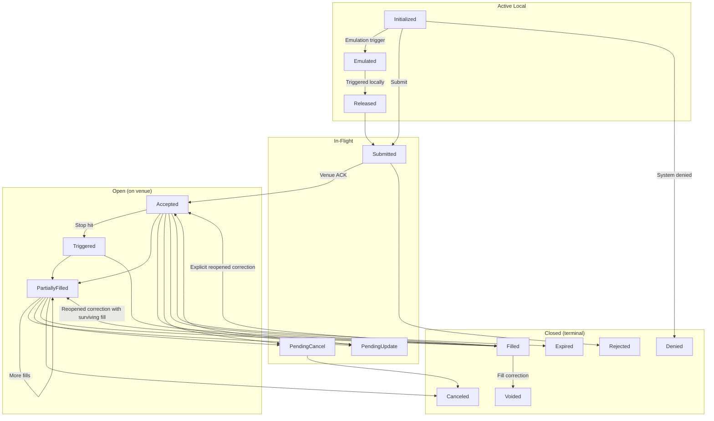

# 订单（Orders）

NautilusTrader 支持广泛的订单类型和执行指令，尽可能地暴露交易场所（venue）的功能。交易者可以为跨任意交易策略的订单执行与管理定义指令和条件关系。

## 概览

所有订单类型都源自两种基本类型：*Market*（市价）和 *Limit*（限价）订单。就流动性而言，两者是相对的。
*Market* 订单通过以最优可用价格立即成交来消耗流动性（consume liquidity），而 *Limit*
订单通过以指定价格挂在订单簿（order book）中等待成交来提供流动性（provide liquidity）。

NautilusTrader 支持九种订单类型（`OrderType` 枚举值），在 [订单类型](#order-types) 一节中进行了汇总，并为每种类型提供了专门的指南。

:::info
NautilusTrader 为许多订单类型和执行指令提供了统一的 API，但并非所有交易场所都支持每个选项。
如果订单包含目标交易场所不支持的指令或选项，系统将不会提交该订单。
系统会记录一条清晰的说明性错误日志。
:::

### 术语

- 如果订单类型为 `MARKET`，或该订单作为*可成交*（marketable）订单执行（即吃单，taker），则称该订单为**主动型（aggressive）**。
- 如果订单不可成交（即挂单提供流动性），则称该订单为**被动型（passive）**。
- 如果订单处于以下三种非终态（non-terminal）状态之一，且仍在本地系统边界内，则称该订单为**本地活跃（active local）**：
  - `INITIALIZED`
  - `EMULATED`
  - `RELEASED`
- 如果订单处于以下状态之一，则称该订单为**在途（in-flight）**：
  - `SUBMITTED`
  - `PENDING_UPDATE`
  - `PENDING_CANCEL`
- 如果订单处于以下（非终态）状态之一，则称该订单为**开放（open）**：
  - `ACCEPTED`
  - `TRIGGERED`
  - `PENDING_UPDATE`
  - `PENDING_CANCEL`
  - `PARTIALLY_FILLED`
- 如果订单处于以下（终态）状态之一，则称该订单为**关闭（closed）**：
  - `DENIED`
  - `REJECTED`
  - `CANCELED`
  - `EXPIRED`
  - `FILLED`
  - `VOIDED`

### 订单状态流转

下图展示了订单生命周期和主要状态转换：

### 订单状态定义

| 状态                | 说明                                                                        |
|--------------------|-----------------------------------------------------------------------------|
| `INITIALIZED`      | 订单已在 Nautilus 系统内实例化。                                             |
| `DENIED`           | 订单因无效、无法处理或超出风险限制而被 Nautilus 拒绝（denied）。            |
| `EMULATED`         | 订单正由 `OrderEmulator` 组件模拟（emulated）。                              |
| `RELEASED`         | 订单已从 `OrderEmulator` 组件释放（released）。                              |
| `SUBMITTED`        | 订单已提交至交易场所（等待确认）。                                          |
| `ACCEPTED`         | 订单已被交易场所确认接收且有效（此时可能已在工作中）。                      |
| `REJECTED`         | 订单被交易场所拒绝。                                                        |
| `CANCELED`         | 订单已被取消（终态）。                                                      |
| `EXPIRED`          | 订单已到达其 GTD 过期时间（终态）。                                         |
| `TRIGGERED`        | 订单的 STOP 价格已在交易场所被触发。                                        |
| `PENDING_UPDATE`   | 订单在交易场所有待处理的修改请求。                                          |
| `PENDING_CANCEL`   | 订单在交易场所有待处理的取消请求。                                          |
| `PARTIALLY_FILLED` | 订单已在交易场所部分成交。                                                  |
| `FILLED`           | 订单已完全成交（终态）。                                                    |
| `VOIDED`           | 订单在经过权威成交更正（fill correction）后处于终态。                       |

## 执行指令

某些交易场所允许交易者对订单的处理和执行方式指定条件和限制。以下是各类执行指令的简要汇总。

### 有效期类型（Time in force）

订单的有效期类型指定了订单在剩余数量被取消之前，将保持开放或活跃的时长。

- `GTC` **（Good Till Cancel，取消前有效）**：订单在被交易者或交易场所取消之前一直保持活跃。
- `IOC` **（Immediate or Cancel / Fill and Kill，立即成交否则取消）**：订单立即执行，未成交部分被取消。
- `FOK` **（Fill or Kill，全部成交否则取消）**：订单立即全部成交，否则完全不成交。
- `GTD` **（Good Till Date，指定日期前有效）**：订单在指定的到期日期和时间之前一直保持活跃。
- `DAY` **（当日/交易时段内有效）**：订单在当前交易时段结束前一直保持活跃。
- `AT_THE_OPEN` **（OPG，开盘时有效）**：订单仅在交易时段开盘时活跃。
- `AT_THE_CLOSE`：订单仅在交易时段收盘时活跃。

### 到期时间（Expire time）

此指令需与 `GTD` 有效期类型配合使用，用于指定订单将从交易场所的订单簿（或订单管理系统）中过期并移除的时间。

### 只挂单（Post-only）

标记为 `post_only` 的订单将只参与向限价订单簿提供流动性，绝不会作为吃单方（aggressor）发起吃掉流动性的成交。此选项对做市商，
或希望将订单限制在流动性*挂单方（maker）*费率档位的交易者来说非常重要。

### 只减仓（Reduce-only）

设置为 `reduce_only` 的订单只会减少某一金融工具上的现有持仓，且永远不会开立新持仓（若已空仓）。该指令的确切行为可能因交易场所而异。

不过，Nautilus 中 `SimulatedExchange`（模拟交易所）的行为与真实交易场所的典型行为一致。

- 当关联持仓被平仓（变为空仓）时，订单将被取消。
- 随着关联持仓规模的减小，订单数量也会相应减少。

### 显示数量（Display quantity）

`display_qty` 指定了 *Limit* 订单中在限价订单簿上显示的部分数量。
这类订单也称为冰山订单（iceberg order），因为其存在可见部分，同时还有更多隐藏数量。
将显示数量指定为零，等同于将订单设置为 `hidden`（隐藏）。

### 触发类型（Trigger type）

也称为[触发方式（trigger method）](https://www.interactivebrokers.com/en/software/tws/usersguidebook/configuretws/Modify%20the%20Stop%20Trigger%20Method.htm)，适用于条件触发型订单，用于指定触发止损价格的方式。

- `DEFAULT`：交易场所的默认触发类型（通常为 `LAST_PRICE` 或 `BID_ASK`）。
- `LAST_PRICE`：触发价格将基于最新成交价。
- `BID_ASK`：触发价格将基于买入订单的买价（bid）和卖出订单的卖价（ask）。
- `DOUBLE_LAST`：触发价格将基于连续两次最新成交价。
- `DOUBLE_BID_ASK`：触发价格将基于连续两次相应的买价或卖价。
- `LAST_OR_BID_ASK`：触发价格将基于最新成交价或买卖价（bid/ask）之一。
- `MID_POINT`：触发价格将基于买卖价的中间价。
- `MARK_PRICE`：触发价格将基于交易场所针对该金融工具的标记价格（mark price）。
- `INDEX_PRICE`：触发价格将基于交易场所针对该金融工具的指数价格（index price）。

### 触发偏移类型（Trigger offset type）

适用于条件跟踪止损（trailing-stop）触发型订单，用于指定基于与*市场*（相应的买价、卖价或最新成交价）的偏移量来触发止损价格修改的方式。

- `DEFAULT`：交易场所的默认偏移类型（通常为 `PRICE`）。
- `PRICE`：偏移基于价格差值。
- `BASIS_POINTS`：偏移基于以基点（basis points）表示的价格百分比差值（100bp = 1%）。
- `TICKS`：偏移基于最小变动价位（tick）数量。
- `PRICE_TIER`：偏移基于交易场所特定的价格档位（price tier）。

### 关联订单（Contingent orders）

订单之间还可以指定更高级的关联关系。
例如，可以将子订单设置为仅在父订单被激活或成交时才触发，或者将多个订单关联起来，使一个订单成交后取消或减少另一个订单的数量。
详情请参见 [高级订单](advanced.md) 指南。

## 订单工厂（Order factory）

创建新订单最简便的方式是使用内置的 `OrderFactory`，它会自动附加到每个 `Strategy` 类上。该工厂会处理更底层的细节——例如确保分配正确的
trader ID 和 strategy ID、生成必要的初始化 ID 和时间戳，并对不一定适用于所创建订单类型、或仅在指定更高级执行指令时才需要的参数进行抽象封装。

这使得工厂可以提供更简单的订单创建方法，本文所有示例都使用 `Strategy` 上下文中的 `OrderFactory`。

更多详情请参见 [`OrderFactory` API 参考](/docs/python-api-latest/common.html#nautilus_trader.common.factories.OrderFactory)。

## 订单类型

NautilusTrader 支持以下订单类型。每种类型都链接到附带代码示例的专门指南；可选参数会以注释形式标出其默认值。

| 订单类型                                             | 类别                  | 说明                                                              |
|------------------------------------------------------|-----------------------|--------------------------------------------------------------------------|
| [`MARKET`](market.md)                                | 主动型（Aggressive）   | 立即以最优可用价格成交指定数量。                                     |
| [`LIMIT`](limit.md)                                  | 被动型（Passive）      | 挂在订单簿中，仅以限价或更优价格成交。                                |
| [`STOP_MARKET`](stop_market.md)                      | 条件型（Conditional）  | 一旦触发价格被击中，即下达一笔 *Market* 订单。                        |
| [`STOP_LIMIT`](stop_limit.md)                        | 条件型（Conditional）  | 一旦触发价格被击中，即在设定价格下达一笔 *Limit* 订单。                |
| [`MARKET_TO_LIMIT`](market_to_limit.md)              | 混合型（Hybrid）       | 以 *Market* 方式提交；未成交余量以成交价挂为 *Limit* 单。              |
| [`MARKET_IF_TOUCHED`](market_if_touched.md)          | 条件型（Conditional）  | 一旦触发价格被触及，即下达一笔 *Market* 订单。                        |
| [`LIMIT_IF_TOUCHED`](limit_if_touched.md)            | 条件型（Conditional）  | 一旦触发价格被触及，即在设定价格下达一笔 *Limit* 订单。                |
| [`TRAILING_STOP_MARKET`](trailing_stop_market.md)    | 条件跟踪型            | 以偏移量跟踪触发价，触发后下达一笔 *Market* 订单。                     |
| [`TRAILING_STOP_LIMIT`](trailing_stop_limit.md)      | 条件跟踪型            | 以偏移量跟踪触发价，触发后下达一笔 *Limit* 订单。                      |

### FIX OrdType 映射

各订单类型在协议有定义的情况下，会映射到最接近的 FIX 5.0 SP2 [`OrdType <40>`](https://www.onixs.biz/fix-dictionary/5.0.sp2/tagnum_40.html) 值：

| 订单类型              | FIX `OrdType <40>`                   |
|----------------------|--------------------------------------|
| Market               | `1`（Market）                        |
| Limit                | `2`（Limit）                         |
| Stop‑Market          | `3`（Stop）                          |
| Stop‑Limit           | `4`（Stop Limit）                    |
| Market‑To‑Limit      | `K`（Market With Left Over as Limit）|
| Market‑If‑Touched    | `J`（Market If Touched）             |
| Limit‑If‑Touched     | 无专用值 †                            |
| Trailing‑Stop‑Market | `3`（Stop）+ 跟踪挂钩（trailing peg）  |
| Trailing‑Stop‑Limit  | `4`（Stop Limit）+ 跟踪挂钩           |

† FIX 未为 *Limit-If-Touched* 定义专用的 `OrdType`；通常以 `4`（Stop Limit）加一个有利的触发价发送。
跟踪止损同样没有专用值，被建模为 `3`/`4` 加跟踪挂钩字段。

## 高级订单

多个订单可以被分组为列表，并通过关联关系（OTO、OCO、OUO）建立联系，括号订单（bracket order）则将止盈和止损子订单附加到入场单上。
有关订单列表、关联类型、验证规则和括号订单的详情，请参见 [高级订单](advanced.md) 指南。

## 模拟订单（Emulated orders）

NautilusTrader 可以在本地模拟交易场所原生不支持的订单类型，实际执行时仅使用 `MARKET` 和 `LIMIT` 订单。
有关模拟生命周期、支持的类型、查询方式及最佳实践，请参见 [模拟订单](emulated.md) 指南。

## 相关指南

- [事件（Events）](../events/) - 订单事件、持仓事件及处理程序分发。
- [执行（Execution）](../execution.md) - 订单执行与成交处理。
- [持仓（Positions）](../positions.md) - 由订单成交产生的持仓。
- [策略（Strategies）](../strategies.md) - 策略中的订单管理。
</content>
