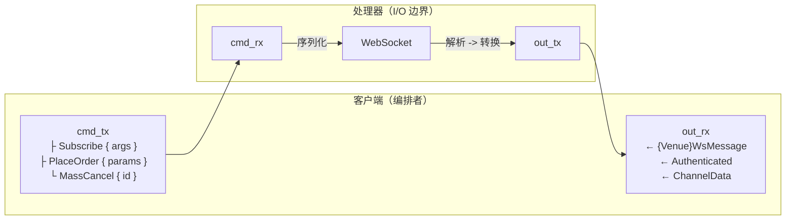

# 适配器

## 简介

本开发者指南提供了为 NautilusTrader 平台构建 v2 集成适配器的规范。适配器负责连接交易场所和
数据提供方，将它们的原生 API 转换为该平台统一的接口和规范化的领域模型。

适配器是 Rust 原生的。它们用 Rust 实现平台的数据和执行客户端 trait，然后通过 PyO3 将配置、
工厂和部分选定的底层 API 暴露给 Python。

请根据你所需的边界参考成熟的适配器：

| 适配器 | 参考模式                                                                           |
|---------|-----------------------------------------------------------------------------------------------|
| Bybit   | 多产品 JSON REST/WebSocket 适配器，同一个客户端类型在各产品间复用。          |
| OKX     | 多个公共/私有/业务 WebSocket 连接，产品覆盖范围广。          |
| Binance | 特定产品的客户端，市场数据/交易协议分离，包括 SBE。            |
| Kraken  | Spot/Futures 子模块，各产品拥有专属的 HTTP、WebSocket、数据和执行客户端。 |

没有一种目录结构能适用于所有交易场所。首先从通用的 Rust 客户端和工厂契约开始，
只有当某个交易场所存在真实的边界时，才按产品或协议进行拆分。

## 适配器的结构

NautilusTrader v2 适配器遵循分层架构：

- **Rust 适配器 crate**：负责网络通信、解析、数据和执行客户端、配置以及工厂。
- **PyO3 绑定**：暴露 Rust 配置、工厂、领域类型以及部分选定的底层客户端。
- **生成的 Python 包**：加载扩展模块并提供类型桩。

### Rust 核心（`crates/adapters/your_adapter/`）

Rust 层负责：

- **HTTP 客户端**：原始 API 通信、请求签名、限流。
- **WebSocket 客户端**：低延迟流式连接、消息解析。
- **解析**：将交易场所数据快速转换为 Nautilus 领域模型。
- **Python 绑定**：PyO3 导出，使 Rust 功能可供 Python 使用。

典型的 Rust 结构：

```
crates/adapters/your_adapter/
├── src/
│   ├── common/              # 共享类型和工具
│   │   ├── consts.rs        # 交易场所常量 / 经纪商 ID
│   │   ├── credential.rs    # API key 存储和签名辅助工具
│   │   ├── enums.rs         # REST/WS 负载中镜像的交易场所枚举
│   │   ├── error.rs         # 适配器级别的错误聚合（适用时）
│   │   ├── models.rs        # 共享模型类型
│   │   ├── parse.rs         # 共享解析辅助工具
│   │   ├── retry.rs         # 重试分类（适用时）
│   │   ├── urls.rs          # 感知环境和产品的基础 URL 解析器
│   │   └── testing.rs       # 单元测试中复用的固定装置
│   ├── http/                # HTTP 客户端实现
│   │   ├── client.rs        # 带身份验证的 HTTP 客户端
│   │   ├── error.rs         # HTTP 专属的错误类型
│   │   ├── models.rs        # REST 负载的结构体
│   │   ├── parse.rs         # 响应解析函数
│   │   └── query.rs         # 请求和查询构建器
│   ├── websocket/           # WebSocket 实现
│   │   ├── client.rs        # WebSocket 客户端
│   │   ├── dispatch.rs      # 执行事件分发和订单路由
│   │   ├── enums.rs         # WebSocket 专属的枚举
│   │   ├── error.rs         # WebSocket 专属的错误类型
│   │   ├── handler.rs       # 数据处理器（I/O 边界）
│   │   ├── messages.rs      # 帧和消息枚举
│   │   ├── parse.rs         # 消息解析函数
│   │   └── subscription.rs  # 订阅主题辅助工具（可选）
│   ├── python/              # PyO3 Python 绑定
│   │   ├── enums.rs         # 暴露给 Python 的枚举
│   │   ├── http.rs          # Python HTTP 客户端绑定
│   │   ├── urls.rs          # Python URL 辅助工具
│   │   ├── websocket.rs     # Python WebSocket 客户端绑定
│   │   └── mod.rs           # 模块导出
│   ├── config.rs            # 配置结构体
│   ├── data.rs               # 数据客户端实现
│   ├── execution.rs         # 执行客户端实现
│   ├── factories.rs         # 工厂函数
│   └── lib.rs               # 库入口点
├── tests/                   # 使用模拟服务器的集成测试
│   ├── data_client.rs       # 数据客户端集成测试
│   ├── exec_client.rs       # 执行客户端集成测试
│   ├── http.rs               # HTTP 客户端集成测试
│   └── websocket.rs         # WebSocket 客户端集成测试
└── test_data/               # 规范的交易场所负载数据
```

### Python 包（`python/nautilus_trader/adapters/your_adapter`）

v2 Python 包是对 Rust 模块的轻量投影。运行时的 `__init__.py` 从扩展模块中加载符号，而
`__init__.pyi` 是从 `pyo3_stub_gen` 注解生成的：

```
python/nautilus_trader/adapters/your_adapter/
├── __init__.py   # 扩展模块加载器
└── __init__.pyi  # 生成的类型桩
```

不要手动编辑生成的 `.pyi` 文件。将 PyO3 和桩注解添加到 Rust 源代码中，然后运行
`make py-stubs-v2`。

## 适配器实现顺序

在构建适配器时，请遵循这一由依赖关系驱动的顺序。每个阶段都建立在前一个阶段之上。
在通过 PyO3 暴露 Rust 客户端和工厂契约之前，先将其完成。

### 第 1 阶段：Rust 核心基础设施

构建底层的网络通信和解析基础。

| 步骤 | 组件                  | 描述                                                                                  |
|------|----------------------------|------------------------------------------------------------------------------------------------------------------------|
| 1.1  | HTTP 错误类型           | 定义带有可重试/不可重试变体的 HTTP 专属错误枚举（`http/error.rs`）。     |
| 1.2  | HTTP 客户端                | 实现凭据、请求签名、限流和重试逻辑。                      |
| 1.3  | HTTP API 模型           | 为 REST 端点定义请求/响应结构体（`http/models.rs`、`http/query.rs`）。      |
| 1.4  | HTTP 解析               | 将交易场所响应转换为 Nautilus 领域模型（`http/parse.rs`、`common/parse.rs`）。      |
| 1.5  | WebSocket 错误类型      | 定义 WebSocket 专属的错误枚举（`websocket/error.rs`）。                                 |
| 1.6  | WebSocket 客户端        | 实现连接生命周期、身份验证、心跳和重连。                 |
| 1.7  | WebSocket 消息         | 定义流式负载类型（`websocket/messages.rs`）。                                    |
| 1.8  | WebSocket 解析          | 将流消息转换为 Nautilus 领域模型（`websocket/parse.rs`）。                    |
| 1.9  | Python 绑定            | 通过 PyO3 暴露所需的 Rust 类型（`python/mod.rs`）。                                       |

**里程碑**：Rust crate 能够编译，单元测试通过，HTTP/WebSocket 客户端能够进行身份验证并
流式接收/请求原始数据。

### 第 2 阶段：金融工具定义

金融工具是基础：数据和执行客户端都依赖于它们。

| 步骤 | 组件                  | 描述                                                                                  |
|------|----------------------------|------------------------------------------------------------------------------------------------------------------------|
| 2.1  | 金融工具解析         | 将交易场所的金融工具定义解析为 Nautilus 类型（现货、永续合约、期货、期权）。    |
| 2.2  | 金融工具加载         | 通过 Rust 客户端加载、过滤、缓存并发出金融工具。                          |
| 2.3  | 交易品种映射             | 处理交易场所特有的交易品种格式和 Nautilus `InstrumentId` 转换。                 |

**里程碑**：数据客户端加载有效的金融工具，在每个解析边界处将其缓存，并通过 `DataClient`
提供金融工具请求服务。

### 第 3 阶段：市场数据

构建数据订阅和历史数据请求。

| 步骤 | 组件                  | 描述                                                                                  |
|------|----------------------------|------------------------------------------------------------------------------------------------------------------------|
| 3.1  | 公共 WebSocket 数据流   | 订阅订单簿、成交、行情以及其他公共频道。                        |
| 3.2  | 历史数据请求   | 通过 HTTP 获取历史 K 线、成交和订单簿快照。                            |
| 3.3  | 数据客户端（Rust）         | 实现 `DataClient`，向数据引擎发出 `DataEvent` 值。                      |

**里程碑**：数据客户端连接、订阅金融工具，并向平台发出市场数据。

### 第 4 阶段：订单执行

构建订单管理和账户状态。

| 步骤 | 组件                  | 描述                                                                                  |
|------|----------------------------|------------------------------------------------------------------------------------------------------------------------|
| 4.1  | 私有 WebSocket 数据流  | 订阅订单更新、成交、持仓和账户余额变化。                   |
| 4.2  | 基础订单提交       | 通过 HTTP 或 WebSocket 实现市价单和限价单。                                     |
| 4.3  | 订单修改/取消  | 实现订单修改和取消。                                                  |
| 4.4  | 执行客户端（Rust）    | 使用 `ExecutionClientCore` 和 `ExecutionEventEmitter` 实现 `ExecutionClient`。         |
| 4.5  | 执行对账   | 为启动时的对账生成订单、成交和持仓状态报告。                |

**里程碑**：执行客户端能够提交订单、接收成交，并在连接时对状态进行对账。

### 第 5 阶段：高级特性

根据交易场所能力扩展覆盖范围。

| 步骤 | 组件                  | 描述                                                                                  |
|------|----------------------------|------------------------------------------------------------------------------------------------------------------------|
| 5.1  | 高级订单类型       | 条件单、止损单、止盈单、追踪止损单、冰山单等。                    |
| 5.2  | 批量操作           | 批量下单、批量取消、全部取消。                                     |
| 5.3  | 交易场所特有功能    | 期权链、资金费率、强平，或其他交易场所特有的数据。                   |

### 第 6 阶段：配置和工厂

将所有部分连接起来以供生产环境使用。

| 步骤 | 组件                  | 描述                                                                                  |
|------|----------------------------|------------------------------------------------------------------------------------------------------------------------|
| 6.1  | 配置结构体      | 使用 `bon::Builder`、`Default`、serde 和 `ClientConfig` 定义 Rust 配置。                |
| 6.2  | 客户端工厂           | 实现 `DataClientFactory` 和 `ExecutionClientFactory`。                                  |
| 6.3  | Python 注册        | 向 PyO3 注册表注册配置和工厂，并生成桩。                    |
| 6.4  | 环境变量      | 支持从环境变量解析凭据。                                    |

### 第 7 阶段：测试和文档

验证该集成并记录使用方式。

| 步骤 | 组件                  | 描述                                                                                  |
|------|----------------------------|------------------------------------------------------------------------------------------------------------------------|
| 7.1  | Rust 单元测试            | 在 `#[cfg(test)]` 代码块中测试解析器、签名辅助工具和业务逻辑。                  |
| 7.2  | Rust 集成测试     | 在 `tests/` 中针对模拟 Axum 服务器测试 HTTP/WebSocket 客户端。                           |
| 7.3  | Python 边界测试      | 在 `python/tests/unit/adapters/<adapter>/` 下测试 v2 工厂/配置提取。             |
| 7.4  | 验收测试             | 运行每一个适用的 `DataTester` 和 `ExecTester` 规范用例。                                |
| 7.5  | 示例脚本            | 添加 Rust 节点测试工具和 Python v2 `LiveNode` 测试工具脚本。                               |
| 7.6  | 集成指南          | 记录能力、配置、交易场所行为和规范例外情况。                   |

详细的测试组织指南请参见 [测试](#testing) 一节。

---

## Rust 适配器模式

### 通用代码（`common/`）

将交易场所常量、凭据辅助工具、枚举和可复用解析器归入 `src/common` 中。像 OKX 这样的适配器
将 `consts`、`credential`、`enums` 和 `urls` 等子模块与一个用于固定装置的 `testing`
模块放在一起，为跨领域的部分提供一个集中的位置。当某个适配器有多个环境或产品类别时，
添加一个专属的 `common::urls` 辅助工具，使 REST/WebSocket 基础 URL 与 Python 层保持同步。

### 交易品种规范化（`common/symbol.rs`）

当某个交易场所使用与 Nautilus `InstrumentId` 不同的交易品种格式时，将双向转换辅助函数
放在 `common/symbol.rs` 中。标准接口由两个函数组成：

- `format_instrument_id(venue_symbol, product_type)` 将交易场所交易品种字符串转换为
  Nautilus `InstrumentId`，按需追加或转换产品类型后缀
  （例如，`"BTCUSDT"` + `Linear` 变为 `"BTCUSDT-LINEAR.BYBIT"`）。
- `format_venue_symbol(instrument_id)` 剥离 Nautilus 后缀，还原出用于 API 调用的
  交易场所原生交易品种。

各适配器间的常见模式：

- **基于后缀的产品类型**：Bybit 追加 `-SPOT`、`-LINEAR`、`-INVERSE`、`-OPTION`。
  `BybitSymbol` 包装类型在构造时验证后缀并规范化为大写。
- **隐式产品映射**：Binance USD-M 期货在 Nautilus 层追加 `-PERP`，而 COIN-M
  保留交易场所现有的 `_PERP` 后缀。
- **大小写规范化**：当交易场所不区分大小写时，在输入时转换为大写。
- **`Ustr` 驻留**：将规范化后的交易品种存储为 `Ustr`，实现零成本比较。

对于原始交易品种 1:1 映射到 `InstrumentId`（无需后缀处理）的交易场所，`common/parse.rs`
中的内联辅助函数就足够了，不需要专门的 `symbol.rs`。

### URL 解析

在 `common/urls.rs` 中定义 URL 常量和解析函数：

```rust
const VENUE_WS_URL: &str = "wss://stream.venue.com/ws";
const VENUE_TESTNET_WS_URL: &str = "wss://testnet-stream.venue.com/ws";

pub const fn get_ws_base_url(testnet: bool) -> &'static str {
    if testnet { VENUE_TESTNET_WS_URL } else { VENUE_WS_URL }
}
```

配置结构体应提供覆盖字段（`base_url_http`、`base_url_ws` 等），在未设置时回退到这些默认值。

### 配置（`config.rs`）

在 `src/config.rs` 中暴露类型化的配置结构体，使 Python 调用方能够切换交易场所特有的行为
（参见 OKX 如何接入 demo URL、重试和频道标志）。保持默认值最小化，将 URL 选择逻辑委托给
`common::urls` 中的辅助工具。关于面向用户的设计原理，参见
[配置](../concepts/configuration.md) 概念指南。

#### Builder 与 Default

配置结构体派生 `bon::Builder` 并实现 `Default`。构建器通过 `#[builder(default = value)]`
注解拥有所有的默认值。`Default` 实现委托给构建器，从而使默认值只在一个地方定义：

```rust
#[derive(Clone, Debug, bon::Builder)]
pub struct VenueDataClientConfig {
    pub api_key: Option<String>,
    #[builder(default = 60)]
    pub http_timeout_secs: u64,
    #[builder(default = 3)]
    pub max_retries: u32,
}

impl Default for VenueDataClientConfig {
    fn default() -> Self {
        Self::builder().build()
    }
}
```

这可以防止构建器默认值与 `Default` 输出之间发生漂移。绝不要在 `Default` 实现体中
重复默认值。

bon 总是将 `Option<T>` 字段默认设为 `None`。对于极少数需要将 `Option<T>` 字段默认为
`Some(value)` 的情况，在 `Default` 实现中覆盖它，并将其余的都委托给构建器：

```rust
impl Default for VenueDataClientConfig {
    fn default() -> Self {
        Self {
            poll_interval_secs: Some(60),
            ..Self::builder().build()
        }
    }
}
```

#### 字段类型规则

当某个字段始终有一个合理的默认值，且下游代码直接使用该值时，使用带有
`#[builder(default = value)]` 的普通 `T`：

```rust
#[builder(default = 60)]
pub http_timeout_secs: u64,
```

当 `None` 承载着独特的含义时（例如"特性已禁用"、"无边界"或"从环境继承"），
使用 `Option<T>`（不带构建器注解）：

```rust
/// Interval in seconds between open order checks.
/// When `None`, open order polling is disabled.
pub open_check_interval_secs: Option<f64>,
```

根据配置本身的语义来选择类型，而不是根据下游函数签名来选择。如果在配置层面
`None` 意味着"该特性已关闭"，使用 `Option<T>`。如果该字段总是解析为一个具体的值，
即使下游构造函数仍然接受 `Option<T>`、调用处需要用 `Some(config.field)` 包装，
也应使用普通的 `T`。

#### Python 构造函数

在 `py_new` 中，对于 Python 调用方可能省略以选用 Rust 默认值的字段，接受 `Option<T>`。
将必须显式指定的构造上下文（例如交易者 ID、账户 ID，或某个在构造时需要凭据的交易场所）
保留为普通的 `T`。Binance 和 OKX 的执行配置要求提供 `TraderId` 和 `AccountId`；
Kraken 同样要求执行凭据，而 Bybit 则将账户 ID 保留在其工厂/配置边界中。

对于映射到普通 Rust 字段的可选 Python 参数，将其与默认值进行解包：

```rust
fn py_new(http_timeout_secs: Option<u64>) -> Self {
    let defaults = Self::default();
    Self {
        http_timeout_secs: http_timeout_secs.unwrap_or(defaults.http_timeout_secs),
        ..
    }
}
```

对于 Rust 的 `Option<T>` 字段，使用 `.or()` 回退到默认的可选值。当默认值为 `None` 时，
这会保留调用方传入的 `None`。当默认值为 `Some(value)` 时，如果调用方传入了 `None`，
这会填入默认值：

```rust
open_check_interval_secs: open_check_interval_secs.or(defaults.open_check_interval_secs),
```

#### 默认值

使用合理的生产环境默认值：凭据默认为 `None`（在运行时从环境变量解析）、主网 URL、
标准超时。对于 `trader_id` 和 `account_id`，使用占位符值，例如
`TraderId::from("TRADER-001")` 和 `AccountId::from("VENUE-001")`。

`..Default::default()` 模式使示例和测试专注于与默认值不同的字段：

```rust
let config = VenueExecClientConfig {
    trader_id,
    account_id,
    environment: VenueEnvironment::Testnet,
    ..Default::default()
};
```

### 错误分类（`common/error.rs`）

对于拥有多种客户端类型的适配器，在 `common/error.rs` 中定义一个聚合各组件错误的
适配器级别错误枚举：

```rust
#[derive(Debug, thiserror::Error)]
pub enum VenueError {
    #[error("HTTP error: {0}")]
    Http(#[from] VenueHttpError),

    #[error("WebSocket error: {0}")]
    WebSocket(#[from] VenueWsError),

    #[error("Build error: {0}")]
    Build(#[from] VenueBuildError),
}
```

这使得在适配器边界处能够进行统一的错误处理，同时保留组件特有的错误细节以便调试。

### 重试分类（`common/retry.rs`）

当某个适配器需要精细的重试逻辑时，在 `common/retry.rs` 中定义一个重试分类模块，
用于区分可重试、不可重试和致命错误：

```rust
#[derive(Debug, thiserror::Error)]
pub enum VenueError {
    #[error("Retryable error: {source}")]
    Retryable {
        #[source]
        source: VenueRetryableError,
        retry_after: Option<Duration>,
    },

    #[error("Non-retryable error: {source}")]
    NonRetryable {
        #[source]
        source: VenueNonRetryableError,
    },

    #[error("Fatal error: {source}")]
    Fatal {
        #[source]
        source: VenueFatalError,
    },
}
```

包含诸如 `from_http_status()`、`from_rate_limit_headers()`、`is_retryable()`、
`is_fatal()` 和 `retry_after()` 之类的辅助方法，使整个适配器的错误分类保持一致。
参见 BitMEX 适配器获取参考实现。

### Python 导出（`python/mod.rs`）

通过重新导出客户端、枚举和辅助函数，用 PyO3 模块镜像 Rust 的接口面。当新功能在 Rust
中落地时，将其添加到 `python/mod.rs` 中，使 Python 层保持同步（OKX 适配器是一个很好的
参考）。

### Python 绑定（`python/`）

通过 PyO3 将 Rust 功能暴露给 Python。为需要 Python 访问的交易场所特有结构体标记
`#[pyclass]`，并使用带有 `#[getter]` 属性的 `#[pymethods]` 代码块来实现字段访问。

对于 HTTP 客户端中的异步方法，使用 `pyo3_async_runtimes::tokio::future_into_py`
将 Rust future 转换为 Python 可等待对象。在返回自定义类型的列表时，在构造 Python
列表之前，用 `Py::new(py, item)` 映射每一项。在 `python/mod.rs` 中使用
`m.add_class::<YourType>()` 注册所有导出的类和枚举，使其对 Python 代码可用。

遵循其他适配器所建立的模式：在 Rust 中为面向 Python 的方法加上 `py_*` 前缀，
同时使用 `#[pyo3(name = "method_name")]` 在不带前缀的情况下暴露它们。

在将金融工具从 WebSocket 传递给 Python 时，使用返回 PyO3 类型以供缓存的
`instrument_any_to_pyobject()`。对于反方向（Python -> Rust），在 `cache_instrument()`
方法中使用 `pyobject_to_instrument_any()`。绝不要在 `InstrumentAny` 上直接调用
`.into_py_any()`，因为它没有实现所需的 trait。

### 类型限定

适配器特有的类型（枚举、结构体）和 Nautilus 领域类型不应完全限定。在模块级别导入它们并
使用简短名称（例如使用 `OKXContractType` 而不是
`crate::common::enums::OKXContractType`，使用 `InstrumentId` 而不是
`nautilus_model::identifiers::InstrumentId`）。这能保持代码简洁易读。
只对来自 `anyhow` 和 `tokio` 的类型进行完全限定，以避免与其他 crate 中同名类型产生歧义。

### 字符串驻留

对平台反复存储的任何非唯一字符串（交易场所、交易品种、金融工具 ID）使用
`ustr::Ustr`，以最小化内存分配和比较开销。

### 共享缓存

根据访问模式选择集合类型：

- 对于读多写少、快照式的场景，使用 `Arc<AtomicMap<K, V>>` 或 `Arc<AtomicSet<K>>`。
  读取加载一个不可变快照。当写入方可能存在竞争时使用 `rcu()`；仅当只有一个写入方时，
  `load()` 后接 `store()` 才是安全的。
- 当独立的键会收到频繁的并发写入或基于条目的更新时，使用 `Arc<DashMap<K, V>>` 或
  `Arc<DashSet<K>>`。
- 对于由单个处理器任务拥有的状态，使用普通的 `AHashMap` 或 `AHashSet`。

Bybit、OKX 和 Kraken 对金融工具缓存使用 `AtomicMap`；Binance 根据产品客户端同时
使用 `AtomicMap` 和 `DashMap`。将共享缓存保持在外层客户端上，使克隆能观察到相同的状态。

在客户端暴露缓存操作时，使用 `cache_instruments()` 进行批量插入，使用
`cache_instrument()` 进行单个 upsert，使用 `get_instrument()` 进行查找。不要仅为了
凑齐一整套方法而添加未使用的访问器。

### 测试辅助工具（`common/testing.rs`）

将 HTTP 和 WebSocket 单元测试中共用的固定装置和负载加载器存储在 `src/common/testing.rs`
中。这能使 `#[cfg(test)]` 辅助工具保持在生产模块之外，并鼓励复用。

### 金融工具状态差异比对（`common/status.rs`）

当数据客户端通过 REST 轮询金融工具状态时，将可复用的差异比对逻辑放在
`common/status.rs` 中，而不是内联在数据客户端里。Bybit 使用的一种感知订阅的形式是：

```rust
pub fn diff_and_emit_statuses(
    new_statuses: &AHashMap<InstrumentId, MarketStatusAction>,
    cached_statuses: &mut AHashMap<InstrumentId, MarketStatusAction>,
    subscriptions: Option<&AHashSet<InstrumentId>>,
    sender: &tokio::sync::mpsc::UnboundedSender<DataEvent>,
    ts_event: UnixNanos,
    ts_init: UnixNanos,
)
```

该函数将 `new_statuses` 中的每一项与 `cached_statuses` 进行比较，为任何 `MarketStatusAction`
发生变化的金融工具发出一个 `InstrumentStatus` 事件。存在于缓存中但不存在于新快照中的
金融工具会被视为已移除，并发出 `NotAvailableForTrading`。该缓存始终反映完整的 API 状态。

传入 `Some(&set)` 作为 `subscriptions` 参数，将发出的事件限制在已订阅的金融工具范围内；
或传入 `None` 无条件发出所有变化。将共享缓存存储在
`Arc<AtomicMap<InstrumentId, MarketStatusAction>>` 中。每次轮询时，克隆已加载的快照，
调用差异比对函数，然后存储更新后的映射。如果可能有多个任务对其进行更新，请改用 `rcu()`。

### 客户端 trait 和工厂（`data.rs`、`execution.rs`、`factories.rs`）

Rust 客户端是平台集成层：

- 实现 `DataClient` 处理订阅和请求。其同步命令方法应验证或捕获输入，在需要时派生
  异步工作，并在不阻塞运行时的情况下返回。
- 实现 `ExecutionClient` 处理订单命令、报告、账户状态和对账。围绕 `ExecutionClientCore`
  和 `ExecutionEventEmitter` 构建它。
- 为每个配置实现 `ClientConfig`，并在 `DataClientFactory::create()` 或
  `ExecutionClientFactory::create()` 内部对其进行向下转型。
- 将特定产品客户端、`AccountType` 和 `OmsType` 的工厂选择逻辑保持在同一个地方。

工厂返回 `Box<dyn DataClient>` 或 `Box<dyn ExecutionClient>`。执行工厂接收一个只读的
`CacheView`；将该视图传递给 `ExecutionClientCore`，而不是从适配器中修改平台缓存。

PyO3 模块通过 `get_global_pyo3_registry()` 注册工厂和配置提取器，使
`LiveNode.builder().add_data_client(...)` 和 `.add_exec_client(...)` 能够将 Python
对象传递给 Rust 工厂 trait。也要在适配器的 `#[pymodule]` 中注册公共的配置和工厂类。

当 HTTP、WebSocket 和历史数据路径共享相同的转换逻辑时，复杂的适配器也可以将
交易场所到领域的构造逻辑集中到 `factories.rs` 中。将简单的转换保留在
`common/parse.rs` 或传输特定的 `parse.rs` 模块中。

### 连接生命周期（`connect`）

数据客户端和执行客户端在 `connect()` 期间都遵循严格的初始化顺序，以防止与对账和
策略启动产生竞态。平台会等待所有客户端发出已连接信号，然后才运行对账或启动策略，
因此所有初始化都必须在 `connect()` 内完成。

#### 数据事件发出

数据客户端通过在构造时获取的无边界通道向平台发出事件：

```rust
let data_sender = get_data_event_sender();
```

`DataEvent` 枚举承载了该客户端产生的所有数据类型：

| 变体                       | 用途                                                 |
|-------------------------------|-------------------------------------------------------|
| `DataEvent::Instrument`       | 引导过程和更新期间的金融工具定义。  |
| `DataEvent::InstrumentStatus` | 来自轮询或 WS 数据流的市场状态变化。     |
| `DataEvent::Data`             | 市场数据（成交、报价、订单簿深度变化、K 线）。      |
| `DataEvent::Response`         | 对历史数据请求的响应。                |
| `DataEvent::FundingRate`      | 衍生品的资金费率更新。                 |
| `DataEvent::OptionGreeks`     | 交易场所提供的期权希腊值。                         |

使用 `self.data_sender.send(DataEvent::Instrument(instrument))` 发送事件。发送失败时
记录警告，但不要传播该错误，因为接收方已关闭意味着系统正在关闭。对于从异步工作中
发出数据的派生任务，克隆该发送方。

#### 数据客户端

1. **通过 REST 获取金融工具** - 调用 `bootstrap_instruments()` 或等效方法。
2. **本地缓存** - 填充客户端的内部金融工具映射和 HTTP 客户端缓存。
3. **发送给数据引擎** - 通过 `data_sender` 将每个金融工具作为 `DataEvent::Instrument`
   发送。这些事件会在启动期间排队，并在对账运行之前处理。
4. **缓存到 WebSocket** - 调用 `ws.cache_instruments()`，使处理器能够解析消息。
5. **连接 WebSocket** - 建立流式连接。

```rust
async fn connect(&mut self) -> anyhow::Result<()> {
    let instruments = self.bootstrap_instruments().await?;
    ws.cache_instruments(instruments);
    ws.connect().await?;
    ws.wait_until_active(10.0).await?;
    // ...
}
```

#### 订单簿事件标志

当解析器发出 `OrderBookDelta` 值时，设置定义每个逻辑事件边界的标志。参见
[深度变化标志与事件边界](../concepts/data/index.md#delta-flags-and-event-boundaries)。

- 在每一组逻辑事件的最后一条深度变化数据上设置 `F_LAST`。数据引擎使用它将缓冲的
  深度变化数据刷新给订阅方。
- 在快照序列的每一条深度变化数据上设置 `F_SNAPSHOT`，包括 `Clear` 动作。
- 对于空快照的 `Clear` 深度变化数据，同时设置 `F_SNAPSHOT` 和 `F_LAST`。
- 当一条交易场所消息包含多个逻辑更新组时，用 `F_LAST` 结束每一组。

缺少 `F_LAST` 不会引发错误，但被缓冲的订阅方将永远不会收到该事件。

#### 执行客户端

1. **初始化金融工具** - 调用 `ensure_instruments_initialized_async()`，它会检查
   `self.core.instruments_initialized()`，如果金融工具已经被缓存则提前返回。否则它
   会通过 REST 获取金融工具，并将其缓存到 HTTP 客户端、WebSocket 客户端以及任何
   广播客户端中。
2. **连接 WebSocket** - 建立私有流式连接。
3. **订阅频道** - 订单、成交、持仓、钱包/保证金。
4. **启动 WebSocket 数据流处理器** - 开始处理传入的消息。
5. **获取账户状态** - 调用 `refresh_account_state()`，它会通过 REST 请求余额和保证金，
   构建一个 `AccountState`，并通过 `ExecutionEventEmitter` 发出它。
6. **等待账户注册完成** - 调用 `await_account_registered(timeout_secs)`，它会以 10ms
   为间隔轮询 `self.core.cache().account(&account_id)`，直到该账户出现或超时。
   此步骤会阻塞 connect，以便投资组合能够在对账期间处理订单。
7. **发出已连接信号** - 调用 `self.core.set_connected()`。

```rust
async fn connect(&mut self) -> anyhow::Result<()> {
    self.ensure_instruments_initialized_async().await?;

    self.ws_client.connect().await?;
    self.ws_client.wait_until_active(10.0).await?;
    // ... subscribe channels, start stream ...

    self.refresh_account_state().await?;
    self.await_account_registered(30.0).await?;

    self.core.set_connected();
    Ok(())
}
```

#### 账户状态发出

`ExecutionEventEmitter` 提供了两个用于发出账户状态的方法：

- `emit_account_state(balances, margins, reported, ts_event)` 使用内部的
  `OrderEventFactory` 从原始参数构建一个 `AccountState`，然后分发它。当适配器拥有
  需要组合的独立余额和保证金值时，使用这个方法。
- `send_account_state(state)` 分发一个已预先构建好的 `AccountState`。当适配器已经从
  解析 HTTP 或 WebSocket 负载中获得了一个完全构造好的状态时，使用这个方法。

## HTTP 客户端模式

适配器使用两层 HTTP 客户端架构：一个用于底层 API 操作的原始客户端，以及一个用于
高层逻辑的领域客户端。这种拆分也使得针对 Python 绑定的高效克隆成为可能。

### 客户端结构

该架构由两个互补的客户端组成：

1. **原始客户端**（`MyRawHttpClient`）- 与交易场所端点匹配的底层 API 方法。
2. **领域客户端**（`MyHttpClient`）- 使用 Nautilus 领域类型的高层方法。

```rust
use std::sync::Arc;

use nautilus_core::AtomicMap;
use nautilus_network::http::HttpClient;
use ustr::Ustr;

// Raw HTTP client - low-level API methods matching venue endpoints
pub struct MyRawHttpClient {
    base_url: String,
    client: HttpClient,  // Use nautilus_network::http::HttpClient, not reqwest directly
    credential: Option<Credential>,
    retry_manager: RetryManager<MyHttpError>,
    cancellation_token: CancellationToken,
}

// Domain HTTP client - wraps raw client with Arc, provides high-level API
pub struct MyHttpClient {
    pub(crate) inner: Arc<MyRawHttpClient>,
    // Additional domain-specific state (e.g., instrument cache)
    instruments: Arc<AtomicMap<Ustr, InstrumentAny>>,
}
```

**要点**：

- **原始客户端**（`MyRawHttpClient`）包含与交易场所端点命名匹配的底层 HTTP 方法
  （例如 `get_instruments`、`get_balance`、`place_order`）。这些方法接受交易场所特有的
  查询对象，并返回交易场所特有的响应类型。
- **领域客户端**（`MyHttpClient`）将原始客户端包装在 `Arc` 中以实现高效克隆
  （Python 绑定需要这一点）。它提供接受 Nautilus 领域类型（例如 `InstrumentId`、
  `ClientOrderId`）并返回领域对象的高层方法。它也可能缓存金融工具或其他交易场所
  元数据。
- 使用 `nautilus_network::http::HttpClient` 而不是直接使用 `reqwest::Client`，
  以获得限流、重试逻辑和一致的错误处理。
- 只暴露 Python 用户需要的客户端。领域客户端通常是主要接口；只有当底层交易场所
  API 有意被公开时，原始客户端才有用。

### 解析器函数

解析器函数将交易场所特有的数据结构转换为 Nautilus 领域对象。对于跨领域的转换
（金融工具、成交、K 线），将其放在 `common/parse.rs` 中；对于 REST 特有的转换，
放在 `http/parse.rs` 中。每个解析器接受交易场所数据加上上下文（账户 ID、时间戳、
金融工具引用），并返回一个包装在 `Result` 中的 Nautilus 领域类型。

**标准模式：**

- 将价格、数量、资金、费用和其他离散领域值解析为 `Decimal`，然后按该金融工具的精度
  构建领域类型。只对本质上连续的值使用 `f64`。
- 在解析可选字段之前检查空字符串——交易场所经常返回 `""` 而不是省略字段。
- 使用 `match` 语句显式地将交易场所枚举映射到 Nautilus 枚举，而不是实现可能隐藏
  映射错误的自动转换。
- 当构造 Nautilus 类型（数量、价格）需要精度或其他元数据时，接受金融工具引用。
- 使用具描述性的函数名：`parse_position_status_report`、`parse_order_status_report`、
  `parse_trade_tick`。

当解析辅助函数（`parse_price_with_precision`、`parse_timestamp`）被多个解析器复用时，
将其放在与私有函数相同的模块中。

### 时间戳约定

Nautilus 使用 `UnixNanos`（自纪元以来的纳秒数）。大多数交易场所以毫秒为单位提供数据。
在解析器边界处使用 `nautilus_core::datetime::millis_to_nanos` 进行转换；在结构体字段上
记录线上单位。`ts_event` 是转换后的交易场所时间戳；`ts_init` 是
`clock.get_time_ns()`。对于没有交易场所时间戳的记录（金融工具），两者都使用
`clock.get_time_ns()`。

### 方法命名与组织

原始客户端使用交易场所特有的参数和响应类型镜像交易场所端点。领域客户端包装它，
并暴露接受 Nautilus 领域类型的高层方法。

**命名约定：**

- **原始客户端方法**：命名尽可能贴近交易场所端点（例如 `get_instruments`、
  `get_balance`、`place_order`）。这些方法是原始客户端的内部方法，接受交易场所特有的
  类型（构建器、JSON 值）。
- **领域客户端方法**：根据操作语义命名（例如 `request_instruments`、`submit_order`、
  `cancel_order`）。这些是暴露给 Python 的方法，接受 Nautilus 领域对象
  （InstrumentId、ClientOrderId、OrderSide 等）。

**领域方法流程：**

领域方法遵循三步模式：从 Nautilus 类型构建交易场所特有的参数，调用对应的原始客户端
方法，然后解析响应。对于返回领域对象的端点（持仓、订单、成交），从 `common/parse`
中调用解析器函数。对于返回原始交易场所数据的端点（费率、余额），直接从响应信封中提取
结果。以 `request_*` 为前缀的方法表示它们返回领域数据，而 `submit_*`、`cancel_*` 或
`modify_*` 之类的方法执行动作并返回确认。

领域客户端将原始客户端包装在 `Arc` 中，以支持 Python 绑定所需的高效克隆。

### 查询参数构建器

使用带有恰当默认值和符合人体工程学的 Option 处理方式的 `derive_builder` crate：

```rust
use derive_builder::Builder;

#[derive(Clone, Debug, Deserialize, Serialize, Builder)]
#[serde(rename_all = "camelCase")]
#[builder(setter(into, strip_option), default)]
pub struct InstrumentsInfoParams {
    pub category: ProductType,
    #[serde(skip_serializing_if = "Option::is_none")]
    pub symbol: Option<String>,
    #[serde(skip_serializing_if = "Option::is_none")]
    pub limit: Option<u32>,
}

impl Default for InstrumentsInfoParams {
    fn default() -> Self {
        Self {
            category: ProductType::Linear,
            symbol: None,
            limit: None,
        }
    }
}
```

**关键属性：**

- `#[builder(setter(into, strip_option), default)]` - 实现简洁的 API：
  `.symbol("BTCUSDT")` 而不是 `.symbol(Some("BTCUSDT".to_string()))`。
- `#[serde(skip_serializing_if = "Option::is_none")]` - 从查询字符串中省略可选字段。
- 只在完全使用默认值的请求也有效时才实现 `Default`。在构建器中将必需的交易场所
  参数保持为必需项。

### 请求签名与身份验证

将签名逻辑保留在 `common/credential.rs` 下的 `Credential` 结构体中：

- 以字符串所有权形式存储 API key，并将密钥保存在一个会在丢弃时归零的类型中。
  从 `Debug` 输出中隐去密钥、口令和私钥。
- 精确按照线上发送的字节实现该交易场所的签名方案。这可能是 HMAC、Ed25519，
  或其他交易场所特有的方案。
- 将凭据传递给原始 HTTP 客户端；领域客户端通过内部客户端委托签名。

当交易场所使用相同的密钥材料时，跨 HTTP 和 WebSocket 复用凭据存储，
但当它们的负载格式不同时，保留各自协议特有的签名方法。

### 凭据模块结构

将凭据环境变量名称、解析、验证、存储和签名集中在 `common/credential.rs` 中。
配置结构体是 DTO，绝不能解析环境变量。

对于每个环境使用一对密钥的交易场所，使用 `credential_env_vars()` 和搭配
`resolve_env_var_pair` 的 `Credential::resolve()`。如果产品类型、密钥类型或废弃处理
会改变查找方式，暴露一个目的特定的解析器，例如 `resolve_credentials(...)`。
Binance 是特定产品 Ed25519 解析的参考；Bybit、OKX 和 Kraken 展示了更简单的
环境映射模式。

**简单布局：**

```rust
use nautilus_core::env::resolve_env_var_pair;

/// Returns the environment variable names for API credentials.
pub fn credential_env_vars(is_testnet: bool) -> (&'static str, &'static str) {
    if is_testnet {
        ("{VENUE}_TESTNET_API_KEY", "{VENUE}_TESTNET_API_SECRET")
    } else {
        ("{VENUE}_API_KEY", "{VENUE}_API_SECRET")
    }
}

impl Credential {
    /// Resolves credentials from provided values or environment variables.
    pub fn resolve(
        api_key: Option<String>,
        api_secret: Option<String>,
        is_testnet: bool,
    ) -> Option<Self> {
        let (key_var, secret_var) = credential_env_vars(is_testnet);
        let (k, s) = resolve_env_var_pair(api_key, api_secret, key_var, secret_var)?;
        Some(Self::new(k, s))
    }
}
```

### 环境变量约定

当未直接提供 API 凭据时，适配器会从环境变量中加载，避免硬编码密钥。

**命名约定：**

| 环境  | API Key 变量          | API Secret 变量          |
|--------------|---------------------------|------------------------------|
| 主网/生产 | `{VENUE}_API_KEY`         | `{VENUE}_API_SECRET`         |
| 测试网      | `{VENUE}_TESTNET_API_KEY` | `{VENUE}_TESTNET_API_SECRET` |
| 演示         | `{VENUE}_DEMO_API_KEY`    | `{VENUE}_DEMO_API_SECRET`    |

一些交易场所需要额外的凭据：

- OKX：`OKX_API_PASSPHRASE`

**关键原则：**

- 将环境变量名称和查找规则集中在 `common/credential.rs` 中；不要在各客户端中
  重复作为字符串字面量。
- 环境变量解析应发生在核心 Rust 代码中，而不是 Python 绑定中。
- 对可选凭据使用 `get_or_env_var_opt`（缺失时返回 `None`）。
- 对必需凭据使用 `get_or_env_var`（缺失时返回错误）。
- 无效的凭据（例如格式错误的密钥）必须立即失败并返回错误，绝不能静默降级为
  未经身份验证的模式。

### 错误处理与重试逻辑

使用 `nautilus_network` 中的 `RetryManager` 以获得一致的重试行为。

### 限流

通过 `HttpClient` 使用 `LazyLock<Quota>` 静态变量配置限流。

**命名约定：**

- REST 配额：`{VENUE}_REST_QUOTA`（例如 `OKX_REST_QUOTA`、`BYBIT_REST_QUOTA`）
- WebSocket 配额：`{VENUE}_WS_{OPERATION}_QUOTA`（例如 `OKX_WS_CONNECTION_QUOTA`、
  `OKX_WS_ORDER_QUOTA`）
- 限流键：`{VENUE}_RATE_LIMIT_KEY_{OPERATION}`（例如 `OKX_RATE_LIMIT_KEY_SUBSCRIPTION`、
  `OKX_RATE_LIMIT_KEY_ORDER`）

**WebSocket 的标准限流键：**

| 键                             | 操作                       |
|---------------------------------|-----------------------------------|
| `*_RATE_LIMIT_KEY_SUBSCRIPTION` | 订阅、取消订阅、登录。   |
| `*_RATE_LIMIT_KEY_ORDER`        | 下单（常规和算法）。 |
| `*_RATE_LIMIT_KEY_CANCEL`       | 取消订单、全部取消。      |
| `*_RATE_LIMIT_KEY_AMEND`        | 修改/更新订单。             |

**示例：**

```rust
pub static OKX_REST_QUOTA: LazyLock<Quota> =
    LazyLock::new(|| Quota::per_second(NonZeroU32::new(250).unwrap()));

pub static OKX_WS_SUBSCRIPTION_QUOTA: LazyLock<Quota> =
    LazyLock::new(|| Quota::per_hour(NonZeroU32::new(480).unwrap()));

pub const OKX_RATE_LIMIT_KEY_ORDER: &str = "order";
```

在发送 WebSocket 消息时传入限流键，以实施针对每种操作的配额：

```rust
self.send_with_retry(payload, Some(vec![OKX_RATE_LIMIT_KEY_ORDER.to_string()])).await
```

**策略：**

适配器应遵循以下限流原则。

- 将每个配额映射到该交易场所对其计量的范围（按 IP、账户、API key、连接、URL、
  传输层或操作类别）。将共享同一范围的每个客户端（数据、执行、轮询器）都从一个
  以该范围为键的限流器中获取；为一个共享上限使用独立限流器会静默地使有效速率
  翻倍。只为交易场所独立计量的子上限添加不同的键。
- 只有当交易场所对数据流量和执行流量分开计量时，才将它们分桶隔离。这种拆分对
  恢复过程仍然很重要：数据路径的触发（订阅、取消订阅、控制帧）会拒绝一次订阅，
  表现为市场数据缺失，并通过适配器重试或重连来恢复，通常策略并不知情；执行路径的
  触发对策略是可见的，并受下方的结果策略约束。
- 按交易场所实际的计量方式来调节速率，而不仅仅是其宣称的数字。匹配窗口形态、
  突发情况以及任何端点权重：以文档记录的速率运行的令牌桶，在空闲突发之后仍可能
  超出严格的滚动窗口。线路延迟不会创造速率余量，因为恒定的延迟只是移动了到达时间
  而不改变速率，而抖动同样会像分散消息一样使消息聚集在一起。只有在窗口语义或
  共享的外部流量确实需要时才增加余量，而不要作为一个凑整的缓冲区。
- 用一个闭环的门控来限制在途请求数，而不是用限流器。当交易场所对并发未确认消息数
  单独设限（区别于发送速率）时，用一个在每次终止性结果（确认、拒绝、发送失败、
  重连）时释放槽位的计数来控制派发。发送速率限流器无法做到这一点，因为在途数量
  取决于发送速率乘以确认延迟，而限流器永远无法观察到这一点。
- 将执行路径上的限流响应视为未知结果，而不是拒绝。根据
  [订单命令结果策略](#order-command-outcome-policy)，一个被限流的命令仍然可能已经
  到达交易场所，因此只有在该命令是幂等的、或交易场所证明它未被处理时才重试；
  否则应让该订单保持在途状态并进行对账。

## WebSocket 客户端模式

WebSocket 客户端处理实时流式数据。它们管理连接状态、身份验证、订阅和重连逻辑。

### 客户端结构

WebSocket 适配器使用**两层架构**，将 Python 可访问的状态与高性能异步 I/O 分开：

#### 连接状态跟踪

使用 `Arc<ArcSwap<AtomicU8>>` 跟踪连接状态，以在所有克隆之间提供无锁、无竞争的可见性：

```rust
use arc_swap::ArcSwap;

pub struct MyWebSocketClient {
    connection_mode: Arc<ArcSwap<AtomicU8>>,  // Shared connection mode (lock-free)
    signal: Arc<AtomicBool>,                   // Cancellation signal for graceful shutdown
    // ...
}
```

**模式解析：**

- **外层 `Arc`**：在所有克隆之间共享（Python 绑定会在异步操作之前克隆客户端）。
- **`ArcSwap`**：通过 `.store()` 实现原子指针替换，而无需替换外层的 Arc。
- **内层 `Arc<AtomicU8>`**：来自 `WebSocketClient::connection_mode_atomic()` 的实际
  连接状态。

用一个占位符原子值（`ConnectionMode::Closed`）进行初始化，然后在 `connect()` 中调用
`.store(client.connection_mode_atomic())`，原子性地切换到真实客户端的状态。所有克隆
都通过 `is_active()` 中的无锁 `.load()` 调用即时观察到更新。

底层的 `WebSocketClient` 在重连完成时会发送一个 `RECONNECTED` 哨兵消息，触发处理器中的
重新订阅逻辑。

**外层客户端**（`{Venue}WebSocketClient`）：

- 编排连接生命周期、身份验证、订阅。
- 使用根据访问模式选择的集合，维护对 Python 可见的状态。
- 为重连逻辑跟踪订阅状态。
- 存储在重连后解析消息所需的金融工具元数据。
- 通过 `cmd_tx` 通道向处理器发送命令。
- 通过 `out_rx` 通道接收交易场所事件。

**内层处理器**（`{Venue}WsFeedHandler`）：

- 作为无状态 I/O 边界，运行在专用的 Tokio 任务中。
- 独占拥有 `WebSocketClient`（无需 `RwLock`）。
- 处理来自 `cmd_rx` 的命令 -> 序列化为 JSON -> 通过 WebSocket 发送。
- 接收原始 WebSocket 消息 -> 反序列化为 `{Venue}WsFrame` -> 转换为
  `{Venue}WsMessage` -> 通过 `out_tx` 发出。
- 使用 `AHashMap<K, V>`（单线程，无需加锁）拥有挂起的请求状态。
- 使用 `VecDeque<{Venue}WsMessage>` 缓冲单次帧解析产生的多条消息。

一些交易场所为市场数据和订单管理暴露独立的 WebSocket 端点（不同的 URL、身份验证
流程或消息协议）。在这种情况下，拆分为两对客户端+处理器，分别位于
`websocket/data/` 和 `websocket/orders/` 子目录下，各自遵循相同的两层模式。
将它们命名为 `{Venue}MdWebSocketClient` / `{Venue}MdWsFeedHandler` 以及
`{Venue}OrdersWebSocketClient` / `{Venue}OrdersWsFeedHandler`。

**通信模式：**



**关键原则：**

- **热路径上无共享锁**：处理器拥有 `WebSocketClient`，客户端通过无锁的 mpsc 通道
  发送命令。
- **所有发送都使用命令模式**：订阅、订单、取消都通过 `HandlerCommand` 枚举路由。
- **状态使用事件模式**：处理器发出 `{Venue}WsMessage` 事件（包括
  `Authenticated`），客户端根据事件维护状态。
- **挂起状态的所有权**：处理器拥有用于匹配响应的 `AHashMap`（层与层之间没有
  `Arc<DashMap>`）。
- **消息缓冲**：处理器对能产生多条输出消息的帧使用
  `VecDeque<{Venue}WsMessage>`。`next()` 方法会在轮询通道之前先排空该队列。
- **共享客户端状态**：对读多的快照（如金融工具缓存）使用 `AtomicMap`。对独立
  更新的条目（如挂起的请求或订阅）使用 `DashMap`。处理器对由其任务拥有的状态
  使用 `AHashMap`。

#### 处理器初始化握手（`SetClient`）

处理器在构造时并不拥有其 `WebSocketClient`。`WebSocketClient` 不是 `Clone`，
将其移入一个已派生的任务构造函数中会比较别扭；多个适配器通过命令通道使用一种
延迟移交的方式。Lighter 使用这种更严格的顺序：

1. 外层客户端调用 `WebSocketClient::connect(...)` 并获得已连接的客户端。
2. 外层客户端创建本地的 `cmd_tx`/`cmd_rx` 和 `out_tx`/`out_rx` 通道。在 `client`
   被移动之前，连接模式原子值被捕获到一个本地变量中。
3. 外层客户端首先在本地的 `cmd_tx` 上发送 `HandlerCommand::SetClient(client)`，
   随后是任何缓存重放命令（例如 `InitializeInstruments`）。
4. 只有在 `SetClient` 已入队之后，外层客户端才发布新的命令通道（交换
   `self.cmd_tx`）并存储捕获到的连接模式（将 `is_active()` 转换为 true）。
   以相反的顺序进行会产生竞态：一个观察到 `is_active()` 的克隆可能在 SetClient
   落地之前，就在已发布的 `cmd_tx` 上加入一个 Subscribe，而处理器会因为
   `inner == None` 而丢弃它。
5. 外层客户端用 `cmd_rx` 派生处理器任务。处理器的构造函数接受初始化为 `None` 的
   `inner: Option<WebSocketClient>`；它处理的第一个命令是 `SetClient`，
   这会将客户端移入 `self.inner`。
6. 第 4 步之后由克隆排入队列的任何订阅/订单命令，会在 `cmd_rx` 中排在
   `SetClient` 和 `InitializeInstruments` 之后，因此会按队列顺序到达一个
   已完全接线的处理器。

```rust
pub enum HandlerCommand {
    SetClient(WebSocketClient),
    Disconnect,
    Subscribe { /* ... */ },
    // ... other commands
}

pub(super) struct {Venue}WsFeedHandler {
    inner: Option<WebSocketClient>,  // None until SetClient
    cmd_rx: tokio::sync::mpsc::UnboundedReceiver<HandlerCommand>,
    // ...
}

// In the cmd_rx match arm:
HandlerCommand::SetClient(client) => {
    self.inner = Some(client);
}
```

BitMEX、OKX、Bybit、Hyperliquid 和 Lighter 都使用 `SetClient` 将已连接的
`WebSocketClient` 移交给处理器。Lighter 会在发布新的 `cmd_tx` 或将连接标记为
活跃之前，先将 `SetClient` 排入队列；较旧的适配器可能会先发布命令通道。

### 身份验证

身份验证状态通过事件进行管理：

- 处理器处理 `Login` 响应 -> 立即**返回** `{Venue}WsMessage::Authenticated`。
- 客户端接收事件 -> 更新本地身份验证状态 -> 继续进行订阅。
- `AuthTracker`（来自 `nautilus_network::websocket::auth`）跨线程跟踪身份验证状态。

来自 `nautilus_network` 的 `AuthTracker` 结构体提供线程安全的身份验证状态：

```rust
pub struct AuthTracker {
    tx: Arc<Mutex<Option<AuthResultSender>>>,
    authenticated: Arc<AtomicBool>,
}
```

`AuthTracker` 内部基于 `Arc`，因此克隆会共享状态。客户端和处理器都存储
`auth_tracker: AuthTracker`，并各自获得同一实例的 `.clone()`。该跟踪器暴露了一个
四方法的生命周期：`begin()` 开始一次尝试并返回一个一次性接收方，`succeed()`
设置已验证标志并通知接收方，`fail(message)` 带着一个错误清除该标志，
`invalidate()` 在断开连接时清除该标志。下游消费方通过内部的 `AtomicBool` 查询
`is_authenticated()` 进行无锁读取。

**注意**：`Authenticated` 消息在客户端的派生循环中被消费，用于协调重连流程，
不会转发给下游消费方（数据/执行客户端）。如果需要，下游消费方可以通过
`AuthTracker` 查询身份验证状态。执行客户端的 `Authenticated` 处理器仅在调试级别
记录日志，没有依赖该事件的重要逻辑。

#### 认证令牌轮换（单端点混合信任适配器）

一些交易场所通过单个 WebSocket 端点同时运行公共市场数据和经身份验证的账户频道，
由附加在每个订阅请求上的短期存活的持有者令牌（bearer token）进行门控。
Lighter 是典型示例：该令牌是对 `(deadline, account_index, api_key_index)` 的
Schnorr 签名，交易场所强制规定了 8 小时的硬性上限
（`LIGHTER_AUTH_TOKEN_MAX_TTL`）。`build_auth_token_for(...)` 目前发出的是
7 小时的令牌，执行客户端每 6 小时刷新一次账户频道订阅。

这与逐消息签名模式（Hyperliquid）以及会话登录模式（BitMEX、Bybit）形成对比；
后两者都不需要在会话内进行令牌轮换。

**令牌生命周期**

外层客户端拥有该调度；处理器拥有线路发送。流程如下：

1. **在账户订阅之前铸造令牌**：在 WebSocket 到达活跃状态之后，执行客户端调用
   `build_auth_token_for(...)`，然后将该令牌用于初始的账户频道订阅。
2. **在订阅时分发**：`subscribe_account(...)` 将该令牌附加到
   `HandlerCommand::Subscribe`。WebSocket 客户端将确切的 `(channel, auth)`
   键值对存储在 `subscription_args` 中，用于重连重放。
3. **调度刷新**：在执行 WebSocket 消费方启动之后，执行客户端在 `get_runtime()`
   上派生一个刷新任务。该任务等待 `AUTH_TOKEN_REFRESH_INTERVAL`（6 小时）或
   一个重连通知，铸造一个新令牌，并为每一个账户频道重新发出
   `subscribe_account(...)`。
4. **断开连接时停止**：刷新任务观察执行客户端的取消令牌，并在客户端停止或
   断开连接时退出。

**调度所在的位置**

将轮换定时器放在外层客户端中，而不是处理器中。执行客户端拥有凭据并决定何时铸造；
处理器仍然是一个只发送提供的令牌、自己不签名的 I/O 边界。

```rust
fn spawn_auth_token_refresh(&self, credential: Credential) {
    let ws_client = self.ws_client.clone();
    let cancellation_token = self.cancellation_token.clone();
    let account_index = credential.account_index();
    let refresh_notify = Arc::clone(&self.auth_refresh_notify);
    let channels = [
        LighterWsChannel::AccountAllOrders(account_index),
        LighterWsChannel::AccountAllTrades(account_index),
        LighterWsChannel::AccountAllPositions(account_index),
        LighterWsChannel::AccountAllAssets(account_index),
    ];

    get_runtime().spawn(async move {
        loop {
            tokio::select! {
                () = cancellation_token.cancelled() => break,
                () = refresh_notify.notified() => {},
                () = tokio::time::sleep(AUTH_TOKEN_REFRESH_INTERVAL) => {},
            }

            if let Ok(token) = build_auth_token_for(&credential) {
                for channel in channels.clone() {
                    let _ = ws_client
                        .subscribe_account(channel, token.clone())
                        .await;
                }
            }
        }
    });
}
```

**与重连的交互**

在 `Reconnected` 时，Lighter WebSocket 客户端会通过 `HandlerCommand::Subscribe`
重放已跟踪的 `subscription_args`，然后转发重连事件。执行客户端会通知刷新任务，
刷新任务会立即铸造一个新令牌并重新订阅每一个账户频道。新的订阅会替换存储的
重放令牌。

**故障处理**

订阅发送失败会调用 `mark_failure(topic)`，使重连重放保持该主题为待处理状态。
Lighter 目前尚未针对会话中的交易场所拒绝实现立即的认证令牌刷新路径。

### 订阅管理

#### 共享的 `SubscriptionState` 模式

来自 `nautilus_network::websocket` 的 `SubscriptionState` 结构体在客户端和处理器之间
共享，内部使用 `Arc<DashMap<>>` 实现线程安全访问：

- **`SubscriptionState` 通过 `Arc` 共享**：客户端和处理器都获得同一实例的
  `.clone()`（Arc 指针的浅克隆）。
- **职责拆分**：客户端跟踪用户意图（`mark_subscribe`、`mark_unsubscribe`），
  处理器跟踪服务器确认（`confirm_subscribe`、`confirm_unsubscribe`、
  `mark_failure`）。
- **为什么两者都需要它**：单一事实来源，具备无锁的并发访问，没有同步开销。

#### 订阅生命周期

**订阅（subscription）**代表处于以下两种状态之一的任何主题：

| 状态         | 描述 |
|---------------|-------------|
| **待处理（Pending）**   | 订阅请求已发送给交易场所，等待确认。 |
| **已确认（Confirmed）** | 交易场所已确认订阅，正在积极流式传输数据。 |

状态转换遵循以下生命周期：

| 触发条件           | 调用的方法        | 起始状态 | 目标状态  | 备注 |
|-------------------|----------------------|------------|-----------|-------|
| 用户订阅   | `mark_subscribe()`   |            | 待处理   | 主题被添加到待处理集合中。 |
| 交易场所确认    | `confirm()`          | 待处理    | 已确认 | 从待处理移动到已确认。 |
| 交易场所拒绝    | `mark_failure()`     | 待处理    | 待处理   | 保持待处理状态，等待重连时重试。 |
| 用户取消订阅 | `mark_unsubscribe()` | 已确认  | 待处理   | 在收到确认前临时处于待处理状态。 |
| 取消订阅确认   | `clear_pending()`    | 待处理    | 已移除   | 主题被彻底移除。 |

**关键原则**：

- `subscription_count()` 只报告**已确认的订阅**，不包括待处理的订阅。
- 失败的订阅会保持待处理状态，并在重连时自动重试。
- 已确认和待处理的订阅在重连后都会被恢复。
- 取消订阅操作必须检查确认消息中的 `op` 字段，以避免重新确认某个主题。

#### 确认时机

处理器负责将主题从待处理转换为已确认。根据线上格式所提供的内容，
针对不同交易场所建立了两种模式：

**显式确认（当交易场所支持时优先使用）**：由 BitMEX、OKX、Bybit 和 Lighter 使用。
交易场所发送一个专门的订阅/取消订阅确认帧（通常是
`{ "event": "subscribe", "arg": ..., "code": ... }` 或类似形式）。处理器匹配该帧，
从其 `arg`/`req_id` 字段推导出主题，并进行分发：

- 成功 -> `confirm_subscribe(topic)` / `confirm_unsubscribe(topic)`。
- 失败 -> `mark_failure(topic)`（保持待处理状态；重连时重试）。
- 取消订阅失败应被视为仍处于订阅状态，并重新确认。

将确认处理保持在从线路帧 match 分支中调用的一个分支或函数中，使该生命周期在
一处可审计。

**首帧隐式确认（回退方案）**：由 Lighter 作为后备方案使用，也被任何省略订阅确认
或使其不可靠的交易场所使用。当该主题的第一条入站数据帧到达时，处理器调用
`confirm_subscribe(topic)`。该主题从帧的 `channel` 字段中恢复。当显式确认被丢弃
或在第一条数据帧之后才到达时，这也起到后备作用。

```rust
// Inside the data-frame match arm:
let topic = frame_topic(&frame);
self.subscriptions.confirm_subscribe(&topic);
// ... then parse and emit
```

这两种模式可以共存：一个有时发送确认、有时不发送的交易场所，可以对确认帧使用
显式处理器，对数据帧使用隐式后备方案；`confirm_subscribe()` 是幂等的。

失败路径必须调用 `mark_failure(topic)`（而不是静默丢弃该订阅）。`mark_failure()`
会使该主题保持待处理状态，以便重连重放能够恢复它。

#### 主题格式模式

适配器使用交易场所特有的分隔符来构造订阅主题：

| 适配器      | 分隔符 | 示例                | 模式                      |
|--------------|-----------|-------------------------|-------------------------------|
| **BitMEX**   | `:`       | `trade:XBTUSD`         | `{channel}:{symbol}`         |
| **OKX**      | `:`       | `trades:BTC-USDT-SWAP` | `{channel}:{symbol}`         |
| **Bybit**    | `.`       | `orderbook.50.BTCUSDT` | `{channel}.{depth}.{symbol}` |
| **Lighter**  | `:` / `/` | `order_book:0`         | `{channel}:{market_index}`   |

使用带有恰当分隔符的 `split_once()` 解析主题，提取频道和交易品种部分。

##### 非对称的入站与出站分隔符

一些交易场所对出站订阅负载和入站帧 `channel` 字段使用不同的分隔符。Lighter 是
典型的例子：出站订阅使用 `order_book/0`（斜杠），入站帧携带
`"channel": "order_book:0"`（冒号）。

已确立的变通方案：

- 为 `SubscriptionState::new(delimiter)` 选择入站分隔符，使处理器可以直接根据
  每个收到的帧的 `channel` 字段来确认订阅。
- 在交易场所的频道/订阅枚举上暴露两个方法：
  - `subscription_channel()` 返回出站格式的负载（用于序列化订阅/取消订阅请求）。
  - `topic_key()` 返回用于对 `SubscriptionState` 和重连重放映射进行键控的规范
    主题键（与入站形式匹配）。

这使得整个处理器过程中保持单一的规范主题标识，同时在发出时仍遵循交易场所的
线上格式。

### 重连逻辑

在重连时，恢复身份验证和订阅：

1. **跟踪订阅**：将原始订阅参数保存在集合（例如 `Arc<DashMap>`）中，避免将主题
   反向解析回参数。

2. **重连流程**：
   - 从处理器接收 `{Venue}WsMessage::Reconnected`。
   - 如果已验证：重新进行身份验证并等待确认。
   - 通过处理器命令恢复所有已跟踪的订阅。
   - 当下游消费方需要重置本地状态时，通过 `out_tx` 将
     `{Venue}WsMessage::Reconnected` 转发给它们。BitMEX、OKX、Bybit 和 Lighter
     会在恢复流程启动后转发该事件；Hyperliquid 目前在重新订阅之后在 WebSocket
     客户端中消费该事件。

对于具有 `Authenticated` 事件的适配器，客户端的派生循环可以为重连协调消费该事件，
而不是转发它。下游消费方在需要身份验证状态时可以查询 `AuthTracker`。

**保留订阅参数：**

将原始订阅参数存储在一个单独的集合中，以便在无需将主题反向解析为参数的情况下
实现确定性的重连重放：

```rust
pub struct MyWebSocketClient {
    subscription_state: Arc<SubscriptionState>,
    subscription_args: Arc<DashMap<String, SubscriptionArgs>>,  // topic -> original args
    // ...
}

impl MyWebSocketClient {
    async fn subscribe(&self, args: SubscriptionArgs) -> Result<(), Error> {
        let topic = args.to_topic();
        self.subscription_state.mark_subscribe(&topic);
        self.subscription_args.insert(topic.clone(), args.clone());
        self.send_cmd(HandlerCommand::Subscribe(args)).await
    }

    async fn unsubscribe(&self, topic: &str) -> Result<(), Error> {
        self.subscription_state.mark_unsubscribe(topic);
        self.subscription_args.remove(topic);
        self.send_cmd(HandlerCommand::Unsubscribe(topic.to_string())).await
    }

    async fn restore_subscriptions(&self) {
        for entry in self.subscription_args.iter() {
            let _ = self.send_cmd(HandlerCommand::Subscribe(entry.value().clone())).await;
        }
    }
}
```

这避免了复杂的主题解析，并确保订阅按照最初的请求原样被重放。

### Ping/Pong 处理

同时支持 WebSocket 控制帧 ping 和应用层文本 ping：

- **控制帧 ping**：由 `WebSocketClient` 通过 `PingHandler` 回调自动处理。
- **文本 ping**：一些交易场所（例如 OKX）使用 `"ping"`/`"pong"` 文本消息。
  在 `WebSocketConfig` 中配置 `heartbeat_msg: Some(TEXT_PING.to_string())`，
  并在处理器中对收到的 `TEXT_PING` 用 `TEXT_PONG` 进行响应。

处理器应在消息处理循环的早期检查 ping 消息，并立即响应以维持连接健康。

### 断开连接生命周期（`close`）

`close()` 方法遵循一个三步关闭序列：发信号、发命令、等待。

```rust
impl MyWebSocketClient {
    pub async fn close(&mut self) -> Result<(), MyWsError> {
        tracing::debug!("Starting close process");

        // 1. Send disconnect command so handler can clean up gracefully
        if let Err(e) = self.cmd_tx.read().await.send(HandlerCommand::Disconnect) {
            tracing::warn!("Failed to send disconnect command to handler: {e}");
        }

        // 2. Set stop signal so handler loop exits after processing disconnect
        self.signal.store(true, Ordering::Release);

        // 3. Await task handle with timeout, abort if stuck
        if let Some(task_handle) = self.task_handle.take() {
            match Arc::try_unwrap(task_handle) {
                Ok(handle) => {
                    let abort_handle = handle.abort_handle();
                    match tokio::time::timeout(Duration::from_secs(2), handle).await {
                        Ok(Ok(())) => tracing::debug!("Handler task completed"),
                        Ok(Err(e)) => tracing::error!("Handler task error: {e:?}"),
                        Err(_) => {
                            tracing::warn!("Timeout waiting for handler task, aborting");
                            abort_handle.abort();
                        }
                    }
                }
                Err(arc_handle) => {
                    tracing::debug!("Cannot unwrap task handle, aborting");
                    arc_handle.abort();
                }
            }
        }

        Ok(())
    }
}
```

**要点：**

- 在设置停止信号之前发送 `Disconnect`，使处理器在退出之前处理它。
- 返回 `Result<(), {Venue}WsError>`，使调用方能够处理失败情况。
- 在信号存储时使用 `Ordering::Release`，使处理器能观察到该写入。
- 在等待之前提取 `abort_handle`，使其在超时后依然可用。
- 当 `Arc::try_unwrap` 失败时（存在其他克隆），直接中止。

### 数据流消费（`stream`）

外层客户端暴露一个 `stream()` 方法，将 `out_rx` 的所有权作为一个异步流交给调用方。
数据和执行客户端调用一次该方法以驱动它们的消息处理循环：

```rust
impl MyWebSocketClient {
    pub fn stream(&mut self) -> impl Stream<Item = MyWsMessage> + 'static {
        let rx = self
            .out_rx
            .take()
            .expect("Stream receiver already taken or not connected");
        let mut rx = Arc::try_unwrap(rx)
            .expect("Cannot take ownership - other references exist");
        async_stream::stream! {
            while let Some(msg) = rx.recv().await {
                yield msg;
            }
        }
    }
}
```

数据/执行客户端在一个带有取消令牌或停止信号的 `tokio::select!` 循环中消费该流，
根据 `{Venue}WsMessage` 变体进行匹配，并调用解析函数来生成 Nautilus 领域类型。

### 订阅主题辅助工具（`subscription.rs`）

当某个交易场所的订阅主题结构复杂（多种参数类型、金融工具类型/族/ID 变体、
K 线宽度编码）时，将主题构建和解析逻辑提取到 `websocket/subscription.rs` 中。
这使 `client.rs` 专注于连接生命周期，`handler.rs` 专注于 I/O。

对于拥有简单 `{channel}:{symbol}` 主题的交易场所，在客户端中使用内联辅助函数就
足够了，不需要单独的模块。

### 处理器配置常量

定义处理器特有的调优常量以确保行为一致：

| 常量                   | 用途                                          | 典型值 |
|----------------------------|--------------------------------------------------|---------------|
| `DEFAULT_HEARTBEAT_SECS`   | 发送保活消息的间隔。        | 15-30         |
| `WEBSOCKET_AUTH_WINDOW_MS` | 身份验证时间戳的最大存活期。       | 5000-30000    |
| `BATCH_PROCESSING_LIMIT`   | 每个事件循环周期处理的最大消息数。 | 100-1000      |

根据范围将这些放在 `websocket/handler.rs` 或 `common/consts.rs` 中。

### 消息路由

处理器使用两个消息枚举，将线路反序列化与发出的事件分开。数据和执行客户端层
将发出的事件转换为 Nautilus 领域类型。

定义两个枚举：

1. **`{Venue}WsFrame`**：Serde 反序列化的线路帧。包含交易场所可能发送的每一种
   JSON 形态（登录响应、订阅确认、频道数据、订单响应、错误、ping）。
   通常是 `pub(super)`，因为只有处理器使用它。

2. **`{Venue}WsMessage`**：在 `out_tx` 上发出的处理器输出事件。包含客户端需要的
   线路数据子集，加上没有线路表示的合成控制变体（`Reconnected`、
   `Authenticated`、`SendFailed`）。这是消费方进行匹配的 `pub` 类型。

处理器将原始文本反序列化为 `{Venue}WsFrame`，在内部处理控制帧（订阅确认、
登录、ping），并将相关帧转换为通过 `out_tx` 发送的 `{Venue}WsMessage` 事件。
客户端从 `out_rx` 接收，并路由到数据/执行回调，这些回调使用解析函数将交易场所
类型转换为 Nautilus 领域类型。

#### 消息类型命名约定

以交易场所名称为前缀的类型（例如 `OKX`、`Bitmex`）包含原始的交易所特有类型。
以 `Nautilus` 为前缀的类型包含准备好供交易系统使用的规范化领域类型。

**线路帧枚举（serde 反序列化，处理器内部使用）：**

```rust
pub(super) enum MyWsFrame {
    Login { event, code, msg, conn_id },
    Subscription { event, arg, conn_id, code, msg },
    OrderResponse { id, op, code, msg, data },
    BookData { arg, action, data: Vec<MyBookMsg> },
    Data { arg, data: Value },
    Error { code, msg },
    Ping,
    Reconnected,
}
```

**处理器输出枚举（发给客户端）：**

```rust
pub enum MyWsMessage {
    BookData { arg, action, data: Vec<MyBookMsg> },
    ChannelData { channel, inst_id, data: Value },
    Orders(Vec<MyOrderMsg>),
    OrderResponse { id, op, code, msg, data },
    SendFailed { request_id, client_order_id, op, error },
    Instruments(Vec<MyInstrument>),
    Error(MyWebSocketError),
    Reconnected,
    Authenticated,
}
```

帧枚举包含用于反序列化的每一种线路形态（登录确认、订阅确认、ping）。输出枚举
去掉了处理器内部消费的形态，并添加了源于处理器逻辑（而非线路上）的合成变体
（`Authenticated`、`SendFailed`）。

包含用于交易场所确认（下单、取消、修改）的 `OrderResponse`，以及用于重试耗尽后
WebSocket 发送失败的 `SendFailed`。当交易场所明确拒绝某个命令时，执行客户端的
分发层可以将 `OrderResponse` 转换为 Nautilus 拒绝事件。它必须将 `SendFailed`
视为未知结果，并使订单状态保持开放以待对账。

**在数据/执行客户端中的转换：**

数据客户端的消息循环根据 `{Venue}WsMessage` 变体进行匹配，并调用解析函数生成
Nautilus 领域类型（`Data`、`OrderBookDeltas` 等）。执行客户端的分发层处理
`OrderResponse`、`SendFailed` 和 `Orders` 变体。`SendFailed` 记录交易场所结果
未知；它不是一个拒绝。这使处理器专注于 I/O 和反序列化，而客户端层拥有领域转换。

执行分发使用一个两层路由契约来转换订单和成交消息：

1. 处理器发出交易场所特有的订单类型（例如 `Orders(Vec<MyOrderMsg>)`）。
2. 客户端分发层跟踪哪些订单是通过该客户端提交的。
3. **已跟踪订单**：将交易场所类型转换为订单事件（`OrderAccepted`、
   `OrderCanceled`、`OrderFilled` 等），并合成任何缺失的生命周期事件
   （例如在一次快速成交之前的 `OrderAccepted`）。
4. **外部/未知订单**：转换为报告（`OrderStatusReport` 或 `FillReport`），
   供下游对账使用。

当交易场所结果未被确认时（某个命令超时、某条流消息与 HTTP 响应产生竞态，
或在修改过程中收到部分状态），将该订单保持在其待处理状态，让实盘执行引擎从
交易场所状态中解析它。不要为了覆盖每一种这样的竞态而添加适配器代码：引擎已经
通过在途检查和未结订单查询拥有"从交易场所解析真相"的能力，其报告会对该订单
进行对账。直接事件承载实时的正常路径，报告承载外部订单和对账，引擎则对这些
竞态进行对账。例如，Betfair 的 `replaceOrders` 超时会使订单保持在
`PendingUpdate`，在途检查会根据交易场所状态解析它，而不需要适配器添加定制的
超时恢复逻辑。

#### `WsDispatchState`

执行分发状态位于 `websocket/dispatch.rs` 中定义的 `WsDispatchState` 结构体中。
它跟踪哪些生命周期事件已经被发出，以防止在重连和快速成交竞态中出现重复：

```rust
#[derive(Debug, Default)]
pub struct WsDispatchState {
    pub order_identities: DashMap<ClientOrderId, OrderIdentity>,
    pub emitted_accepted: DashSet<ClientOrderId>,
    pub triggered_orders: DashSet<ClientOrderId>,
    pub filled_orders: DashSet<ClientOrderId>,
    clearing: AtomicBool,
}
```

| 字段               | 用途                                                         |
|---------------------|-------------------------------------------------------------------|
| `order_identities`  | 将客户端订单 ID 映射到提交时设置的身份元数据。    |
| `emitted_accepted`  | 防止重复的 `OrderAccepted` 事件。                      |
| `triggered_orders`  | 跟踪已触发的条件单。                  |
| `filled_orders`     | 防止在重连重放时出现重复的 `OrderFilled` 事件。    |
| `clearing`          | 在集合达到容量上限时防范并发驱逐操作。            |

每个 `DashSet` 都受 `DEDUP_CAPACITY` 常量（通常为 10,000）限制。当某个集合达到
容量上限时，`evict_if_full()` 会使用对 `clearing` 标志的比较交换（compare-exchange）
操作对其进行原子清除，以防止并发清除。

同一模块中的自由函数 `dispatch_ws_message()` 将 `{Venue}WsMessage` 变体路由到
适当的订单事件构建器，使用 `WsDispatchState` 进行去重，使用 `OrderIdentity`
进行"已跟踪 vs 外部"分类。

#### 跨来源成交去重

`WsDispatchState` 在单一数据流内防止重复的生命周期事件。当适配器从多个来源
（WebSocket 用户数据和 HTTP 对账）接收成交时，需要一个单独的、成交 ID 级别的
去重机制来防止同一笔成交被发出两次。

`BoundedDedup<T>` 模式通过一个固定容量的集合来解决这个问题，该集合由用于插入顺序的
`VecDeque` 和用于 O(1) 查找的 `AHashSet` 支撑。当该集合达到容量上限时，最旧的条目
会被驱逐（FIFO）。`insert()` 方法在该值已存在时返回 `true`，表示存在重复：

```rust
struct BoundedDedup<T> {
    order: VecDeque<T>,
    set: AHashSet<T>,
    capacity: usize,
}
```

在执行客户端中使用它来跟踪成交 ID（通常作为交易品种和成交 ID 组成的
`(Ustr, i64)` 元组）。10,000 的容量为大多数交易场所提供了足够的覆盖范围，
同时不会造成无边界的内存增长。

#### 撤单重下修改与在途成交

一些交易场所（例如 Hyperliquid）将修改实现为撤单重下：交易场所分配一个新的
交易场所订单 ID，并发出 `ACCEPTED(new_voi)` 和 `CANCELED(old_voi)`。分发逻辑将
新的一段提升为 `OrderUpdated`，并抑制过时的取消事件。携带替换后交易场所订单 ID
的成交会驱动同样的提升（仅当订单没有价格时才回退为缓冲），因此一个被丢弃的
`ACCEPTED` 不会使该成交被搁置。旧交易场所订单 ID 上的成交单独计数，因此替换单的
规模是按剩余量（`target - filled`）计算的，而不是总量。

该减法运算是在分发修改时进行的，因此如果一笔成交在请求发送之后才到达，
替换单会被设置得过大，交易场所可能会导致该订单超额成交。为了防止这种情况，
撤单重下的提升过程：

- 重新读取累计已成交数量；
- 在替换单规模过大时，将新交易场所订单排队进行一次修正性减量，
  调整到真实的剩余量；
- 在新的交易场所订单 ID 上重新装载在途标记，以抑制修正操作的取消一环。

该减量操作会在接收循环之外发出。它缩小了但没有完全消除竞态：如果替换单在
减量操作到达之前就已成交，引擎的超额成交防护措施是最后一道防线。

### 错误处理

#### 订单命令结果策略

适配器只能从确定性的命令失败证据中发出以下拒绝事件：

- `OrderRejected`。
- `OrderModifyRejected`。
- `OrderCancelRejected`。

正面的交易场所证据包括结构化的订单响应、每笔订单的批量响应，或明确报告拒绝的
订单状态消息。正面的本地证据包括证明某个取消或修改命令无法发送、并且可以归因于
单个订单命令的准备失败。

本地验证并不自动等同于交易场所拒绝：

- 在 `OrderSubmitted` 之前验证提交命令，验证失败时发出 `OrderDenied`。
- 如果提交验证在 `OrderSubmitted` 之后失败，记录该失败并让订单保持在途。
- 如果取消或修改的准备工作在命令发送之前失败，只有在适配器能够将该失败归因于
  该命令时，才发出 `OrderCancelRejected` 或 `OrderModifyRejected`。否则记录一条
  警告，不要发出拒绝事件。

不要为使交易场所结果保持未知的错误发出拒绝事件。未知结果包括传输错误、
WebSocket 发送失败、请求超时、断开连接、被取消的本地任务、缺失的确认、
HTTP 5xx 响应、限流、重试耗尽、请求可能已到达交易场所之后的解析失败，
以及没有逐订单交易场所结果的整批请求失败。

当结果未知时，将订单保持在其当前的在途状态，让 WebSocket 更新、在途检查、
未结订单轮询、启动时对账，或显式的查询命令来解析最终状态。对于批量命令，
只对明确拒绝该命令的、逐订单的交易场所结果发出拒绝事件；一次整体请求失败
不应变成每个订单一个拒绝事件。

取消和修改错误需要交易场所特定的允许列表。诸如 "not found"、"already closed"
或 "unknown order" 之类的通用交易场所错误，可能意味着该订单在请求被处理之前
就已成交或已取消。只有在交易场所的语义使命令拒绝毫无歧义时，才发出
`OrderCancelRejected` 或 `OrderModifyRejected`。

#### 客户端侧错误传播

通道发送失败（客户端 -> 处理器）应以 `Result<(), Error>` 的形式明确传播：

```rust
impl MyWebSocketClient {
    async fn send_cmd(&self, cmd: HandlerCommand) -> Result<(), Error> {
        self.cmd_tx.read().await.send(cmd)
            .map_err(|e| Error::ClientError(format!("Handler not available: {e}")))
    }

    pub async fn submit_order(...) -> Result<(), Error> {
        let cmd = HandlerCommand::PlaceOrder { ... };
        self.send_cmd(cmd).await  // Propagates channel failures
    }
}
```

#### 处理器侧重试逻辑

WebSocket 发送失败（处理器 -> 网络）应由处理器使用 `RetryManager` 进行重试：

```rust
pub struct MyWsFeedHandler {
    inner: Option<WebSocketClient>,
    retry_manager: RetryManager<MyWsError>,
    // ...
}

impl MyWsFeedHandler {
    async fn send_with_retry(&self, payload: String, rate_limit_keys: Option<Vec<String>>) -> Result<(), MyWsError> {
        if let Some(client) = &self.inner {
            self.retry_manager.execute_with_retry(
                "websocket_send",
                || async {
                    client.send_text(payload.clone(), rate_limit_keys.clone())
                        .await
                        .map_err(|e| MyWsError::ClientError(format!("Send failed: {e}")))
                },
                should_retry_error,
                create_timeout_error,
            ).await
        } else {
            Err(MyWsError::ClientError("No active WebSocket client".to_string()))
        }
    }

    async fn handle_place_order(...) -> anyhow::Result<()> {
        let payload = serde_json::to_string(&request)?;

        match self.send_with_retry(payload, Some(vec![RATE_LIMIT_KEY])).await {
            Ok(()) => Ok(()),
            Err(e) => {
                // Emit SendFailed so dispatch can record an unknown outcome.
                let _ = self.out_tx.send(MyWsMessage::SendFailed {
                    request_id: request_id.clone(),
                    client_order_id: Some(client_order_id),
                    op: Some(MyWsOperation::Order),
                    error: e.to_string(),
                });
                Err(anyhow::anyhow!("Failed to send order: {e}"))
            }
        }
    }
}

fn should_retry_error(error: &MyWsError) -> bool {
    match error {
        MyWsError::NetworkError(_) | MyWsError::Timeout(_) => true,
        MyWsError::AuthenticationError(_) | MyWsError::ParseError(_) => false,
    }
}
```

**关键原则：**

- 客户端会立即传播通道失败（处理器不可用）。
- 处理器重试瞬时的 WebSocket 失败（网络问题、超时）。
- 当重试耗尽时处理器发出 `SendFailed`；执行客户端分发层会记录一个未知结果，
  等待对账或后续的交易场所更新。
- 使用 `nautilus_network::retry` 中的 `RetryManager` 以获得一致的退避策略。

#### 出站 WebSocket 负载日志

`nautilus_network::websocket::WebSocketClient::send_text` 会以 TRACE 级别记录出站
文本负载，以便本地适配器调试。由于适配器发送的内容可能包含身份验证数据，
不要在适配器级别的 DEBUG 或 INFO 日志中重复原始负载。在更高的日志级别，
只记录诸如消息类型、频道和负载长度之类的元数据。

### 命名约定

适配器遵循标准化的命名约定，以在所有交易场所集成之间保持一致性。

#### 频道命名：`raw` -> `out`

WebSocket 消息频道在处理器内部遵循两阶段转换流水线：

| 阶段 | 类型 | 描述 | 示例 |
|-------|------|-------------|---------|
| `raw` | 原始 WebSocket 帧 | 来自网络层的字节/文本。 | `raw_rx: UnboundedReceiver<Message>` |
| `out` | 交易场所特有的消息 | 已解析的交易场所消息类型。 | `out_tx: UnboundedSender<MyWsMessage>` |

处理器将原始帧反序列化为交易场所特有的类型，并在 `out_tx` 上发出它们。
数据和执行客户端层随后将交易场所类型转换为 Nautilus 领域类型。

**示例流程：**

```rust
// Client creates output channel for venue messages
let (out_tx, out_rx) = tokio::sync::mpsc::unbounded_channel();  // Venue messages (MyWsMessage)

// Handler receives raw frames, outputs venue messages
let handler = MyWsFeedHandler::new(
    cmd_rx,
    raw_rx,  // Input: Message (raw WebSocket frames)
    out_tx,  // Output: MyWsMessage
    // ...
);
```

通道名称反映的是数据转换的阶段，而不是目的地。对原始 WebSocket 帧（`Message`）
使用 `raw_*`，对交易场所特有的消息类型使用 `out_*`。

### 背压策略

延迟敏感路径上的 WebSocket 通道有意设计为**无边界**。该平台优先考虑延迟，
宁可显式崩溃（OOM）也不愿延迟或丢弃数据。

:::note
除非延迟要求发生变化，否则不要添加有边界的通道、缓冲限制或背压。
:::

#### 字段命名：`inner` 和命令通道

持有对底层组件引用的结构体遵循以下约定：

| 字段         | 类型                                                | 描述 |
|---------------|-----------------------------------------------------|-------------|
| `inner`       | `Option<WebSocketClient>`                           | 网络层的 WebSocket 客户端（仅处理器持有，独占所有权）。 |
| `cmd_tx`      | `Arc<tokio::sync::RwLock<UnboundedSender<...>>>`   | 到处理器的命令通道（客户端侧）。 |
| `cmd_rx`      | `UnboundedReceiver<HandlerCommand>`                 | 来自客户端的命令通道（处理器侧）。 |
| `out_tx`      | `UnboundedSender<{Venue}WsMessage>`                 | 到客户端的输出通道（处理器侧）。 |
| `out_rx`      | `Option<Arc<UnboundedReceiver<{Venue}WsMessage>>>`  | 来自处理器的输出通道（客户端侧）。 |
| `task_handle` | `Option<Arc<JoinHandle<()>>>`                       | 处理器任务句柄。 |

**示例：**

```rust
// Client struct
pub struct MyWebSocketClient {
    cmd_tx: Arc<tokio::sync::RwLock<UnboundedSender<HandlerCommand>>>,
    out_rx: Option<Arc<UnboundedReceiver<MyWsMessage>>>,
    task_handle: Option<Arc<JoinHandle<()>>>,
    connection_mode: Arc<ArcSwap<AtomicU8>>,  // Lock-free connection state
    // ...
}

impl MyWebSocketClient {
    async fn send_cmd(&self, cmd: HandlerCommand) -> Result<(), Error> {
        self.cmd_tx.read().await.send(cmd)
            .map_err(|e| Error::ClientError(format!("Handler not available: {e}")))
    }
}

// Handler struct
pub(super) struct MyWsFeedHandler {
    inner: Option<WebSocketClient>,  // Exclusively owned - no RwLock
    cmd_rx: UnboundedReceiver<HandlerCommand>,
    raw_rx: UnboundedReceiver<Message>,
    out_tx: UnboundedSender<MyWsMessage>,
    pending_requests: AHashMap<String, RequestData>,  // Single-threaded - no locks
    pending_messages: VecDeque<MyWsMessage>,           // Multi-message buffer
    // ...
}
```

处理器无锁地独占拥有 `WebSocketClient`。客户端通过 `cmd_tx`（包装在 `RwLock`
中以允许重连时替换通道）发送命令，并通过 `out_rx` 接收事件。使用一个
`send_cmd()` 辅助函数来统一命令发送方式。

#### 类型命名：`{Venue}Ws{TypeSuffix}`

所有与 WebSocket 相关的类型都遵循一个标准化的命名模式：`{Venue}Ws{TypeSuffix}`

- `{Venue}`：首字母大写的交易场所名称（例如 `OKX`、`Bybit`、`Bitmex`、
  `Hyperliquid`）。
- `Ws`："WebSocket" 的缩写（而不是全拼）。
- `{TypeSuffix}`：完整的类型描述符（例如 `Message`、`Error`、`Request`、
  `Response`）。

**示例：**

```rust
// Correct - abbreviated Ws, full type suffix
pub enum OKXWsMessage { ... }
pub enum BybitWsError { ... }
pub struct HyperliquidWsRequest { ... }
```

**标准类型后缀：**

- `Message`：WebSocket 消息枚举。
- `Error`：WebSocket 错误类型。
- `Request`：请求消息类型。
- `Response`：响应消息类型。

**Tokio 通道限定：**

始终将 tokio 通道类型完全限定为 `tokio::sync::mpsc::`，以避免与其他 crate 中
同名类型产生歧义。绝不要在模块级别直接导入 `mpsc`。

```rust
// Correct
let (tx, rx) = tokio::sync::mpsc::unbounded_channel::<MyMessage>();
```

### 拆分的 WebSocket 架构

一些交易场所暴露多个具有不同协议或编码的 WebSocket 端点。当某个交易场所要求
市场数据和订单管理使用独立的连接时，将 `websocket/` 模块拆分为镜像连接边界的
子模块：

```
src/
├── websocket/
│   ├── mod.rs              # Re-exports from submodules
│   ├── streams/            # Market data pub/sub connection
│   │   ├── client.rs       # Streams client
│   │   ├── handler.rs      # Streams feed handler
│   │   ├── messages.rs     # Streams message types
│   │   └── mod.rs
│   └── trading/            # Order management + user data (authenticated WS API)
│       ├── client.rs       # Trading client
│       ├── handler.rs      # Trading handler
│       ├── messages.rs     # Trading message types
│       ├── user_data.rs    # User data stream venue types (execution reports, etc.)
│       ├── parse.rs        # Parse functions for user data -> Nautilus types
│       ├── error.rs        # Trading error types
│       └── mod.rs
```

每个子模块都遵循与上文相同的两层客户端/处理器模式。父级 `websocket/mod.rs`
重新导出公共的客户端类型。

`trading/` 模块同时处理订单操作（下单、取消、修改）和用户数据流
（成交报告、账户更新）。当交易场所经身份验证的 WebSocket API 支持
`session.logon` 和内联的用户数据订阅时，这两方面可以共享一个经身份验证的连接。
这避免了独立的 `execution/` 模块和已废弃的 REST listenKey 生命周期。

对于用户数据事件通过单独的数据流连接到达的交易场所（例如返回 listenKey
用于专用数据流 URL 的期货 API），`streams/` 处理器会从组合连接中同时分发
市场数据和用户数据事件。

#### 拆分架构的命名约定

类型名称包含子模块限定符，以避免歧义：

| 子模块    | 命令类型                         | 消息类型                        |
|--------------|--------------------------------------|--------------------------------------|
| `streams/`   | `{Venue}WsStreamsCommand`            | `{Venue}WsMessage`（交易场所类型）    |
| `trading/`   | `{Venue}WsTradingCommand`            | `{Venue}WsTradingMessage`           |

`{Venue}Ws` 前缀遵循标准的类型命名约定。限定符
（`Streams`、`Trading`）区分了原本会在子模块之间发生冲突的类型。

#### 何时拆分

当交易场所具有以下情况时拆分 WebSocket 模块：

- 使用不同协议的不同端点（例如市场数据使用 SBE 二进制协议，交易使用 JSON）
- 一个专用的订单管理 WebSocket API（`ws-api` 风格），与发布/订阅数据流并存
- 用户数据内联在经身份验证的交易连接上传递，而不是通过单独的 listenKey 数据流

当单个连接通过基于频道的多路复用处理所有消息类型时（OKX、Bybit 及类似交易场所
的常见模式），不要进行拆分。

### 多产品 WebSocket 管理

一些交易场所对所有产品类型使用相同的 WebSocket 协议，但在独立的端点上提供服务
（例如 Bybit 为 Linear、Spot 和 Inverse 提供不同的 URL）。在这种情况下，数据客户端
为每个产品类型创建一个 WebSocket 客户端，并在一个映射中管理它们：

```rust
pub struct MyDataClient {
    ws_clients: AHashMap<MyProductType, MyWebSocketClient>,
}
```

每个客户端都遵循相同的两层客户端/处理器模式。订阅路由会检查该金融工具的产品类型，
以选择正确的客户端。在连接时，数据客户端遍历该映射以连接所有客户端；在断开连接时，
它会关闭所有客户端。

这与按协议或用途分离的拆分架构（`streams/` vs `trading/`）不同。多产品管理
是按产品类型分离，同时共享相同的协议。

## 建模交易场所负载

在 Rust 中镜像上游模式（schema）时使用以下约定。

### REST 模型（`http::models` 和 `http::query`）

- 将请求和响应表示放在 `src/http/models.rs` 中，并派生 `serde::Deserialize`
  （当适配器需要发回数据时，添加 `serde::Serialize`）。
- 使用诸如 `#[serde(rename_all = "camelCase")]` 或
  `#[serde(rename_all = "snake_case")]` 之类的整体大小写属性来镜像上游负载名称；
  只有当上游键会成为无效的 Rust 标识符或与关键字冲突时（例如
  `#[serde(rename = "type")] pub order_type: String`），才添加逐字段重命名。
- 在 `src/http/query.rs` 中保留查询参数的辅助结构体，派生 `serde::Serialize`
  以保持类型安全，并复用 `common::consts` 中的常量而不是重复字面量。

### WebSocket 消息（`websocket::messages`）

- 在 `src/websocket/messages.rs` 中定义流式负载类型，为每个交易场所主题提供一个
  镜像上游 JSON 的结构体或枚举。
- 应用与 REST 模型相同的命名指南：依赖整体大小写重命名，除非语法强制要求，
  否则保持字段名与交易场所一致；考虑使用 serde 辅助工具，例如
  `#[serde(tag = "op")]` 或 `#[serde(flatten)]`，并在代码注释中记录这一选择。
- 在代码注释和模块文档中记录任何有意偏离上游模式的地方，以便其他贡献者能够
  快速理解这种映射关系。

### 针对开放式交易场所值集合的枚举加固

一个没有回退机制的严格枚举，会在交易场所第一次发送一个它未建模的值时，
使整条消息硬性失败。请根据该字段所驱动的内容来选择行为：

- 参考性/描述性字段（金融工具或产品类型、市场状态、行情类型、公开成交类型）：
  添加一个 `Unknown` 回退，使新值能够优雅降级。使用 `#[serde(other)] Unknown`，
  或者当该枚举同时派生 `strum::EnumString` 时使用
  `deserialize_{field}_or_unknown` 垫片（参见
  `coinbase/src/common/parse.rs`）。发出警告并将 `Unknown` 映射到跳过或安全的
  默认值；绝不要虚构一个值。
- 订单/成交/持仓状态（订单/持仓状态、订单/成交类型、流动性、有效期类型、
  触发字段）：保持严格，不设置万能捕获项。一个未建模的值必须使反序列化失败，
  以便处理器能大声记录日志，而不是让引擎与交易场所状态失去同步。

显式地对已知值进行建模，而不是使用万能捕获项：一个有文档记录的 `"unknown"`
哨兵值会变成一个映射到带警告的安全默认值的变体（参见
`kraken/src/common/enums.rs`）；一个像 `FillOrKill` 这样的、以变更日志命名的值
会变成一个真正的变体。

---

## 任务管理

### 派生异步任务（`spawn_task`）

数据和执行客户端为 WebSocket 数据流处理、周期性轮询和订单提交派生后台任务。
用一个提供错误日志和句柄跟踪的 `spawn_task()` 方法包裹所有派生的工作：

```rust
fn spawn_task<F>(&self, description: &'static str, fut: F)
where
    F: Future<Output = anyhow::Result<()>> + Send + 'static,
{
    let runtime = get_runtime();
    let handle = runtime.spawn(async move {
        if let Err(e) = fut.await {
            log::warn!("{description} failed: {e:?}");
        }
    });

    let mut tasks = self.pending_tasks.lock().expect(MUTEX_POISONED);
    tasks.retain(|handle| !handle.is_finished());
    tasks.push(handle);
}
```

将任务句柄存储在 `pending_tasks: Mutex<Vec<JoinHandle<()>>>` 中。每次调用
`spawn_task` 都会在推入新句柄之前清理已完成的句柄，防止无边界增长。在断开连接时，
中止所有剩余的句柄。

### 绝不在 trait 方法中使用 `block_on`

实盘运行器从 tokio 运行时内部调用同步的 `ExecutionClient` 和 `DataClient` trait
方法。在这些方法中使用 `runtime.block_on()` 会导致 panic，报错
*"Cannot start a runtime from within a runtime"*。请改用 `spawn_task`：

```rust
// Wrong: panics at runtime
fn query_order(&self, cmd: &QueryOrder) -> anyhow::Result<()> {
    get_runtime().block_on(async { self.http_client.get_order(&id).await })
}

// Correct: clone what you need, spawn, return immediately
fn query_order(&self, cmd: &QueryOrder) -> anyhow::Result<()> {
    let http_client = self.http_client.clone();
    let emitter = self.emitter.clone();

    self.spawn_task("query_order", async move {
        let report = http_client.get_order(&id).await?;
        emitter.send_order_status_report(report);
        Ok(())
    });
    Ok(())
}
```

`block_on` 在运行于 tokio 运行时之外的上下文中是有效的：

| 上下文                      | 为何安全                                       |
|------------------------------|--------------------------------------------------|
| PyO3 `#[pymethods]`         | 由 Python 调用，没有环境运行时          |
| 二进制文件的 `main()` 函数   | 顶层入口点，运行时尚未启动  |
| 专用的后台线程 | 在 tokio 工作线程池之外创建的线程     |
| `block_in_place` 包装器    | 先将该线程移出工作线程池   |
| 拥有自己运行时的测试代码  | `Runtime::new()` 创建一个隔离的运行时    |

### 使用 `CancellationToken` 实现优雅关闭

使用 `tokio_util::sync::CancellationToken` 协调多个已派生任务之间的关闭。客户端
在构造时创建一个令牌，并将克隆传递给每个已派生的任务。任务将该令牌与其主要工作
一起进行 select：

```rust
tokio::select! {
    msg = stream.next() => { /* process */ }
    _ = cancellation_token.cancelled() => { break; }
}
```

在断开连接时，客户端会取消该令牌，从而向所有任务发出退出其循环的信号。这与
处理器级别的 `signal: Arc<AtomicBool>` 模式互补：`AtomicBool` 控制处理器的
I/O 循环，而 `CancellationToken` 协调客户端在处理器之外派生的任务的关闭
（轮询循环、对账任务、数据流消费方）。

在重连时通过用一个全新的 `CancellationToken::new()` 替换它来重置该令牌，
以使后续任务不会一出生就处于已取消状态。

---

## 测试

适配器应提供确定性的 Rust 单元测试和集成测试覆盖、一个聚焦的 Python v2 边界测试，
以及针对每一项已宣称能力的实时验收覆盖。让每个测试套件与其所保护的生产边界放在一起。

**关键原则：** `tests/` 目录用于需要外部基础设施（模拟 Axum 服务器、模拟的网络
条件）的集成测试。用于解析、序列化和业务逻辑的单元测试应放在源模块内的
`#[cfg(test)]` 代码块中。

### Rust 测试

#### 布局

```
crates/adapters/your_adapter/
├── src/
│   ├── http/
│   │   ├── client.rs                  # HTTP 客户端 + 单元测试
│   │   └── parse.rs                   # REST 负载解析器 + 单元测试
│   └── websocket/
│       ├── client.rs                  # WebSocket 客户端 + 单元测试
│       └── parse.rs                   # 流式解析器 + 单元测试
├── tests/                             # 集成测试（模拟服务器）
│   ├── data_client.rs                 # 数据客户端集成测试
│   ├── exec_client.rs                 # 执行客户端集成测试
│   ├── http.rs                        # HTTP 客户端集成测试
│   └── websocket.rs                   # WebSocket 客户端集成测试
└── test_data/                         # 测试套件使用的规范交易场所负载
    ├── http_{method}_{endpoint}.json  # 包含 retCode/result/time 的完整交易场所响应
    └── ws_{message_type}.json         # WebSocket 消息样本
```

#### 测试文件组织

| 文件                 | 目的                                                                                                                   |
|----------------------|---------------------------------------------------------------------------------------------------------------------------|
| `tests/data_client.rs` | 数据客户端的集成测试。验证数据订阅、历史数据请求和市场数据解析。    |
| `tests/exec_client.rs` | 执行客户端的集成测试。验证订单提交、修改、取消和成交报告。 |
| `tests/http.rs`      | 底层 HTTP 客户端测试。针对模拟 Axum 服务器验证请求签名、错误处理和响应解析。    |
| `tests/websocket.rs` | WebSocket 客户端测试。验证连接生命周期、身份验证、订阅和消息路由。                |

**指南：**

- 将单元测试放在其所测试的模块旁边（`#[cfg(test)]` 代码块）。使用
  `src/common/testing.rs`（或等效的辅助模块）存放共享固定装置，使生产文件保持整洁。
- 将基于 Axum 的集成测试套件保存在 `crates/adapters/<adapter>/tests/` 下，
  镜像公共 API（HTTP 客户端、WebSocket 客户端、数据客户端、执行客户端）。
- 数据和执行客户端测试（`data_client.rs`、`exec_client.rs`）应聚焦于更高层次的
  行为：订阅工作流、订单生命周期和领域模型转换。HTTP 和 WebSocket 测试
  （`http.rs`、`websocket.rs`）聚焦于传输层的关注点。
- 将上游负载样本（快照、REST 回复）存储在 `test_data/` 下，并从单元测试和集成测试
  两方面引用它们。为测试数据文件保持一致的命名：REST 响应使用
  `http_get_{endpoint_name}.json`，WebSocket 消息使用
  `ws_{message_type}.json`。包含完整的交易场所响应信封（状态码、时间戳、
  结果包装器），而不仅仅是数据负载。在每个文件中提供多个真实的示例——例如，
  持仓数据应包括多头、空头和平仓持仓，以覆盖所有解析器分支。
- **测试数据来源**：测试数据必须来自官方 API 文档示例，或通过网络调用直接来自
  实时 API。绝不要手动编造或生成测试数据，因为这样做可能会遗漏只在真实交易场所
  响应中才会出现的边界情况（例如负精度值、科学计数法、意外的字段类型）。

#### 单元测试

单元测试应放在源模块内的 `#[cfg(test)]` 代码块中，而不是放在 `tests/` 目录中。

**要测试的内容（在源模块中）：**

- 将交易场所 JSON 负载反序列化为 Rust 结构体。
- 将交易场所类型转换为 Nautilus 领域模型的解析函数。
- 请求签名和身份验证辅助工具。
- 枚举转换和映射逻辑。
- 价格、数量和精度计算。

**不要测试的内容：**

- 标准库行为（Vec 操作、HashMap 查找、字符串解析）。
- 第三方 crate 功能（chrono 日期运算、serde 属性）。
- 测试辅助代码本身（固定装置加载器、mock 构建器）。

测试应当练习生产代码路径。如果一个测试只验证 `Vec::extend()` 能工作、或
chrono 能解析一个日期字符串，它没有提供任何价值。

##### WebSocket 单元测试覆盖

WebSocket 单元测试涉及三个方面：消息反序列化、解析分发和处理器逻辑。
每个方面都位于其所测试模块内的一个 `#[cfg(test)]` 代码块中。

**消息类型（`messages.rs`）：**

- 从 `test_data/` 中的固定装置 JSON 文件反序列化每一个消息变体。
- 往返测试：序列化一个已构造的结构体，反序列化其输出，并断言相等。
  往返测试能捕获仅靠反序列化测试会漏掉的字段重命名、缺失的
  `skip_serializing_if` 属性以及精度损失问题。
- 覆盖交易场所负载中的边界情况：为 null 的可选字段、空数组、零数量。

**解析函数（`parse.rs`）：**

- 针对每种类型标签或判别值练习快速路径字节扫描器。
- 练习慢速路径回退逻辑（字段不在预期的字节位置）。
- 验证未知的类型标签会产生一个描述性的错误，而不是 panic。

**处理器逻辑（`handler.rs`）：**

- 验证处理器过滤内部消息（心跳、订阅确认、pong 帧），不将它们转发给消费方。
- 验证重连信号触发重新身份验证并发出 `Reconnected` 变体。
- 验证多消息缓冲：当单个原始帧产生多条输出消息时，所有消息都以正确的顺序
  从 `next()` 中出现。
- 验证在错误和成功响应时对挂起订单的清理。

#### 集成测试

集成测试应放在 `tests/` 目录中，针对模拟基础设施练习公共 API。

**要测试的内容（在 tests/ 目录中）：**

- 针对模拟 Axum 服务器的 HTTP 客户端请求。
- WebSocket 连接生命周期、身份验证和消息路由。
- 数据客户端订阅工作流和历史数据请求。
- 执行客户端订单提交、修改和取消流程。
- 模拟失败情况下的错误处理和重试行为。

至少应审查现有适配器测试套件以获取参考模式，并验证每个适配器都能证明
相同的核心行为。

##### HTTP 客户端集成覆盖

- **正常路径** – 获取一个具代表性的公共资源（例如金融工具或标记价格），并验证
  该响应被转换为 Nautilus 领域模型。
- **凭据防护** – 在没有凭据的情况下调用一个私有端点，断言得到一个结构化的错误；
  再用凭据重复该调用，证明能成功。
- **限流/重试映射** – 呈现交易场所特有的限流响应，并断言适配器产生了正确的
  `OkxError`/`BitmexHttpError` 变体，使重试策略能够做出反应。
- **查询构建器** – 练习分页/时间限定端点（历史成交、K 线）的构建器，并断言
  发出的查询字符串与交易场所规范相符（`after`、`before`、`limit` 等）。
- **错误转换** – 验证非 2xx 的上游响应能映射到附带原始代码/消息的适配器错误枚举。

##### WebSocket 客户端集成覆盖

- **登录握手** – 确认成功的登录会翻转内部身份验证状态，并测试服务器返回非零
  代码的失败情况；客户端应呈现一个错误，避免将自己标记为已验证。
- **Ping/Pong** – 证明基于文本和基于控制帧的 ping 都能触发立即的 pong 响应。
- **订阅生命周期** – 断言公共和私有频道的订阅请求/确认都被正确发出，
  且取消订阅调用会将条目从缓存的订阅集合中移除。
- **重连行为** – 模拟一次断开连接，并验证客户端重新进行身份验证、恢复公共频道，
  并跳过那些在断开连接前已被显式取消订阅的私有频道。
- **消息路由** – 通过 socket 输入具代表性的数据/确认/错误负载，并断言它们
  作为正确的 `{Venue}WsMessage` 变体到达公共流。
- **配额标记**（可选但推荐）– 验证下单/取消/修改操作被标记了正确的配额标签，
  以便限流能够独立于订阅流量被强制执行。

**CI 健壮性：**

- 绝不要在测试中使用带任意时长的裸 `tokio::time::sleep()`。这会使测试在 CI
  负载下变得不稳定，且比必要的更慢。
- 使用 `wait_until_async` 测试辅助函数，带超时地轮询某个条件。测试会在条件
  满足时立即返回，并在超时时确定性地失败，而不是依赖任意的 sleep 时长。
- 优先使用带有共享状态的事件驱动断言（例如收集 `subscription_events`，
  跟踪待处理/已确认的主题，等待 `connection_count` 转换）。
- 使用适配器特有的辅助函数，对诸如"身份验证已确认"或"重连已完成"之类的
  显式信号进行门控，使测试套件在负载下仍保持确定性。

##### 数据和执行客户端集成测试

数据（`tests/data_client.rs`）和执行（`tests/exec_client.rs`）客户端集成测试
验证从 WebSocket 经解析到事件发出的完整消息流程。

**测试基础设施：**

| 组件                    | 目的                                                                             |
|------------------------------|---------------------------------------------------------------------------------------|
| 模拟 Axum 服务器             | 提供 HTTP 端点（金融工具、费率、持仓）和 WebSocket 频道。   |
| `TestServerState`            | 跟踪连接、订阅和身份验证状态以供断言使用。         |
| 线程局部事件通道  | `set_data_event_sender()` / `set_exec_event_sender()` 用于捕获发出的事件。 |
| `wait_until_async`           | 带超时地轮询条件，以进行确定性的异步断言。                   |

**数据客户端覆盖：**

| 测试场景                | 验证内容                                                      |
|------------------------------|------------------------------------------------------------------------|
| 连接/断开连接           | 连接生命周期、WebSocket 建立、干净关闭。 |
| 订阅成交             | 成交 tick 事件被发送到数据频道。                     |
| 订阅报价             | 来自行情（LINEAR）或订单簿（SPOT）的报价事件。         |
| 订阅订单簿深度变化数据        | 来自订单簿快照/更新的 OrderBookDeltas 事件。       |
| 订阅标记/指数价格  | 按订阅状态过滤（仅在已订阅时才发出）。    |
| 重置状态                  | 订阅跟踪被清空，连接被终止。          |
| 连接时的金融工具       | 在建立连接过程中发出的金融工具事件。             |

**执行客户端覆盖：**

| 测试场景                | 验证内容                                                      |
|------------------------------|------------------------------------------------------------------------|
| 连接/断开连接           | 身份验证握手、私有 + 交易 WS 连接、订阅。 |
| 演示模式                    | 只连接私有 WS（跳过交易 WS，回退到 HTTP）。 |
| 订单提交             | 订单接受/拒绝事件、交易场所 ID 关联。          |
| 订单修改/取消    | 更新和取消确认事件。                       |
| 持仓/钱包更新      | PositionStatusReport 和 AccountState 事件。                  |

**关键模式：**

- 每个 `#[tokio::test]` 都运行在一个全新的线程上，确保线程局部通道隔离。
- 对订阅/连接状态使用 `wait_until_async`，而不是任意的 sleep。
- 在订阅测试之前排空金融工具事件，以隔离断言。
- 在断言发出的事件之前，先验证 `TestServerState` 中的订阅状态。

### 验收测试

[数据测试规范](spec_data_testing.md) 和 [执行测试规范](spec_exec_testing.md)
定义了适配器合规性：

- 运行每一个与已宣称能力相匹配的测试用例。被跳过的用例必须对应集成指南中
  记录的一项不受支持的能力。
- 数据组 1-4 定义了基线数据合规性。执行组 1-5 定义了基线执行合规性，
  且数据连通性必须先通过。
- 运行未结订单、成交、多头持仓和空头持仓的对账用例。这些是执行适配器的
  必需项，而不是可选的高级覆盖。
- 练习每一个受支持的产品族、环境、订单类型、有效期类型、执行标志，
  以及交易场所特有的参数路径。
- 在 `docs/integrations/<adapter>.md` 中维护一份订单能力矩阵，包括订单类型、
  有效期值、动作、标志和特定产品的例外情况。

提供成熟适配器所使用的两个测试工具入口点：

- Rust：`crates/adapters/<adapter>/examples/node_data_tester.rs` 和
  `node_exec_tester.rs`。按产品拆分的适配器将它们放在 `examples/<product>/`
  下，正如 Binance 所做的那样。
- Python v2：`python/examples/<adapter>/data_tester.py` 和 `exec_tester.py`，
  使用 `LiveNode`、Rust 配置/工厂类，以及内置的 `DataTester` 或 `ExecTester`。

测试工具脚本默认应能在不建立网络连接的情况下构建。需要一个显式的运行标志
才能连接，并需要一个单独的显式标志才能提交实盘订单。

### Python v2 边界测试

在 `python/tests/unit/adapters/<adapter>/` 下测试配置构造、工厂提取、模块导出，
以及任何仅限 Python 的转换。当实现是用 Rust 完成的时候，不要在 Python 中重复
传输、解析器、重连或订单生命周期的覆盖；将这些行为的测试保留在 Rust 的单元测试和
集成测试套件中。

在更改 PyO3 导出之后，用 `make py-stubs-v2` 重新生成桩。有针对性的漂移检查是
`make check-v2-generated-drift`。

---

## 文档

所有适配器文档（模块级文档、文档注释和内联注释）都应遵循
[文档风格指南](docs.md)。

### Rust 文档要求

为 Rust 模块和公共项编写文档。不要为私有项添加文档注释。使用第三人称陈述语气
（例如 "Returns the account ID" 而不是 "Return the account ID"）。

- **模块**：在每个文件顶部（许可证声明头之后）使用 `//!` 文档注释描述该模块的目的。
- **公共类型**：在公共结构体和枚举上方使用 `///` 文档注释。保持描述简洁；
  通常一句话就足够了。
- **公共方法**：每一个 `pub fn` 和 `pub async fn` 都必须有一个 `///` 文档注释，
  描述该方法的作用。不要在单独的 `# Arguments` 部分中记录各个参数。
  类型签名和名称应该是自解释的。当行为复杂或不明显时，可以在描述中提及参数。

**不应记录的内容**：

- 私有方法、类型和字段。将必要的字段不变量放在所属的公共类型上。
- 单独的参数/实参（改用具描述性的名称）。
- 从代码中显而易见的实现细节。
- 在 `python/` 绑定或生成的 `.pyi` 文件中手写复制 Rust 文档。

在 Rust 项上编写源文档。`python/generate_docstrings.py` 会将其复制到 PyO3
包装器，`make py-stubs-v2` 会生成 Python 类型桩。绝不要手动编辑生成的桩。

---

## 测试规范参考

- [数据测试规范](spec_data_testing.md)：针对金融工具、订单簿、报价、成交、K 线、
  衍生品数据、状态、期权和生命周期行为的完整 `DataTester` 矩阵。
- [执行测试规范](spec_exec_testing.md)：针对订单、修改、取消、标志、拒绝、
  对账和期权的完整 `ExecTester` 矩阵。
