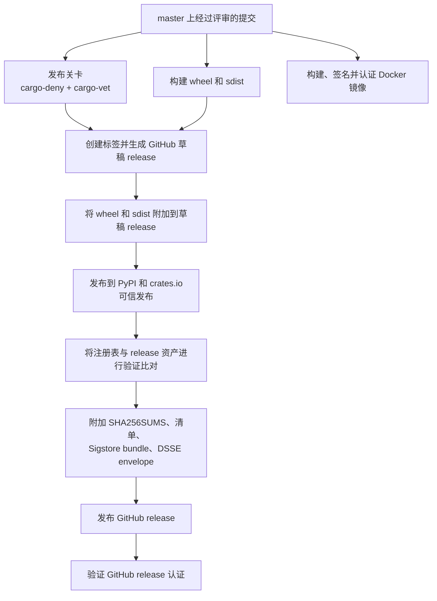

# 发布安全架构

本页描述了 NautilusTrader 发布流水线的安全模型，说明了发布产物是如何被
构建、发布、认证（attest）和验证的。

请将本页与以下文档配合阅读：

- [发布说明](releases.md)，记录了发布工作流和检查清单。
- [安全策略](https://github.com/nautechsystems/nautilus_trader/blob/develop/SECURITY.md)，
  提供了面向消费者的验证命令。
- [.github/OVERVIEW.md](https://github.com/nautechsystems/nautilus_trader/blob/develop/.github/OVERVIEW.md#security)，
  记录了 CI/CD 控制措施。

## 安全目标

发布流水线有四个目标：

- 每一个官方产物都从经过评审的仓库提交（commit）构建而成。
- 在不使用长期存活的包注册表令牌的情况下发布 Python 和 Rust 包。
- 在发布 GitHub release 之前附加校验和、清单和来源证明（provenance）。
- 为用户提供足够的公开数据，以验证下载的产物与该发布版本相符。

GitHub release 是包完整性的锚点。稳定版发布会先将 wheel 和 sdist 资产附加到一个
草稿状态的 GitHub release 上，然后才开始任何包索引的发布。该流水线会先发布包索引，
再将这些索引与 GitHub release 资产进行验证比对，然后附加最终的完整性资产，
最后才发布该 GitHub release。

## 威胁模型

该流水线可防御以下威胁：

- 被入侵或可变的第三方 GitHub Actions —— 通过将 action 固定到具体的 commit SHA 来防御。
- 从错误的工作流、分支或环境中意外发布 —— 通过将 OIDC 发布者绑定到
  `nautechsystems/nautilus_trader`、`build.yml` 和 `release` 环境来防御。
- 长期存活的包注册表令牌被窃取 —— 通过使用 PyPI 和 crates.io 的可信发布
  （Trusted Publishing）来防御。
- 注册表传播延迟或部分重跑 —— 通过使发布和验证脚本具备幂等性和可重试性来防御。
- 注册表替换或上传漂移 —— 通过将 PyPI 和 crates.io 上的产物与发布清单和注册表元数据
  进行比对来防御。
- 静默的手动 crate 恢复 —— 通过要求在 `CRATES_IO_MANUAL_PUBLISH_EXCEPTIONS` 中显式列出条目
  并在 `crates-manifest.json` 中记录这些例外情况来防御。

该流水线**不**防御以下情况：

- 拥有权限修改发布工作流和批准发布的恶意维护者。
- GitHub、PyPI、crates.io 或 Sigstore 本身被攻破，从而伪造用户所依赖的信任根。
- 在验证运行之前，终端用户的机器已被攻破。
- 交易所、经纪商、数据提供方或用户交易策略在运行时被攻破。
- wheel 和 sdist 的逐比特可重现构建漂移。目前的保证是来源证明和摘要校验，
  而不是可重现构建（reproducible builds）。

## 信任根

- GitHub 仓库规则保护经过评审的源码、发布分支和发布标签。相关记录是受保护的
  `master` 分支和不可变的 `v*` 发布标签。
- GitHub Actions 的 OIDC 颁发者从 `https://token.actions.githubusercontent.com`
  提供短期存活的工作流身份。
- GitHub 的 `release` 环境把控包发布和发布批准。该环境限制部署只能来自 `master`，
  并需要评审者批准。
- PyPI 可信发布在不使用持久令牌的情况下发布 wheel 和 sdist。它绑定到仓库
  `nautechsystems/nautilus_trader`、工作流 `build.yml` 和环境 `release`。
- crates.io 可信发布在不使用持久令牌的情况下发布 Rust crate。它绑定到所有者
  `nautechsystems`、仓库 `nautilus_trader`、工作流 `build.yml` 和环境 `release`。
- Sigstore 的 Fulcio、Rekor 和 TUF 将产物与 OIDC 身份及透明日志（transparency log）
  绑定。GitHub 产物认证、PyPI 发布认证和 Docker cosign 签名都依赖于这个信任根。
- GitHub release 的不可变性防止发布后资产和标签被替换。已发布的 release 资产
  和发布标签会变为不可变。

## 发布流程



Docker 工作流与包发布工作流是分开的，但它遵循同样的身份模型：镜像签名和 SBOM 认证
将镜像摘要与预期的 GitHub Actions 工作流身份绑定在一起。

## 产物记录

- Python wheel 会发布到 GitHub Releases、PyPI 以及 Nautech Systems 包索引
  （`packages.nautechsystems.io`）。`SHA256SUMS`、按资产单独提供的 `.sha256` 文件
  以及 `dist-manifest.json` 记录了完整性信息。GitHub 产物认证、PyPI 发布认证、
  `.sigstore` bundle 以及 `.intoto.jsonl` envelope 记录了来源证明。
- Python sdist 使用与 wheel 相同的公开位置、完整性记录和来源证明记录。
- Rust crate 发布到 crates.io。crates.io 的校验和以及 `crates-manifest.json`
  记录了完整性信息。除非存在显式的手动例外，否则 crates.io 的 `trustpub_data`
  记录了来源证明。
- Docker 镜像发布到 GitHub Container Registry。镜像摘要即为完整性记录。
  Sigstore cosign 签名和 SPDX SBOM 认证记录了来源证明。
- GitHub release 记录通过 GitHub Releases 发布。已发布的 release 资产和不可变
  标签记录了完整性信息。GitHub release 认证记录了来源证明。

## 消费者验证对照表

详细命令见
[验证发布版本](https://github.com/nautechsystems/nautilus_trader/blob/develop/SECURITY.md#verifying-releases)。
下面展示的是每类消费者应当验证的公开数据。

### Python wheel 和 sdist

需要验证：

- 该产物的摘要与 `SHA256SUMS`、按资产单独提供的 `.sha256` 文件，或
  `dist-manifest.json` 相符。
- GitHub 产物认证身份匹配 `master` 或 `nightly` 分支上的
  `nautechsystems/nautilus_trader/.github/workflows/build.yml`。
- PyPI 发布认证报告的仓库是 `nautechsystems/nautilus_trader`，工作流是 `build.yml`，
  环境是 `release`。

示例：

```bash
export TAG=v1.228.0
export REPO=nautechsystems/nautilus_trader
export ARTIFACT=nautilus_trader-1.228.0.tar.gz
export ISSUER=https://token.actions.githubusercontent.com
export IDENTITY='^https://github\.com/nautechsystems/nautilus_trader/\.github/workflows/build\.yml@refs/heads/(master|nightly)$'

gh release download "$TAG" --repo "$REPO" --pattern "$ARTIFACT" --pattern "$ARTIFACT.sha256"
sha256sum -c "$ARTIFACT.sha256"
gh attestation verify "$ARTIFACT" \
  --repo "$REPO" \
  --cert-identity-regex "$IDENTITY" \
  --cert-oidc-issuer "$ISSUER"
```

### PyPI 发布来源证明

需要验证：

- PyPI 文件哈希值与 `dist-manifest.json` 相符。
- PyPI 来源证明公开了预期的 GitHub 发布者身份。
- `pypi-attestations verify` 能够接受所下载文件的 URL。

示例：

```bash
export VERSION=1.228.0
export ARTIFACT=nautilus_trader-1.228.0.tar.gz
export PYPI_URL=$(curl -sS "https://pypi.org/pypi/nautilus_trader/$VERSION/json" | \
  jq -r --arg artifact "$ARTIFACT" '.urls[] | select(.filename == $artifact) | .url')

uv run --no-project --no-build --with pypi-attestations -- \
  pypi-attestations verify pypi \
  --repository https://github.com/nautechsystems/nautilus_trader \
  "$PYPI_URL"
```

### Rust crate

需要验证：

- crates.io 上该版本的校验和与下载的 `.crate` 文件相符。
- `trustpub_data.provider` 为 `github`。
- `trustpub_data.repository` 为 `nautechsystems/nautilus_trader`。
- `published_by` 为 `null`，除非 `crates-manifest.json` 中记录了显式的
  `manual_token_publish` 例外情况。

示例：

```bash
export CRATE=nautilus-core
export VERSION=0.58.0
export REPO=nautechsystems/nautilus_trader
export VERSION_JSON=$(curl -sS "https://crates.io/api/v1/crates/$CRATE/versions" | \
  jq -c --arg version "$VERSION" '.versions[] | select(.num == $version)')
export CRATE_SHA256=$(printf '%s\n' "$VERSION_JSON" | jq -r '.checksum')

printf '%s\n' "$VERSION_JSON" | jq -e --arg repo "$REPO" \
  '.trustpub_data.provider == "github" and .trustpub_data.repository == $repo and .published_by == null'
curl -sSL "https://static.crates.io/crates/$CRATE/$CRATE-$VERSION.crate" -o "$CRATE-$VERSION.crate"
test "$(sha256sum "$CRATE-$VERSION.crate" | cut -d ' ' -f 1)" = "$CRATE_SHA256"
```

### Docker 镜像

需要验证：

- 可变标签解析出的摘要与你打算运行的镜像一致。
- cosign 签名身份与 Docker 工作流相符。
- SPDX SBOM 认证绑定的是同一个镜像摘要。

示例：

```bash
export IMAGE_BASE=ghcr.io/nautechsystems/nautilus_trader
export DIGEST=$(crane digest "$IMAGE_BASE:latest")
export IMAGE=$IMAGE_BASE@$DIGEST
export ISSUER=https://token.actions.githubusercontent.com
export IDENTITY='^https://github\.com/nautechsystems/nautilus_trader/\.github/workflows/docker\.yml@refs/heads/(master|nightly)$'

cosign verify "$IMAGE" --certificate-identity-regexp "$IDENTITY" --certificate-oidc-issuer "$ISSUER"
cosign verify-attestation \
  --type https://spdx.dev/Document/v2.3 \
  "$IMAGE" \
  --certificate-identity-regexp "$IDENTITY" \
  --certificate-oidc-issuer "$ISSUER"
```

## 手动恢复策略

正常的发布只使用可信发布（Trusted Publishing）。手动发布包是在部分发布失败之后
才使用的最后手段（last-resort recovery path）。

手动恢复的规则：

- 当注册表或 Sigstore 验证器失败时，优先重新运行失败的任务或工作流。
- 发布之后不要替换发布标签或 GitHub release 资产。
- 不要静默接受手动发布的 crate。
- 如果某个 crate 必须使用令牌恢复，需要在 `CRATES_IO_MANUAL_PUBLISH_EXCEPTIONS`
  中列出每一个 `crate@version`。
- 在发布说明和 `crates-manifest.json` 中记录该例外情况，并将
  `release_status` 设置为 `"manual_token_publish"`。

没有任何常规发布路径依赖长期存活的 PyPI 或 crates.io 令牌。

## 事件响应策略

- PyPI 发布者漂移由 PyPI 来源证明验证器检测到。此时应停止发布、修复 PyPI 可信发布者
  配置，并重新运行验证。
- crates.io 发布者漂移由可信发布检查或注册表验证器检测到。修复 crate 发布者设置
  并重新运行。仅在部分恢复时才使用手动例外。
- GitHub release 资产不匹配由校验和或清单验证检测到。应在发布前停止该次发布，
  或者如果资产已经发布，则发布一份安全公告（advisory）。
- Sigstore、Rekor 或 TUF 延迟由可重试的透明日志错误检测到。以有限的退避策略重试，
  如果延迟持续存在，则暂停发布封存。
- 当认证验证变得含混不清时，会出现 Sigstore 信任根方面的担忧。此时应暂停发布，
  对照注册表记录进行验证，并在支持的情况下轮换信任根。
- 工作流身份不匹配由 GitHub、PyPI 或 cosign 的身份检查检测到。在经过评审之前，
  应将其视为配置漂移或安全入侵来处理。
- 当 crates.io 显示 `published_by` 而不是 `trustpub_data` 时，即可检测到手动 crate
  发布例外情况。应记录该显式例外，记录受影响的 crate，并保留审计轨迹。

## SLSA 姿态

Python 发布产物通过 GitHub 产物认证和 PyPI 发布认证携带构建来源证明。Docker 镜像
携带 Sigstore 签名和 SPDX SBOM 认证。Rust crate 依赖 crates.io 可信发布元数据以及
发布时的 `crates-manifest.json`。

本页并未针对所有产物类别断言某个具名的 SLSA 等级。未来任何关于 SLSA 等级的声明都必须
引用本架构文档，说明其所涵盖的产物类别，并包含 CI 验证，以证明所发布的来源证明能够
按照所声明的谓词类型正确解析。
