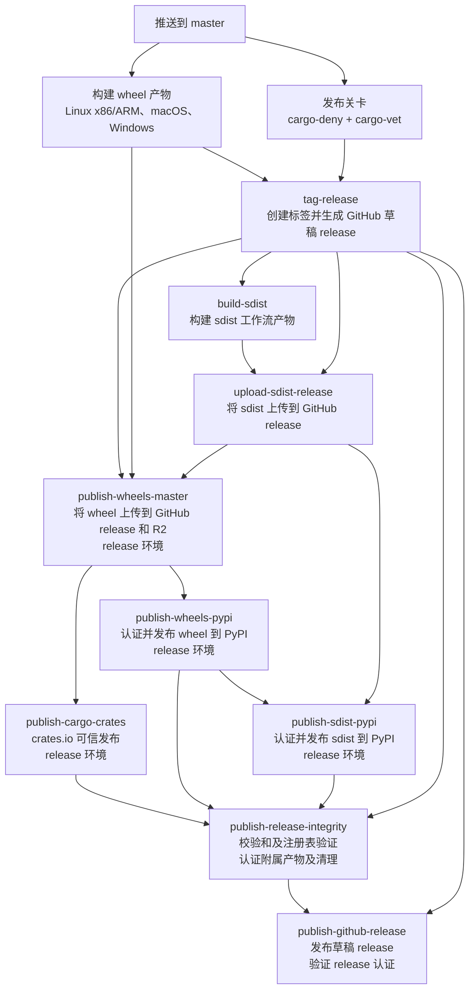

# 发布说明

本指南涵盖了发布流程以及撰写发布说明（release notes）的规范。

## 概述

NautilusTrader 使用三分支模型：

- **`develop`**：活跃开发分支；每次推送都会将开发版 wheel 发布到 Cloudflare R2。
- **`nightly`**：预发布测试分支；发布 alpha 版 wheel 和 CLI 二进制文件。
- **`master`**：稳定发布分支；触发完整的发布流水线。

推送到 `master` 会自动根据 `pyproject.toml` 中的版本号打标签，创建一个草稿状态的
GitHub release，上传发布资产，将 Cargo crate 发布到 crates.io，将 wheel 和 sdist 发布到
PyPI，发布该 GitHub release，构建 Docker 镜像，并触发文档重新构建。

## 稳定版发布工作流

`build` 工作流将 GitHub release 视为稳定版发布的锚点。它会先以草稿形式创建该
release，将 wheel 和 sdist 资产上传到这个草稿 release，然后才将这些包发布到包索引。
只有在注册表验证和最终完整性资产都已完成之后，该工作流才会发布该 GitHub release。



在编辑 `.github/workflows/build.yml` 时，请保持以下顺序规则不变：

- 草稿状态的 GitHub release 必须先于任何发布资产上传或包注册表发布而存在。
- wheel 和 sdist 资产必须先附加到 GitHub release 上，然后才能开始包索引发布
  （`packages.nautechsystems.io`、PyPI、crates.io）。
- PyPI 和 crates.io 的可信发布任务必须保留 `environment: release` 和
  `id-token: write`；这些注册依赖于 `release` 环境。
- 非 OIDC 的完整性检查和资产上传任务，除非需要 release 环境的密钥或批准，
  否则应避免使用 `environment: release`。
- `publish-release-integrity` 必须在 PyPI 和 crates.io 发布之后运行。它会先生成
  发布清单，再根据该清单验证各注册表，只有验证通过之后才附加最终的完整性资产。
- `publish-github-release` 必须是稳定版发布流程的最后一个任务。GitHub 建议先创建
  草稿 release，附加所有资产，然后在启用 release 不可变性之前发布该草稿。一旦仓库
  启用了 GitHub release 不可变性，已发布的 release 资产和标签就无法再更改；只有
  标题和发布说明仍可编辑。该任务会在发布之前验证最终的草稿资产集，并在发布草稿之后
  验证 GitHub 的 release 认证。

## 版本号管理

该项目维护两个版本号：

| 文件                     | 范围          | 示例   |
|--------------------------|----------------|-----------|
| `pyproject.toml`         | Python 包 | `1.223.0` |
| `Cargo.toml`（工作区） | Rust crate    | `0.55.0`  |

这两个版本号独立递增。Python 版本号决定了发布标签（`v1.223.0`）。

## Crates.io 发布

`build` 工作流通过 `publish-cargo-crates` 任务发布 Cargo crate。该任务通过 GitHub
Actions OIDC 使用 crates.io 可信发布，因此不使用持久的 cargo 令牌。请为每个 crate 在
crates.io 上配置以下信息：

| 字段       | 值             |
|-------------|-------------------|
| 所有者（Owner）       | `nautechsystems`  |
| 仓库（Repository）  | `nautilus_trader` |
| 工作流（Workflow）    | `build.yml`       |
| 环境（Environment） | `release`         |

在为某个 crate 配置好可信发布者之后，请为其启用"仅限可信发布"（Trusted Publishing
Only）。从未发布过的 crate 仍需要先进行一次初始的手动发布，crates.io 才会允许配置
可信发布者。

不要在 CI 发布流程中使用 `cargo publish --workspace`。发布任务运行的是
`scripts/ci/publish-cargo-crates.sh`，该脚本按依赖顺序逐个发布 crate，跳过
crates.io 上已经存在的版本，并在发布依赖该 crate 的其他 crate 之前，等待每个新版本
出现在 crates.io API 和稀疏索引（sparse index）中。如果某个可发布的 crate 依赖于一个
本地 `publish = false` 且在 crates.io 上不存在的 crate，脚本会在上传之前失败。
可选的本地依赖也算作阻塞项，因为发布一个解析到不存在 crate 的公共特性会使该特性
无法使用。

发布后验证只有在 crates.io 显示某个已存在的 crate 版本是由本仓库通过可信发布方式
发布时，才会将其视为 `previously_published`。对于由用户发布的 crate 版本，
除非 `CRATES_IO_MANUAL_PUBLISH_EXCEPTIONS` 中为紧急令牌发布恢复列出了每一个已恢复的
`crate@version` 条目，否则验证仍会失败。被接受的手动条目会记录在
`crates-manifest.json` 中，`release_status` 为 `"manual_token_publish"`；格式错误或
未使用的例外条目会导致任务失败。错误的可信发布仓库以及校验和或稀疏索引不匹配也会
导致失败。

## 发布检查清单

### 发布前（在 `develop` 上）

- [ ] 定稿 `RELEASES.md`：审查所有条目，移除空的部分
- [ ] 确保 `pyproject.toml` 和 `Cargo.toml` 工作区中已设置好版本号
- [ ] 确保 CI 发布的每一个 crate 都已配置好 crates.io 可信发布：
  `bash scripts/ci/check-crates-io-trusted-publishing.sh`
- [ ] 确保 `develop` 上的所有 CI 检查均已通过

### 发布

- [ ] 将 `develop` 合并到 `nightly`，验证 nightly CI 通过
- [ ] 将 `nightly` 合并到 `master`
- [ ] 验证 `build` 工作流完整执行：
  - 为 Linux x86/ARM、macOS、Windows 构建了 wheel
  - `cargo-deny` 和 `cargo-vet` 通过
  - 打标签之前，发布文档/特性以及 Cargo 发布预检均已通过
  - 已创建标签并生成草稿 GitHub release
  - wheel 和 sdist 已在包注册表发布之前附加到 GitHub release
  - Cargo crate 已发布到 crates.io，或因版本已存在而被跳过
  - wheel 和 sdist 已发布到 PyPI
  - 在附加发布校验和、crate 清单和认证附属产物之前，注册表验证已通过
  - 所有发布资产和完整性资产附加完成之后，GitHub release 已发布
- [ ] 验证 `docker` 工作流完整执行（镜像已构建并推送）
- [ ] 验证 `build-docs` 工作流完整执行（已触发文档重新构建）

### 发布后（在 `develop` 上）

- [ ] 在 `RELEASES.md` 中为已发布版本更新发布日期
- [ ] 在已完成的发布条目下方添加水平分隔线 `---`
- [ ] 在 `RELEASES.md` 顶部添加下一版本的模板（见下文）
- [ ] 将 `pyproject.toml` 版本号提升到下一个发布版本号
- [ ] 更新教程和操作指南中 `Cargo.toml` 代码片段的 crate 版本号
  （`docs/concepts/rust.md`、`docs/how_to/run_rust_backtest.md`、
  `docs/how_to/run_rust_live_trading.md`）

## 发布说明

本节记录了在 `RELEASES.md` 中撰写发布说明的规范。

### 分节

按以下顺序使用以下各节：

1. 增强功能（Enhancements）
2. 破坏性变更（Breaking Changes）
3. 安全（Security）
4. 修复（Fixes）
5. 内部改进（Internal Improvements）
6. 文档更新（Documentation Updates）
7. 弃用（Deprecations）

对于某次发布中没有条目的部分，应予以省略。

### 增强功能

新特性以及面向用户可见的改进。

**格式**：

```markdown
- Added `subscribe_order_fills(...)` and `unsubscribe_order_fills(...)` for `Actor`
- Added BitMEX conditional orders support
- Added support for `OrderBookDepth10` requests (#2955), thanks @faysou
```

**准则**：

- 以 "Added" 开头。
- 对代码元素使用反引号。
- 具体说明新增了什么，而不是如何实现的。

### 破坏性变更

可能破坏现有代码的变更。

**格式**：

```markdown
- Removed `nautilus_trader.analysis.statistics` subpackage - must import from `nautilus_trader.analysis`
- Renamed `BinanceAccountType.USDT_FUTURE` to `USDT_FUTURES`
- Changed `start` parameter to required for `Actor` data request methods
```

**准则**：

- 以 "Removed"、"Renamed" 或 "Changed" 开头。
- 简要说明迁移方式。

### 安全

用于防止崩溃、未定义行为或数据损坏的安全加固与修复。包括从"内部改进"中
提升上来的重要加固改进。

**格式**：

```markdown
- Fixed non-executable stack for Cython extensions to support hardened Linux systems
- Fixed divide-by-zero and overflow bugs in model crate that could cause crashes
- Fixed core arithmetic operations to reject NaN/Infinity values and improve overflow handling
```

**准则**：

- 应包含溢出/下溢修复、内存安全改进、FFI 防护、数据完整性修复。
- 关注对用户的影响：可能会发生什么后果。
- 排除常规的依赖更新、轻微的加固或仅涉及测试的修复。
- 如果该次发布没有任何安全相关条目，则完全省略本节。

### 修复

提升正确性、但不构成安全问题的 bug 修复。

**格式**：

```markdown
- Fixed reduce-only order panic when quantity exceeds position
- Fixed Binance order status parsing for external orders (#3006), thanks for reporting @bmlquant
```

**准则**：

- 以 "Fixed" 开头。

### 内部改进

实现细节和基础设施方面的变更。

**格式**：

```markdown
- Added ARM64 support to Docker builds
- Ported `PortfolioAnalyzer` to Rust
- Improved clock and timer thread safety
- Upgraded Rust (MSRV) to 1.90.0
- Upgraded `pyo3` crates to v0.26.0
```

**准则**：

- 使用 "Added"、"Implemented"、"Improved"、"Optimized"、"Upgraded"、"Refined"、
  "Standardized"。
- 依赖升级需包含版本号。

### 文档更新

对指南和示例的变更。

**格式**：

```markdown
- Added rate limit tables with links to official docs
- Improved dark and light themes for readability
- Fixed broken links
```

### 弃用

标记为待移除的特性。

**格式**：

```markdown
- Deprecated `some_config_option`; disable (`False`) to maintain consistent behaviour. Will be removed in future version
```

**准则**：

- 说明迁移方式并提供替代方案。

## 署名

- 为外部贡献者署名：使用 `thanks @username` 或 `thanks for reporting @username`。
- 对于社区贡献和复杂特性，注明议题/PR 编号：`(#1234)`。

## 风格

- 使用句首字母大写（只有首个单词大写）。
- 不以句号结尾。
- 对代码元素使用反引号。
- 关注**变更内容**，而不是实现方式。

**要具体明确**：

```markdown
❌ Improved Binance adapter
✅ Improved Binance fill handling when instrument not cached
```

## 安全分类

如果某项变更涉及以下内容，应将其归入"安全"部分：

- 内存安全（威胁稳定性的溢出、下溢、除零错误）。
- 可能破坏状态的未定义行为或崩溃。
- 数据完整性（NaN/Infinity 传播、导致数据损坏的竞态条件）。
- 防止注入或利用的输入校验（SQL 注入、命令注入、路径穿越）。
- 构建加固（不可执行栈、FFI 防护）。
- 用户应当了解的重要加固措施。

否则，请归入"修复"（针对逻辑 bug 和 panic）或"内部改进"（针对轻微的加固措施）。

注意：单纯的逻辑 panic 应归入"修复"，除非它们威胁到系统稳定性或导致数据损坏。

## 示例

**安全**（可能导致崩溃/损坏）：

```markdown
- Fixed divide-by-zero in margin calculations that could crash the engine
- Fixed non-executable stack for Cython extensions to support hardened systems
```

**修复**（不正确但安全）：

```markdown
- Fixed Binance order status parsing for external orders
- Fixed position purge logic to prevent purging re-opened position
```

**增强功能**（面向用户）：

```markdown
- Added BitMEX conditional orders support
```

**内部**（实现细节）：

```markdown
- Implemented BitMEX ping/pong handling
```

## 发布说明模板

```markdown
# NautilusTrader <VERSION> Beta

Released on TBD (UTC).

### Enhancements

### Breaking Changes

### Security

### Fixes

### Internal Improvements

### Documentation Updates

### Deprecations

---
```
