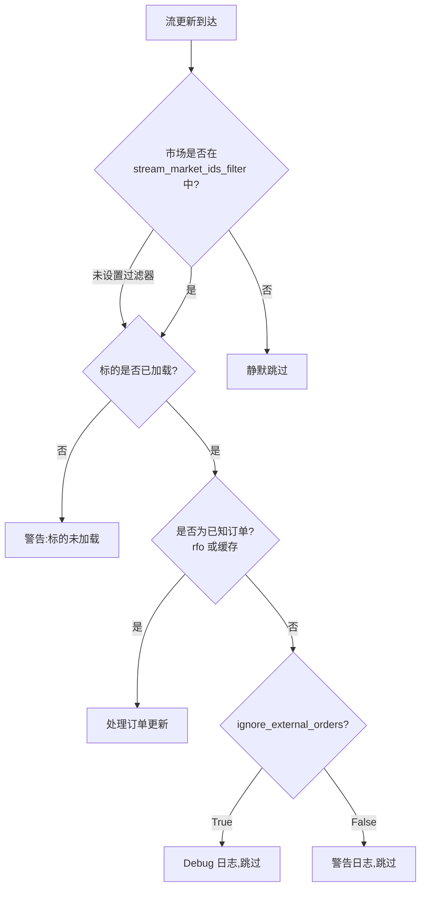

# Betfair

Betfair 成立于 2000 年,运营着全球最大的在线博彩交易所,
总部位于伦敦,并在全球设有分支机构。

NautilusTrader 提供了一个适配器,用于集成 Betfair 的 REST API 和
Exchange Streaming API。

## 安装

安装带有 Betfair 支持的 NautilusTrader:

```bash
uv pip install "nautilus_trader[betfair]"
```

若要从源码构建并带上 Betfair 附加组件:

```bash
uv sync --all-extras
```

## 示例

可以在[这里](https://github.com/nautechsystems/nautilus_trader/tree/develop/examples/live/betfair/)找到实时示例脚本。

## Betfair 文档

Betfair 为开发者提供了以下文档:

- [Betfair 开发者门户](https://developer.betfair.com/):访问 API 和文档的主要入口。
- [Exchange API 指南](https://developer.betfair.com/exchange-api/):Betting、Accounts 与 Streaming API 概览。

## 应用密钥(Application keys)

Betfair 要求使用应用密钥(Application Key)对 API 请求进行身份验证。注册并
为账户注资后,使用 [API-NG Developer AppKeys Tool](https://apps.betfair.com/visualisers/api-ng-account-operations/)
获取密钥。

每个账户会分配两个应用密钥:一个 **Live** 密钥(需要一次性激活费用),
以及一个用于开发和测试的 **Delayed** 密钥。

:::info
详细的设置说明请参见 [Application Keys](https://betfair-developer-docs.atlassian.net/wiki/spaces/1smk3cen4v3lu3yomq5qye0ni/pages/2687105/Application+Keys) 文档。
:::

## API 凭证

通过环境变量或客户端配置提供你的 Betfair 凭证:

```bash
export BETFAIR_USERNAME=<your_username>
export BETFAIR_PASSWORD=<your_password>
export BETFAIR_APP_KEY=<your_app_key>
export BETFAIR_CERTS_DIR=<path_to_certificate_dir>
```

:::tip
建议使用环境变量来管理凭证。
:::

:::note
当前 Rust 说明:Rust 目前会读取 `BETFAIR_USERNAME`、`BETFAIR_PASSWORD` 与
`BETFAIR_APP_KEY`。它尚未读取 `BETFAIR_CERTS_DIR`。
:::

## SSL 证书

Betfair 建议自动化交易系统使用带 SSL 证书的
[非交互式(机器人)登录](https://betfair-developer-docs.atlassian.net/wiki/spaces/1smk3cen4v3lu3yomq5qye0ni/pages/2687915/Non-Interactive+bot+login)。
`certs_dir` 配置项是可选的,但生产部署中建议使用证书。

### 生成证书

使用 OpenSSL 创建一个 2048 位 RSA 证书:

```bash
# 生成私钥和证书签名请求
openssl genrsa -out client-2048.key 2048
openssl req -new -key client-2048.key -out client-2048.csr

# 自签名证书(有效期 365 天)
openssl x509 -req -days 365 -in client-2048.csr -signkey client-2048.key -out client-2048.crt
```

### 上传到 Betfair

在使用证书之前,需先将其绑定到你的 Betfair 账户:

1. 打开 [My Betfair Account Security](https://myaccount.betfair.com/accountdetails/mysecurity?showAPI=1)。
2. 滚动到 **Automated Betting Program Access**,点击 **Edit**。
3. 上传你的 `client-2048.crt` 文件。

### 目录结构

将证书文件放入某个目录,并将 `BETFAIR_CERTS_DIR` 设置为该路径:

```
/path/to/certs/
├── client-2048.crt
└── client-2048.key
```

:::info
SSL 证书用于 Exchange Streaming API 连接。REST API 使用用户名/密码配合
应用密钥进行身份验证。
:::

:::warning
在 Betfair 网站上启用两步验证(2FA)不会影响 API 访问。无论 2FA 设置如何,
基于证书的登录都能正常工作。
:::

## 概览

Betfair 适配器提供三个主要组件:

- `BetfairInstrumentProvider`:加载 Betfair 市场并将其转换为 Nautilus 标的。
- `BetfairDataClient`:从 Exchange Streaming API 流式获取实时市场数据。
- `BetfairExecutionClient`:通过 REST API 提交订单(投注)并跟踪执行状态。

## 实现状态

NautilusTrader 目前发布了一个稳定的 Python Betfair 适配器,以及一个正在
开发中的 Rust 对齐路径。

本页仍是稳定指南,现已内联标注了主要的 Rust 差异。若要了解
`crates/adapters/betfair` 中当前 Rust 优先的行为,以及计划中的切换路径,
请参阅 [Betfair v2 过渡指南](betfair_v2.md)。

## 订单能力

与传统金融交易所相比,Betfair 作为一个博彩交易所具有独特的特性:

### 订单类型

| 订单类型             | 是否支持 | 备注                               |
|------------------------|-----------|-------------------------------------|
| `MARKET`               | ✓*        | Python 将普通市价单映射为激进的 `LIMIT`;Rust 仅支持 BSP 的 `AT_THE_CLOSE`。 |
| `LIMIT`                | ✓         | 以特定赔率下达的订单。     |
| `STOP_MARKET`          | -         | *不支持*。                    |
| `STOP_LIMIT`           | -         | *不支持*。                    |
| `MARKET_IF_TOUCHED`    | -         | *不支持*。                    |
| `LIMIT_IF_TOUCHED`     | -         | *不支持*。                    |
| `TRAILING_STOP_MARKET` | -         | *不支持*。                    |

### 执行指令

| 指令   | 是否支持 | 备注                               |
|---------------|-----------|-------------------------------------|
| `post_only`   | -         | 不适用于博彩交易所。 |
| `reduce_only` | -         | 不适用于博彩交易所。 |

### 有效期选项

| 有效期 | 是否支持 | 备注                                      |
|---------------|-----------|--------------------------------------------|
| `GTC`         | ✓         | 映射到 Betfair `PERSIST` 持久化模式。     |
| `GTD`         | -         | *不支持*。                           |
| `DAY`         | ✓         | 映射到 Betfair `LAPSE` 持久化模式。       |
| `FOK`         | ✓         | 映射到 Betfair `FILL_OR_KILL`。            |
| `IOC`         | ✓         | 映射到支持部分成交的 `FILL_OR_KILL`。 |

:::note
Betfair 使用持久化模型,而非传统的有效期(time-in-force)模型。适配器将
`FOK` 映射到 Betfair 的 `FILL_OR_KILL`,而 `IOC` 使用带
`min_fill_size=0` 的 `FILL_OR_KILL` 以允许部分成交。

当前的适配器还支持 BSP 收盘单流程。Rust 仅在 `AT_THE_CLOSE` 模式下接受
`MARKET` 订单。Rust 还会将处于 `AT_THE_CLOSE` 或 `AT_THE_OPEN` 模式的
`LIMIT` 订单映射为 Betfair 的 `LIMIT_ON_CLOSE` 指令。
:::

### 高级订单功能

| 功能            | 是否支持 | 备注                                    |
|--------------------|-----------|------------------------------------------|
| 订单修改 | ✓         | 仅限于不改变敞口的字段。 |
| 括号单/OCO 订单 | -         | *不支持*。                         |
| 冰山订单     | -         | *不支持*。                         |

### 批量操作

| 操作          | 是否支持 | 备注                |
|--------------------|-----------|----------------------|
| 批量提交       | ✓         | Python 和 Rust 均支持 `SubmitOrderList`。 |
| 批量修改       | -         | *不支持*。     |
| 批量取消       | ✓         | Python 和 Rust 均支持批量取消请求。 |

### 仓位管理

| 功能             | 是否支持 | 备注                                   |
|---------------------|-----------|-----------------------------------------|
| 查询仓位     | -         | 博彩交易所模型有所不同。         |
| 仓位模式       | -         | 不适用于博彩交易所。     |
| 杠杆控制    | -         | 博彩交易所没有杠杆。        |
| 保证金模式         | -         | 博彩交易所没有保证金。          |

### 订单查询

| 功能              | 是否支持 | 备注                                  |
|----------------------|-----------|----------------------------------------|
| 查询未成交订单    | ✓         | 列出所有活跃投注。                  |
| 查询订单历史  | ✓         | 历史投注数据。               |
| 订单状态更新 | ✓         | 实时投注状态变化。           |
| 成交历史        | ✓         | 投注匹配与结算报告。   |

### 条件单

| 功能             | 是否支持 | 备注                                   |
|---------------------|-----------|-----------------------------------------|
| 订单列表         | -         | *不支持*。                        |
| OCO 订单          | -         | *不支持*。                        |
| 括号单      | -         | *不支持*。                        |
| 条件单  | -         | 仅支持基本投注条件。              |

## 报价机制与定价

Betfair 使用分层报价机制,不同价格区间对应不同的最小变动单位:

| 价格区间   | 最小变动单位 |
|---------------|-----------|
| 1.01 - 2.00   | 0.01      |
| 2.00 - 3.00   | 0.02      |
| 3.00 - 4.00   | 0.05      |
| 4.00 - 6.00   | 0.10      |
| 6.00 - 10.00  | 0.20      |
| 10.00 - 20.00 | 0.50      |
| 20.00 - 30.00 | 1.00      |
| 30.00 - 50.00 | 2.00      |
| 50.00 - 100.00 | 5.00     |
| 100.00 - 1000.00 | 10.00  |

最小价格为 1.01,最大价格为 1000.00。

## 订单修改

在 Betfair 上修改订单有一些特定限制:

- **价格与数量不能原子性地同时变更** —— 这需要分别操作。
- **价格修改** 使用 `ReplaceOrders`(取消 + 以新价格提交新订单)。
- **数量减少** 使用带 `size_reduction` 参数的 `CancelOrders`。
- **数量增加** 不受支持 —— 需提交新订单代替。

:::warning
一次替换操作会同时为原订单生成一个取消事件,并为替换订单生成一个已接受
事件。适配器会跟踪待处理的替换,以抑制合成的取消事件。
:::

## 订单流成交处理

执行客户端处理来自 Betfair Exchange Streaming API 的订单更新。两个
配置项控制更新的过滤方式:

- **`stream_market_ids_filter`**:在市场层面过滤(提前退出,静默跳过)。
- **`ignore_external_orders`**:在订单层面过滤。Python 还用它来控制
  全量镜像缓存检查的日志级别。Rust 目前仅跳过没有 `rfo` 的 OCM 更新。

下方流程图对应的是稳定的 Python 执行路径。

Python 将 `stream_market_ids_filter` 与对账范围
(`reconcile_market_ids_only`)分开处理。当 `reconcile_market_ids_only=False`
且未配置显式的 `reconcile_market_ids` 时,Rust 目前会在对账期间回退使用
`stream_market_ids_filter`。



Python 还会在 `check_cache_against_order_image` 全量镜像对账期间应用
`stream_market_ids_filter`。Rust 目前通过 `generate_mass_status()` 进行
对账,尚未执行同样的全量镜像缓存检查。

当 `ignore_external_orders=True` 时,Python 适配器会跳过在缓存中找不到的
订单和成交:

| 场景                       | 说明                                         |
|--------------------------------|-----------------------------------------------------|
| 流更新中的未知订单 | 不存在场所到客户端的订单 ID 映射。         |
| 全量镜像中的未知订单    | 镜像同步期间在缓存中找不到该订单。         |
| 全量镜像中的未知成交     | 同步期间该成交与任何已知订单都不匹配。    |

:::info
对于共享同一个 Betfair 账户的多节点部署,请同时设置
`stream_market_ids_filter`(仅包含你自己的市场)与
`ignore_external_orders=True`,以避免出现关于其他节点管理订单的警告。
:::

### 成交处理

适配器在处理来自流的成交时,处理了若干边缘情况:

- **增量成交**:Betfair 报告的是累计已匹配数量。适配器通过跟踪每个
  订单上次已知的已成交数量来计算增量成交。
- **超额成交保护**:会拒绝会导致超过订单数量的成交。
- **去重**:已发布成交 ID 的缓存可防止因延迟消息或流重连重放而产生的
  重复成交事件。
- **竞态条件**:当流成交在 HTTP 订单响应之前到达时,适配器会立即缓存
  场所订单 ID,以确保订单能够正确匹配。
- **网络错误恢复**:当 HTTP 订单提交因网络错误(超时、连接重置)失败时,
  订单可能实际上仍已在场所下达。适配器会将订单保持在 SUBMITTED 状态,
  并保留客户订单引用,以便流在重连时能够确认该订单。API 明确拒绝的
  错误(Betfair 明确拒绝)仍会立即拒绝。

## 速率限制

适配器使用独立的速率限制桶,使账户状态轮询与对账不会限制订单下达:

| 桶  | 默认值 | 端点                                            | 是否可配置                     |
|---------|---------|------------------------------------------------------|----------------------------------|
| 通用 | 5/s     | 账户状态、对账、保活。           |                                  |
| 订单  | 20/s    | `placeOrders`、`replaceOrders`、`cancelOrders`。      | `order_request_rate_per_second`。 |

订单状态和成交报告查询在遇到 `TOO_MANY_REQUESTS` 错误后,会在延迟
1 秒后重试一次;订单操作则会以错误消息直接拒绝。

Betfair 的实际 API 限制更为细致:

| 类别                 | 限制                | 备注                                                |
|--------------------------|----------------------|------------------------------------------------------|
| 订单操作         | 1,000 笔交易/秒 | `placeOrders`、`cancelOrders`、`replaceOrders` 的总指令数。 |
| 订单投影查询 | 3 个并发         | `listMarketBook`(带 `OrderProjection`)、`listCurrentOrders`、`listMarketProfitAndLoss`。 |
| 最佳实践            | 5 请求/秒         | 建议每个市场调用 `listMarketBook` 的频率。         |

:::info
有关速率限制的详情,请参见
[为什么我会收到 TOO_MANY_REQUESTS 错误?](https://support.developer.betfair.com/hc/en-us/articles/360000406111)
以及 [市场数据请求限制](https://docs.developer.betfair.com/display/1smk3cen4v3lu3yomq5qye0ni/Market+Data+Request+Limits)。
:::

## 自定义数据类型

Betfair 适配器提供了若干通过市场流传递的自定义数据类型。所有自定义数据
在订阅市场后都会自动传递 —— 无需显式订阅,不过策略可以为特定数据类型
注册处理器。

### BetfairTicker

某个投注选项的实时 ticker 数据。

| 字段                 | 类型    | 说明                     |
|-----------------------|---------|---------------------------------|
| `instrument_id`       | str     | Nautilus 标的标识符。 |
| `last_traded_price`   | float   | 最新已匹配价格(赔率)。      |
| `traded_volume`       | float   | 总已匹配成交量。           |
| `starting_price_near` | float   | 近端 BSP 指标。        |
| `starting_price_far`  | float   | 远端 BSP 指标。         |

### BetfairStartingPrice

市场收盘后已实现的 Betfair 起始价格(BSP)。

| 字段           | 类型  | 说明                     |
|-----------------|-------|---------------------------------|
| `instrument_id` | str   | Nautilus 标的标识符。 |
| `bsp`           | float | 最终起始价格(赔率)。    |

### BetfairRaceRunnerData

单匹马的实时 GPS 跟踪数据(Total Performance Data)。
适用于受支持的英国和爱尔兰赛事。

| 字段              | 类型  | 说明                             |
|--------------------|-------|-----------------------------------------|
| `race_id`          | str   | Betfair 赛事标识符。                |
| `market_id`        | str   | Betfair 市场标识符。              |
| `selection_id`     | int   | Betfair 参赛者(runner)标识符。  |
| `latitude`         | float | GPS 纬度。                           |
| `longitude`        | float | GPS 经度。                          |
| `speed`            | float | 当前速度,单位 m/s(基于多普勒推算)。 |
| `progress`         | float | 距离终点线的距离(米)。      |
| `stride_frequency` | float | 步频,单位 Hz。                 |

### BetfairRaceProgress

包含分段用时和跑位顺序的赛事摘要数据。

| 字段            | 类型       | 说明                                   |
|------------------|------------|-----------------------------------------------|
| `race_id`        | str        | Betfair 赛事标识符。                      |
| `market_id`      | str        | Betfair 市场标识符。                    |
| `gate_name`      | str        | 计时门(如 "1f"、"2f"、"Finish")。     |
| `sectional_time` | float      | 该分段用时(秒)。             |
| `running_time`   | float      | 自赛事开始以来的总用时(秒)。       |
| `speed`          | float      | 领先马匹速度,单位 m/s。                  |
| `progress`       | float      | 领先马匹距终点线的距离(米)。      |
| `order`          | list[int]  | 按当前赛事位置排序的参赛者 ID 列表。 |
| `jumps`          | list[dict] | National Hunt 赛事的跳跃障碍数据。   |

### 订阅自定义数据

订阅市场后,自定义数据会自动通过 Betfair 市场流传递。要在策略或 actor 中
接收自定义数据,请使用 Betfair 客户端 ID 注册处理器:

```python
from nautilus_trader.adapters.betfair.constants import BETFAIR_CLIENT_ID
from nautilus_trader.adapters.betfair.data_types import BetfairRaceRunnerData
from nautilus_trader.adapters.betfair.data_types import BetfairRaceProgress
from nautilus_trader.adapters.betfair.data_types import BetfairTicker
from nautilus_trader.model.data import DataType

class MyStrategy(Strategy):
    def on_start(self):
        # 订阅 ticker 数据
        self.subscribe_data(DataType(BetfairTicker), client_id=BETFAIR_CLIENT_ID)

        # 订阅所有参赛者的实时跟踪数据(通配)
        self.subscribe_data(DataType(BetfairRaceRunnerData), client_id=BETFAIR_CLIENT_ID)

        # 或按 selection_id 订阅特定参赛者
        self.subscribe_data(
            DataType(BetfairRaceRunnerData, metadata={"selection_id": 49411491}),
            client_id=BETFAIR_CLIENT_ID,
        )

        # 订阅所有赛事进度更新(通配)
        self.subscribe_data(DataType(BetfairRaceProgress), client_id=BETFAIR_CLIENT_ID)

        # 或按 race_id 订阅特定赛事
        self.subscribe_data(
            DataType(BetfairRaceProgress, metadata={"race_id": "35278018.1617"}),
            client_id=BETFAIR_CLIENT_ID,
        )

    def on_data(self, data):
        if isinstance(data, BetfairRaceRunnerData):
            self.log.info(
                f"Runner {data.selection_id}: speed={data.speed} m/s, "
                f"progress={data.progress}m to finish"
            )
        elif isinstance(data, BetfairRaceProgress):
            self.log.info(f"Race order: {data.order}")
        elif isinstance(data, BetfairTicker):
            self.log.info(f"LTP: {data.last_traded_price}")
```

:::info
使用 `DataType(BetfairRaceRunnerData)`(不带 metadata)订阅会接收
**所有**参赛者的数据。添加 `metadata={"selection_id": <id>}` 可过滤到
特定参赛者。类似地,`DataType(BetfairRaceProgress)` 会接收所有赛事的
进度,而 `metadata={"race_id": <id>}` 可过滤到特定赛事。

赛事数据(RCM 消息)需要 Total Performance Data(TPD)覆盖以及具备
TPD 权限的 Betfair API key。并非所有赛事都启用了 GPS 跟踪。
:::

### 从文件加载赛事数据

对于使用录制赛事数据进行回测的场景,请使用文件解析器:

```python
from nautilus_trader.adapters.betfair.parsing.core import parse_betfair_rcm_file

for data in parse_betfair_rcm_file("path/to/rcm_data.json"):
    if isinstance(data, BetfairRaceRunnerData):
        print(f"Runner {data.selection_id} at {data.latitude}, {data.longitude}")
```

## 配置

### 数据客户端配置选项

| 选项                    | 默认值   | 说明 |
|---------------------------|-----------|-------------|
| `account_currency`        | 必填  | 用于数据和价格订阅的 Betfair 账户货币。 |
| `username`                | `None`    | Betfair 账户用户名;省略时从环境变量读取。 |
| `password`                | `None`    | Betfair 账户密码;省略时从环境变量读取。 |
| `app_key`                 | `None`    | 用于 API 身份验证的 Betfair 应用密钥。 |
| `certs_dir`               | `None`    | 包含用于登录的 Betfair SSL 证书的目录。 |
| `instrument_config`       | `None`    | 可选的 `BetfairInstrumentProviderConfig`,用于限定可用市场的范围。 |
| `subscription_delay_secs` | `3`       | 发送首次市场订阅请求前的延迟(秒)。 |
| `keep_alive_secs`         | `36,000`  | Betfair 会话的保活间隔(秒)。 |
| `subscribe_race_data`     | `False`   | 若为 `True`,则订阅 Race Change Messages(RCM)以获取实时 GPS 跟踪数据。 |
| `stream_conflate_ms`      | `None`    | 显式的流合流(conflation)间隔,单位毫秒(`0` 表示禁用合流)。 |
| `stream_heartbeat_ms`     | `5,000`    | 流心跳间隔,单位毫秒(500-5000)。设为 `None` 表示省略。 |
| `proxy_url`               | `None`    | HTTP 请求的可选代理 URL。 |

:::warning
当 `stream_conflate_ms` 为 `None` 时,Betfair 会应用其默认的合流行为
(通常为启用状态)。若要确保不进行合流并接收每一次价格更新,请显式设置
`stream_conflate_ms=0`。
:::

:::note
当前的 Rust 差异:

- Rust 尚未暴露 `certs_dir`。
- Rust 不使用 `instrument_config`;而是通过 `BetfairDataConfig` 上的直接
  过滤字段来限定标的范围。
- Rust 使用固定的 36,000 秒保活间隔。
- Rust 目前要求提供 `stream_heartbeat_ms`;不接受 `None` 来省略心跳。

:::

### 执行客户端配置选项

| 选项                       | 默认值  | 说明 |
|------------------------------|----------|-------------|
| `account_currency`           | 必填 | 用于下单和余额的 Betfair 账户货币。 |
| `username`                   | `None`   | Betfair 账户用户名;省略时从环境变量读取。 |
| `password`                   | `None`   | Betfair 账户密码;省略时从环境变量读取。 |
| `app_key`                    | `None`   | 用于 API 身份验证的 Betfair 应用密钥。 |
| `certs_dir`                  | `None`   | 包含用于登录的 Betfair SSL 证书的目录。 |
| `instrument_config`          | `None`   | 可选的 `BetfairInstrumentProviderConfig`,用于限定对账范围。 |
| `calculate_account_state`    | `True`   | 为 `True` 时,根据事件在本地计算账户状态。 |
| `request_account_state_secs` | `300`    | 向 Betfair 轮询账户状态的间隔(秒,`0` 表示禁用)。 |
| `reconcile_market_ids_only`  | `False`  | 为 `True` 时,对账仅覆盖 `instrument_config.market_ids`(未设置时无效果)。 |
| `reconcile_market_ids`       | `None`   | 仅限 Rust。当 `reconcile_market_ids_only=True` 时,用于对账的显式市场 ID。 |
| `stream_market_ids_filter`   | `None`   | 需要从流中处理的市场 ID 列表;其余市场会被静默跳过。 |
| `ignore_external_orders`     | `False`  | 为 `True` 时,忽略本地缓存中缺失的流订单。 |
| `use_market_version`         | `False`  | 为 `True` 时,将最新的市场版本附加到订单请求中以实现价格保护。 |
| `order_request_rate_per_second` | `20`  | 订单端点的速率限制(请求数/秒),与通用 API 端点独立。 |
| `stream_heartbeat_ms`        | `5,000`   | 订单流心跳间隔,单位毫秒(500-5000)。设为 `None` 表示省略。 |
| `proxy_url`                  | `None`   | HTTP 请求的可选代理 URL。 |

:::warning
如果你设置了 `stream_market_ids_filter`,请确保它包含你所交易的全部市场。
在被该过滤器排除的市场上下的订单,将无法接收到流中的实时成交和取消更新。
:::

:::note
当前的 Rust 差异:

- Rust 尚未暴露 `certs_dir` 或 `instrument_config`。
- Rust 使用 `calculate_account_state` 作为定期账户状态轮询的开关。
- 当 `reconcile_market_ids_only=True` 时,Rust 使用 `reconcile_market_ids`。
- 若 `reconcile_market_ids_only=False`,当未设置 `reconcile_market_ids` 时,
  Rust 目前会回退使用 `stream_market_ids_filter` 进行启动时对账。
- Rust 目前仅将 `ignore_external_orders` 应用于没有 `rfo` 的 OCM 更新。
- Rust 目前要求提供 `stream_heartbeat_ms`;不接受 `None` 来省略心跳。

:::

## 会话管理

Betfair 会话通常每 12-24 小时过期一次。当出现 `NO_SESSION` 或
`INVALID_SESSION_INFORMATION` 错误时,适配器会自动处理会话重连:

- HTTP 客户端会重新连接并获取新的会话令牌。
- 流客户端会重新进行身份验证并重新订阅市场。
- 保活机制会主动延长会话。Python 暴露了 `keep_alive_secs`。Rust 目前
  使用固定的 10 小时间隔。

:::info
在账户状态轮询或保活期间出现的会话错误会触发自动重连。正常的会话过期
无需人工干预。
:::

## 市场版本价格保护

Betfair 市场有一个 `version`(版本)编号,每当订单簿发生变化时(例如,
出现新的价格档位、投注被匹配)就会递增。适配器可以将该版本附加到
`placeOrders` 和 `replaceOrders` 请求中,从而针对过期订单提供价格保护。

当 `use_market_version=True` 时,每个订单请求都会携带适配器最后看到的
市场版本号。如果在 Betfair 处理该订单时市场已推进超过该版本,Betfair
会让该投注**失效(lapse)**,而不会将其与已变化的订单簿撮合。

```python
from nautilus_trader.adapters.betfair.config import BetfairExecClientConfig

exec_config = BetfairExecClientConfig(
    account_currency="GBP",
    use_market_version=True,
)
```

适配器从 instrument 的 `info` 字典中读取市场版本,该字典由 Exchange
Streaming API 的 `MarketDefinition` 更新填充。这意味着:

- 该版本反映的是最近一次的流更新,而非 HTTP API 快照。
- 市场变化与适配器接收到更新版本之间存在固有延迟。
- 在收到首个流 `MarketDefinition` 之前提交的订单不会包含版本信息。

:::warning
市场版本保护是保守的。在快速变化的市场中,版本可能在你的下单信号与
提交之间发生变化,即使价格仍然可以接受,也会导致该投注失效。请权衡
保护效果与成交率之间的取舍。
:::

## 多节点部署

当多个交易节点共享同一个 Betfair 账户、处理不同市场时,请对每个节点
进行配置以避免相互干扰:

1. 将 `stream_market_ids_filter` 设置为仅包含该节点的市场。
2. 将 `ignore_external_orders=True` 设置为抑制关于其他节点订单的警告。
3. 将 `reconcile_market_ids_only=True` 设置为限制对账范围。

这可以防止警告信息泛滥,并确保每个节点只处理属于自己的订单和成交。

下面是一个最小示例,演示如何为实时 `TradingNode` 配置 Betfair 客户端:

```python
from nautilus_trader.adapters.betfair import BETFAIR
from nautilus_trader.adapters.betfair import BetfairLiveDataClientFactory
from nautilus_trader.adapters.betfair import BetfairLiveExecClientFactory
from nautilus_trader.config import TradingNodeConfig
from nautilus_trader.live.node import TradingNode

# 配置 Betfair 数据和执行客户端(使用 AUD 账户货币)
config = TradingNodeConfig(
    data_clients={BETFAIR: {"account_currency": "AUD"}},
    exec_clients={BETFAIR: {"account_currency": "AUD"}},
)

# 使用 Betfair 适配器工厂构建 TradingNode
node = TradingNode(config)
node.add_data_client_factory(BETFAIR, BetfairLiveDataClientFactory)
node.add_exec_client_factory(BETFAIR, BetfairLiveExecClientFactory)
node.build()
```

## 贡献

:::info
如需了解更多功能或为 Betfair 适配器贡献代码,请参阅我们的
[贡献指南](https://github.com/nautechsystems/nautilus_trader/blob/develop/CONTRIBUTING.md)。
:::
