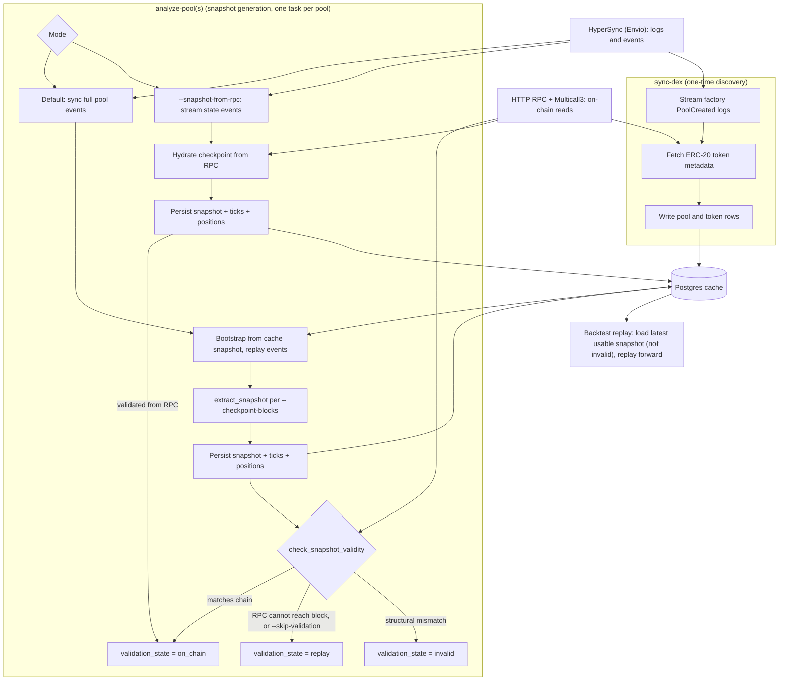

# Blockchain

## 概览

区块链适配器从 EVM 链上摄取 DeFi 数据,并通过 NautilusTrader 数据模型将其暴露出来。
它使用三种后端:

- HyperSync:高吞吐量的历史区块与合约日志。查询格式、分页与调优细节请参见
  [Envio HyperSync 文档](https://docs.envio.dev/docs/HyperSync/hypersync-usage)。
- HTTP RPC:合约调用、Multicall 读取,以及最终的链上状态补齐。
- Postgres:可选的持久化缓存状态、池元数据、已解码事件与快照。

## 核心原语

DeFi 领域模型位于 `nautilus_model::defi`。

### Chain

`Chain` 定义了目标区块链及其默认服务端点。

| 字段                       | 类型         | 说明                                                        |
|-----------------------------|--------------|--------------------------------------------------------------------|
| `name`                      | `Blockchain` | 链枚举值,例如 `Ethereum` 或 `Arbitrum`。                |
| `chain_id`                  | `u32`        | EVM 链 ID,例如以太坊为 `1`。                            |
| `hypersync_url`             | `String`     | HyperSync 端点,默认为 `https://{chain_id}.hypersync.xyz`。 |
| `rpc_url`                   | `Option`     | 存储在链模型上的可选直接 RPC 端点。            |
| `native_currency_decimals`  | `u8`         | 原生 gas 代币的小数精度,通常为 `18`。                  |

可以通过 `Chain::from_chain_id` 按数字 ID 加载链,或通过
`Chain::from_chain_name` 按名称加载。

| 链系列                | 代码 | 名称         | 精度 |
|-----------------------------|------|--------------|----------|
| Ethereum 及其 L2            | ETH  | Ethereum     | 18       |
| Polygon                     | POL  | Polygon      | 18       |
| Avalanche                   | AVAX | Avalanche    | 18       |
| BSC                         | BNB  | Binance Coin | 18       |

### DEX 与流动性池

DEX 集成会注册:

- 工厂合约地址。
- 事件签名与解析函数。
- AMM 类型。

池定义将链、DEX、池合约、代币对、手续费档位、tick 间距与创建区块绑定为
一个稳定的 Nautilus 标的 ID。

Uniswap V3 及兼容的集中流动性池还会用到:

- `Initialize(uint160,int24)` 用于初始价格状态。
- `Mint` 与 `Burn` 事件,用于重放仓位与 tick 状态。
- `Swap` 事件,用于实时池价格变动。
- 通过 HTTP RPC 读取 `slot0`、流动性、活跃 tick 以及仓位数据的最终状态。

## 配置

| 选项                            | 默认值            | 说明                                            |
|-----------------------------------|--------------------|----------------------------------------------------------|
| `chain`                           | 必填           | 目标 `Chain`,例如 Ethereum 或 Arbitrum。          |
| `dex_ids`                         | `[]`               | 要注册并同步的 DEX 集成。                 |
| `http_rpc_url`                    | 必填           | 用于合约读取和 Multicall 的 HTTP RPC 端点。    |
| `wss_rpc_url`                     | `None`             | 用于 RPC 实时流的可选 WSS RPC 端点。        |
| `rpc_requests_per_second`         | `None`             | 可选的 RPC 请求节流。                         |
| `multicall_calls_per_rpc_request` | `200`              | 每次 RPC 请求所要求的最大 Multicall 目标数量。   |
| `use_hypersync_for_live_data`     | Rust 中为 `false`    | 为 true 时,实时区块与事件流使用 HyperSync。 |
| `from_block`                      | `None`             | 历史同步的可选起始区块。                 |
| `pool_filters`                    | `DexPoolFilters()` | 流动性池范围过滤规则。                       |
| `postgres_cache_database_config`  | `None`             | 可选的 Postgres 缓存配置。                 |
| `proxy_url`                       | `None`             | 可选的 HTTP 与 WebSocket 代理 URL。                 |
| `transport_backend`               | `Tungstenite`      | WebSocket 传输后端。                           |

:::note
目前池快照请求需要一个 Postgres 缓存数据库。内存缓存可以保存代币和池信息,
但最新的池分析器(profiler)初始化仍需通过缓存数据库路径读取快照和事件状态。
:::

## 环境

在仓库之外设置凭证:

```bash
export ENVIO_API_TOKEN="<envio-token>"
export RPC_HTTP_URL="https://your-rpc.example"
export RPC_WSS_URL="wss://your-rpc.example"
```

若使用本地 `.env` 文件,请将其排除在版本控制之外:

```dotenv
ENVIO_API_TOKEN=<envio-token>
RPC_HTTP_URL=https://your-rpc.example
RPC_WSS_URL=wss://your-rpc.example
```

- Rust HyperSync 客户端要求提供 `ENVIO_API_TOKEN`。令牌缺失或格式错误会在
  发出任何查询之前导致客户端构造失败。
- 合约读取和快照补齐需要 `RPC_HTTP_URL` 或 `--rpc-url`。
- `RPC_WSS_URL` 仅在需要 WSS RPC 实时流时才需要。

有关令牌设置与配额详情,请参见 Envio 的
[HyperSync API 令牌文档](https://docs.envio.dev/docs/HyperSync/api-tokens)。

### RPC 端点

`RPC_HTTP_URL` 或 `--rpc-url` 必须指向目标链的 EVM JSON-RPC 端点。
数据客户端在构造时解析该端点,首次池同步会通过它读取链上状态。
HyperSync 端点由链 ID 推导得出(`https://{chain_id}.hypersync.xyz`)。

已验证的免费公共 HTTP 端点(截至 2026 年 6 月,无需 API key):

| 链        | HTTP 端点                          | 是否为归档节点 |
| ------------ | -------------------------------------- | ------- |
| Arbitrum One | `https://arb1.arbitrum.io/rpc`         | 否      |
| Arbitrum One | `https://arbitrum.gateway.tenderly.co` | 是      |
| Ethereum     | `https://ethereum-rpc.publicnode.com`  | 否      |

免费的归档端点是存在的,但可用性与限制会发生变化。快照验证通常每个池只需
少量的 `eth_call` 调用,因此一个免费归档端点通常足以获得
`validation_state = on_chain`。

归档节点支持与否会影响验证结果,但不影响事件同步是否运行:

- 在归档节点上,历史区块快照会与链上状态进行验证,并以
  `validation_state = on_chain` 存储。
- 在非归档节点上,历史读取会失败,快照会保持 `validation_state = replay`,
  这仍可作为重放的起点使用。
- 在非归档节点上首次同步必须运行到较近的 `--to-block`,因为非归档节点
  只能提供最近的状态,而初始化读取的是目标区块处的链上状态。

如需其他链或归档访问权限,可使用 [chainlist.org](https://chainlist.org)
或 [comparenodes.com](https://www.comparenodes.com) 等目录,或使用带
密钥的提供商(Infura、Alchemy、dRPC)。

## 本地服务

开发用的 compose 文件会启动 Postgres、Redis 和 pgAdmin。

```bash
make start-services
make init-db
```

默认 Postgres 连接信息:

- 主机:`127.0.0.1:5432`
- 数据库:`nautilus`
- 用户:`nautilus`
- 密码:`pass`

检查 schema 是否存在:

```bash
docker exec nautilus-database psql -U nautilus -d nautilus -Atc \
    "select count(*) from information_schema.tables where table_schema='public'"
```

对于具有破坏性的 DeFi 测试,请使用单独的数据库或可重置的 Docker 卷。
池发现与快照测试可能会向 `token`、`pool`、`pool_*_event`、
`pool_snapshot`、`pool_position` 和 `pool_tick` 写入大量数据行。

## 数据流

### 架构

`sync-dex` 只发现一次池和代币。随后 `analyze-pool(s)` 会生成
`pool_snapshot` 行。下图展示了默认的重放路径以及 `--snapshot-from-rpc`
路径。



`analyze-pools` 为每个池运行一个任务,受 `--concurrency` 限制。每个任务
拥有自己的数据客户端。只要快照的 `validation_state` 不是 `invalid`,
它就可用作重放起点。

### 池发现

池发现流程:

- 从 HyperSync 流式获取 DEX 工厂事件。
- 通过 RPC 获取 ERC-20 元数据。
- 将有效的代币和池存入缓存。
- 可通过 `DexPoolFilters` 跳过代币元数据无效或为空的池。

### 实时数据

- `use_hypersync_for_live_data = true`:通过 HyperSync 订阅区块以获取
  实时时间戳,并为每个已订阅的 DEX 过滤器持有一个开放式的 HyperSync
  DEX 事件流。
- `use_hypersync_for_live_data = false`:使用 WSS RPC 区块与池日志订阅
  获取实时的成交、流动性更新、手续费收取、闪电事件与协议费用事件。

### 快照初始化

对于兼容 Uniswap V3 的快照,初始化流程为:

- 从 HyperSync 重放历史的 Initialize、Mint 和 Burn 事件,以重建 tick
  与仓位。
- 通过 HTTP RPC 和 Multicall 获取最终的链上状态,然后基于该快照恢复
  分析器(profiler)。

初始化模式:

- 默认:存储直到目标区块为止的完整池事件历史,然后从数据库进行初始化。
- `--snapshot-from-rpc`:跳过完整的成交存储,从 HyperSync 流式获取
  Initialize、Mint、Burn、SetFeeProtocol 和 CollectProtocol 事件以枚举
  tick 和仓位,然后从 RPC 补齐精确的检查点区块。

当所需输出是最终快照而非已存储的成交历史时,对于交易量大的老旧池,请使用
`--snapshot-from-rpc`。它不能与 `--from-block`、`--reset` 或
`--require-existing-snapshot` 组合使用。

如果最终的 RPC 补齐失败,适配器必须以失败方式关闭(fail closed)。
它绝不能发出一个基于陈旧价格状态、由重放事件构建而成的快照。

### 快照验证

在将快照标记为有效之前,初始化流程会将重放得到的分析器状态与链上状态
进行比较。以下结构化字段必须完全匹配:

- 当前 tick。
- 活跃流动性。
- 各 tick 的净流动性与总流动性。
- 仓位流动性。

结构化字段不匹配会导致以失败方式关闭,该快照不会被标记为有效。

非结构化字段的不匹配会被接受,并发出警告:

- Sqrt price(平方根价格),当重放是按事件范围计算而 RPC 快照是按区块
  范围计算时,两者会有差异。
- 手续费协议(fee protocol),在分叉链上,或某个手续费协议事件不在
  重放范围内时,可能会有差异。
- 协议手续费余额,由于重放计算中的舍入,可能与直接读取链上累加器的
  RPC 快照有所不同。

如果只有非结构化字段存在差异,该快照会被接受。这与回测重放的行为一致。

### 快照初始化保护

当分析应仅从本地快照缓存运行时,使用 `--require-existing-snapshot`:

- 检查目标区块或之前是否存在可用的最新 `pool_snapshot`。
- 若不存在可用快照,则返回 `needs_bootstrap`。
- 将没有仓位或 tick 的空创建区块快照视为不可用。
- 跳过该池的创建区块到目标区块的初始化过程。

```bash
nautilus blockchain analyze-pools \
    --chain ethereum \
    --dex UniswapV3 \
    --addresses-file pools.txt \
    --to-block 25218797 \
    --require-existing-snapshot \
    --rpc-url "$RPC_HTTP_URL"
```

`analyze-pool(s)` 会打印:

- 每个 `--checkpoint-blocks` 条目一条 JSON 结果。
- 若未提供检查点,则在 `--to-block` 处打印一条 JSON 结果。

需要首次初始化的池格式如下:

```json
{
  "chain": "Ethereum",
  "dex": "UniswapV3",
  "pool_address": "0x1111111111111111111111111111111111111111",
  "target_block": 25218797,
  "status": "needs_bootstrap"
}
```

成功的结果包含 `validation_state`:

- `on_chain`:已补齐并与链上状态匹配。
- `replay`:基于重放推导得出,或未经检查,但仍可作为重放起点使用。
- `invalid`:已补齐但不匹配,不可用。

```json
{
  "chain": "Ethereum",
  "dex": "UniswapV3",
  "pool_address": "0x1111111111111111111111111111111111111111",
  "target_block": 25218797,
  "status": "success",
  "snapshot_block": 25218790,
  "positions": 2,
  "ticks": 7,
  "validation_state": "replay",
  "already_valid": false,
  "liquidity_utilization_rate": 0.25
}
```

### 检查点与并发

- `--checkpoint-blocks b1,b2,...`:在一次初始化过程中生成多个快照。
  区块会被排序、去重,并限制在 `--to-block` 以内。
- `--concurrency`:控制 `analyze-pools` 的并行度。默认值:`4`。
- `--skip-validation`:跳过链上比较,将重放推导出的快照保留为
  `replay` 状态。
- `--snapshot-from-rpc`:在检查点区块处从链上补齐,并将快照记录为
  `on_chain`。

快照键:

- 默认模式:以检查点当前或之前的最后一个池事件作为键。两个检查点之间
  没有事件时,可以共享一个存储行。
- `--snapshot-from-rpc`:以请求的检查点区块加上按区块范围的哨兵
  交易/日志索引作为键。

### 回测重放

回测重放需要输入数据中包含一个快照。回测期间适配器不会响应实时快照请求。

`load_pool_snapshot` 从 Postgres 读取包含仓位和 tick 在内的完整快照:

```python
from nautilus_trader.adapters.blockchain import load_pool_snapshot

snapshot = load_pool_snapshot(
    pg_config=postgres_config,
    chain_id=chain_id,
    pool_address=pool_address,
    before_block=replay_start_block,  # 该区块或之前的最新快照
)
```

重放规则:

- 默认情况下,只返回 `on_chain` 快照。传入 `require_valid=False` 可
  接受 replay 类型的快照。
- 将 `None` 视为初始化失败。不要在没有分析器状态的情况下进行重放。
- 将结果包装为 `DefiData.PoolSnapshot(snapshot)`,并连同池事件一起
  传给 `BacktestEngine.add_defi_data`。
- 从快照区块开始重放每一个池事件。若从快照区块之后开始,可能导致
  分析器状态陈旧。

缓存的区块时间戳会以 UNIX 纳秒的形式加载进 Nautilus 数据对象。当加载
快照和池事件时,以秒精度写入的缓存行会被规范化为纳秒,而纳秒精度的行
会保留其存储精度。

## 合约

### Base contract 与 Multicall3

`BaseContract` 通过 Multicall3
(`0xcA11bde05977b3631167028862bE2a173976CA11`)批量处理合约调用:

- 调用使用 `allow_failure: true`,以便能够报告单个合约调用的失败。
- 读取操作针对单一区块上下文执行。
- 传输层与提供商层的失败会以 RPC 错误的形式呈现。

### ERC-20 元数据

`Erc20Contract` 通过 Multicall 读取 `name`、`symbol` 和 `decimals`。
适配器可以跳过代币元数据格式错误、为原始字节或为空的池。

### Uniswap V3 池

`UniswapV3PoolContract` 读取全局池状态、活跃 tick 与仓位。

- 大型池可能超出提供商的负载、gas 或超时限制。
- 若最终状态读取失败,补齐过程会以失败方式关闭。
- 超大型池可能需要更强的提供商,或未来的分块/最小化补齐方案。

PancakeSwap V3 复用了 Uniswap V3 的读取合约,因为 `slot0`、`ticks`、
`positions`、`liquidity` 以及手续费增长的读取共享相同的 ABI。手续费
协议编码有所不同:

- Uniswap V3 将两个 4 位手续费分母打包进一个 `uint8`。
- PancakeSwap V3 在 `slot0.feeProtocol` 中存储两个 16 位的基点份额,
  并发出 `SetFeeProtocol(uint32,uint32,uint32,uint32)`。
- PancakeSwap V3 快照存储 `fee_protocol0_basis_points` 和
  `fee_protocol1_basis_points`,重放时按
  `fee * basis_points / 10000` 计算协议手续费。

## 冒烟测试

### HyperSync 身份验证

```bash
curl -fsS --max-time 15 \
    -H "Authorization: Bearer $ENVIO_API_TOKEN" \
    https://1.hypersync.xyz/height
```

期望结果:包含数字 `height` 字段的 JSON。

### 小型 HyperSync 查询

```bash
query='{"from_block":25170900,"to_block":25170901,"include_all_blocks":true,"field_selection":{"block":["number","timestamp","hash"]}}'

curl -sS --max-time 30 \
    -H "Authorization: Bearer $ENVIO_API_TOKEN" \
    -H "Content-Type: application/json" \
    --data "$query" \
    https://1.hypersync.xyz/query/arrow-ipc \
    -o /dev/null \
    -w "http_code=%{http_code} size_download=%{size_download}\n"
```

期望结果:HTTP `200`,且返回内容大小非零。

### 适配器编译检查

```bash
cargo check -p nautilus-blockchain --features hypersync
```

### 实时“失败即关闭”回归测试

这个被忽略(ignored)的测试使用真实的 HyperSync 重放,配合一个无效的
本地 HTTP RPC URL。它验证最终 RPC 补齐失败时会以失败方式关闭,而不是
发出一个陈旧的快照。

```bash
cargo test -p nautilus-blockchain --features hypersync \
    live_hypersync_bootstrap_fails_closed_when_rpc_hydration_fails \
    -- --ignored --nocapture
```

期望结果:一个被忽略的测试通过。这可能需要几分钟时间。

## 运维说明

- 对高交易量的历史日志扫描使用 HyperSync。请求格式与调优细节请参见
  [Envio HyperSync 文档](https://docs.envio.dev/docs/HyperSync/hypersync-usage)。
- 使用 HTTP RPC 获取最终合约状态并进行验证。
- 对大型 Uniswap V3 池,请使用付费或高配额的 RPC 提供商。
- 将 `ENVIO_API_TOKEN`、RPC 密钥和 Postgres 凭证保存在版本控制之外。
- 对需要写入池快照、可重复运行的 DeFi 测试,请使用单独的 Postgres 数据库。
- 将最终状态补齐失败视为已发出快照的硬性失败。

### 池分析的前置条件与常见坑点

以下问题会以 `analyze-pool(s)` 失败的形式出现,并附带明确的原因和修复方式。

#### 分析之前先发现池

`analyze-pool(s)` 从缓存读取池元数据,如果该池从未被发现,会以
`Pool <address> is not registered` 失败。请先对该链/DEX 运行一次
`sync-dex` 以填充 `pool` 表。

#### 不受支持的 DEX 组合会在同步前失败

某个 DEX 可能已针对某条链注册,但缺少命令所需的解析器。CLI 会快速失败:

- `sync-dex`(发现)需要 `PoolCreated` 解析器。
- `analyze-pool(s)`(快照)需要 Initialize、Swap、Mint、Burn 和 Collect
  解析器。
- 支持重放的 DEX 还会额外解析 `SetFeeProtocol`,以便重放时保持手续费
  协议设置正确。
- 同时解析 `CollectProtocol` 的 DEX 可以重放协议手续费余额提取。

当前支持情况:

- Uniswap V3 在 Ethereum、Base、Arbitrum 和 BSC 上支持重放。
- PancakeSwap V3 在 Ethereum、Base、Arbitrum 和 BSC 上支持重放。
- Aerodrome Slipstream 在 Base 上支持快照,但没有 `PoolCreated` 解析器。
  在 `analyze-pool(s)` 之前需通过其他方式注册池。
- Uniswap V2/V4、Camelot 和 Fluid 目前仅支持发现。
- Polygon 支持 `sync-blocks`,但没有 DEX 注册。

`blockchain analyze-pool --help` 和 `blockchain sync-dex --help` 会打印
当前支持的链与 DEX 组合,这些信息来自已注册的解析器。

#### 使用校验和格式的池地址

地址必须符合 EIP-55 校验和格式;小写地址会以
`Blockchain address '<address>' has incorrect checksum` 失败。从
`UniswapV3Factory.getPool` 解析出的池地址是小写的,传入 `--address`
之前请先对其进行校验和转换。

#### 在有限制的 RPC 上降低 multicall 批量大小

公共节点会强制执行单次调用的 gas 上限,因此大型 multicall 会返回
`out of gas`,适配器会回退到缓慢的逐项获取。可传入较小的
`--multicall-calls-per-rpc-request`(例如在
`https://arb1.arbitrum.io/rpc` 上使用 `50`),以使批量保持在上限之下。

#### 在非归档 RPC 上使用较近的目标区块

首次同步会在 `--to-block` 处读取链上状态,而非归档节点只能提供最近的
状态,因此针对历史目标的链上读取会失败。参见 [RPC 端点](#rpc-端点)。

#### HyperSync 速率限制按令牌共享

HyperSync 的速率限制是按令牌计算的。有关令牌与用量的详情,请参见
Envio 的 [HyperSync API 令牌文档](https://docs.envio.dev/docs/HyperSync/api-tokens)。

- 在免费或低配额令牌上保持较低的 `--concurrency`。
- 对一个交易量大的老旧池进行完整的首次同步,可能需要成千上万次请求。
- 当仅需一个精确的检查点快照、不需要完整成交存储时,使用
  `--snapshot-from-rpc`。

#### 没有流动性事件的池会干净地失败

一个到目标区块为止没有已处理 Mint/Burn 事件的池,没有可以生成快照的状态:

- `analyze-pools` 会针对该池发出一行 `"status": "failure"` 的 JSON,
  同时其他池继续运行。
- `analyze-pool` 会返回该错误。
- 应选择有流动性活动的池以避免此类失败。

#### 退出码反映各池的失败情况

当任何一个池失败时,`analyze-pool(s)` 会以非零状态退出,每个失败的池也
会以一行 `"status": "failure"` 的 JSON 报告。请依据退出码判断整体
成功/失败,并解析每一行结果的 `status` 以获取每个池的详细情况。

## 操作手册:实时池同步冒烟测试

用于检查某条链上某个 DEX 的池发现、事件解析和快照生成流程。
示例使用 Arbitrum 上的 PancakeSwap V3。

### 前置条件

- 已导出 `ENVIO_API_TOKEN`。
- 该链的 RPC HTTP URL(`--rpc-url` 或 `RPC_HTTP_URL`)。
- 已启动带 schema 的 Postgres(`make start-services && make init-db`)。
- 已构建的 CLI:`cargo build -p nautilus-cli --features defi --bin nautilus`。

### 步骤

先发现池,然后分析特定的池:

```bash
./target/debug/nautilus blockchain sync-dex --chain arbitrum --dex PancakeSwapV3 \
    --rpc-url https://arb1.arbitrum.io/rpc \
    --host 127.0.0.1 --port 5432 --username nautilus --password pass --database nautilus

./target/debug/nautilus blockchain analyze-pools --chain arbitrum --dex PancakeSwapV3 \
    --address <pool-address> --address <pool-address> \
    --rpc-url https://arb1.arbitrum.io/rpc \
    --host 127.0.0.1 --port 5432 --username nautilus --password pass --database nautilus \
    --concurrency 1
```

通过统计以下表中的行数进行验证:

- `pool_swap_event`
- `pool_liquidity_event`
- `pool_collect_event`
- `pool_flash_event`
- `pool_fee_protocol_update_event`
- `pool_fee_protocol_collect_event`
- `pool_snapshot`
- `pool_position`
- `pool_tick`

手续费协议相关的表通常为空或很小,因为 `SetFeeProtocol` 和
`CollectProtocol` 很少触发。

### 常见坑点

- 免费或低配额的 Envio 令牌,在高活跃度池上可能大部分时间都花在退避
  等待上。可以选择历史较短的池、降低 `--concurrency`,或使用
  `--snapshot-from-rpc`。
- 开发环境的 Postgres 数据可能在会话进行中消失,而 schema 仍然存在。
  如有疑问,请紧接在 `analyze-pool(s)` 之前运行 `sync-dex`。
- 在池生命周期中段使用 `--from-block` 会跳过 `Initialize`,因此快照
  初始化可能失败,报错
  `Pool is not initialized and it doesn't contain initial price, cannot bootstrap profiler`。
  如需快照,请从创建区块开始同步。
- 地址必须符合 EIP-55 校验和格式。可使用 CLI 或 `count(*)` 检查池数据行。
- 能力保护机制会在同步之前拒绝不受支持的 DEX/解析器组合。参见
  [不受支持的 DEX 组合会在同步前失败](#不受支持的-dex-组合会在同步前失败)。

## 扩展适配器

当前事件模型主要针对 Uniswap V3 集中流动性池:

- `PoolSwap` 携带 `sqrt_price_x96` 和 `tick`。
- `PoolLiquidityUpdate` 携带 `tick_lower` 和 `tick_upper`。
- 也存在其他 `DexType` 和 `AmmType` 系列,但大多数除发现之外未被打通。

### 添加新的事件或协议系列

在编写解析器之前应先设计好分类体系。大多数系列并不适配 V3 结构体:

- Uniswap V2 发出 `Sync`。
- Uniswap V4 使用 `ModifyLiquidity` 和 `Donate`。
- Curve 和 Balancer 的池可以持有两种以上的代币。

零散地添加事件容易产生可选字段、重复变体,以及后续的重命名问题。

设计阶段应当:

- 梳理该协议的事件,并针对每个事件决定它是复用、扩展,还是新增一个
  `DexPoolData` 变体。
- 决定该系列是否需要一个新的分类维度。单例或使用 `poolId` 的协议
  (Uniswap V4、Balancer)以及多代币池(Curve)会打破按池地址、代币对
  组织的假设。
- 按照 `<概念>_<动词>` 的约定命名事件,例如 `fee_protocol_update`。
  链上事件的原始名称仅用于签名和错误标签。

然后按照现有事件(例如 `fee_protocol_collect`)的方式,将每个事件贯穿
完整路径:

- 事件结构体
- HyperSync 与 RPC 解析器
- `DexExtended` 解析器插槽
- `DexPoolData` 和 `DefiData` 变体
- 分析器(profiler)应用方法
- 事件表及其插入逻辑
- `stream_pool_events` 的 UNION 分支及行映射器
- PyO3 绑定

应使用解析器往返测试、分析器应用测试以及解析器一致性测试来覆盖它。

增量同步会从每个池最后同步的区块继续。添加新的事件类型不会回填已同步的
历史数据;若需填充新表,需从创建区块开始重置同步。

### 添加新链

如果一条新链的 DEX 复用了已建模的事件,那么添加它只需注册:

- 添加该 `Chain`。
- 添加其 RPC 客户端。
- 添加各 DEX 的注册。

新的协议系列则需要经过上述设计阶段。

## 当前限制

- 超大型 Uniswap V3 池在最终状态 Multicall 补齐期间,仍可能遇到提供商
  负载、超时或速率限制问题。
- `multicall_calls_per_rpc_request` 记录了预期的批处理上限,但部分最终
  快照路径仍需要更完善的分块处理。
- 一个完整成功的 WETH/USDT 或 WETH/USDC 交付测试,需要一个能够提供最终
  状态读取的真实 HTTP RPC 提供商,否则适配器需要先实现最小化/分块补齐。
- 链上快照验证目前覆盖 Uniswap V3 和 PancakeSwap V3(共享 V3 池读取
  ABI)。使用不同池 ABI 的分叉版本可以同步事件并生成重放快照,但在
  最终状态补齐支持其池合约之前,无法达到 `validation_state = on_chain`。
