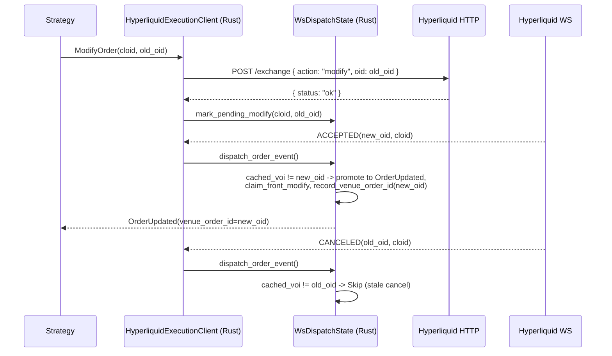

# Hyperliquid

[Hyperliquid](https://hyperliquid.gitbook.io/hyperliquid-docs) 是一个去中心化的永续期货和
现货交易所,构建在专为交易优化的 Hyperliquid L1 区块链之上。HyperCore
提供完全链上的订单簿和撮合引擎。该集成支持接入 Hyperliquid 的实时
市场数据与订单执行。

## 概览

该适配器以 Rust 实现,带有 Python 绑定。它直接与 Hyperliquid 的
REST 和 WebSocket API 集成,无需依赖外部客户端库。

Hyperliquid 适配器包含多个组件:

- `HyperliquidHttpClient`:底层 HTTP API 连接。
- `HyperliquidWebSocketClient`:底层 WebSocket API 连接。
- `HyperliquidInstrumentProvider`:标的解析与加载功能。
- `HyperliquidDataClient`:市场数据流管理器。
- `HyperliquidExecutionClient`:账户管理与交易执行网关。
- `HyperliquidDataClientFactory`:Hyperliquid 数据客户端工厂(供
  交易节点构建器使用)。
- `HyperliquidExecutionClientFactory`:Hyperliquid 执行客户端工厂
  (供交易节点构建器使用)。

:::note
大多数用户只需为实时交易节点定义配置(如下所示),不必直接与这些底层
组件打交道。
:::

## 示例

可以在[这里](https://github.com/nautechsystems/nautilus_trader/tree/develop/examples/live/hyperliquid/)找到实时示例脚本。

## Builder code 归属标注

已提交的主网订单会携带 NautilusTrader 的 builder code,费率为
**零**,因此该归属标注不会增加任何交易成本。这有助于我们评估该集成
的实际使用情况,并据此确定持续维护的优先级。对于大规模交易的用户,
标注订单流也可能有资格获得
[机构](https://nautilustrader.io/institutional/)等级的直接支持。

你可以通过在序列化配置中设置
`include_builder_attribution: false`,或在 Python 中设置
`include_builder_attribution=False`,来选择退出归属标注。

在以下三种情况下,订单中会省略 builder 地址:

- **测试网**:Hyperliquid 测试网会拒绝携带钱包未明确批准的 builder
  地址的订单(水龙头注资的测试网钱包通常没有批准),因此测试网订单
  永远不会包含 builder。
- **金库交易**(配置了 `vault_address`):Hyperliquid 不允许金库
  批准 builder 手续费,因此包含 builder 地址会导致交易所拒绝该订单。
- **归属标注已禁用**(`include_builder_attribution=False`):选择
  不标注其订单流的用户可以显式禁用 builder 归属标注。

```python
from nautilus_trader.adapters.hyperliquid import HyperliquidExecClientConfig

config = HyperliquidExecClientConfig(
    include_builder_attribution=False,
)
```

### Builder 手续费批准

在订单能够携带 builder 地址之前,Hyperliquid 要求进行一次性的
`ApproveBuilderFee` 批准:来自从未批准过 builder 手续费的钱包的
订单,会以 `Builder fee has not been approved` 原因被拒绝(任何
先前的批准,即使费率为 0%,也满足该检查)。该批准必须由主钱包的
私钥签署,而适配器在 agent(API)钱包设置中并不持有该私钥,因此它
作为一次性脚本运行,而非在执行客户端启动时运行。0% 的最大手续费率
仅允许归属标注:永远不会收取任何 builder 手续费,若要提高该费率,
则需要由你重新签署一次批准。

每个钱包运行一次批准脚本(读取 `HYPERLIQUID_PK`,或配合
`HYPERLIQUID_TESTNET=true` 使用 `HYPERLIQUID_TESTNET_PK`):

```bash
cargo run -p nautilus-hyperliquid --bin hyperliquid-builder-fee-approve
```

或从 Python 中运行:

```python
from nautilus_trader.adapters.hyperliquid import builder_fee_approve

builder_fee_approve()
```

### 撤销批准

使用撤销操作,将先前批准的 builder 手续费上限设为 0%(例如,某个
早期版本曾收取过 builder 手续费的批准)。撤销会限定该费率上限;它
不会移除批准记录本身,因此除非禁用了 `include_builder_attribution`,
否则归属标注仍会继续。

```bash
cargo run -p nautilus-hyperliquid --bin hyperliquid-builder-fee-revoke
```

或从 Python 中运行:

```python
from nautilus_trader.adapters.hyperliquid import builder_fee_revoke

builder_fee_revoke()
```

Rust 脚本会打印该操作的摘要,并在签名之前暂停,等待按下 Enter 键;
如果摘要中有任何内容看起来不对,请使用 `Ctrl+C` 中止,或传入
`--yes` 以跳过提示。Python 绑定不会提示确认:调用前请自行检查当前
的环境变量。

## 测试网设置

Hyperliquid 提供了一个测试网环境,可以使用模拟资金测试策略。

:::info
**需要主网账户。** Hyperliquid 的测试网水龙头仅对先前在主网存过款的
钱包生效。你必须先为主网账户注资,才能获得测试网 USDC。
:::

### 获取测试网资金

要接收测试网 USDC,你必须先使用同一个钱包地址在**主网**上存过款:

1. 访问 [Hyperliquid 主网门户](https://app.hyperliquid.xyz/),使用你的
   钱包进行一次存款。
2. 使用同一个钱包访问[测试网水龙头](https://app.hyperliquid-testnet.xyz/drip)。
3. 从水龙头领取 1,000 模拟 USDC。

:::note
**邮箱钱包用户**:邮箱登录会为主网和测试网生成不同的地址。要使用
水龙头,请从主网导出你的邮箱钱包,将其导入 MetaMask 或 Rabby,然后
将扩展连接到测试网。
:::

### 创建测试网账户

1. 访问 [Hyperliquid 测试网门户](https://app.hyperliquid-testnet.xyz/)。
2. 连接你的钱包(MetaMask、WalletConnect 或邮箱)。
3. 测试网会自动为你的钱包地址创建一个账户。

### 导出你的私钥

要在 NautilusTrader 中使用你的测试网账户,你需要导出钱包的私钥:

**MetaMask:**

1. 点击账户旁边的三点菜单。
2. 选择 “Account details”。
3. 点击 “Show private key”。
4. 输入密码并复制私钥。

:::warning
**切勿分享你的私钥。**
使用环境变量安全地存储私钥;切勿将其提交到版本控制中。
:::

### 设置环境变量

将你的测试网凭证设置为环境变量:

```bash
export HYPERLIQUID_TESTNET_PK="your_private_key_here"
# 可选:用于金库交易
export HYPERLIQUID_TESTNET_VAULT="vault_address_here"
```

当配置中 `environment=HyperliquidEnvironment.TESTNET` 时,适配器会
自动加载这些变量。

:::warning
**Agent / API 钱包**:如果 `HYPERLIQUID_TESTNET_PK` 是一个在主账户
下批准的[agent 钱包](#agent-钱包)(在 Hyperliquid UI 上创建 API
钱包时的典型设置),你还必须将 `HYPERLIQUID_ACCOUNT_ADDRESS` 设置为
主账户地址。否则,即使订单在场所上是活跃的,`OrderStatusReport`
请求和 WebSocket 用户数据流也会返回空结果。参见
[GH-4010](https://github.com/nautechsystems/nautilus_trader/issues/4010)。
:::

## 产品支持

Hyperliquid 提供正向永续期货、HIP-3 builder 部署的永续合约、原生
现货市场,以及 HIP-4 二元结果市场。

| 产品类型      | 数据源 | 交易 | 备注                                                   |
|-------------------|-----------|---------|---------------------------------------------------------|
| 现货              | ✓         | ✓       | 原生现货市场。                                    |
| 永续期货 | ✓         | ✓       | 以 USDC 结算的正向永续合约(由验证者运营)。         |
| HIP-3 永续合约  | ✓         | ✓       | Builder 部署的永续合约,按 dex 独立抵押品。选择性启用。 |
| HIP-4 结果合约    | ✓         | ✓       | 以 USDH 结算的二元结果。选择性启用。                   |

:::note
标准的 Hyperliquid 永续合约以 USDC 结算。HIP-3 dex 可能以自己的
抵押代币结算,例如 USDH、USDE 或 USDT0,同时在符号中仍将计价货币
标记为 `USD`。现货市场是标准的货币对。配置和启用方式详情参见
[HIP-3 builder 部署的永续合约](#hip-3-builder-部署的永续合约)和
[HIP-4 结果市场](#hip-4-结果市场)。Hyperliquid 当前的 API 文档将
`outcomeMeta` 标记为仅限测试网,因此 HIP-4 的发现依赖于所选环境是否
提供该载荷。
:::

## 符号规则

Hyperliquid 对标的使用特定的符号格式:

### 现货市场

格式:`{Base}-{Quote}-SPOT`

示例:

- `PURR-USDC-SPOT` - PURR/USDC 现货交易对
- `HYPE-USDC-SPOT` - HYPE/USDC 现货交易对

在策略中订阅:

```python
InstrumentId.from_str("PURR-USDC-SPOT.HYPERLIQUID")
```

:::note
现货标的可能包含金库代币(以 `vntls:` 为前缀)。标的提供者会自动
处理这些代币。
:::

### 永续期货

格式:`{Base}-USD-PERP`

示例:

- `BTC-USD-PERP` - 比特币永续期货
- `ETH-USD-PERP` - 以太坊永续期货
- `SOL-USD-PERP` - Solana 永续期货

在策略中订阅:

```python
InstrumentId.from_str("BTC-USD-PERP.HYPERLIQUID")
InstrumentId.from_str("ETH-USD-PERP.HYPERLIQUID")
```

### HIP-3 永续合约

格式:`{dex}:{Asset}-USD-PERP`

[HIP-3](https://hyperliquid.gitbook.io/hyperliquid-docs/hyperliquid-improvement-proposals-hips/hip-3-builder-deployed-perpetuals)
市场使用以冒号分隔的 dex 前缀。dex 名称标识该市场属于哪个 builder
部署的永续 dex。

示例:

- `xyz:TSLA-USD-PERP` - trade.xyz 上的特斯拉永续合约
- `xyz:GOLD-USD-PERP` - trade.xyz 上的黄金永续合约
- `flx:NVDA-USD-PERP` - Felix 上的英伟达永续合约
- `vntl:SPACEX-USD-PERP` - Ventuals 上的 SpaceX 永续合约

在策略中订阅:

```python
InstrumentId.from_str("xyz:TSLA-USD-PERP.HYPERLIQUID")
```

### HIP-4 结果侧代币

格式:`{outcome_index}-{YES|NO}-OUTCOME.HYPERLIQUID`,其中
`outcome_index` 是来自 `outcomeMeta` 的 `outcome` 字段,中间部分
标记二元的哪一侧。`-OUTCOME` 后缀与 `-PERP` / `-SPOT` 对称。

[HIP-4](https://hyperliquid.gitbook.io/hyperliquid-docs/hyperliquid-improvement-proposals-hips/hip-4-outcome-markets)
侧代币是全额抵押的二元合约,在解析日以 `0`(输方)或 `1`(赢方)
结算。Nautilus 符号使用上方人类可读的形式;传输层的 `raw_symbol`
使用场所的币种形式 `#{encoding}`(其中
`encoding = 10 * outcome_index + side`,`side` 为 `0` 表示 Yes、
`1` 表示 No),这是 `l2Book` 和 `allMids` 所接受的格式。

示例(outcome 25):

- `25-YES-OUTCOME.HYPERLIQUID`:Yes 侧。编码 `250`,传输层币种
  `#250`,代币名称 `+250`,操作资产 ID `100_000_250`。
- `25-NO-OUTCOME.HYPERLIQUID`:No 侧。编码 `251`,传输层币种
  `#251`,代币名称 `+251`,操作资产 ID `100_000_251`。

在策略中订阅:

```python
InstrumentId.from_str("25-YES-OUTCOME.HYPERLIQUID")
```

:::note
结果的编号会循环使用。每次结算都会从 `outcomeMeta` 中移除已解析的
结果,场所下一次上市会推进该索引。可以使用
`curl -s -X POST https://api.hyperliquid.xyz/info -d '{"type":"outcomeMeta"}'`
查看当前实时的编号集合。
:::

交易流程、结算和当前限制,参见
[HIP-4 结果市场](#hip-4-结果市场)。

## HIP-3 builder 部署的永续合约

[HIP-3](https://hyperliquid.gitbook.io/hyperliquid-docs/hyperliquid-improvement-proposals-hips/hip-3-builder-deployed-perpetuals)
允许符合条件的部署方在 Hyperliquid 上启动无需许可的永续 dex。这些
市场包括股票(TSLA、NVDA、AAPL)、商品(黄金、原油)、指数
(标普 500),以及 IPO 前代币(SpaceX、OpenAI)。

在实时 `TradingNode` 中,HIP-3 永续合约会在连接时与标准永续合约
一起自动加载:适配器会从 `allPerpMetas` 获取每一个永续 dex(标准的
和 builder 部署的),因此无需额外的客户端配置。

要缩小加载范围,请使用 `InstrumentProviderConfig` 过滤:

```python
instrument_provider=InstrumentProviderConfig(
    load_all=True,
    filters={"market_types": ["perp_hip3"]},
)
```

对于直接使用 `HyperliquidHttpClient` 的场景,除非通过
`load_instrument_definitions` 显式启用,否则 HIP-3 永续 dex 会被
排除:

```python
from nautilus_trader.adapters.hyperliquid import HyperliquidEnvironment
from nautilus_trader.adapters.hyperliquid import HyperliquidHttpClient

client = HyperliquidHttpClient.from_env(HyperliquidEnvironment.MAINNET)
instruments = await client.load_instrument_definitions(
    include_spot=True,
    include_perps=True,
    include_perps_hip3=True,
    include_outcomes=False,
)
```

### 与标准永续合约的差异

HIP-3 市场在同一个 HyperCore 撮合引擎上交易,并使用相同的订单
API。主要差异如下:

- **更高的手续费**:默认为标准永续合约手续费的 2 倍。部署方获得
  其中一半。
- **逐仓保证金**:HIP-3 市场默认仅支持逐仓保证金。
- **按 dex 的抵押品**:每个 HIP-3 dex 通过其在 `allPerpMetas` 中
  的 `collateralToken` 条目声明其结算代币。Nautilus 通过
  `spotMeta` 解析该代币,并将符号的计价部分保持为 `USD`。如果非
  USDC 抵押代币无法从 `spotMeta` 中解析,标的加载会返回一个错误,
  而非回退到 USDC。
- **部署方管理的预言机**:预言机数据流由部署方运营,而非验证者。
- **增长模式**:部分 dex 启用了增长模式,可将协议手续费降低 90%。

完整的协议详情,参见 Hyperliquid 文档:

- [HIP-3 提案](https://hyperliquid.gitbook.io/hyperliquid-docs/hyperliquid-improvement-proposals-hips/hip-3-builder-deployed-perpetuals)
- [HIP-3 部署方操作](https://hyperliquid.gitbook.io/hyperliquid-docs/for-developers/api/hip-3-deployer-actions)
- [资产 ID](https://hyperliquid.gitbook.io/hyperliquid-docs/for-developers/api/asset-ids)
- [手续费](https://hyperliquid.gitbook.io/hyperliquid-docs/trading/fees)

### 通配符字符清理

部分 HIP-3 dex 部署的资产,其场所名称中包含 `*` 或 `?` 字节(例如
`dex:STREAMABCD****-USD-PERP`)。这些字节与 Nautilus 消息总线的
模式语法(`*` = 零个或多个,`?` = 一个字符)冲突,如果未经处理就
嵌入到主题字符串中,会破坏订阅路由。

Hyperliquid 适配器在构造 `InstrumentId.symbol` 时,会将这两种字节
都替换为 `x`,因此一个名为 `dex:STREAMABCD****` 的 HIP-3 资产会以
如下形式暴露给策略:

```python
InstrumentId.from_str("dex:STREAMABCDxxxx-USD-PERP.HYPERLIQUID")
```

这一替换仅适用于用于主题、缓存、日志和配置的 Nautilus 内部符号。
场所官方名称会保留在标的的 `raw_symbol` 字段中,用于 HTTP 和
WebSocket 传输层调用,下单时也引用数字资产索引,因此与 Hyperliquid
之间的往返不受影响。

订阅场所名称中带有通配符字节的 HIP-3 标的时,请使用清理后的形式。
不含 `*` 或 `?` 的符号会原样通过。

该替换是有损的:两个不同的场所名称,例如 `dex:FOO*` 和
`dex:FOO?`,会被规范化为同一个 Nautilus 符号。标的加载器会检测
这种冲突,保留第一个定义,并记录一条带被丢弃场所名称的警告;被
丢弃的标的在场所重命名解决该冲突之前,无法通过 Nautilus 交易。

## HIP-4 结果市场

[HIP-4](https://hyperliquid.gitbook.io/hyperliquid-docs/for-developers/api/asset-ids#outcomes)
市场是全额抵押的二元合约。每个市场有两个侧代币(Yes / No),在
解析日结算为 `1 USDH`(赢方)或 `0 USDH`(输方)。Hyperliquid 当前
的 API 文档通过 `outcomeMeta` 暴露结果元数据,并将该端点标记为
仅限测试网。适配器将结果元数据视为“尽力而为”,当场所不返回该载荷
时,会跳过 HIP-4 标的。

### 加载结果标的

在实时 `TradingNode` 中,当场所暴露 `outcomeMeta` 时,结果标的会
自动(尽力而为地)加载;当前 Hyperliquid 文档将该元数据端点标记为
仅限测试网,当该载荷不可用时,适配器会跳过 HIP-4 标的。无需客户端
配置。

对于直接使用 `HyperliquidHttpClient` 的场景,请通过
`load_instrument_definitions` 显式启用:

```python
from nautilus_trader.adapters.hyperliquid import HyperliquidEnvironment
from nautilus_trader.adapters.hyperliquid import HyperliquidHttpClient

client = HyperliquidHttpClient.from_env(HyperliquidEnvironment.TESTNET)
instruments = await client.load_instrument_definitions(
    include_spot=True,
    include_perps=True,
    include_perps_hip3=False,
    include_outcomes=True,
)
```

提供者为每个结果发出两个 `BinaryOption` 标的(每侧一个),以 USDH
计价。符号使用
`{outcome_index}-{YES|NO}-OUTCOME.HYPERLIQUID` 的形式。
`expiration_ns` 从场所描述(`expiry:YYYYMMDD-HHMM`,UTC)中解析。
独立的二元合约携带自己的到期时间;命名和回退结果继承自其父问题。
默认值:每 tick `0.0001`,每手 `0.01`。

每个标的的 `BinaryOption.info` 携带解析后的场所元数据键值对
(在 Python 中通过 `info["key"]` 访问,在 Rust 中通过
`Params.get_str(...)`)。派生标识符始终会被填充;当场所包含描述
派生字段时,这些字段才会出现。

| 字段              | 来源                         | 备注                                             |
|--------------------|--------------------------------|-----------------------------------------------------|
| `outcome_index`    | 派生                        | 来自 `outcomeMeta` 的 `outcome`                      |
| `outcome_side`     | 派生                        | `0` = Yes,`1` = No                               |
| `side_name`        | 派生                        | `"Yes"` 或 `"No"`                                 |
| `encoding`         | 派生                        | `10 * outcome_index + side`                       |
| `asset_id`         | 派生                        | `100_000_000 + encoding`                          |
| `market_name`      | `outcomeMeta.outcomes[*].name` | 场所市场标签                                |
| `class`            | 描述                    | `priceBinary` 或 `priceBucket`                    |
| `underlying`       | 描述                    | 标的资产代码                               |
| `expiry`           | 描述                    | `YYYYMMDD-HHMM` UTC                               |
| `target_price`     | 描述                    | 二元结算阈值                       |
| `period`           | 描述                    | 重复周期(例如 `1d`、`3m`)               |
| `price_thresholds` | 描述                    | 逗号分隔的阈值(bucket 市场)       |
| `named_index`      | 命名结果描述      | 在父 `named_outcomes` 数组中的位置 |
| `is_fallback`      | 回退结果描述   | 某问题的 `other` 结果为 `true`              |
| `question`         | 父问题                | 问题 ID                                       |
| `question_name`    | 父问题                | 问题标签                                   |
| `question_*`       | 父问题描述    | 每个已解析的问题字段,带 `question_` 前缀 |

描述键从场所的驼峰命名法降为蛇形命名法
(`targetPrice` -> `target_price`,`priceThresholds` ->
`price_thresholds`)。值保留为字符串,以保持传输层的一致性;数字
标识符(`outcome_index`、`outcome_side`、`encoding`、`asset_id`、
`question`、`named_index`)存储为 JSON 数字。

### 结算货币

结果以 USDH 结算(代币索引 360,在 `USDH/USDC` 现货交易对 `@230`
上交易)。适配器在首次创建结果标的时,以 8 位小数精度注册 USDH,
因此 `BinaryOption.currency`、`quote_currency`,以及零手续费结果
成交的手续费货币,都会解析为 USDH。

USDH 现货余额会与永续清算所视图合并,因此 `AccountState` 会携带
USDH,以及 USDC 和任何其他非零现货持仓。

### 交易流程

结果侧代币(`{outcome_index}-{YES|NO}-OUTCOME.HYPERLIQUID`)通过
标准的下单路径交易。像对待任何永续或现货标的一样提交
`SubmitOrder`;执行客户端会通过相同的 `Order` 操作,将其路由到场所的
`#{encoding}` 订单簿(其中
`encoding = 10 * outcome_index + outcome_side`)。不需要 HIP-4
专属的调用。

结算由场所驱动;参见[结算分发](#结算分发)。

#### 高级工作流

对于需要在场外管理侧代币库存的策略,完整的 `userOutcome` 操作集
可以直接在 `HyperliquidHttpClient`(Rust 和 PyO3)上访问:

```python
from decimal import Decimal
from nautilus_trader.core.nautilus_pyo3 import HyperliquidEnvironment
from nautilus_trader.core.nautilus_pyo3 import HyperliquidHttpClient

client = HyperliquidHttpClient.from_env(HyperliquidEnvironment.MAINNET)

# 从 USDH 铸造配对的 Yes + No 侧代币(例如双向做市)
await client.submit_split_outcome(50, Decimal("1.0"))

# 将配对的 Yes + No 组合销毁回 USDH(amount=None 表示合并最大数量)
await client.submit_merge_outcome(50, None)

# 多结果 priceBucket 辅助方法
await client.submit_merge_question(9, None)
await client.submit_negate_outcome(9, 52, Decimal("1.0"))
```

| 操作                  | 使用场景 |
|-------------------------|----------|
| `submit_split_outcome`  | 从计价货币铸造配对的 Yes + No 代币(初始做市、双向对冲) |
| `submit_merge_outcome`  | 将配对的 Yes + No 组合销毁回计价货币,而无需穿越价差 |
| `submit_merge_question` | 将一个完整的多结果篮子原子性地平仓回计价货币 |
| `submit_negate_outcome` | 将某个结果的 No 份额转换为同一问题下所有其他结果的 Yes 份额 |

对于方向性下注,普通的 `SubmitOrder` 路径就足够了;上述方法仅在
你想要在场外创建或销毁侧代币库存时才需要。

### 订单限制

结果侧代币的行为类似于现货代币(无保证金、无资金费率、无强平)。
执行客户端会拒绝不适用的功能:

- `reduce_only` 订单。
- 触发型订单类型(`StopMarket`、`StopLimit`、`MarketIfTouched`、
  `LimitIfTouched`、跟踪止损)。

支持带 `GTC`、`IOC` 或 `ALO` 有效期的 `Limit` 和 `Market` 订单。
场所最小值为 10 USDH 名义金额;请将 `order_qty` 设置为使得
`order_qty * limit_price >= 10`。

### 结算分发

到期时,场所会平掉持有的侧代币余额,并为每一侧发出一个
`Settlement` 成交。适配器通过标准的用户成交流(HTTP 轮询和
WebSocket)消费这些成交;不运行合成分发。

每笔结算成交:

- `order_side = SELL`,零手续费。
- 赢方价格为 `1` USDH,输方为 `0`。
- 呈现为一份 `FillReport`。
- 当 WebSocket 分发将该仓位关联到一个被跟踪的订单时,也会发出
  `OrderFilled`。

统一覆盖独立的 `priceBinary` 结果以及多结果的 `priceBucket` 问题。

### 仓位对账

HIP-4 侧代币在 `spotClearinghouseState` 上以 `+E` 代币形式出现,
`coin` 字段被设置,但没有 `token` 字段。适配器:

- 在反序列化期间将 `SpotBalance.token` 视为可选。
- 在生成 `PositionStatusReport` 时,将 `+E` / `#E` 币种解析为其
  `BinaryOption` 标的。
- 当仓位状态过滤器为一个结果标的时,跳过永续清算所的获取(结果
  永远不会出现在 `assetPositions` 中)。

### 多结果(priceBucket)市场

场所通过 `outcomeMeta` 中顶层的 `questions` 数组暴露多结果市场。
每个问题引用一个回退结果,加上一系列命名结果,其各自的描述通过
`index:N` 指回该问题。每个侧代币都被建模为一个独立的
`BinaryOption` 标的;`HyperliquidHttpClient` 上的
`submit_merge_question` 和 `submit_negate_outcome` 操作在问题
层面运作,用于篮子平仓和跨结果轮转。

## 标的提供者

标的提供者支持在通过 `InstrumentProviderConfig(filters=...)`
加载标的时进行过滤:

| 过滤键                  | 类型        | 说明                                 |
|-----------------------------|-------------|---------------------------------------------|
| `market_types`(或 `kinds`) | `list[str]` | `"perp"`、`"perp_hip3"` 或 `"spot"`。       |
| `bases`                     | `list[str]` | 基础货币代码,例如 `["BTC", "ETH"]`。 |
| `quotes`                    | `list[str]` | 计价货币代码,例如 `["USDC"]`。      |
| `symbols`                   | `list[str]` | 完整符号,例如 `["BTC-USD-PERP"]`。      |

仅加载永续标的的示例:

```python
instrument_provider=InstrumentProviderConfig(
    load_all=True,
    filters={"market_types": ["perp"]},
)
```

## 数据订阅

适配器支持以下数据订阅。所有永续数据类型(标记价格、指数价格、
资金费率)都同时适用于标准永续和 HIP-3 永续。

| 数据类型         | 订阅 | 快照 | 历史 | Nautilus 类型                 | 备注                                 |
|-------------------|------|----------|-------|--------------------------------|---------------------------------------|
| 成交 tick       | ✓    | -        | ✓     | `TradeTick`                   | WebSocket 成交;`recentTrades`。     |
| 公开成交       | ✓    | -        | ✓     | `HyperliquidPublicTrade`      | 选择性启用的自定义数据,包含交易对手和哈希。 |
| 报价 tick       | ✓    | -        | -     | `QuoteTick`                   | 最优买卖价。                       |
| 订单簿增量 | ✓    | ✓        | -     | `OrderBookDelta`              | L2 快照。                         |
| 订单簿深度  | ✓    | -        | -     | `OrderBookDepth10`            | 前 10 档 L2 快照。                  |
| K 线              | ✓    | -        | ✓     | `Bar`                         | 支持的周期见下文。            |
| 标记价格       | ✓    | -        | -     | `MarkPriceUpdate`             | 永续标记价格 tick。           |
| 指数价格      | ✓    | -        | -     | `IndexPriceUpdate`            | 标的参考价格。          |
| 资金费率     | ✓    | -        | ✓     | `FundingRateUpdate`           | `fundingHistory` 端点。            |
| 未平仓合约     | ✓    | -        | -     | `HyperliquidOpenInterest`     | 来自 `activeAssetCtx` 的自定义数据。    |
| 全部中间价          | ✓    | -        | -     | `HyperliquidAllMids`          | 来自 `allMids` 的自定义数据。           |
| 全部 dex 上下文  | ✓    | -        | -     | `HyperliquidAllDexsAssetCtxs` | 来自 `allDexsAssetCtxs` 的自定义数据。  |

:::note
不支持历史报价请求。历史成交请求使用 `recentTrades` 信息端点,该
端点返回最近的公开成交快照(最新在前),没有时间范围。
`request_trades` 会将该快照过滤到请求的 `[start, end]` 窗口,并
通过保留最新的成交来应用 `limit`。当请求超出快照中最早的成交时,
适配器会记录一条警告,并提供可用的子集(或空响应)。该端点依赖
Hyperliquid 索引器:自托管的 `/info` 节点会返回 HTTP 422,适配器
会将其视为无覆盖,并以空响应答复。实时成交仍可通过 WebSocket 的
`trades` 频道获取。
:::

### 订单簿精度控制

`l2Book` 订阅接受可选的 `nSigFigs` 和 `mantissa` 参数,用于精简
场所侧的订单簿聚合。当通过订单簿增量和深度订阅的 `subscribe_params`
传入时,适配器会转发它们。

Hyperliquid 接受的 `nSigFigs` 值为 `2`、`3`、`4`、`5`,或省略表示
完整精度。`mantissa` 仅在 `nSigFigs=5` 时有效,接受 `1`、`2` 或 `5`。

```python
from nautilus_trader.model.data import BookType

self.subscribe_order_book_deltas(
    instrument_id=instrument_id,
    book_type=BookType.L2_MBP,
    params={"n_sig_figs": 5, "mantissa": 2},
)
```

省略两个参数会订阅完整深度的订单簿。

同一标的的订单簿增量和深度 10 快照共享同一个场所 `l2Book` 数据流:

- 第一个订阅会打开该数据流,并设置其精度选项。
- 在该数据流活跃期间请求不同的选项会记录一条警告,并保持当前活跃的
  选项。
- 当两种用途中的最后一个取消订阅时,该数据流会关闭。
- 重连会以原始精度选项恢复该数据流。

### Hyperliquid 特有数据

该适配器会发出 Hyperliquid 特有的自定义数据类型:

- 来自 WebSocket `allMids` 数据流的 `HyperliquidAllMids`。每次更新
  在一个载荷中携带所有当前报告的中间价。
- 来自 WebSocket `allDexsAssetCtxs` 数据流的
  `HyperliquidAllDexsAssetCtxs`。每次更新携带跨默认永续 dex 和
  HIP-3 builder dex 的、按标的规范化的资产上下文条目。
- 来自标记价格、指数价格和资金费率共用的 `activeAssetCtx` 数据流的
  `HyperliquidOpenInterest`。
- 来自 `trades` 和 `recentTrades` 的 `HyperliquidPublicTrade`。
  每个事件都是自包含的,包含买方、卖方和场所哈希。

| 字段      | 类型             | 说明                                              |
|------------|------------------|------------------------------------------------------------|
| `mids`     | `dict[str, str]` | 标的 ID 到中间价的映射。                      |
| `ts_event` | `int`            | 更新发生时的 UNIX 时间戳(纳秒)。  |
| `ts_init`  | `int`            | 该对象构建时的 UNIX 时间戳(纳秒)。 |

通过 `DataType(HyperliquidAllMids)` 从 actor 或策略中订阅。对于
HIP-3 dex 专属的数据流,请在 `metadata["dex"]` 中传入场所 dex:

```python
from nautilus_trader.adapters.hyperliquid.constants import HYPERLIQUID_CLIENT_ID
from nautilus_trader.adapters.hyperliquid.data import HyperliquidAllMids
from nautilus_trader.model.data import DataType

self.subscribe_data(
    data_type=DataType(HyperliquidAllMids, metadata={"dex": "hyperliquid"}),
    client_id=HYPERLIQUID_CLIENT_ID,
)
```

`HyperliquidOpenInterest` 携带一个永续标的的最新未平仓合约。在
`metadata["instrument_id"]` 中传入规范的 Nautilus `instrument_id`
进行订阅:

| 字段           | 类型           | 说明                                                                 |
|-----------------|----------------|-----------------------------------------------------------------------------|
| `instrument_id` | `InstrumentId` | 规范的 Nautilus 标的 ID。                                           |
| `open_interest` | `Decimal`      | 解析为可直接进行算术运算的未平仓合约数。                             |
| `ts_event`      | `int`          | 更新发生时的 UNIX 时间戳(纳秒)。与 `ts_init` 相同。  |
| `ts_init`       | `int`          | 该对象构建时的 UNIX 时间戳(纳秒)。                    |

```python
from nautilus_trader.adapters.hyperliquid import HYPERLIQUID_CLIENT_ID
from nautilus_trader.adapters.hyperliquid import HyperliquidOpenInterest
from nautilus_trader.model.data import DataType

self.subscribe_data(
    data_type=DataType(
        HyperliquidOpenInterest,
        metadata={"instrument_id": str(self.instrument_id)},
    ),
    client_id=HYPERLIQUID_CLIENT_ID,
)
```

`HyperliquidOpenInterest` 复用了已经为同一币种的标记价格、指数价格
和资金费率提供支撑的同一个底层 `activeAssetCtx` 场所订阅。添加 OI
订阅不会打开第二个并行的 `activeAssetCtx` 订阅。

`HyperliquidPublicTrade` 是通用 `TradeTick` 的一个选择性启用的
替代方案,用于公开订单流研究。它具有 `instrument_id`、`price`、
`size`、`aggressor_side`、`trade_id`、`buyer`、`seller`、`hash`、
`ts_event` 和 `ts_init`。使用相同的规范标的元数据订阅:

```python
from nautilus_trader.adapters.hyperliquid import HYPERLIQUID_CLIENT_ID
from nautilus_trader.adapters.hyperliquid import HyperliquidPublicTrade
from nautilus_trader.model.data import DataType

self.subscribe_data(
    data_type=DataType(
        HyperliquidPublicTrade,
        metadata={"instrument_id": str(self.instrument_id)},
    ),
    client_id=HYPERLIQUID_CLIENT_ID,
)
```

当两者同时被请求时,它与 `TradeTick` 共享同一个场所的 `trades`
订阅。与旁挂的 `users` 事件不同,每条 `HyperliquidPublicTrade` 都
可以独立进行 Arrow 序列化,能够在无需连接的情况下记录到 Nautilus
catalog 并从中查询。该类型的 `RequestCustomData` 使用与历史成交
请求相同的仅限最近的 `recentTrades` 快照。

在 `TradingNode` 内运行的 Python 策略中,该载荷会以具体的自定义
数据类型本身传递给 `on_data`:

```python
from decimal import Decimal

from nautilus_trader.adapters.hyperliquid import HyperliquidOpenInterest

def on_data(self, data) -> None:
    if isinstance(data, HyperliquidOpenInterest):
        if data.open_interest > Decimal("1000"):
            self.log.info(f"OI {data.instrument_id} -> {data.open_interest}")
```

`HyperliquidAllDexsAssetCtxs` 暴露的是整个数据流的聚合,而非每个
标的一个主题,因此策略只需订阅一次,然后过滤出所需的规范化条目:

| 字段             | 类型                              | 说明                                                                |
|-------------------|-----------------------------------|------------------------------------------------------------------------|
| `dex`             | `str`                             | 来自 Hyperliquid `perpDexs` 的永续 dex 标识符。`""` 是默认 dex。  |
| `instrument_id`   | `InstrumentId`                    | 该条目对应的规范 Nautilus 标的 ID。                            |
| `mark_price`      | `Price`                           | 当前标记价格。                                                        |
| `oracle_price`    | `Price`                           | 当前预言机/指数参考价格。                                              |
| `prev_day_price`  | `Price`                           | 来自场所载荷的前一日参考价格。                       |
| `mid_price`       | `Price \| None`                   | 场所载荷中存在时的中间价。                               |
| `impact_prices`   | `HyperliquidImpactPrices \| None` | 存在时的最优买卖冲击价格。                                 |
| `funding_rate`    | `Decimal`                         | 解析为可直接进行算术运算的资金费率。                             |
| `open_interest`   | `Decimal`                         | 解析为可直接进行算术运算的未平仓合约数。                             |
| `premium`         | `Decimal \| None`                 | 场所载荷中存在时的溢价。                                 |
| `day_ntl_volume`  | `Decimal`                         | 24 小时名义成交量。                                                       |
| `day_base_volume` | `Decimal`                         | 24 小时基础成交量。                                                       |
| `ts_event`        | `int`                             | 更新发生时的 UNIX 时间戳(纳秒)。与 `ts_init` 相同。 |
| `ts_init`         | `int`                             | 该对象构建时的 UNIX 时间戳(纳秒)。                   |

底层的 Hyperliquid 传输层载荷以 `ctxs: [[dex, ctxs[]], ...]` 形式
到达。适配器解码该实时场所格式,并在策略看到数据之前,将其规范化为
下方展示的按条目输出形式。

适配器不会凭空创造 `dex` 值。它从 Hyperliquid 的 `meta` /
`allPerpMetas` 初始化有序的 dex 全集,并从实时的 `perpDexs` 信息
端点解析 builder dex 标识符。空字符串 `""` 表示 Hyperliquid 的
默认永续 dex;非空值(如 `xyz`、`flx` 或 `vntl`)是场所定义的
builder dex 标识符。

该映射根据连接时加载的标的解析,且该数据流是按位置排列的(没有
按条目的币种名称),因此后续上市的永续合约只有在重连后才会出现。
某个 dex 的上下文数量不匹配会记录一条警告以提示重连;条目按位置
保持对齐,这对于追加上市的情况是正确的。

```python
from nautilus_trader.adapters.hyperliquid import HYPERLIQUID_CLIENT_ID
from nautilus_trader.adapters.hyperliquid import HyperliquidAllDexsAssetCtxs
from nautilus_trader.model.data import DataType

self.subscribe_data(
    data_type=DataType(HyperliquidAllDexsAssetCtxs),
    client_id=HYPERLIQUID_CLIENT_ID,
)

def on_data(self, data) -> None:
    if isinstance(data, HyperliquidAllDexsAssetCtxs):
        for entry in data.entries:
            if entry.dex == "xyz":
                self.log.info(f"{entry.instrument_id} OI={entry.open_interest}")
```

### 支持的 K 线周期

| 精度 | Hyperliquid K 线 |
|------------|--------------------|
| 1-MINUTE   | `1m`               |
| 3-MINUTE   | `3m`               |
| 5-MINUTE   | `5m`               |
| 15-MINUTE  | `15m`              |
| 30-MINUTE  | `30m`              |
| 1-HOUR     | `1h`               |
| 2-HOUR     | `2h`               |
| 4-HOUR     | `4h`               |
| 8-HOUR     | `8h`               |
| 12-HOUR    | `12h`              |
| 1-DAY      | `1d`               |
| 3-DAY      | `3d`               |
| 1-WEEK     | `1w`               |
| 1-MONTH    | `1M`               |

## 订单能力

Hyperliquid 支持完整的订单类型和执行选项集。

:::note
在下方的表格中,“永续合约” 同时涵盖标准的由验证者运营的永续合约,
以及 HIP-3 builder 部署的永续合约。相同的订单类型、有效期选项和
执行指令均适用于两者。
:::

### 订单类型

| 订单类型          | 永续合约 | 现货 | 备注                                               |
|---------------------|------------|------|-----------------------------------------------------|
| `MARKET`            | ✓          | ✓    | 带可配置滑点的 IOC 限价单,基于最优 BBO。 |
| `LIMIT`             | ✓          | ✓    |                                                     |
| `STOP_MARKET`       | ✓          | ✓    | 止损单。                                   |
| `STOP_LIMIT`        | ✓          | ✓    | 带限价执行的止损单。                     |
| `MARKET_IF_TOUCHED` | ✓          | ✓    | 市价止盈。                              |
| `LIMIT_IF_TOUCHED`  | ✓          | ✓    | 带限价执行的止盈。                   |

:::info
条件单(止损和触及型)使用 Hyperliquid 原生的触发单功能实现,带
自动的 TP/SL 模式检测。所有触发单都根据
[标记价格](https://hyperliquid.gitbook.io/hyperliquid-docs/trading/robust-price-indices)
评估。
:::

:::note
市价单需要缓存的报价数据。适配器使用最优卖价(买入)或最优买价
(卖出),加上可配置的滑点缓冲(默认 50 基点)。价格在提交前会
按 Hyperliquid 的价格约束进行取整。请确保为你打算使用市价单交易的
任何标的订阅报价。

滑点缓冲由 `HyperliquidExecClientConfig` 上的
`market_order_slippage_bps` 控制(默认 50 基点),也可以通过
`SubmitOrder.params` 中的 `market_order_slippage_bps` 键按订单
覆盖。
:::

:::note
`STOP_MARKET` 和 `MARKET_IF_TOUCHED` 订单不携带限价。适配器会用
相同的可配置滑点缓冲(默认 50 基点)从触发价格推导出一个限价,
取整到 5 位有效数字,并限制在场所的小数位上限内(买入向上取整,
卖出向下取整)。这保证了满足 Hyperliquid 的
`limit_px >= trigger_px`(买入)/ `limit_px <= trigger_px`
(卖出)约束。
:::

:::warning
**价格规范化默认启用。** Hyperliquid 对订单价格强制执行最多 5 位
有效数字,外加基于 `szDecimals` 的按资产小数位上限(永续为
`6 - szDecimals`,现货为 `8 - szDecimals`)。例如,如果 ETH 交易价
为 $2,600(4 位整数),即使标的的 `price_precision=2`,也只允许
1 位小数。

默认情况下,适配器会将所有出站限价和触发价格规范化为 5 位有效
数字,并将其限制在标的价格精度内,以防止订单被拒绝。这意味着你
提交的价格可能会有轻微变动。要禁用此功能并完全掌控价格格式,请在
`HyperliquidExecClientConfig` 中设置 `normalize_prices=False`。

如果你禁用了规范化,可以在策略中应用相同的取整逻辑:

```python
from decimal import Decimal, ROUND_DOWN

def round_to_sig_figs(price: Decimal, sig_figs: int = 5) -> Decimal:
    if price == 0:
        return Decimal(0)
    shift = sig_figs - int(price.adjusted()) - 1
    if shift <= 0:
        factor = Decimal(10) ** (-shift)
        return (price / factor).to_integral_value() * factor
    return round(price, shift)
```

:::

### 有效期

| 有效期 | 永续合约 | 现货 | 备注                |
|---------------|------------|------|-----------------------|
| `GTC`         | ✓          | ✓    | 撤销前有效。  |
| `IOC`         | ✓          | ✓    | 立即成交或取消。 |
| `FOK`         | -          | -    | *不支持*。     |
| `GTD`         | -          | -    | *不支持*。     |

### 执行指令

| 指令   | 永续合约 | 现货 | 备注                            |
|---------------|------------|------|-----------------------------------|
| `post_only`   | ✓          | ✓    | 等同于 ALO 有效期。 |
| `reduce_only` | ✓          | ✓    | 仅平仓订单。               |

:::info
会立即成交的 post-only 订单会被 Hyperliquid 拒绝。适配器会检测
这一情况,并生成一个 `OrderRejected` 事件。Post-only 订单通过
Hyperliquid 的 ALO(仅增加流动性)通道路由。
:::

### 订单操作

| 操作         | 永续合约 | 现货 | 备注                                                 |
|-------------------|------------|------|---------------------------------------------------------|
| 提交订单      | ✓          | ✓    | 单笔订单提交。                              |
| 提交订单列表 | ✓          | ✓    | 批量订单提交(单次 API 调用)。             |
| 修改订单      | ✓          | ✓    | 需要场所订单 ID。                              |
| 取消订单      | ✓          | ✓    | 按客户端订单 ID 取消。                            |
| 取消全部订单 | ✓          | ✓    | 对未成交订单批量使用 `cancelByCloid`。              |
| 批量取消      | ✓          | ✓    | 对提供的列表批量使用 `cancelByCloid`。        |

:::info
取消操作优先使用 `cancelByCloid`,当没有缓存的 CLOID 时回退到按
数字 OID 的 `cancel`;快速取消和标准取消作为独立的批量操作分发,
因此一次取消请求可能产生不止一次场所调用。

当场所在批量取消响应中返回一个权威的按订单拒绝结果时(例如,对于
一个已处于终态的订单返回 `MissingOrder`),适配器会为该订单发出
一个 `OrderCancelRejected` 事件,并保持其他取消操作不受影响。
场所结果未知的整体请求失败不携带这种按订单的证据。
:::

:::info
在 NautilusTrader 之外下达的订单(例如通过 Hyperliquid Web UI
或另一个客户端)会被检测并作为外部订单跟踪。它们会出现在订单状态
报告和仓位对账中。
:::

### 修改即取消重下

Hyperliquid 将订单修改实现为**取消重下**。
[交易所端点](https://hyperliquid.gitbook.io/hyperliquid-docs/for-developers/api/exchange-endpoint#modify-an-order)
上的 `modify` 操作会取消原订单(旧的 `oid`),并以新的 `oid` 打开
一个替代订单。两条腿共享相同的客户端订单 ID(`cloid`)。

修改的 HTTP 响应只确认成功。随后,
[`orderUpdates` WebSocket 订阅](https://hyperliquid.gitbook.io/hyperliquid-docs/for-developers/api/websocket/subscriptions)
会推送一个 `ACCEPTED(new_oid)` 状态报告,接着为原来的腿推送一个
`CANCELED(old_oid)`。

Rust 原生的 `HyperliquidExecutionClient`(通过
`HyperliquidExecutionClientFactory` 使用)通过执行客户端拥有的
[`WsDispatchState`](https://github.com/nautechsystems/nautilus_trader/tree/develop/crates/adapters/hyperliquid/src/websocket/dispatch.rs),
在 Rust 侧运行检测、去重和事件提升。提交时,客户端会注册一个以
`client_order_id` 为键的 `OrderIdentity`(策略、标的、方向、类型、
数量、最后已知价格)。每一份传入的状态报告或成交都会通过分发路由:
被跟踪的订单通过 `ExecutionEventEmitter::send_order_event` 发出
类型化的 `OrderEventAny::*` 事件;外部订单则回退到原始的
`OrderStatusReport` / `FillReport`,以便引擎进行对账。分发会将
报告中的 `venue_order_id` 与该 `cloid` 最后缓存的值进行比较;
当两者不同时,它会将 `ACCEPTED` 提升为 `OrderUpdated`,并抑制配对
的过期取消:



如果 Hyperliquid 在飞行中修改期间,在 `ACCEPTED(new_oid)` 之前
先推送了 `CANCELED(old_oid)`,一个待处理的修改意图会让分发丢弃
旧腿的取消,并仍将随后的 `ACCEPTED` 通过 `OrderUpdated` 路径路由。
该意图会在 HTTP 调用之前入队,因此即使请求仍在飞行中,早到的取消
也会被抑制。场所拒绝的修改会清除自己的意图;传输失败则会保留它,
因此一个尽管客户端超时但仍到达场所的修改,仍会抑制早到的
`CANCELED(old_oid)`,并将最终的 `ACCEPTED(new_oid)` 提升为
`OrderUpdated`(否则检测会回退到缓存的 `venue_order_id`,而迟到的
`ACCEPTED` 已不再匹配它)。参见
[GH-3827](https://github.com/nautechsystems/nautilus_trader/issues/3827)。

在同一个 `cloid` 下快速连续的修改,会作为一串飞行中意图排队,而
非单一标记。较晚的修改不会覆盖较早意图对旧腿的抑制,一次失败的
修改只会清除它自己的尝试,较新的排队修改保持不变。每次替换的
`ACCEPTED` 都会提升队列中最旧的意图,并将下一个意图的旧腿推进到
已提升的替代订单,因此每条腿的过期取消都会被抑制,每个
`OrderUpdated` 都携带其自身的目标数量。

同样的意图链保护了飞行中查询和单笔订单对账路径。在某次修改仍在
飞行中时,`query_order` 和 `generate_order_status_report` 会为被
替代的腿丢弃一个 `Canceled`,因此一次带外状态探测,如果在替代订单
出现之前就解析了旧的 `oid`,也无法终止这个仍存活的订单。旧腿的
非取消状态(例如一次迟到的 `Filled`)仍会被转发,以便对账能够
恢复它。

这些路径也会提升替代订单。Hyperliquid 在 `frontendOpenOrders`
中以相同的 `cloid`、新的 `oid` 列出替代订单,因此当替代订单的
`ACCEPTED(new_oid)` 在 WebSocket 上丢失、且尚未到达任何成交时,
查询会按 `cloid` 解析它,并直接将其提升为 `OrderUpdated`(将
`cloid` 重新绑定到 `new_oid`,并推进修改链)。因此该订单不会一直
绑定到已取消的腿,后续的修改和取消会指向那个仍存活的替代订单。
参见 [GH-4270](https://github.com/nautechsystems/nautilus_trader/issues/4270)。

替代腿的 `FillReport` 也可能领先于 `ACCEPTED(new_oid)` 到达。当
待处理修改标记已设置、且该报告的 `oid` 与缓存的值不匹配时,分发
会直接使用修改的目标价格,从该成交推导出绑定关系(`OrderUpdated`
接着 `OrderFilled`)。如果没有可用于提升的价格,它会转而缓冲该
成交,并在匹配的 `ACCEPTED` 到达时清空它,因此 `OrderFilled` 总是
紧随提升它的 `OrderUpdated` 之后、基于最新状态发出。参见
[GH-3972](https://github.com/nautechsystems/nautilus_trader/issues/3972)。

:::note
一种链式修改的边缘情况被推迟处理:如果*先前*一条腿的延迟成交在
*新的*飞行中修改期间到达、且该新修改随后失败,那么被缓冲的成交
会一直搁置,直到终态清理。对账(`request_fill_reports`)会恢复
它。要彻底解决这个问题,需要额外的设计工作(退役 VOI 跟踪,或
在修改失败路径上进行清空)。
:::

## 订单簿

订单簿通过 L2 WebSocket 订阅维护。每条消息都传递一个全深度快照
(清空 + 重建),而非增量。

:::note
每个交易者实例、每个标的存在一个订单簿的限制。
:::

## 账户与仓位管理

`AccountState` 合并了永续保证金和现货余额。永续保证金和全仓保证金
使用情况来自 `clearinghouseState`;非零的现货代币(USDC、USDH、
HYPE、金库代币、HIP-4 结果侧代币等)来自
`spotClearinghouseState`。当永续摘要反映出非零的抵押品、保证金或
可提现余额时,USDC 来自永续摘要;当永续摘要缺失或为零时,则改用
现货 USDC。

标准永续合约默认使用全仓保证金;HIP-3 永续合约默认使用逐仓。连接
时,执行客户端会将订单、成交和仓位与 Hyperliquid 的清算所状态进行
对账。现货仓位从持有的余额重建(仅限多头);HIP-4 侧代币与其匹配的
`BinaryOption` 标的进行对账。

:::note
杠杆直接通过 Hyperliquid Web UI 或 API 管理,而非通过适配器。交易
前请在 Hyperliquid 上为每个标的设置你想要的杠杆。
:::

## 强平与 ADL 处理

Hyperliquid 通过 `userEvents` 订阅上的两个 WebSocket 接口发出
场所发起的平仓信号:

- **`liquidation` 事件**:当某个账户被强平时发出。携带
  `liquidation ID`、强平方地址、被强平用户、被强平的名义仓位,
  以及被强平的账户价值。适配器会以警告级别记录这些信息,供运维
  可见。
- **成交级别的 `liquidation` 元数据**:`fills` 数组中的每个条目
  都可以携带一个可选的 `liquidation` 对象,包含 `method`、
  `markPx` 和 `liquidatedUser`。`method` 取值为 `market`(强平进
  订单簿)或 `backstop`(与后备金库对冲平仓,相当于保险机制介入时
  的 ADL 平仓)。

适配器会为每笔强平成交发出标准的 `FillReport`。强平元数据会与该
成交一起被记录,以便你能将平仓与场所侧事件关联起来。无需策略侧
更改;现有的风险和对账逻辑会像处理任何其他 TAKER 成交一样处理
这些成交。

上游参考资料:

- [WebSocket `userEvents`(`liquidation` 和 `FillLiquidation`)](https://hyperliquid.gitbook.io/hyperliquid-docs/for-developers/api/websocket/subscriptions)
- [强平机制](https://hyperliquid.gitbook.io/hyperliquid-docs/trading/liquidations)

## 连接管理

适配器在 WebSocket 断开连接时会使用指数退避(从 250ms 开始,最多
5s)自动重连。重连时,所有活跃订阅会自动重新订阅,订单簿快照会被
重建。无需人工干预。

每 30 秒发送一次心跳 ping 以保持连接存活(Hyperliquid 会在空闲
60 秒后关闭连接)。

### 数据流健康状况与恢复

数据客户端会跟踪订单簿增量、深度 10 快照和 BBO 报价的接收新鲜度:

- `stale_stream_receive_timeout_secs` 设置陈旧阈值。
- `stale_stream_warning_cooldown_secs` 控制重复警告。
- 同一标的的一个新鲜 BBO 数据流,会将陈旧订单簿警告改为相对陈旧
  警告。BBO 报价仅是新鲜度参考,不是订单簿输入。

恢复功能默认关闭。当设置了 `stale_stream_recovery_enabled` 时:

- 首次陈旧检查始终会发出警告。
- 一个仍然陈旧的数据流,每
  `stale_stream_recovery_cooldown_secs` 会收到一次针对性的重新
  订阅。
- `l2Book` 重新订阅会保留原始精度选项。
- 经过 `stale_stream_max_targeted_resubscribes` 次尝试后,客户端
  会请求一次完整的 WebSocket 重连。
- 新鲜数据会重置该数据流的恢复阶梯。

## API 凭证

向 Hyperliquid 客户端提供凭证有两种方式。可以将对应的值传给配置
对象,或设置以下环境变量:

对于 Hyperliquid 主网客户端,可以设置:

- `HYPERLIQUID_PK`
- `HYPERLIQUID_VAULT`(可选,用于金库交易)

对于 Hyperliquid 测试网客户端,可以设置:

- `HYPERLIQUID_TESTNET_PK`
- `HYPERLIQUID_TESTNET_VAULT`(可选,用于金库交易)

对于任一环境下的 agent(API)钱包交易,你还可以设置:

- `HYPERLIQUID_ACCOUNT_ADDRESS`(主账户地址;主网和测试网共用)

:::tip
建议使用环境变量来管理凭证。
:::

## Agent 钱包

Hyperliquid 允许主账户批准一个
[agent 钱包](https://hyperliquid.gitbook.io/hyperliquid-docs/for-developers/api/nonces-and-api-wallets)
(也称为 API 钱包或子密钥),代表主账户签署订单。由 agent 签署的
订单归属于主账户,而非 agent 的地址。

如果你的 `HYPERLIQUID_PK`(或 `HYPERLIQUID_TESTNET_PK`)是一个
agent 钱包,你还必须将 `account_address`(或
`HYPERLIQUID_ACCOUNT_ADDRESS` 环境变量)设置为主账户地址。否则,
适配器会查询 agent 地址的余额、订单和 WebSocket 事件,而该地址
不拥有任何东西,提交的订单将永远无法对账(没有
`OrderStatusReport`,没有呈现的成交)。

执行工厂会解析出一个账户地址,并将该值同时传给 REST 账户查询和
WebSocket 用户订阅。签名仍使用配置的私钥;当设置了 `vault_address`
时,金库交易仍会在已签名的交易所载荷中发送 `vaultAddress`。

显式的配置值优先于环境变量。环境变量仅填充被省略的配置值。

用于信息查询和 WebSocket 订阅的执行账户地址的解析顺序:

1. `account_address`(使用 agent 钱包时的主账户)。
2. `vault_address`(金库子账户)。
3. `HYPERLIQUID_ACCOUNT_ADDRESS`。
4. `HYPERLIQUID_VAULT` 或 `HYPERLIQUID_TESTNET_VAULT`。
5. 从私钥推导出的地址(钱包本身)。

:::note
`HYPERLIQUID_ACCOUNT_ADDRESS` 是主网和测试网共用的单一环境变量
(与 `HYPERLIQUID_PK` / `HYPERLIQUID_TESTNET_PK` 不同)。如果你的
agent 钱包在两个环境下都在同一个主地址下批准,一个值即可覆盖两者。
:::

:::tip
邮箱登录钱包对主网和测试网生成不同的地址,因此主账户地址可能不同。
在这种情况下,建议按环境在 `HyperliquidExecClientConfig` 中显式
设置 `account_address`,而不是依赖共享的环境变量。
:::

## 金库交易

Hyperliquid 支持
[金库交易](https://hyperliquid.gitbook.io/hyperliquid-docs/trading/vaults),
即由某个钱包代表金库(子账户)进行操作。订单以该钱包的私钥签署,
但签名载荷中包含金库地址。

要通过金库交易,请在执行客户端配置中设置 `vault_address`(或设置
`HYPERLIQUID_VAULT` / `HYPERLIQUID_TESTNET_VAULT` 环境变量)。

:::warning
对于普通的金库交易,请保持 `account_address` 未设置,以便
`vault_address` 成为 REST 查询和 WebSocket 用户订阅所使用的账户
地址。如果同时设置了 `account_address` 和 `vault_address`,
`account_address` 会在查询和订阅中优先生效,而 `vault_address`
仍会进入已签名的交易所载荷。
:::

## 资金费率

Hyperliquid 永续期货使用固定的 1 小时资金费率结算周期。适配器为
所有 `FundingRateUpdate` 对象将 `interval` 设为 `60`(分钟)。

## 速率限制

适配器为 Hyperliquid 的 REST API 实现了令牌桶速率限制器,容量为
每分钟 1200 权重。HTTP 信息请求在遇到速率限制(429)和服务端错误
(5xx)响应时,会自动以指数退避(带全抖动)重试。对于 WebSocket
的 POST 交易请求,适配器将同时飞行中的消息数上限设为 100,以匹配
场所限制。

## 配置

### 数据客户端配置选项

| 选项                                   | 默认值   | 说明 |
|------------------------------------------|-----------|-------------|
| `private_key`                            | `None`    | 用于已认证端点的可选 EVM 私钥。 |
| `base_url_ws`                            | `None`    | WebSocket 基础 URL 的覆盖值。 |
| `base_url_http`                          | `None`    | HTTP 信息 URL 的覆盖值。 |
| `proxy_url`                              | `None`    | HTTP 与 WebSocket 传输的可选代理 URL。 |
| `environment`                            | `None`    | 环境枚举(`MAINNET` 或 `TESTNET`);未设置时解析为 `MAINNET`。 |
| `http_timeout_secs`                      | `60`      | 应用于 REST 调用的超时时间(秒)。 |
| `ws_timeout_secs`                        | `30`      | 应用于 WebSocket 连接的超时时间(秒)。 |
| `stale_stream_receive_timeout_secs`      | `120`     | 陈旧市场数据流警告的接收年龄阈值(秒)。设为 `0` 可禁用数据流健康监控。 |
| `stream_health_check_interval_secs`      | `15`      | 市场数据流健康检查之间的间隔(秒)。设为 `0` 可禁用数据流健康监控。 |
| `stale_stream_warning_cooldown_secs`     | `60`      | 同一市场数据流陈旧警告之间的冷却时间(秒)。 |
| `stale_stream_recovery_enabled`          | `False`   | 启用陈旧市场数据流的自动恢复(先针对性重新订阅,再重连)。 |
| `stale_stream_recovery_cooldown_secs`    | `120`     | 同一市场数据流恢复操作之间的冷却时间(秒)。必须为正数,恢复才会运行。 |
| `stale_stream_max_targeted_resubscribes` | `3`       | 陈旧数据流在升级为完整 WebSocket 重连之前的针对性重新订阅尝试次数。 |
| `update_instruments_interval_mins`       | `60`      | 标的目录刷新间隔(分钟)。 |
| `transport_backend`                      | `Sockudo` | WebSocket 传输后端。 |

### 执行客户端配置选项

| 选项                         | 默认值   | 说明 |
|--------------------------------|-----------|-------------------------------------------------------------------------------------------|
| `private_key`                  | `None`    | EVM 私钥;省略时从 `HYPERLIQUID_PK` 或 `HYPERLIQUID_TESTNET_PK` 加载。 |
| `vault_address`                | `None`    | 金库地址;省略时从 `HYPERLIQUID_VAULT` 或 `HYPERLIQUID_TESTNET_VAULT` 加载。 |
| `account_address`              | `None`    | 用于 agent 钱包交易的主账户地址;从 `HYPERLIQUID_ACCOUNT_ADDRESS` 加载。 |
| `environment`                  | `None`    | 环境枚举(`MAINNET` 或 `TESTNET`);未设置时解析为 `MAINNET`。 |
| `base_url_ws`                  | `None`    | WebSocket 基础 URL 的覆盖值。 |
| `base_url_http`                | `None`    | HTTP 信息基础 URL 的覆盖值。 |
| `base_url_exchange`            | `None`    | 交易所 API 基础 URL 的覆盖值。 |
| `max_retries`                  | `3`       | 提交、取消或修改订单请求的最大重试次数。 |
| `retry_delay_initial_ms`       | `100`     | 重试之间的初始延迟(毫秒)。 |
| `retry_delay_max_ms`           | `5000`    | 重试之间的最大延迟(毫秒)。 |
| `http_timeout_secs`            | `60`      | 应用于 REST 调用的超时时间(秒)。 |
| `ws_post_timeout_secs`         | `10`      | 应用于 WebSocket POST 交易请求的超时时间(秒)。 |
| `normalize_prices`             | `True`    | 在提交前将订单价格规范化为 5 位有效数字。 |
| `include_builder_attribution`  | `True`    | 在符合条件的主网订单上包含零手续费的 Nautilus builder 归属标注。 |
| `market_order_slippage_bps`    | `50`      | 应用于 MARKET 和止损触发推导的滑点缓冲(基点)。可通过 `SubmitOrder.params` 按订单覆盖。 |
| `outcome_settlement_poll_secs` | `0`       | HIP-4 `outcomeMeta` 结算轮询间隔(秒)。仅限 Rust;场所的 `Settlement` 成交已覆盖结算,因此默认禁用轮询。 |
| `proxy_url`                    | `None`    | HTTP 与 WebSocket 传输的可选代理 URL。 |
| `transport_backend`            | `Sockudo` | WebSocket 传输后端。 |

:::note
`outcome_settlement_poll_secs` 是唯一仅限 Rust 的选项:它未在
`HyperliquidExecClientConfig` 的 Python 构造函数上暴露,始终使用
其默认值。`max_retries`、`retry_delay_initial_ms` 和
`retry_delay_max_ms` 字段在 Rust 和 Python 配置中都被接受,但
执行客户端目前尚未使用它们(其 HTTP 客户端仅使用请求超时和代理
构造)。
:::

### 配置示例

```python
from nautilus_trader.adapters.hyperliquid import HYPERLIQUID
from nautilus_trader.adapters.hyperliquid import HyperliquidDataClientConfig
from nautilus_trader.adapters.hyperliquid import HyperliquidEnvironment
from nautilus_trader.adapters.hyperliquid import HyperliquidExecClientConfig
from nautilus_trader.config import InstrumentProviderConfig
from nautilus_trader.config import TradingNodeConfig

config = TradingNodeConfig(
    data_clients={
        HYPERLIQUID: HyperliquidDataClientConfig(
            instrument_provider=InstrumentProviderConfig(load_all=True),
            environment=HyperliquidEnvironment.TESTNET,
        ),
    },
    exec_clients={
        HYPERLIQUID: HyperliquidExecClientConfig(
            private_key=None,  # 从 HYPERLIQUID_TESTNET_PK 环境变量加载
            vault_address=None,  # 可选:从 HYPERLIQUID_TESTNET_VAULT 加载
            instrument_provider=InstrumentProviderConfig(load_all=True),
            environment=HyperliquidEnvironment.TESTNET,
            normalize_prices=True,  # 将价格取整到 5 位有效数字
        ),
    },
)
```

:::note
当 `environment=HyperliquidEnvironment.TESTNET` 时,适配器会自动
使用测试网环境变量(`HYPERLIQUID_TESTNET_PK` 和
`HYPERLIQUID_TESTNET_VAULT`),而非主网变量。
:::

然后,创建一个 `TradingNode` 并添加客户端工厂:

```python
from nautilus_trader.adapters.hyperliquid import HYPERLIQUID
from nautilus_trader.adapters.hyperliquid import HyperliquidDataClientFactory
from nautilus_trader.adapters.hyperliquid import HyperliquidExecutionClientFactory
from nautilus_trader.live.node import TradingNode

# 使用配置实例化实时交易节点
node = TradingNode(config=config)

# 向节点注册客户端工厂
node.add_data_client_factory(HYPERLIQUID, HyperliquidDataClientFactory)
node.add_exec_client_factory(HYPERLIQUID, HyperliquidExecutionClientFactory)

# 最后构建节点
node.build()
```

## 贡献

:::info
如需了解更多功能或为 Hyperliquid 适配器贡献代码,请参阅我们的
[贡献指南](https://github.com/nautechsystems/nautilus_trader/blob/develop/CONTRIBUTING.md)。
:::
