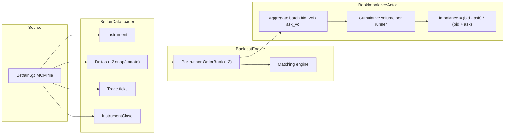

# 订单簿失衡回测（Betfair）

:::note
这是一个**仅使用 Rust** 的 v2 系统教程。它直接驱动 Rust `BacktestEngine`，
使用原始的 Betfair 流数据，绕过 Python 和 Parquet 路径。
:::

本教程在 Betfair MATCH_ODDS 市场上对 `BookImbalanceActor` 进行回测。
它加载一个原始的历史流式 `.gz` 文件，将其送入 Rust
`BacktestEngine`，并跟踪每个参赛者（runner）的买卖挂单量失衡情况。

## 简介

Betfair 是一个体育博彩交易所，参与者以小数赔率对结果进行 back（买入）和 lay
（卖出）操作。每个参赛者都有自己的 L2 订单簿，其行为类似于金融订单簿。

该 Actor 读取每个交易品种的 `OrderBookDeltas`，并累计双边的两个运行总量：
买单量（back 订单）和卖单量（lay 订单）。批次失衡和累计失衡的计算方式为：

```
imbalance = (bid_volume - ask_volume) / (bid_volume + ask_volume)
```

正值表示市场更倾向于 back 该结果。体育交易者常将此作为基础信号，
通常结合价格动量或全市场特征一起使用。

一次 release 构建每秒可处理约三百万个数据点，同时在撮合引擎中维护完整的订单簿。



## 前提条件

- 一个可用的 Rust 工具链（[rustup.rs](https://rustup.rs)）。
- 已克隆并可构建的 NautilusTrader 代码仓库。
- 一个包含 MCM（Market Change Message，市场变更消息）数据的 Betfair
  历史 `.gz` 文件。可从
  [Betfair 历史数据](https://historicdata.betfair.com/)、第三方存档，
  或自行录制 Exchange Streaming API 数据获取。

将文件放置于：

```
tests/test_data/local/betfair/1.253378068.gz
```

该路径已被 gitignore 忽略，不随代码仓库一同分发。示例数据集是一个包含
3 名参赛者、录制了 18 天、约 82,000 行 MCM 记录的足球 MATCH_ODDS 市场。

## 加载数据

`BetfairDataLoader` 读取经过 gzip 压缩的 Betfair Exchange Streaming API
文件，并将每一行解析为 Nautilus 领域对象：

```rust
use nautilus_betfair::loader::{BetfairDataItem, BetfairDataLoader};
use nautilus_model::types::Currency;

let mut loader = BetfairDataLoader::new(Currency::GBP(), None);
let items = loader.load(&filepath)?;
```

该加载器返回一个 `Vec<BetfairDataItem>`：

| 变体（Variant）             | 描述                                     | 是否映射到 `Data` 枚举？       |
|:--------------------|:------------------------------------------------|:---------------------------|
| `Instrument`        | 来自市场定义的参赛者定义。       | 否（单独添加）      |
| `Status`            | 市场状态转换（PreOpen、Trading……）。 | 否（`Data` 没有对应变体） |
| `Deltas`            | 订单簿快照或增量更新。            | 是，`Data::Deltas`        |
| `Trade`             | 由累计成交量得出的增量成交记录。 | 是，`Data::Trade`         |
| `Ticker`            | 最新成交价、成交量、BSP near/far。            | -                          |
| `StartingPrice`     | 参赛者的 Betfair Starting Price。            | -                          |
| `BspBookDelta`      | BSP 专用订单簿增量。                        | -                          |
| `InstrumentClose`   | 结算事件。                            | 是，`Data::InstrumentClose` |
| `SequenceCompleted` | 批次完成标记。                        | -                          |
| `RaceRunnerData`    | GPS 追踪数据（赛马/赛犬）。     | -                          |
| `RaceProgress`      | 赛事级别的进度数据。                      | -                          |

回测引擎接受 `Data` 枚举，因此我们只需映射所需的变体，
跳过 Betfair 专用类型：

```rust
use nautilus_model::data::{Data, OrderBookDeltas_API};

let mut instruments = AHashMap::new();
let mut data: Vec<Data> = Vec::new();

for item in items {
    match item {
        BetfairDataItem::Instrument(inst) => {
            instruments.insert(inst.id(), *inst);
        }
        BetfairDataItem::Deltas(d) => {
            data.push(Data::Deltas(OrderBookDeltas_API::new(d)));
        }
        BetfairDataItem::Trade(t) => {
            data.push(Data::Trade(t));
        }
        BetfairDataItem::InstrumentClose(c) => {
            data.push(Data::InstrumentClose(c));
        }
        _ => {}
    }
}
```

`OrderBookDeltas_API` 是围绕 `OrderBookDeltas` 的一个薄 FFI 封装，
`Data` 枚举需要它。

流中的每次市场定义更新都会重新发出交易品种信息，因此该映射通过保留
最新版本来去重。

:::warning
`Status` 变体携带市场状态转换信息（PreOpen、Trading、Suspended、Closed），
但 `Data` 枚举没有对应的变体。此示例不会回放状态转换。如果您将此扩展为
一个下单的策略，撮合引擎将无法从数据流中感知到市场暂停或关闭。请单独
订阅交易品种状态，或为引擎添加状态路由。
:::

## Actor

NautilusTrader 在 trading crate 的 examples 模块中提供了
`BookImbalanceActor`。该示例使用逐参赛者交易品种列表和日志间隔对其进行了配置：

```rust
use nautilus_trading::examples::actors::BookImbalanceActor;

let actor = BookImbalanceActor::new(instrument_ids, 5000, None);
engine.add_actor(actor)?;
```

第二个参数是日志间隔：每个参赛者每 5,000 次更新打印一行进度信息。该示例
从环境变量 `IMBALANCE_LOG_INTERVAL` 读取该值，因此当您想为本教程末尾的
面板捕获更细粒度的数据时，可将其设置为较小的值（如 `200`）。

完整源码位于
[`crates/trading/src/examples/actors/imbalance/actor.rs`](https://github.com/nautechsystems/nautilus_trader/tree/develop/crates/trading/src/examples/actors/imbalance/actor.rs)。

### 工作原理

Rust 中的 `DataActor` 需要三个部分：

1. 一个持有 `DataActorCore` 字段以及您自己状态的结构体。
2. `nautilus_actor!(YourType)` 用于连接核心，外加一个 `Debug`
   实现。
3. `DataActor` trait 的实现，包含您所需的回调函数。

该框架为运行时 Actor 提供了通用的 `Actor` 和 `Component` 实现。当您的结构体
持有 `DataActorCore` 时，`nautilus_actor!` 宏会提供原生运行时连接，
因此普通的 Actor 代码只需实现它所需的回调。

启动时，该 Actor 会为每个交易品种订阅 `OrderBookDeltas`。每次更新时，
它会从各个增量中汇总每一侧的成交量，并累计运行总量。停止时，它会打印
每个交易品种的汇总信息。

在 `subscribe_book_deltas` 中设置 `managed: false` 意味着数据引擎
不会在缓存中为该 Actor 维护单独的订单簿副本。交易所端的撮合引擎仍会
通过每次增量调用 `book.apply_delta()` 来维护自己的订单簿。如果您的
Actor 需要从 `self.cache().order_book(&instrument_id)` 读取完整的
订单簿状态，请设置 `managed: true`。

## 回测引擎设置

### 创建引擎和交易场所

Betfair 是一个现金结算的博彩交易所。该交易场所使用
`AccountType::Cash`、`OmsType::Netting` 以及 `BookType::L2_MBP`：

```rust
let mut engine = BacktestEngine::new(BacktestEngineConfig::default())?;

engine.add_venue(
    SimulatedVenueConfig::builder()
        .venue(Venue::from("BETFAIR"))
        .oms_type(OmsType::Netting)
        .account_type(AccountType::Cash)
        .book_type(BookType::L2_MBP)
        .starting_balances(vec![Money::from("1_000_000 GBP")])
        .build()?,
)?;
```

### 添加交易品种、Actor 和数据

```rust
for instrument in instruments.values() {
    engine.add_instrument(instrument)?;
}

let actor = BookImbalanceActor::new(instrument_ids, 5000, None);
engine.add_actor(actor)?;

engine.add_data(data, None, true, true)?;
```

`add_data` 的参数为 `(data, client_id, validate, sort)`。当
`validate: true` 时，引擎会检查批次中第一个元素的交易品种是否已注册
（假定该批次是同质的）。当 `sort: true` 时，会按时间戳排序。

### 运行

```rust
engine.run(None, None, None, false)?;
```

这四个参数分别为 `(start, end, run_config_id, streaming)`。对
start/end 传入 `None` 表示使用已加载数据的完整时间范围。

## 运行期间发生了什么

对于按时间戳顺序排列的每个数据点，引擎会：

1. 将时钟推进到该数据点的时间戳。
2. 将数据路由到模拟交易所，交易所会将每个增量应用到相应交易品种的
   `OrderBook` 上，并运行一次撮合引擎循环。
3. 通过数据引擎和消息总线发布该数据，触发 Actor 的 `on_book_deltas`
   回调。
4. 清空命令队列并结算交易场所（处理任何待处理订单）。

撮合引擎为每个交易品种维护一份完整的订单簿。本示例没有需要撮合的订单，
因此一旦将其替换为 `Strategy`，订单簿状态即可直接使用。

## 结果

内置的 MATCH_ODDS 数据集有三名参赛者，共 143,098 个数据点；
release 构建约 48 毫秒内即可完成：

```
--- Book imbalance summary ---
  1.253378068-2426.BETFAIR   updates: 53197  bid_vol: 212225339.34  ask_vol: 117422531.85  imbalance:  0.2876
  1.253378068-48783.BETFAIR  updates: 36475  bid_vol:  52506905.49  ask_vol:  19104694.72  imbalance:  0.4664
  1.253378068-58805.BETFAIR  updates: 25426  bid_vol:  24295351.82  ask_vol:  25692733.11  imbalance: -0.0280
```

参赛者 `2426`（最终获胜者，以 BSP 2.22 结算）最终失衡度为 +0.288：
在整个市场过程中，back 流量持续压倒 lay 流量。参赛者 `48783` 在更少
更新次数下表现出更强的 back 压力（+0.466），而 `58805` 最终接近中性
（-0.028）。


**图 1。** *在整个市场生命周期约 143k 次更新中，各参赛者的累计
`(bid - ask) / (bid + ask)`。虚线标出了每个参赛者的最终失衡值。*


**图 2。** *各参赛者在 `IMBALANCE_LOG_INTERVAL=200` 批次间的每批次
带符号流量比率 `(bid - ask) / (bid + ask)` 的分布。每个参赛者批次分布的
形态比累计失衡度是更敏锐的信号。*


**图 3。** *各参赛者的累计 back（买）和 lay（卖）成交量。双侧均非单调：
即使累计失衡度保持为正，lay 流量偶尔也会在短时间内超过 back 流量。*

### 重新生成面板图

该 Actor 会在每第 N 次更新时记录
`[runner] update #N: batch bid=B ask=A cumulative imbalance=I`
日志行。渲染脚本会解析这些日志行，并使用 `nautilus_dark`
tearsheet 主题绘制静态 PNG 图片。

```bash
IMBALANCE_LOG_INTERVAL=200 cargo run -p nautilus-betfair --features examples --release \
    --example betfair-backtest > /tmp/betfair.log 2>&1

uv sync --extra visualization
BETFAIR_LOG=/tmp/betfair.log \
    python3 docs/tutorials/assets/backtest_book_imbalance_betfair/render_panels.py
```

## 运行示例

```bash
# Debug 构建
cargo run -p nautilus-betfair --features examples --example betfair-backtest

# Release 构建（推荐）
cargo run -p nautilus-betfair --features examples --release --example betfair-backtest

# 自定义数据文件
cargo run -p nautilus-betfair --features examples --release --example betfair-backtest -- path/to/file.gz
```

## 完整源码

完整示例位于
[`crates/adapters/betfair/examples/betfair_backtest.rs`](https://github.com/nautechsystems/nautilus_trader/tree/develop/crates/adapters/betfair/examples/betfair_backtest.rs)。

## 后续步骤

- **添加策略**。将该 Actor 替换为一个基于失衡信号下单
  back/lay 订单的 `Strategy` 实现。相关模式可参考
  `crates/trading/src/examples/strategies/ema_cross/strategy.rs`
  中的 `EmaCross` 示例。
- **使用受管理的订单簿**。在 `subscribe_book_deltas` 中设置
  `managed: true`，并通过 `self.cache().order_book(&id)` 读取
  完整的订单簿，以获得诸如最优挂单价差、深度比率或加权中间价等
  更丰富的信号。
- **多市场**。加载多个 `.gz` 文件，并在同一引擎中运行，以测试
  跨市场信号。
- **与 Python 对比**。使用 `BacktestEngine` 的 Python API 从
  Python 端运行相同的回测。Rust 引擎处理同一数据管线的吞吐量
  约为 Python/Cython 路径的六倍。
