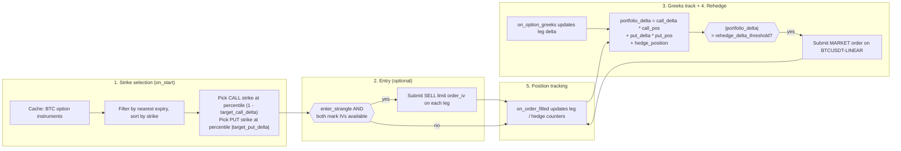

# Delta 中性期权策略（Bybit）

:::note
这是一个**仅使用 Rust** 的 v2 系统教程。它使用 Rust `LiveNode`
在 Bybit 上运行一个实盘的 Delta 中性做空波动率策略。
:::

本教程在 Bybit BTC 期权上运行一个卖出虚值（OTM）宽跨式策略，并使用
BTCUSDT 永续合约进行 Delta 对冲。该策略在启动时选取看涨和看跌行权价，
通过隐含波动率限价单入场，根据交易场所提供的希腊值跟踪组合 Delta，
并在 Delta 偏离阈值时在永续合约上提交市价对冲单。

:::warning
该策略在主网上交易真实资金。设置 `enter_strangle: false` 仅会禁用
初始的宽跨式入场订单。该策略在启动时仍会从缓存中恢复已有持仓，并且
当组合 Delta 突破阈值时仍会在永续合约上提交对冲订单。如果账户中存在
上一次会话遗留的期权或对冲持仓，该策略仍会进行交易。
:::

## 前提条件

- 已完成[期权数据教程](options_data_bybit.md)，该教程涵盖了交易品种发现、
  希腊值订阅以及 `DataActor` 模式。
- 一个具有期权和线性永续合约**交易权限**的 Bybit API 密钥。
- 环境变量：

```bash
export BYBIT_API_KEY="your-api-key"
export BYBIT_API_SECRET="your-api-secret"
```

## 策略概述

`DeltaNeutralVol` 策略随附于 trading crate 的 `examples`
模块中，分五个阶段运行：

1. **行权价选择**：查询交易品种缓存中的所有 BTC 期权，过滤出最近到期日，
   按百分位排名选取虚值（OTM）看涨和看跌行权价。
2. **入场**：在双腿上下达以隐含波动率定价（通过 Bybit 的 `order_iv`
   参数）的 SELL 限价单。入场是可选的，在示例中默认禁用。
3. **希腊值跟踪**：为双腿订阅 `OptionGreeks`。Delta 和隐含波动率
   直接来自 Bybit 的期权行情流。
4. **重新对冲**：计算组合 Delta，并在突破阈值时在 BTCUSDT 永续合约上
   提交市价单。该逻辑在每次希腊值更新以及定期安全定时器触发时执行。
5. **持仓跟踪**：通过 `on_order_filled` 跟踪看涨、看跌以及对冲持仓。
   启动时从缓存中恢复已有持仓。



### 组合 Delta

该策略按以下方式计算净敞口：

```
portfolio_delta = call_delta * call_position
                + put_delta * put_position
                + hedge_position
```

空头宽跨式在起始时接近 Delta 中性，因为看涨和看跌的 Delta 相互抵消。
在默认的 `target_call_delta = 0.20` 和 `target_put_delta = -0.20`
配置下，两条腿在入场时相互抵消。随着标的价格变动，净 Delta 会发生偏移，
策略会通过对冲将其拉回接近零。

## 配置

位于
[`crates/adapters/bybit/examples/node_delta_neutral.rs`](https://github.com/nautechsystems/nautilus_trader/tree/develop/crates/adapters/bybit/examples/node_delta_neutral.rs)
的示例文件对策略进行了如下配置：

```rust
let hedge_instrument_id = InstrumentId::from("BTCUSDT-LINEAR.BYBIT");

let strategy_config = DeltaNeutralVolConfig::builder()
    .option_family("BTC".to_string())
    .hedge_instrument_id(hedge_instrument_id)
    .client_id(client_id)
    .contracts(1)
    .rehedge_delta_threshold(0.5)
    .rehedge_interval_secs(30)
    .enter_strangle(false)
    .iv_param_key("order_iv".to_string())
    .build();

let strategy = DeltaNeutralVol::new(strategy_config);
```

参数（下表所示默认值为结构体默认值；示例将 `enter_strangle`
覆盖为 `false`，`iv_param_key` 覆盖为 `"order_iv"`）：

| 参数                 | 默认值    | 示例值          | 描述                                  |
|---------------------------|------------|------------------|----------------------------------------------|
| `option_family`           | 必填   | `"BTC"`          | 用于交易品种发现的标的过滤条件。  |
| `hedge_instrument_id`     | 必填   | `BTCUSDT-LINEAR` | 用于 Delta 对冲的永续合约。            |
| `client_id`               | 必填   | `"BYBIT"`        | 数据和执行客户端标识符。        |
| `target_call_delta`       | `0.20`     | -                | 用于行权价选择的目标看涨 Delta。      |
| `target_put_delta`        | `-0.20`    | -                | 用于行权价选择的目标看跌 Delta。       |
| `contracts`               | `1`        | -                | 每条腿的合约数量。                           |
| `rehedge_delta_threshold` | `0.5`      | -                | 触发对冲的组合 Delta 阈值。       |
| `rehedge_interval_secs`   | `30`       | -                | 定期重新对冲定时器的时间间隔。            |
| `enter_strangle`          | `true`     | `false`          | 希腊值到达后是否下达入场订单。       |
| `entry_iv_offset`         | `0.0`      | -                | 入场定价相对于标记隐含波动率的下调点数。  |
| `iv_param_key`            | `"px_vol"` | `"order_iv"`     | 适配器专用的隐含波动率参数键名。           |

`iv_param_key` 是不同交易场所之间的关键差异。Bybit 使用
`order_iv`，适配器会将其映射到下单 API 中的 `orderIv` 字段。OKX
使用 `px_vol`。正确设置此参数是基于隐含波动率下单的必要前提。

## 节点设置

该示例为数据客户端和执行客户端都配置了 `Option` 和
`Linear` 产品类型：

```rust
let data_config = BybitDataClientConfig {
    api_key: None,
    api_secret: None,
    product_types: vec![BybitProductType::Option, BybitProductType::Linear],
    ..Default::default()
};

let exec_config = BybitExecClientConfig {
    api_key: None,
    api_secret: None,
    product_types: vec![BybitProductType::Option, BybitProductType::Linear],
    account_id: Some(account_id),
    ..Default::default()
};
```

两种产品类型都是必需的：`Option` 用于宽跨式的两条腿，`Linear`
用于作为对冲工具的 BTCUSDT 永续合约。执行客户端需要
`account_id` 用于订单身份跟踪。

```rust
let mut node = LiveNode::builder(trader_id, environment)?
    .with_name("BYBIT-DELTA-NEUTRAL-001".to_string())
    .add_data_client(None, Box::new(data_factory), Box::new(data_config))?
    .add_exec_client(None, Box::new(exec_factory), Box::new(exec_config))?
    .with_reconciliation(true)
    .with_delay_post_stop_secs(5)
    .build()?;

node.add_strategy(strategy)?;
node.run().await?;
```

`with_reconciliation(true)` 会在启动时向 Bybit 查询未成交订单和持仓，
并在策略启动前将其恢复到缓存中。策略随后会接管上一次会话中的任何
已有持仓。

## 策略工作原理

### 行权价选择

启动时，策略会在缓存中查询所有匹配 `option_family` 的期权交易品种。
它会剔除已过期的期权，选取最近的到期日，将看涨和看跌分开，并按
行权价对每个列表排序。

行权价按照排序列表中的百分位选取：

- **看涨（Call）**：索引 = `(1.0 - target_call_delta) * count`。以
  0.20 的目标 Delta 和 50 个看涨期权为例，将选取第 40 个行权价
  （第 80 百分位，虚值）。
- **看跌（Put）**：索引 = `|target_put_delta| * count`。以 -0.20
  的目标 Delta 为例，将选取第 10 个行权价（第 20 百分位，虚值）。

这是一种启发式方法。对于同一到期日的期权，行权价顺序近似于 Delta
顺序。生产环境中的策略应先为所有行权价订阅希腊值，再按实际 Delta
进行选择。

### 通过隐含波动率入场

当 `enter_strangle` 为 `true` 且双方的标记隐含波动率均已到达时，
策略会使用 `order_iv` 参数下达 SELL 限价单：

```rust
let mut call_params = Params::new();
call_params.insert("order_iv".to_string(), json!(call_entry_iv.to_string()));

self.submit_order(call_order, None, Some(client_id), Some(call_params))?;
```

Bybit 会在服务器端将 `orderIv` 转换为限价，并使其优先于任何显式指定的
价格。`entry_iv_offset` 配置会从标记隐含波动率中减去若干波动率点：
偏移量为 0.02 表示以低于标记价 2 个波动率点的价格卖出，以实现更快成交。

:::note
Bybit 的模拟盘环境会拒绝带有 `order_iv` 的订单。适配器会在订单送达
API 之前将其拒绝。基于隐含波动率的下单请使用主网或测试网。
:::

### 重新对冲

有两个触发条件会检查组合 Delta：

- **每次希腊值更新**：`on_option_greeks` 在更新对应腿的 Delta 值后
  会重新计算组合 Delta。
- **定期定时器**：每隔 `rehedge_interval_secs` 触发一次，作为
  希腊值更新停止到达时的安全保障。

当 `|portfolio_delta| > rehedge_delta_threshold` 时，策略会在
对冲工具上提交市价单。`hedge_pending` 标志用于在订单尚在处理中时
防止重复提交。

### 持仓跟踪

该策略通过 `on_order_filled` 跟踪持仓，而非在每个 tick 查询缓存。
每次成交都会更新相应的持仓计数器（看涨、看跌或对冲）。启动时，
已有持仓会从缓存中恢复（由对账过程填充）。

### 关闭

停止时，策略会取消未成交订单、取消订阅所有数据源，并重置
hedge-pending 标志。它不会平仓。平掉宽跨式和对冲持仓需要手动操作
或单独的退出策略。

## 运行产生的结果

在一个干净账户上以 `enter_strangle: false` 运行 30 秒的主网测试
不会下达任何订单。策略会记录发现的交易品种以及行权价选择结果：

```
Selected call: BTC-28APR26-81000-C-USDT-OPTION.BYBIT (strike=81000)
Selected put: BTC-28APR26-75000-P-USDT-OPTION.BYBIT (strike=75000)
Strangle: 1 contracts per leg, hedge on BTCUSDT-LINEAR.BYBIT
```

这已足以说明该策略的结构性行为。下方面板以实际选取的行权价
（75,000 / 81,000）及采集到的标的价格，将其机理可视化。


**图 1。** *空头 75,000 PUT 加空头 81,000 CALL 组合在到期时的
盈亏，假设总权利金为 1,500 USDT 且无折价。顶部平坦区间为两个行权价
之间的纯权利金收益区；亏损在超过任一行权价后呈线性增长。*


**图 2。** *在 `rehedge_delta_threshold=0.5` 条件下，150 秒内的
合成布朗运动 Delta 漂移。虚线为未对冲的漂移曲线；实线为每次市价
对冲触发（叉号处）后的策略组合 Delta。*


**图 3。** *在入场附近 5% 现货波动范围内，空头看涨和空头看跌两条腿
Delta 变化的简化近似，以及对冲前的最终组合 Delta。负 Gamma 会在两翼
压缩曲线，并在行权价附近使其变得更陡。*


**图 4。** *在示意性隐含波动率微笑曲线上的行权价选择启发式方法。
CALL 行权价位于 (1 - 0.20) 百分位，PUT 行权价位于 0.20 百分位，
使两条腿都在标的附近以大致相等幅度的 Delta 处于虚值状态。*

### 重新生成面板图

```bash
timeout 30 ./target/release/examples/bybit-delta-neutral > /tmp/bybit_dn.log 2>&1

uv sync --extra visualization
DN_LOG=/tmp/bybit_dn.log \
    python3 docs/tutorials/assets/delta_neutral_options_bybit/render_panels.py
```

渲染脚本从日志中解析所选取的行权价；由于默认配置不会下单，
这些面板本身仅具示意性质。

## 风险考量

- **Gamma 风险**：空头宽跨式具有负 Gamma。标的价格大幅波动时，
  Delta 敞口的增长速度会快于重新对冲定时器的响应速度。收紧
  `rehedge_delta_threshold` 并缩短 `rehedge_interval_secs` 可
  提高响应速度，但代价是更多的对冲交易。
- **Vega 风险**：隐含波动率飙升会增加空头期权的按市值计价亏损。
  该策略不管理 Vega 敞口。
- **流动性**：虚值加密期权可能存在较宽的买卖价差。当标的出现跳空
  或永续合约以较粗的数量级成交时，对冲质量会下降。
- **生命周期风险**：停止策略即停止对冲。持仓将保持敞开且不再对冲，
  直到手动管理。

## 运行示例

```bash
cargo run --example bybit-delta-neutral --package nautilus-bybit --features examples
```

该示例默认以 `enter_strangle: false` 运行，因此不会下达宽跨式
入场订单。它仍会恢复已有持仓，并在组合 Delta 突破阈值时提交对冲订单。
在没有历史持仓的干净账户上，不会下达任何订单。

使用 Ctrl+C 停止。策略会在关闭前取消未成交订单并取消订阅。

## 完整源码

- 示例运行器：[`crates/adapters/bybit/examples/node_delta_neutral.rs`](https://github.com/nautechsystems/nautilus_trader/tree/develop/crates/adapters/bybit/examples/node_delta_neutral.rs)
- 策略实现：[`crates/trading/src/examples/strategies/delta_neutral_vol/`](https://github.com/nautechsystems/nautilus_trader/tree/develop/crates/trading/src/examples/strategies/delta_neutral_vol/)
- 包含完整配置参考的策略 README：[`crates/trading/src/examples/strategies/delta_neutral_vol/README.md`](https://github.com/nautechsystems/nautilus_trader/tree/develop/crates/trading/src/examples/strategies/delta_neutral_vol/README.md)

## 另请参阅

- [Bybit 上的期权数据与希腊值](options_data_bybit.md)：前置教程，
  涵盖希腊值订阅和期权链快照。
- [期权](../concepts/options.md)：期权交易品种类型和数据架构。
- [Bybit 集成](../integrations/bybit.md#options-trading)：期权
  订单参数，包括 `order_iv` 和 `mmp`。
