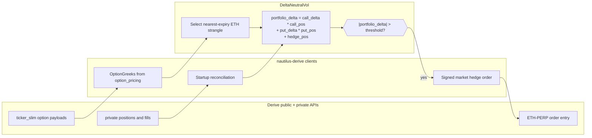

# Delta 中性期权策略（Derive）

:::note
这是一个**仅使用 Rust** 的 v2 系统教程。它使用 Rust `LiveNode`
在 Derive 上运行实盘的 Delta 中性做空波动率策略。
:::

本教程使用 Derive 适配器运行共享的 `DeltaNeutralVol` 策略。随附的
示例会发现 ETH 期权，选取一个虚值看涨和一个虚值看跌期权，订阅交易场所
提供的希腊值，并使用 `ETH-PERP.DERIVE` 进行 Delta 对冲。

Derive 运行器以仅对冲模式启动：它设置了 `enter_strangle: false`，因此
不会下达初始的期权入场订单。它仍会通过对账过程恢复已有持仓，并且
在组合 Delta 突破配置阈值时，可在永续合约上提交市价对冲订单。
对于冒烟测试，可设置 `DERIVE_DELTA_NEUTRAL_HEDGE_ENABLED=false`，
使策略在仍然加载交易品种、对账账户、订阅希腊值的同时不提交对冲订单。
对于入场订单的冒烟测试，可设置
`DERIVE_DELTA_NEUTRAL_ENTER_STRANGLE=true`；此时运行器提交的是
Derive 权利金定价的期权订单，而不是隐含波动率定价的期权订单。

:::warning
该策略可能在主网上交易真实资金。设置 `enter_strangle: false` 仅会禁用
初始的宽跨式入场订单。如果所选期权腿或对冲工具已存在未平仓头寸，
该策略仍可提交对冲订单。
:::

## 前提条件

- 已完成 [Derive 集成指南](../integrations/derive.md)，包括钱包、
  子账户、会话密钥（session-key）和资金设置。
- 一个拥有足够 USDC 抵押品（用于计划允许的对冲订单）的 Derive
  测试网或主网子账户。
- 一个可用的 Rust 工具链，以及已构建好的 NautilusTrader 工作区。
- 针对所选 Derive 环境的环境变量。

测试网：

```bash
export DERIVE_TESTNET_WALLET_ADDRESS="0x..."
export DERIVE_TESTNET_SESSION_PRIVATE_KEY="0x..."
export DERIVE_TESTNET_SUBACCOUNT_ID="12345"
```

主网：

```bash
export DERIVE_WALLET_ADDRESS="0x..."
export DERIVE_SESSION_PRIVATE_KEY="0x..."
export DERIVE_SUBACCOUNT_ID="12345"
export DERIVE_ENVIRONMENT="mainnet"
```

该示例默认使用测试网。仅在涉及真实资金的运行中才设置
`DERIVE_ENVIRONMENT=mainnet`。

## 策略概述

`DeltaNeutralVol` 策略位于 trading crate 的 examples 模块中。Derive
运行器分五个阶段使用它：

1. **交易品种加载**：将 Derive 数据客户端配置为 `currencies: ["ETH"]`，
   使适配器将 ETH 永续合约和期权加载到缓存中。
2. **行权价选择**：在缓存中过滤出有效的 ETH 期权，选取最近的到期日，
   然后按百分位排名选取虚值看涨和看跌行权价。
3. **希腊值跟踪**：为双腿订阅 `OptionGreeks`。Derive 的希腊值来自
   共享的 `ticker_slim` 数据流和 `option_pricing` 负载。
4. **重新对冲**：计算组合 Delta，并在突破阈值时在 `ETH-PERP.DERIVE`
   上提交 Derive 市价单。
5. **持仓跟踪**：通过成交跟踪看涨、看跌和对冲持仓。对账过程会在
   策略启动前恢复已有持仓。



### 组合 Delta

该策略按以下方式计算净敞口：

```
portfolio_delta = call_delta * call_position
                + put_delta * put_position
                + hedge_position
```

当看涨和看跌的 Delta 相互抵消时，空头宽跨式在起始时接近 Delta 中性。
随着标的价格变动，净 Delta 会发生偏移，策略会使用永续合约进行对冲，
将组合拉回接近零。

## 配置

位于 `crates/adapters/derive/examples/node_delta_neutral.rs` 的
示例运行器对策略进行了如下配置：

```rust
let option_family = env_string("DERIVE_DELTA_NEUTRAL_OPTION_FAMILY", "ETH")?;
let default_hedge = format!("{option_family}-PERP.DERIVE");
let hedge_instrument = env_string("DERIVE_DELTA_NEUTRAL_HEDGE_INSTRUMENT", &default_hedge)?;
let enter_strangle = env_bool("DERIVE_DELTA_NEUTRAL_ENTER_STRANGLE", false)?;
let hedge_enabled = env_bool("DERIVE_DELTA_NEUTRAL_HEDGE_ENABLED", true)?;
let rehedge_delta_threshold = if hedge_enabled {
    env_f64("DERIVE_DELTA_NEUTRAL_REHEDGE_DELTA_THRESHOLD", 0.5)?
} else {
    1.0e12
};

let hedge_instrument_id = InstrumentId::from(hedge_instrument.as_str());
let mut strategy_config = DeltaNeutralVolConfig::builder()
    .option_family(option_family)
    .hedge_instrument_id(hedge_instrument_id)
    .client_id(client_id)
    .target_call_delta(env_f64("DERIVE_DELTA_NEUTRAL_TARGET_CALL_DELTA", 0.20)?)
    .target_put_delta(env_f64("DERIVE_DELTA_NEUTRAL_TARGET_PUT_DELTA", -0.20)?)
    .contracts(env_u64("DERIVE_DELTA_NEUTRAL_CONTRACTS", 1)?)
    .rehedge_delta_threshold(rehedge_delta_threshold)
    .rehedge_interval_secs(env_u64("DERIVE_DELTA_NEUTRAL_REHEDGE_INTERVAL_SECS", 30)?)
    .enter_strangle(enter_strangle)
    .entry_iv_offset(env_f64("DERIVE_DELTA_NEUTRAL_ENTRY_IV_OFFSET", 0.0)?)
    .entry_premium_offset_ticks(env_i32("DERIVE_DELTA_NEUTRAL_ENTRY_PREMIUM_OFFSET_TICKS", 1)?)
    .build();

if let Some(expiry) = env_optional_string("DERIVE_DELTA_NEUTRAL_EXPIRY")? {
    strategy_config.expiry_filter = Some(expiry);
}

let strategy = DeltaNeutralVol::new(strategy_config);
```

参数：

| 参数                    | 默认值    | Derive 运行器 | 描述                                   |
|------------------------------|------------|---------------|-----------------------------------------------|
| `option_family`              | 必填   | `"ETH"`       | 用于交易品种发现的标的过滤条件。   |
| `hedge_instrument_id`        | 必填   | `ETH-PERP`    | 用于 Delta 对冲的永续合约。             |
| `client_id`                  | 必填   | `"DERIVE"`    | 数据和执行客户端标识符。         |
| `target_call_delta`          | `0.20`     | `0.20`        | 用于行权价选择的目标看涨 Delta。       |
| `target_put_delta`           | `-0.20`    | `-0.20`       | 用于行权价选择的目标看跌 Delta。        |
| `contracts`                  | `1`        | `1`           | 每条期权腿的合约数量。                     |
| `rehedge_delta_threshold`    | `0.5`      | `0.5`         | 触发对冲的组合 Delta 阈值。         |
| `rehedge_interval_secs`      | `30`       | `30`          | 定期重新对冲定时器的时间间隔。               |
| `expiry_filter`              | `None`     | 未设置         | 可选的到期日子串过滤条件。              |
| `enter_strangle`             | `true`     | `false`       | 权利金数据到达时是否下达入场订单。 |
| `entry_premium_offset_ticks` | `None`     | `1`           | 卖出入场相对期权卖价的加价点数（tick）。   |
| `entry_iv_offset`            | `0.0`      | `0.0`         | 仅在非权利金模式下使用。         |
| `iv_param_key`               | `"px_vol"` | 未使用        | 用于隐含波动率定价交易场所的参数键名。       |

Derive 运行器读取以下环境变量：

| 变量                                          | 默认值                | 描述                        |
|---------------------------------------------------|------------------------|------------------------------------|
| `DERIVE_DELTA_NEUTRAL_OPTION_FAMILY`              | `ETH`                  | 期权系列 / Derive 币种。   |
| `DERIVE_DELTA_NEUTRAL_HEDGE_INSTRUMENT`           | `<family>-PERP.DERIVE` | 永续合约对冲工具。        |
| `DERIVE_DELTA_NEUTRAL_ENTER_STRANGLE`             | `false`                | 是否启用期权入场订单。        |
| `DERIVE_DELTA_NEUTRAL_HEDGE_ENABLED`              | `true`                 | 是否启用永续合约对冲订单。     |
| `DERIVE_DELTA_NEUTRAL_REHEDGE_DELTA_THRESHOLD`    | `0.5`                  | 组合 Delta 对冲阈值。   |
| `DERIVE_DELTA_NEUTRAL_REHEDGE_INTERVAL_SECS`      | `30`                   | 定期对冲检查间隔。     |
| `DERIVE_DELTA_NEUTRAL_CONTRACTS`                  | `1`                    | 每条期权腿的合约数量。          |
| `DERIVE_DELTA_NEUTRAL_TARGET_CALL_DELTA`          | `0.20`                 | 看涨行权价选择目标。      |
| `DERIVE_DELTA_NEUTRAL_TARGET_PUT_DELTA`           | `-0.20`                | 看跌行权价选择目标。       |
| `DERIVE_DELTA_NEUTRAL_EXPIRY`                     | 未设置                  | 可选的到期日子串过滤条件。  |
| `DERIVE_DELTA_NEUTRAL_ENTRY_PREMIUM_OFFSET_TICKS` | `1`                    | 卖出入场相对期权卖价的加点数。 |
| `DERIVE_DELTA_NEUTRAL_ENTRY_IV_OFFSET`            | `0.0`                  | 仅在非权利金模式下使用。    |
| `DERIVE_DELTA_NEUTRAL_MAX_FEE_PER_CONTRACT`       | `1000`                 | 已签名的每合约手续费上限。       |
| `DERIVE_DELTA_NEUTRAL_MARKET_ORDER_SLIPPAGE_BPS`  | 适配器默认值        | 市价对冲滑点上限。       |

Derive 会对显式的权利金限价进行签名。运行器使用
`entry_premium_offset_ticks=1` 启用策略的权利金入场模式，因此入场订单
在有实时期权卖价时会使用该卖价，当报价一侧为空时则回退到 Derive
隐含波动率字段。Bybit 和 OKX 继续使用共享的隐含波动率参数路径。

## 节点设置

Derive 运行器使用实盘环境，并根据 `DERIVE_ENVIRONMENT` 选择测试网
或主网：

```rust
let environment = Environment::Live;
let derive_environment = derive_environment_from_env();
let trader_id = TraderId::from("TESTER-001");
let account_id = AccountId::from("DERIVE-001");
let client_id = *DERIVE_CLIENT_ID;
```

数据客户端会批量加载 ETH 交易品种。这一点很重要，因为策略在
`on_start` 期间会从缓存中选取期权腿。

```rust
let data_config = DeriveDataClientConfig {
    environment: derive_environment,
    currencies: vec![option_family.clone()],
    ..Default::default()
};
```

当配置字段未设置时，执行客户端会从 Derive 相关环境变量中读取钱包、
会话密钥和子账户的值。该示例设置了手续费上限，并允许可选的协议常量
覆盖，用于本地测试。

```rust
let exec_config = DeriveExecClientConfig {
    environment: derive_environment,
    max_fee_per_contract: Some(Decimal::from_str_exact("1000")?),
    domain_separator: env_override(
        derive_environment,
        "DERIVE_DOMAIN_SEPARATOR",
        "DERIVE_TESTNET_DOMAIN_SEPARATOR",
    ),
    action_typehash: env_override(
        derive_environment,
        "DERIVE_ACTION_TYPEHASH",
        "DERIVE_TESTNET_ACTION_TYPEHASH",
    ),
    trade_module_address: env_override(
        derive_environment,
        "DERIVE_TRADE_MODULE_ADDRESS",
        "DERIVE_TESTNET_TRADE_MODULE_ADDRESS",
    ),
    ..Default::default()
};
```

执行客户端需要 `DeriveExecFactoryConfig`，其中携带了交易者 ID 和
账户 ID：

```rust
let exec_factory_config = DeriveExecFactoryConfig {
    trader_id,
    account_id,
    config: exec_config,
};
```

该节点启用了对账功能，因此在策略启动前会加载未成交订单、持仓、
余额和报告：

```rust
let mut node = LiveNode::builder(trader_id, environment)?
    .with_name("DERIVE-DELTA-NEUTRAL-001".to_string())
    .add_data_client(None, Box::new(data_factory), Box::new(data_config))?
    .add_exec_client(None, Box::new(exec_factory), Box::new(exec_factory_config))?
    .with_reconciliation(true)
    .with_delay_post_stop_secs(5)
    .build()?;

node.add_strategy(strategy)?;
node.run().await?;
```

## 策略工作原理

### 行权价选择

启动时，策略在缓存中查询所有匹配 `option_family` 的期权交易品种。
对于 Derive，示例使用 `ETH`，因此匹配的交易品种符号类似于
`ETH-20260626-3000-C.DERIVE`。

它会剔除已过期的期权，可选地应用 `expiry_filter`，未设置过滤条件时
使用最近的到期日。看涨和看跌按行权价排序：

- **看涨（Call）**：索引 = `(1.0 - target_call_delta) * count`。以
  默认值 `0.20` 为例，将选取约第 80 百分位的行权价。
- **看跌（Put）**：索引 = `abs(target_put_delta) * count`。以
  默认值 `-0.20` 为例，将选取约第 20 百分位的行权价。

这是一种行权价排序启发式方法。生产环境中的策略可先为整条期权链
订阅希腊值，再按实际 Delta 进行选择。

### 希腊值与共享行情数据流

Derive 在与报价相同的 `ticker_slim` 频道上发布期权定价字段。适配器
从 `option_pricing` 推导出 `OptionGreeks`，因此策略只需订阅
所选的两条期权腿：

```rust
self.subscribe_option_greeks(call_id, Some(client_id), None);
self.subscribe_option_greeks(put_id, Some(client_id), None);
```

适配器会对底层的行情订阅进行引用计数。同一交易品种的报价、标记价格、
指数价格、资金费率和期权希腊值可以共享同一个 WebSocket 频道。

### 在 Derive 上重新对冲

Derive 执行适配器以带滑点限制价格的已签名订单形式发送市价单。
在签名之前，它会刷新对冲工具的当前行情快照，并将可接受的最差价格
写入 EIP-712 负载中。默认的 `market_order_slippage_bps` 为 `50`。

当所选的两条期权腿均已产生希腊值，且满足以下条件时，策略会提交
一笔对冲：

```
abs(portfolio_delta) > rehedge_delta_threshold
```

组合 Delta 为正会触发在 `ETH-PERP.DERIVE` 上的 SELL；为负则触发
BUY。`hedge_pending` 标志用于在订单尚在处理中时阻止重复提交。

### 持仓跟踪

该策略通过 `on_order_filled` 跟踪持仓，而不是在每次更新时轮询持仓。
对账过程会在启动时恢复已有持仓；后续成交会更新内存中的看涨、
看跌和对冲计数器。

### 关闭

停止时，策略会取消所选期权腿及对冲工具的未成交订单，取消订阅数据源，
并保留已有持仓不变。平掉宽跨式和对冲持仓需要手动操作或单独的
退出策略。

## 运行产生的结果

在测试网上以 `enter_strangle: false` 运行时，策略应能发现所选的
期权腿、订阅希腊值，并且不下达任何入场订单。所选的交易品种符号
取决于当前 Derive 期权链的实际情况：

```
Selected call: ETH-<expiry>-<strike>-C.DERIVE (strike=<strike>)
Selected put: ETH-<expiry>-<strike>-P.DERIVE (strike=<strike>)
Strangle: 1 contracts per leg, hedge on ETH-PERP.DERIVE
Strangle entry disabled: hedging externally-held positions only.
```

如果没有已有持仓，启动后该次运行应仅停留在数据层面。如果账户在
所选期权腿或对冲工具上已持有仓位，定期重新对冲定时器可能会提交
对冲订单。

下方面板使用了与 Derive 运行器相同的选取行权价机理。它们在冒烟测试
日志可用时从中解析所选行权价，否则回退到示意性的 ETH 行权价。


**图 1。** *空头 ETH 看跌加空头 ETH 看涨组合在到期时的盈亏，假设
固定的 USDC 权利金且无折价。顶部平坦区间为两个行权价之间的纯权利金
收益区；亏损在超过任一行权价后呈线性增长。*


**图 2。** *入场附近空头看涨和空头看跌两条腿 Delta 变化的简化近似，
以及对冲前的最终组合 Delta。*


**图 3。** *在 `rehedge_delta_threshold=0.5` 条件下，150 秒内的
合成布朗运动 Delta 漂移。叉号标出了启用对冲时策略提交对冲订单的
位置。*


**图 4。** *在示意性隐含波动率微笑曲线上的行权价选择启发式方法。
看涨行权价位于接近 `(1 - target_call_delta)` 的百分位，看跌行权价
位于接近 `abs(target_put_delta)` 的百分位。*

### 重新生成面板图

```bash
export DERIVE_ENVIRONMENT=mainnet
export DERIVE_DELTA_NEUTRAL_HEDGE_ENABLED=false
timeout 45 cargo run --example derive-delta-neutral --package nautilus-derive --features examples \
    > /tmp/derive_dn.log 2>&1

uv sync --extra visualization
export DN_LOG=/tmp/derive_dn.log
python3 docs/tutorials/assets/delta_neutral_options_derive/render_panels.py
```

渲染脚本仅使用该日志来挑选行权价。由于不下单的冒烟测试配置禁用了
入场和对冲提交，图表本身仅具示意性质。

## 风险考量

- **Gamma 风险**：空头宽跨式具有负 Gamma。ETH 价格大幅波动可能使
  Delta 敞口的增长速度快于重新对冲定时器的响应速度。
- **滑点风险**：Derive 市价单在提交前会对带滑点限制的价格进行签名。
  过紧的限制可能拒绝有用的对冲；过松的限制则可能以比预期更差的价格
  成交。
- **入场价格风险**：Derive 的入场使用实时期权卖价加一个 tick 偏移量，
  或在报价一侧为空时根据 Derive 隐含波动率字段计算权利金。较小或
  负的偏移量可能会直接吃掉盘口并立即成交。
- **抵押品风险**：当子账户缺乏初始保证金余量时，Derive 会拒绝订单。
  在启用实盘对冲之前，请检查 `private/get_subaccount` 或适配器的
  账户快照。
- **生命周期风险**：停止策略即停止对冲。持仓将保持敞开且不再对冲，
  直到在其他地方进行管理。

## 运行示例

```bash
cargo run --example derive-delta-neutral --package nautilus-derive --features examples
```

使用 Ctrl+C 停止。策略会在关闭前取消未成交订单并取消订阅，但不会
平仓。

若要进行加载交易场所和账户但不提交订单的主网冒烟测试：

```bash
export DERIVE_ENVIRONMENT=mainnet
export DERIVE_DELTA_NEUTRAL_HEDGE_ENABLED=false
timeout 45 cargo run --example derive-delta-neutral --package nautilus-derive --features examples
```

若要进行提交 Derive 权利金定价期权入场订单的主网冒烟测试：

```bash
export DERIVE_ENVIRONMENT=mainnet
export DERIVE_DELTA_NEUTRAL_ENTER_STRANGLE=true
export DERIVE_DELTA_NEUTRAL_ENTRY_PREMIUM_OFFSET_TICKS=1
timeout --signal=INT 45 cargo run --example derive-delta-neutral --package nautilus-derive \
    --features examples
```

## 完整源码

- 示例运行器：`crates/adapters/derive/examples/node_delta_neutral.rs`
- 策略实现：`crates/trading/src/examples/strategies/delta_neutral_vol/`
- 策略 README：`crates/trading/src/examples/strategies/delta_neutral_vol/README.md`

## 另请参阅

- [Derive 集成](../integrations/derive.md)：环境设置、符号规范、
  能力和执行语义。
- [期权](../concepts/options.md)：期权交易品种类型和数据架构。
- [Bybit 上的 Delta 中性期权策略](delta_neutral_options_bybit.md)：
  同一共享策略在 Bybit 上使用的特定隐含波动率入场参数。
