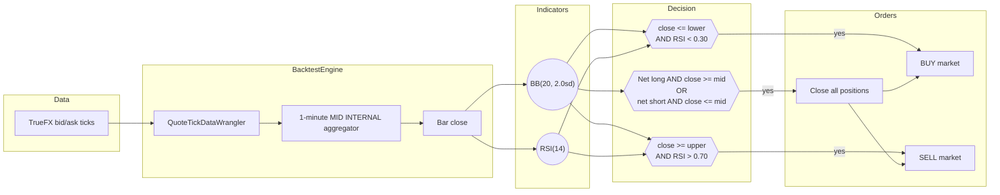

# 基于代理外汇数据的均值回归（AX Exchange）

本教程在 [AX Exchange](https://architect.exchange) 的
**EURUSD-PERP** 上回测一个布林带均值回归策略，使用
[TrueFX](https://www.truefx.com) 的 EUR/USD 现货 tick 数据作为代理。

## 简介

该策略在 1 分钟中间价（mid）K 线上结合了两个指标：

- **布林带（Bollinger Bands）**（`BBMeanReversion` 的 `BB(20, 2.0sd)`）：
  一个滚动 20 根 K 线的均值以及 +/-2 倍标准差包络线。布林带用于标记
  价格相对于近期波动率是否过度延伸。
- **相对强弱指标（RSI）**（`RSI(14)`）：一个 14 根 K 线的动量振荡器。
  NautilusTrader 的 RSI 取值范围为 `[0, 1]`，因此传统的 30/70 阈值
  变为 `0.30` / `0.70`。

入场需要两个信号同时满足：触及下轨且 `RSI < 0.30` 时开多；触及上轨
且 `RSI > 0.70` 时开空。出场是单向的：任何持仓在收盘价重新穿越布林带
中轨时平仓。开新仓前会先平掉反向的已有持仓。

随附的 `BBMeanReversion` 策略刻意保持简单，本身并不具备任何优势
（edge）。



### 为什么使用代理数据

AX Exchange 是一个尚未被历史数据供应商覆盖的新交易场所。
[TrueFX](https://www.truefx.com) 提供免费的机构级 EUR/USD 现货
逐笔数据存档（Integral 和 Jefferies 流动性池），可以很好地作为
AX EURUSD-PERP 回测的替代数据。

## 前提条件

- Python 3.12+
- 已安装 [NautilusTrader](https://pypi.org/project/nautilus_trader/)。
- 一个免费的 TrueFX 账户，用于下载按月的逐笔数据存档。

## 数据准备

### 下载 TrueFX EUR/USD 逐笔数据

1. 前往 [TrueFX 历史数据下载页面](https://www.truefx.com/truefx-historical-downloads/)。
2. 选择 **EUR/USD** 和某个月份，例如 **2025 年 12 月**。
3. 解压 ZIP 文件。CSV 文件没有表头，列为
   `pair, timestamp, bid, ask`。

### 加载为 Nautilus 报价 tick

```python
from pathlib import Path

import pandas as pd

from nautilus_trader.persistence.wranglers import QuoteTickDataWrangler

df = pd.read_csv(
    Path("EURUSD-2025-12.csv"),
    header=None,
    names=["pair", "timestamp", "bid", "ask"],
)
df["timestamp"] = pd.to_datetime(df["timestamp"], format="%Y%m%d %H:%M:%S.%f")
df = df.set_index("timestamp")[["bid", "ask"]]

wrangler = QuoteTickDataWrangler(instrument=EURUSD_PERP)  # 定义见下文
ticks = wrangler.process(df)
```

wrangler 会为每个 tick 打上交易品种 ID 标签。该策略声明了
`1-MINUTE-MID-INTERNAL`，因此引擎会在内部从 tick 数据流中构建
1 分钟中间价 K 线。

## 交易品种定义

代理数据需要手动定义交易品种。乘数 `1000` 使一份合约对应 1,000 EUR
的名义本金。

```python
from decimal import Decimal

from nautilus_trader.model.currencies import USD
from nautilus_trader.model.enums import AssetClass
from nautilus_trader.model.identifiers import InstrumentId
from nautilus_trader.model.identifiers import Symbol
from nautilus_trader.model.instruments import PerpetualContract
from nautilus_trader.model.objects import Price
from nautilus_trader.model.objects import Quantity

instrument_id = InstrumentId.from_str("EURUSD-PERP.AX")

EURUSD_PERP = PerpetualContract(
    instrument_id=instrument_id,
    raw_symbol=Symbol("EURUSD-PERP"),
    underlying="EUR",
    asset_class=AssetClass.FX,
    quote_currency=USD,
    settlement_currency=USD,
    is_inverse=False,
    price_precision=5,
    size_precision=0,
    price_increment=Price.from_str("0.00001"),
    size_increment=Quantity.from_int(1),
    multiplier=Quantity.from_int(1000),
    lot_size=Quantity.from_int(1),
    margin_init=Decimal("0.05"),
    margin_maint=Decimal("0.025"),
    maker_fee=Decimal("0.0002"),
    taker_fee=Decimal("0.0005"),
    ts_event=0,
    ts_init=0,
)
```

手续费和保证金是明确的回测假设。请查阅
[AX Exchange 文档](https://docs.architect.exchange/)获取当前费率。

## 配置

| 参数            | 值  | 描述                                          |
| -------------------- | ------ | ---------------------------------------------------- |
| `bb_period`          | `20`   | 布林带均值和标准差的滚动窗口。 |
| `bb_std`             | `2.0`  | 以标准差为单位的带宽。                   |
| `rsi_period`         | `14`   | RSI 的回看 K 线数量。                                |
| `rsi_buy_threshold`  | `0.30` | 做多入场确认阈值（NautilusTrader RSI 取值 `[0, 1]`）。 |
| `rsi_sell_threshold` | `0.70` | 做空入场确认阈值。                            |
| `trade_size`         | `1`    | 每笔交易一份合约（名义本金 1,000 EUR）。         |

:::tip
NautilusTrader 的 RSI 返回值范围是 `[0.0, 1.0]`，而非 `[0, 100]`。
`0.30` / `0.70` 阈值对应教科书中常见的 30 / 70 水平。
:::

## 回测设置

```python
from nautilus_trader.backtest.config import BacktestEngineConfig
from nautilus_trader.backtest.engine import BacktestEngine
from nautilus_trader.config import LoggingConfig
from nautilus_trader.examples.strategies.bb_mean_reversion import BBMeanReversion
from nautilus_trader.examples.strategies.bb_mean_reversion import BBMeanReversionConfig
from nautilus_trader.model.data import BarType
from nautilus_trader.model.enums import AccountType
from nautilus_trader.model.enums import OmsType
from nautilus_trader.model.identifiers import TraderId
from nautilus_trader.model.identifiers import Venue
from nautilus_trader.model.objects import Money

engine = BacktestEngine(
    BacktestEngineConfig(
        trader_id=TraderId("BACKTESTER-001"),
        logging=LoggingConfig(log_level="INFO"),
    ),
)

AX = Venue("AX")
engine.add_venue(
    venue=AX,
    oms_type=OmsType.NETTING,
    account_type=AccountType.MARGIN,
    base_currency=USD,
    starting_balances=[Money(100_000, USD)],
)

engine.add_instrument(EURUSD_PERP)
engine.add_data(ticks)

strategy = BBMeanReversion(
    BBMeanReversionConfig(
        instrument_id=instrument_id,
        bar_type=BarType.from_str("EURUSD-PERP.AX-1-MINUTE-MID-INTERNAL"),
        trade_size=Decimal("1"),
        bb_period=20,
        bb_std=2.0,
        rsi_period=14,
        rsi_buy_threshold=0.30,
        rsi_sell_threshold=0.70,
    ),
)
engine.add_strategy(strategy)
engine.run()
```

报告可直接从 `engine.trader` 获取：

```python
print(engine.trader.generate_account_report(AX))
print(engine.trader.generate_order_fills_report())
print(engine.trader.generate_positions_report())

engine.reset()
engine.dispose()
```

可直接运行的示例位于
[`architect_ax_mean_reversion.py`](https://github.com/nautechsystems/nautilus_trader/tree/develop/examples/backtest/architect_ax_mean_reversion.py)。

## 运行产生的结果

将 2025 年 12 月的 TrueFX EUR/USD 数据回放通过
`BBMeanReversion(20, 2sd, RSI 14)`，会产生 44,591 根 1 分钟中间价
K 线，并通过 2,178 次成交平掉 1,089 笔持仓。累计已实现盈亏最终为
**-1,287 USD**：策略在整个月内持续小幅亏损，没有明显的机制驱动型
恢复。没有机制过滤器的均值回归策略每个周期都要支付点差成本，而
EUR/USD 在 12 月下半月出现了明显的上升趋势，策略反复与该趋势对抗。


**图 1。** *2025 年 12 月 EUR/USD 1 分钟中间价 K 线，附带布林带中轨
和 +/-2 倍标准差包络线。长时间的平坦区段是 TrueFX 数据流中的周末
缺口。*


**图 2。** *围绕数据集中点的 12 小时局部放大图。上方：中间价及
布林带包络、做多入场（向上三角）、做空入场（向下三角）以及平仓成交
（叉号）。下方：RSI(14) 及 0.30 买入 / 0.70 卖出阈值。*


**图 3。** *整月内每根 K 线的布林带 z 分数与 RSI 的对照散点图。
阴影区域标出了可入场的象限：左下（做多）和右上（做空）。对角线状的
分布是价格相对布林带位置与 RSI 之间自然共动关系的体现。*


**图 4。** *各笔已平仓头寸的累计已实现美元盈亏。曲线大致呈线性下降，
主要由点差成本和每个周期中的小幅不利波动所主导。*

### 重新生成面板图

一个独立的渲染脚本会重新运行该回测，在采集到的 K 线上计算布林带和
RSI，并使用共享的 `nautilus_dark` tearsheet 主题绘制 PNG 面板图。

```bash
uv sync --extra visualization
TRUEFX_CSV=tests/test_data/local/truefx/EURUSD-2025-12.csv \
    python3 docs/tutorials/assets/fx_mean_reversion_ax/render_panels.py
```

请将 `TRUEFX_CSV` 设置为您保存 EUR/USD 数据存档的实际路径。

## 后续步骤

- **添加机制过滤器**。回撤主要集中在趋势性行情中。当已实现波动幅度
  或较慢的趋势过滤器表明市场处于趋势状态时，可抑制入场。
- **调整阈值**。更宽的带宽（`bb_std=2.5`）或更严格的 RSI 阈值
  （`0.25` / `0.75`）会减少入场次数，但会提高确认门槛。
- **添加止损**。硬性止损单可限制每个周期的下行风险，避免持有亏损
  仓位直到等待布林带中轨回归。
- **在 AX 沙盒环境上实盘运行**。一旦回测表现符合预期，可连接到 AX
  沙盒环境进行模拟交易。设置方法参见
  [AX Exchange 集成指南](../integrations/architect_ax.md)。

## 实盘运行

同一个 `BBMeanReversion` 策略可在 AX Exchange 上实盘运行。启动脚本
会将 `BacktestEngine` 替换为配置了 AX 数据和执行客户端的
`TradingNode`。参见实盘示例：
[`ax_mean_reversion.py`](https://github.com/nautechsystems/nautilus_trader/tree/develop/examples/live/architect_ax/ax_mean_reversion.py)。

有关连接设置和 API 密钥配置，请参见
[AX Exchange 集成指南](../integrations/architect_ax.md)。

## 延伸阅读

- [`BBMeanReversion` 策略源码](https://github.com/nautechsystems/nautilus_trader/tree/develop/nautilus_trader/examples/strategies/bb_mean_reversion.py)
- [黄金永续合约订单簿失衡教程](gold_book_imbalance_ax.md)
- [Architect Exchange 文档](https://docs.architect.exchange/)
