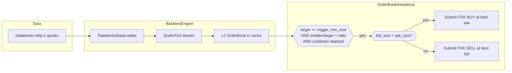

# 使用代理期货数据实现黄金永续合约订单簿失衡（AX Exchange）

本教程在 [AX Exchange](https://architect.exchange) 的
**XAU-PERP** 上回测一个最优挂单失衡策略，使用
[Databento](https://databento.com) 的 CME 黄金期货（`GC.v.0`）
`mbp-1` 报价数据作为代理。

## 简介

最优挂单（top-of-book）失衡是一种微观结构信号：当买卖最优报价
（BBO）某一侧的挂单量明显多于另一侧时，订单簿呈现倾斜状态，短期
价格往往会朝着挂单较薄的一侧移动，因为较厚的一侧在吸收成交流量。
随附的 `OrderBookImbalance` 策略会在双边比率突破阈值且冷却时间已过时，
对较厚的一侧下达全部成交或全部取消（FOK）限价单。

由于该策略只需要最优报价（BBO），它使用 `mbp-1`（按价格市场深度，
仅最优买卖价）报价数据，而非完整的 L2 订单簿。这样可以降低回测的
数据成本。

`OrderBookImbalance` 是一个教学型策略，本身不具备任何优势（edge）。



### 为什么使用代理数据

AX Exchange 是一个新的交易场所，Databento 尚未覆盖。CME 的
`GC` 黄金期货是全球流动性最好的黄金衍生品，为黄金策略回测提供了
具有代表性的微观结构数据。我们使用**连续合约**（continuous contract）
`GC.v.0`，这样该文件会在成交量最高的合约上跨到期日拼接数据，
模拟永续合约追逐流动性的行为方式。`stype_in="continuous"` 参数
会在请求时通过 Databento 的连续合约映射解析该符号。在加载时覆盖
`instrument_id` 是安全的，因为连续合约在任意时刻都映射到单一的
标的交易品种。

有关订单簿失衡特征预测能力的更深入解读，请参见 Databento 的
[使用 sklearn 分析高频交易信号的博客文章](https://databento.com/blog/hft-sklearn-python)。

## 前提条件

- Python 3.12+
- 已安装 [NautilusTrader](https://pypi.org/project/nautilus_trader/)。
- 一个 Databento API 密钥：

```bash
export DATABENTO_API_KEY="your-api-key"
```

- Databento 的 Python 客户端：`pip install databento`。

## 数据准备

### 下载 CME 黄金期货报价

```python
import databento as db
from pathlib import Path

data_path = Path("gc_gold_quotes.dbn.zst")

if not data_path.exists():
    client = db.Historical()
    data = client.timeseries.get_range(
        dataset="GLBX.MDP3",
        symbols=["GC.v.0"],
        stype_in="continuous",
        schema="mbp-1",
        start="2024-11-15",
        end="2024-11-16",
    )
    data.to_file(data_path)
```

这会拉取一个交易日的数据。该文件会在后续运行中被复用。

### 加载为 Nautilus 报价 tick

`DatabentoDataLoader.from_dbn_file` 解析 `.dbn.zst` 存档并生成
`QuoteTick` 对象。`instrument_id` 参数会覆盖 Databento 的符号体系，
使每个 tick 看起来都来自 `XAU-PERP.AX`。

```python
from nautilus_trader.adapters.databento import DatabentoDataLoader
from nautilus_trader.model.identifiers import InstrumentId

instrument_id = InstrumentId.from_str("XAU-PERP.AX")

loader = DatabentoDataLoader()
quotes = loader.from_dbn_file(
    path="gc_gold_quotes.dbn.zst",
    instrument_id=instrument_id,
)
```

## 交易品种定义

代理数据需要手动定义交易品种。价格精度和最小变动单位与 CME 源数据
一致；保证金和手续费参数反映 AX 的实际条件。

```python
from decimal import Decimal

from nautilus_trader.model.currencies import USD
from nautilus_trader.model.enums import AssetClass
from nautilus_trader.model.identifiers import Symbol
from nautilus_trader.model.instruments import PerpetualContract
from nautilus_trader.model.objects import Price
from nautilus_trader.model.objects import Quantity

XAU_PERP = PerpetualContract(
    instrument_id=instrument_id,
    raw_symbol=Symbol("XAU-PERP"),
    underlying="XAU",
    asset_class=AssetClass.COMMODITY,
    quote_currency=USD,
    settlement_currency=USD,
    is_inverse=False,
    price_precision=2,
    size_precision=0,
    price_increment=Price.from_str("0.01"),
    size_increment=Quantity.from_int(1),
    multiplier=Quantity.from_int(1),
    lot_size=Quantity.from_int(1),
    margin_init=Decimal("0.08"),
    margin_maint=Decimal("0.04"),
    maker_fee=Decimal("0.0002"),
    taker_fee=Decimal("0.0005"),
    ts_event=0,
    ts_init=0,
)
```

手续费是明确的回测假设。请查阅
[AX 文档](https://docs.architect.exchange/)获取当前费率。

## 策略配置

`use_quote_ticks=True` 和 `book_type="L1_MBP"` 两者结合，
告诉该策略消费报价数据并在缓存中自行维护 L1 订单簿，而不是订阅
L2 增量数据。

| 参数                      | 值     | 描述                                   |
| ------------------------------ | --------- | --------------------------------------------- |
| `max_trade_size`               | `10`      | 每笔 FOK 订单的合约数量上限。               |
| `trigger_min_size`             | `1.0`     | 较厚一侧必须至少持有一份合约。  |
| `trigger_imbalance_ratio`      | `0.10`    | 当 较薄/较厚 < 10% 时触发。          |
| `min_seconds_between_triggers` | `5.0`     | 连续两次触发之间的冷却时间。        |
| `book_type`                    | `L1_MBP`  | 仅使用最优挂单。                             |
| `use_quote_ticks`              | `True`    | 由报价 tick 驱动策略。          |

```python
from nautilus_trader.examples.strategies.orderbook_imbalance import OrderBookImbalance
from nautilus_trader.examples.strategies.orderbook_imbalance import OrderBookImbalanceConfig

strategy = OrderBookImbalance(
    OrderBookImbalanceConfig(
        instrument_id=instrument_id,
        max_trade_size=Decimal(10),
        trigger_min_size=1.0,
        trigger_imbalance_ratio=0.10,
        min_seconds_between_triggers=5.0,
        book_type="L1_MBP",
        use_quote_ticks=True,
    ),
)
```

## 回测设置

```python
from nautilus_trader.backtest.config import BacktestEngineConfig
from nautilus_trader.backtest.engine import BacktestEngine
from nautilus_trader.config import LoggingConfig
from nautilus_trader.model.enums import AccountType
from nautilus_trader.model.enums import OmsType
from nautilus_trader.model.identifiers import TraderId
from nautilus_trader.model.identifiers import Venue
from nautilus_trader.model.objects import Money

engine = BacktestEngine(
    BacktestEngineConfig(
        trader_id=TraderId("BACKTESTER-001"),
        logging=LoggingConfig(log_level="INFO"),
    ),
)

AX = Venue("AX")
engine.add_venue(
    venue=AX,
    oms_type=OmsType.NETTING,
    account_type=AccountType.MARGIN,
    base_currency=USD,
    starting_balances=[Money(100_000, USD)],
)

engine.add_instrument(XAU_PERP)
engine.add_data(quotes)
engine.add_strategy(strategy)
engine.run()
```

报告可从 `engine.trader` 获取：

```python
print(engine.trader.generate_account_report(AX))
print(engine.trader.generate_order_fills_report())
print(engine.trader.generate_positions_report())

engine.reset()
engine.dispose()
```

可直接运行的示例位于
[`architect_ax_book_imbalance.py`](https://github.com/nautechsystems/nautilus_trader/tree/develop/examples/backtest/architect_ax_book_imbalance.py)。

## 运行产生的结果

将 2024-11-15 一个交易日的 GC.v.0 mbp-1 数据回放通过
`OrderBookImbalance(0.10, 1.0, 5s)`，会产生 2,378 次 FOK 成交，
净结成 5 个已平仓的持仓周期。累计已实现盈亏最终为 **-4,170 USD**：
策略在整个交易日中持续小幅亏损，主要来自加仓型 FOK 成交所产生的
点差成本。


**图 1。** *围绕一个交易周期的 GC.v.0 最优挂单情况，该周期于 09:26
附近以空头入场开始，于 09:31 附近退出，随后再度做多入场直至 09:35。
三角形为从空仓状态入场，叉号为回到空仓状态，空心圆为使持仓量增加的
加仓型 FOK 成交。*


**图 2。** *全天所有采样的最优挂单快照中 `较薄/较厚` 的 BBO
挂单量比率分布，图中标出了 0.10 的触发阈值。阈值左侧的部分即为
可触发的信号区域。*


**图 3。** *全天的中间价（上方）与以合约数计的最优买卖挂单量
（下方）。最优挂单量在约两份到五十份合约之间波动；中间价的波动
范围约为十五美元。*


**图 4。** *五个已平仓持仓周期的累计已实现美元盈亏。斜率持续为负，
各周期的盈亏主要由点差成本主导。*

### 重新生成面板图

一个独立的渲染脚本会使用报价采样 Actor 重新运行该回测，并使用
`nautilus_dark` tearsheet 主题将 PNG 图片写入资源目录。

```bash
uv sync --extra visualization
GC_DBN=tests/test_data/local/Databento/gc_gold_quotes.dbn.zst \
    python3 docs/tutorials/assets/gold_book_imbalance_ax/render_panels.py
```

## 后续步骤

- **更严格的触发条件**。将 `trigger_imbalance_ratio` 降低到
  `0.05`，或将 `trigger_min_size` 提高到 `5`，以要求更强的确信度
  才触发。
- **不同交易时段**。仅回放常规交易时段（RTH），或滚动回放多个交易日，
  观察策略在不同市场机制下的表现。
- **其他交易品种**。AX 提供外汇永续合约（`EURUSD-PERP`、
  `GBPUSD-PERP`）和白银（`XAG-PERP`）。同样的代理数据方法也适用于
  对应的 CME 期货。
- **在 AX 沙盒环境上实盘运行**。一旦回测表现符合预期，可参见
  [AX Exchange 集成指南](../integrations/architect_ax.md)。

## 实盘运行

同一个 `OrderBookImbalance` 策略可在 AX Exchange 上实盘运行。启动
脚本会将 `BacktestEngine` 替换为配置了 AX 数据和执行客户端的
`TradingNode`。参见实盘示例：
[`ax_book_imbalance.py`](https://github.com/nautechsystems/nautilus_trader/tree/develop/examples/live/architect_ax/ax_book_imbalance.py)。

有关连接设置和 API 密钥配置，请参见
[AX Exchange 集成指南](../integrations/architect_ax.md)。

## 延伸阅读

- [`OrderBookImbalance` 策略源码](https://github.com/nautechsystems/nautilus_trader/tree/develop/nautilus_trader/examples/strategies/orderbook_imbalance.py)
- [使用代理外汇数据实现均值回归教程](fx_mean_reversion_ax.md)
- [Architect Exchange 文档](https://docs.architect.exchange/)
- [Databento：使用 sklearn 分析高频交易信号](https://databento.com/blog/hft-sklearn-python)
