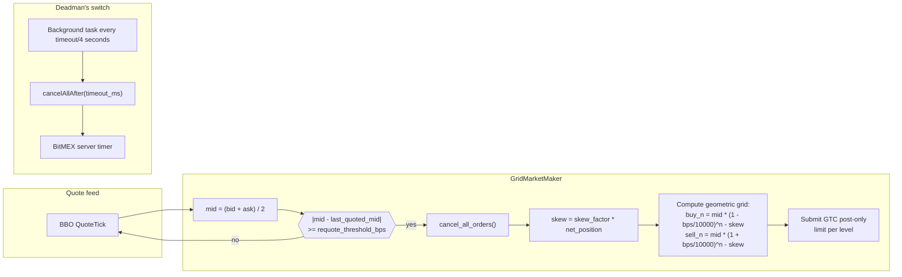
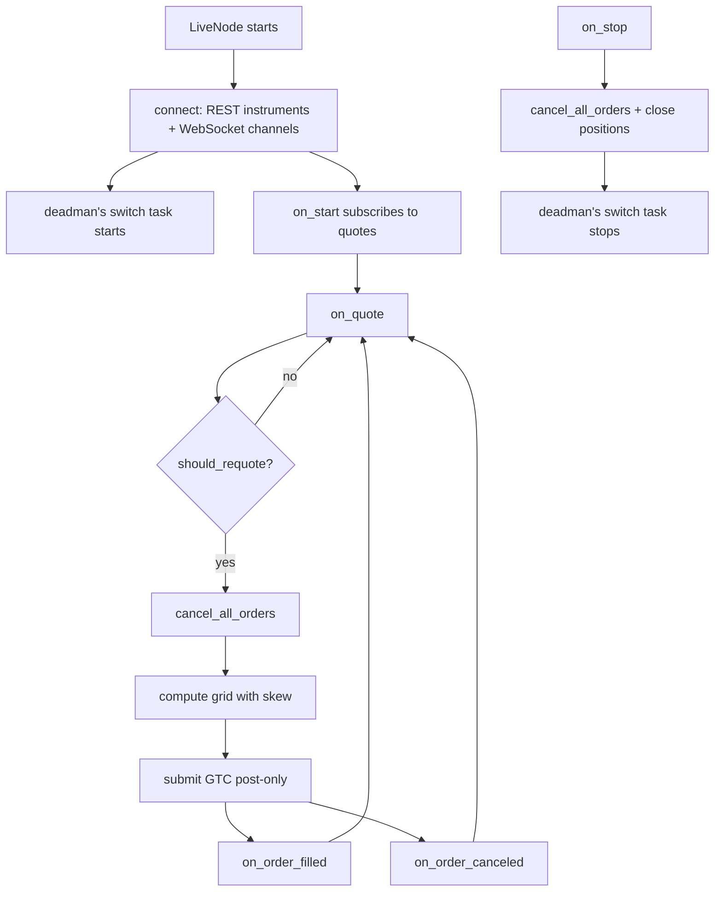

# 基于死人开关的网格做市（BitMEX）

本教程使用来自 [Tardis.dev](https://tardis.dev) 的免费历史报价数据，
在 BitMEX XBTUSD 上回测随附的 `GridMarketMaker` 策略，然后通过
Rust `LiveNode` 使用相同配置进行实盘运行。本教程重点关注 BitMEX 的
**死人开关（deadman's switch）**：一个服务器端的全部取消定时器，
用于在客户端失去连接时保护策略免于产生滞留报价。

## 简介

XBTUSD 是 BitMEX 的一种以美元计价、以 BTC 保证金结算的反向永续合约
（inverse perpetual swap），拥有可追溯至 2014 年的深度订单簿。较窄的
价差和可预测的深度使其成为网格做市的天然场所。



### 为什么选择 BitMEX 进行网格做市

有两个适配器特性与该策略天然契合：

1. **死人开关**（`cancelAllAfter`）：BitMEX 维护一个服务器端的全部
   取消定时器。执行客户端会按计划刷新该定时器。如果连接断开且
   定时器到期，BitMEX 会取消账户上所有未成交订单。
2. **提交/取消广播器**：适配器可以将订单提交和取消请求并行分发到
   多个 HTTP 连接上，以第一个成功的响应为准，其余请求被短路。

### 死人开关的工作机制

当设置了 `deadmans_switch_timeout_secs` 时，一个后台任务会持续
以超时时间的四分之一为间隔刷新服务器端定时器：

```
timeout = 60s -> refresh interval = timeout / 4 = 15s

 t=0s    Strategy starts, cancelAllAfter(60000ms) sent
 t=15s   Refresh: cancelAllAfter(60000ms) sent (resets timer)
 t=30s   Refresh: cancelAllAfter(60000ms) sent
 t=45s   Refresh: cancelAllAfter(60000ms) sent
 t=50s   Connectivity lost (last refresh was at t=45s)
 t=105s  Server timer fires -> BitMEX cancels all open orders
```

对做市而言，滞留报价是一个严重风险：一个持有围绕中间价挂单的客户端
若崩溃，可能在人工干预之前产生无上限的损失。死人开关将敞口暴露窗口
限制在 `timeout` 秒之内。

## 前提条件

- 已安装 [NautilusTrader](https://pypi.org/project/nautilus_trader/)。
- 用于实盘示例的 Rust 工具链（`cargo`）。可从
  [rustup.rs](https://rustup.rs/) 安装。
- 一个 BitMEX 账户：在 [bitmex.com](https://www.bitmex.com/) 注册，
  并生成一个具有订单管理权限的 API 密钥。首次运行请使用
  [BitMEX 测试网](https://testnet.bitmex.com/)。

### 环境变量

```bash
# 主网
export BITMEX_API_KEY="your-api-key"
export BITMEX_API_SECRET="your-api-secret"

# 测试网
export BITMEX_TESTNET_API_KEY="your-testnet-api-key"
export BITMEX_TESTNET_API_SECRET="your-testnet-api-secret"
```

或者将其放在项目根目录的 `.env` 文件中；Python 和 Rust 两条路径
都通过 `dotenvy` 加载该文件。

## 使用免费的 Tardis 报价数据进行回测

除近期成交记录外，BitMEX 自身的 API 并不提供历史 L2 数据。
[Tardis.dev](https://tardis.dev) 从 2019 年 3 月起采集并存档
BitMEX 的逐笔级别数据。**每月第一天的数据无需 API 密钥即可免费
下载**。

### 下载数据

```bash
curl -L -o XBTUSD.csv.gz \
    https://datasets.tardis.dev/v1/bitmex/quotes/2024/01/01/XBTUSD.csv.gz
curl -L -o XBTUSD-trades.csv.gz \
    https://datasets.tardis.dev/v1/bitmex/trades/2024/01/01/XBTUSD.csv.gz
```

成交数据文件对策略而言是可选的，但对绘制面板图很有用：撮合引擎
需要主动成交流量来吃掉挂单方（maker）订单，而这正是由成交数据流
提供的。

:::tip
完整的历史数据（所有日期）需要付费的 Tardis API 密钥。批量获取
请使用 [Tardis 下载工具](https://docs.tardis.dev/downloadable-csv-files)。
:::

### 加载数据

`TardisCSVDataLoader` 直接解析 `.csv.gz` 文件：

```python
from nautilus_trader.adapters.tardis.loaders import TardisCSVDataLoader
from nautilus_trader.model.identifiers import InstrumentId

instrument_id = InstrumentId.from_str("XBTUSD.BITMEX")

loader = TardisCSVDataLoader(instrument_id=instrument_id)
quotes = loader.load_quotes("XBTUSD.csv.gz")
trades = loader.load_trades("XBTUSD-trades.csv.gz")
```

`instrument_id` 参数会将每条记录都标记为 `XBTUSD.BITMEX`，
无论其在源 CSV 中是如何标识的。

### 交易品种定义

XBTUSD 是一种**反向永续合约**：价格以美元计价，但合约以 BTC
进行保证金和结算。一份合约代表 1 美元的名义敞口。

```python
from decimal import Decimal

from nautilus_trader.model.currencies import BTC
from nautilus_trader.model.currencies import USD
from nautilus_trader.model.enums import AssetClass
from nautilus_trader.model.identifiers import Symbol
from nautilus_trader.model.instruments import PerpetualContract
from nautilus_trader.model.objects import Price
from nautilus_trader.model.objects import Quantity

XBTUSD = PerpetualContract(
    instrument_id=instrument_id,
    raw_symbol=Symbol("XBTUSD"),
    underlying="XBT",
    asset_class=AssetClass.CRYPTOCURRENCY,
    base_currency=BTC,
    quote_currency=USD,
    settlement_currency=BTC,
    is_inverse=True,
    price_precision=1,
    size_precision=0,
    price_increment=Price.from_str("0.5"),
    size_increment=Quantity.from_int(1),
    multiplier=Quantity.from_int(1),
    lot_size=Quantity.from_int(1),
    margin_init=Decimal("0.01"),
    margin_maint=Decimal("0.005"),
    maker_fee=Decimal("-0.00025"),
    taker_fee=Decimal("0.00075"),
    ts_event=0,
    ts_init=0,
)
```

手续费率是明确的回测假设。请查阅
[bitmex.com/app/fees](https://www.bitmex.com/app/fees) 获取当前费率。

### 回测引擎设置

XBTUSD 以 BTC 计保证金，因此起始余额以 BTC 计价：

```python
from nautilus_trader.backtest.config import BacktestEngineConfig
from nautilus_trader.backtest.engine import BacktestEngine
from nautilus_trader.config import LoggingConfig
from nautilus_trader.model.enums import AccountType
from nautilus_trader.model.enums import OmsType
from nautilus_trader.model.identifiers import TraderId
from nautilus_trader.model.identifiers import Venue
from nautilus_trader.model.objects import Money

engine = BacktestEngine(
    BacktestEngineConfig(
        trader_id=TraderId("BACKTESTER-001"),
        logging=LoggingConfig(log_level="INFO"),
    ),
)

BITMEX = Venue("BITMEX")
engine.add_venue(
    venue=BITMEX,
    oms_type=OmsType.NETTING,
    account_type=AccountType.MARGIN,
    base_currency=BTC,
    starting_balances=[Money(1, BTC)],
)

engine.add_instrument(XBTUSD)
engine.add_data(quotes + trades)
```

### 策略配置

```python
from nautilus_trader.examples.strategies.grid_market_maker import GridMarketMaker
from nautilus_trader.examples.strategies.grid_market_maker import GridMarketMakerConfig

strategy = GridMarketMaker(
    GridMarketMakerConfig(
        instrument_id=instrument_id,
        max_position=Quantity.from_int(300),
        trade_size=Quantity.from_int(100),
        num_levels=3,
        grid_step_bps=100,
        skew_factor=0.5,
        requote_threshold_bps=10,
    ),
)
engine.add_strategy(strategy)
```

### 运行并查看结果

```python
import pandas as pd

engine.run()

with pd.option_context("display.max_rows", 100, "display.max_columns", None, "display.width", 300):
    print(engine.trader.generate_account_report(BITMEX))
    print(engine.trader.generate_order_fills_report())
    print(engine.trader.generate_positions_report())

engine.reset()
engine.dispose()
```

完整的回测脚本位于
[`bitmex_grid_market_maker.py`](https://github.com/nautechsystems/nautilus_trader/tree/develop/examples/backtest/bitmex_grid_market_maker.py)。

### 运行产生的结果

免费提供的 2024-01-01 样本数据是一个平静的元旦交易日：BTC 全天大部分
时间都在约 200 美元的范围内波动。使用推荐用于实盘的
`grid_step_bps=100`（1%）配置时，最内侧的买卖档位距中间价约
420 美元，全天都未被触及：该示例最终完成时零成交，这是在平静
行情下的真实结果。

下方面板使用了更紧的 `grid_step_bps=20` 配置，对前 200,000 条报价
进行处理，以便展示 maker 成交情况。在 20 bps 步长、两个档位、
20 bps 重新报价阈值的条件下，策略在采集窗口内产生了 22 次 maker
成交。


**图 1。** *XBTUSD 中间价（青色）与 `grid_step_bps=20`、
`num_levels=2` 下的四条理论网格带。三角形为 maker 成交，
向上 = 买入，向下 = 卖出。*

**图 2** 与重新报价阈值对比的中间价步幅分布。


**图 2。** *在采集窗口内，每 5 分钟区间的最大中间价步幅（以基点计）。
虚线以上的区间至少触发过一次重新报价阈值。*


**图 3。** *在 maker 成交序列中的累计带符号 XBTUSD 合约数。库存偏斜
在每次成交后将网格拉回中性。*


**图 4。** *`timeout=60s`、`refresh_interval=15s` 的服务器端
全部取消定时器。每次刷新将定时器重置为 60s。在 t=50s 连接失败后，
定时器不受打扰地持续倒数；服务器在 t=105s 触发 `cancelAll`。*

### 重新生成面板图

```bash
uv sync --extra visualization
XBTUSD_QUOTES=XBTUSD.csv.gz XBTUSD_TRADES=XBTUSD-trades.csv.gz \
    python3 docs/tutorials/assets/grid_market_maker_bitmex/render_panels.py
```

渲染脚本将数据集限制在 200,000 条报价和 30,000 条成交以内，
以确保该运行能在几分钟内可复现地完成。

## 实盘交易：带死人开关的 GridMarketMaker

一旦回测行为符合预期，同一配置可通过 Rust `LiveNode` 实盘运行。
该策略是原生用 Rust 实现的。

### 环境设置

在配置中未显式设置时，凭据会自动从环境变量加载：

```bash
# 测试网（推荐用于首次运行）
export BITMEX_TESTNET_API_KEY="your-key"
export BITMEX_TESTNET_API_SECRET="your-secret"
```

或者将其放在项目根目录的 `.env` 文件中。

### 代码解析

完整的 `main()` 函数位于
[`node_grid_mm.rs`](https://github.com/nautechsystems/nautilus_trader/tree/develop/crates/adapters/bitmex/examples/node_grid_mm.rs)：

```rust
#[tokio::main]
async fn main() -> Result<(), Box<dyn std::error::Error>> {
    dotenvy::dotenv().ok();

    let environment = Environment::Live;
    let trader_id = TraderId::from("TESTER-001");
    let instrument_id = InstrumentId::from("XBTUSD.BITMEX");

    let data_config = BitmexDataClientConfig {
        environment: BitmexEnvironment::Testnet,
        ..Default::default()
    };

    let exec_config = BitmexExecFactoryConfig::new(
        trader_id,
        BitmexExecClientConfig {
            environment: BitmexEnvironment::Testnet,
            deadmans_switch_timeout_secs: Some(60),
            ..Default::default()
        },
    );

    let data_factory = BitmexDataClientFactory::new();
    let exec_factory = BitmexExecutionClientFactory::new();

    let log_config = LoggerConfig {
        stdout_level: LevelFilter::Info,
        ..Default::default()
    };

    let mut node = LiveNode::builder(trader_id, environment)?
        .with_logging(log_config)
        .add_data_client(None, Box::new(data_factory), Box::new(data_config))?
        .add_exec_client(None, Box::new(exec_factory), Box::new(exec_config))?
        .with_reconciliation(true)
        .with_reconciliation_lookback_mins(2880)
        .with_delay_post_stop_secs(5)
        .build()?;

    let config = GridMarketMakerConfig::builder()
        .instrument_id(instrument_id)
        .max_position(Quantity::from("300"))
        .num_levels(3)
        .grid_step_bps(100)
        .skew_factor(0.5)
        .requote_threshold_bps(10)
        .build();
    let strategy = GridMarketMaker::new(config);

    node.add_strategy(strategy)?;
    node.run().await?;

    Ok(())
}
```

配置要点：

- **`deadmans_switch_timeout_secs: Some(60)`**：以 60 秒超时和
  15 秒刷新间隔启用死人开关。
- **`with_reconciliation(true)`**：启动时查询 BitMEX REST API，
  重新加载未成交订单和持仓，使策略在重启后能正确恢复。
- **`with_reconciliation_lookback_mins(2880)`**：对账回看
  2880 分钟（两天）的订单历史。
- **`with_delay_post_stop_secs(5)`**：停止后有 5 秒的宽限期，
  用于在节点退出前处理待处理的取消和成交事件。

### BitMEX 专属考量

#### GTC 订单与 post-only

BitMEX 的网格订单以 `GTC` 加 `ParticipateDoNotInitiate`
（post-only）方式提交。如果订单到达时价格已穿越盘口，BitMEX
会拒绝该订单，而不是让其吃掉流动性。

这与 dYdX 的设置不同，dYdX 的短期订单每 8 秒自动过期。在
BitMEX 上，重新报价周期完全由中间价的变动来驱动
（`requote_threshold_bps`）。

#### 订单量化

BitMEX 交易品种的价格和数量量化由适配器自动处理。策略代码中
无需手动进行取整或转换。

#### 反向永续合约的会计处理

XBTUSD 以 BTC 计保证金。盈亏以 BTC 累积：在 42,000 美元价格下
捕获 1 美元价差，每次成交可获利 1/42,000 BTC。请相应设置
`max_position` 和 `trade_size` 的规模。

### 运行示例

```bash
cargo run --example bitmex-grid-mm --package nautilus-bitmex --features examples
```

### 优雅关闭

按 **Ctrl+C** 停止节点。关闭顺序如下：

1. 收到 SIGINT，trader 停止，触发 `on_stop()`。
2. 策略取消所有订单并平仓。
3. 5 秒宽限期（`delay_post_stop_secs`）处理剩余事件。
4. 死人开关后台任务停止。
5. 客户端断开连接，节点退出。

## 配置参考

### GridMarketMaker 参数

| 参数               | 类型           | 默认值    | 描述                                                              |
| ----------------------- | -------------- | ---------- | ------------------------------------------------------------------------ |
| `instrument_id`         | `InstrumentId` | *必填* | 要交易的交易品种（例如 `XBTUSD.BITMEX`）。                              |
| `max_position`          | `Quantity`     | *必填* | 以合约计的最大净敞口（多头或空头）。                       |
| `trade_size`            | `Quantity`     | `None`     | 每个网格档位的数量。若为 `None`，使用交易品种的 `min_quantity` 或 1.0。 |
| `num_levels`            | `usize`        | `3`        | 买入和卖出档位的数量。                                                   |
| `grid_step_bps`         | `u32`          | `10`       | 以基点计的网格间距（100 = 1%）。                                 |
| `skew_factor`           | `f64`          | `0.0`      | 根据净库存调整网格偏斜的激进程度。                            |
| `requote_threshold_bps` | `u32`          | `5`        | 重新报价前所需的最小中间价变动（基点）。                               |
| `expire_time_secs`      | `Option<u64>`  | `None`     | 以秒计的订单过期时间。在 BitMEX 上使用 `None` 表示 GTC。                   |
| `on_cancel_resubmit`    | `bool`         | `false`    | 在意外取消后于下一次报价重新提交网格。                              |

### 死人开关参数

| 参数                      | 类型          | 描述                                                                                       |
| ------------------------------ | ------------- | ------------------------------------------------------------------------------------------------- |
| `deadmans_switch_timeout_secs` | `Option<u64>` | 以秒计的服务器端取消定时器。刷新间隔 = `timeout / 4`（最短为 1 秒）。`None` 表示禁用该功能。 |

60 秒的超时对应 15 秒的刷新间隔，以及在 BitMEX 触发定时器前的
60 秒窗口。较小的值可缩小敞口暴露窗口，但会增加 API 调用频率；
较大的值可减少开销，但会延长该窗口。

### 选择网格参数

- **`grid_step_bps`**：XBTUSD 价差较窄。建议从 50-100 基点开始，
  确保能成交后再收紧。每个档位可以捕获步长一半的价差。
- **`skew_factor`**：从 `0.0`（无偏斜）开始。值为 `0.5` 时，
  每份净持仓合约将使网格偏移 0.5 美元。
- **`requote_threshold_bps`**：对于 XBTUSD，10 基点（0.1%）是
  一个起始点。较低的值会导致频繁的取消/重新提交；较高的值会在
  快速行情中留下过时的订单。

## 事件流



## 监控与理解输出

### 关键日志消息

| 日志消息                                                             | 含义                                                  |
| ----------------------------------------------------------------------- | -------------------------------------------------------- |
| `Requoting grid: mid=X, last_mid=Y`                                     | 中间价移动超出阈值，正在刷新网格。             |
| `Starting dead man's switch: timeout=60s, refresh_interval=15s`         | 死人开关在节点启动时启用。                    |
| `Dead man's switch heartbeat failed: ...`                               | 出现瞬时网络问题；死人开关会在下一个周期重试。|
| `Disarming dead man's switch`                                           | 关闭期间死人开关被干净地停止。                  |
| `benign cancel error, treating as success`                              | 对已成交或已取消订单的取消操作（属正常现象）。|
| `Reconciling orders from last 2880 minutes`                             | 启动时的对账正在加载先前状态。              |

### 预期的行为模式

1. **启动**：加载交易品种、对账查询先前的订单、WebSocket
   连接成功、首次报价触发初始网格。
2. **稳态**：网格在各次行情更新间保持不变；仅当中间价超出阈值时
   才重新报价。
3. **成交**：持仓更新，在下一次重新报价时调整偏斜。
4. **关闭**：所有订单被取消，持仓被平掉，死人开关停止。
5. **重启**：对账恢复未成交订单状态；策略从先前的网格继续运行。

## 定制建议

### 高波动 vs 低波动

| 条件       | 调整方式                                                                |
| --------------- | ------------------------------------------------------------------------- |
| 高波动 | 更宽的 `grid_step_bps`（100-200），更少的 `num_levels`，更低的 `skew_factor`。 |
| 低波动  | 更紧的 `grid_step_bps`（20-50），更多的 `num_levels`，更高的 `skew_factor`。 |
| 流动性稀薄  | 提高 `requote_threshold_bps` 以减少取消频率。              |

### 启用提交广播器

对于生产环境部署，可启用提交广播器，以在多个 HTTP 连接上提供
冗余的订单提交：

```rust
let exec_config = BitmexExecFactoryConfig::new(
    trader_id,
    BitmexExecClientConfig {
        environment: BitmexEnvironment::Mainnet,
        deadmans_switch_timeout_secs: Some(60),
        submitter_pool_size: Some(2),
        canceller_pool_size: Some(2),
        ..Default::default()
    },
);
```

当 `submitter_pool_size=2` 时，每次订单提交会并行分发到两个 HTTP
客户端；以第一个成功的响应为准。这降低了因某条路径卡顿而错过
提交的概率。

### 主网切换

将两个配置的 `environment` 字段都设置为
`BitmexEnvironment::Mainnet` 即可切换网络。所有端点和凭据相关的
环境变量都会自动解析。

## 延伸阅读

- [BitMEX 集成指南](../integrations/bitmex.md)：完整的适配器参考。
- [基于短期订单的链上网格做市（dYdX）](./grid_market_maker_dydx.md)：
  以短期订单过期机制作为死人开关的一种替代方案。
- [Tardis 可下载 CSV 文件](https://docs.tardis.dev/downloadable-csv-files)：
  Tardis 存档的 schema 文档。
- [BitMEX API 文档](https://www.bitmex.com/app/apiOverview)：
  `cancelAllAfter` 端点和订单管理参考。
