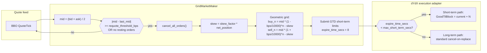
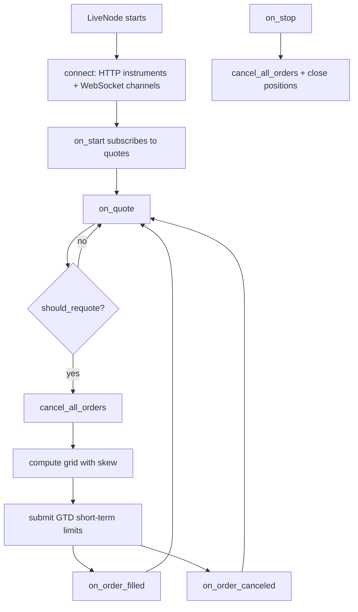

# 基于短期订单的链上网格做市（dYdX）

本教程通过 Rust `LiveNode` 在 dYdX v4 上运行随附的 `GridMarketMaker`
策略。该策略在中间价周围下达对称的限价单，通过偏斜网格来管理库存，
并让交易场所按区块到期时间（time-to-block expiry）来循环短期订单，
而非依赖显式的取消操作。

## 简介

网格做市商在当前中间价周围以固定价格间隔维护一系列挂单买卖限价单。
当某个订单成交时，策略从买卖档位之间的价差中获利。库存管理将净敞口
保持在 `max_position` 以内，使网格不会累积方向性头寸。



### 库存偏斜（受 Avellaneda-Stoikov 启发）

当持仓变为净多头时，整个网格向下移动（更便宜的买价、更便宜的卖价），
以促使下一次成交发生在卖出侧。当持仓变为净空头时，网格向上移动。
这借鉴了 Avellaneda-Stoikov 框架，并将其适配为离散网格。

### 为什么选择 dYdX v4

dYdX v4 非常适合做市：

- **短期订单**，到期时间约 20 秒：低延迟下单，无链上存储成本。
- **约 0.5 秒的出块时间**，实现快速的确认周期。
- **取消无需支付 gas 费**：在 GTB（Good-Til-Block）重放保护机制下，
  短期订单的取消是免费的。
- **链上订单簿**，具有确定性的逐块撮合。
- **批量取消**：一条 `MsgBatchCancel` 可清除所有短期订单。

## 前提条件

### 已注资的 dYdX 账户

您需要一个持有 USDC 抵押品的 dYdX 账户。有关创建和为测试网账户注资的
说明，请参见集成指南中的
[测试网设置](../integrations/dydx.md#testnet-setup)部分。测试网
钱包还需要通过 dYdX UI 注册一个 API 交易密钥。

### 环境变量

```bash
# 主网
export DYDX_PRIVATE_KEY="0x..."
export DYDX_WALLET_ADDRESS="dydx1..."

# 测试网
export DYDX_TESTNET_PRIVATE_KEY="0x..."
export DYDX_TESTNET_WALLET_ADDRESS="dydx1..."
```

## 策略概述

### 几何网格定价

每个档位与中间价保持固定百分比（基点）的距离：

```
Buy level N:  mid * (1 - bps/10000)^N - skew
Sell level N: mid * (1 + bps/10000)^N - skew
```

其中 `skew = skew_factor * net_position`。

以中间价为 1000.00、`grid_step_bps=100`（1%）的 3 档网格为例：

```
                        Sell 3: 1030.30
                    Sell 2: 1020.10
                Sell 1: 1010.00
            ─── Mid: 1000.00 ───
                Buy 1:  990.00
                    Buy 2:  980.10
                        Buy 3:  970.30
```

在净多头持仓为 2 且 `skew_factor=1.0` 时，整个网格向下偏移 2.0：

```
                        Sell 3: 1028.30
                    Sell 2: 1018.10
                Sell 1: 1008.00
            ─── Mid: 1000.00 ───
                Buy 1:  988.00
                    Buy 2:  978.10
                        Buy 3:  968.30
```

### 库存管理

该策略通过两种机制执行持仓限制：

1. **`max_position`**：净敞口（多头或空头）的硬上限。当加入下一个
   网格档位所产生的预计敞口将突破该上限时，该档位会被跳过。
2. **预计敞口跟踪**：在下达每个档位之前，策略会跟踪最坏情况下的
   单侧敞口（当前持仓加上所有待处理的买/卖订单），以避免过度承诺。

`cancel_all_orders` 是异步的，因此在取消请求发出到收到确认之间，
待处理订单仍可能成交。跟踪最坏情况下的单侧敞口可以防止在
取消-重新报价过渡期间出现瞬时的过度敞口。

### 重新报价阈值

`requote_threshold_bps` 控制中间价需要移动多少，策略才会取消所有
未成交订单并下达新的网格：

- **较低的阈值**（5 基点）：响应更快，但会产生更多的取消/下单交易。
- **较高的阈值**（50 基点）：交易更少，但订单可能距离当前价格
  更远。

## 配置

| 参数               | 类型           | 默认值    | 描述                                                              |
| ----------------------- | -------------- | ---------- | ------------------------------------------------------------------------ |
| `instrument_id`         | `InstrumentId` | *必填* | 要交易的交易品种（例如 `ETH-USD-PERP.DYDX`）。                          |
| `max_position`          | `Quantity`     | *必填* | 最大净敞口（多头或空头）。                                    |
| `trade_size`            | `Quantity`     | `None`     | 每个网格档位的数量。若为 `None`，使用交易品种的 `min_quantity` 或 1.0。 |
| `num_levels`            | `usize`        | `3`        | 买入和卖出档位的数量。                                                   |
| `grid_step_bps`         | `u32`          | `10`       | 以基点计的网格间距（10 = 0.1%）。                                |
| `skew_factor`           | `f64`          | `0.0`      | 根据库存调整网格偏斜的激进程度。                   |
| `requote_threshold_bps` | `u32`          | `5`        | 重新报价前所需的最小中间价变动（基点）。                         |
| `expire_time_secs`      | `Option<u64>`  | `None`     | 以秒计的订单过期时间。设置该值时使用 GTD，否则使用 GTC。               |
| `on_cancel_resubmit`    | `bool`         | `false`    | 在意外取消后于下一次报价重新提交网格。                              |

### 参数选择

- **`grid_step_bps`**：在波动较大的市场中使用 50-100 基点，在
  平静行情中使用 5-20 基点。更宽的网格每次成交能捕获更多价差，
  但成交频率更低。
- **`skew_factor`**：从 `0.0` 开始。值为 `0.5` 时，每单位净持仓
  将使网格偏移 0.5 个价格单位。偏斜过度激进可能使整个网格完全
  移到中间价之上或之下。
- **`expire_time_secs`**：对于 dYdX 短期订单，设置为 `8` 秒。
  这落在 40 个区块（约 20 秒）的短期窗口内，能使订单保持在
  快速的短期路径上。当为 `None` 时，订单使用 GTC 和长期路径。
- **`on_cancel_resubmit`**：在一次非策略主动发起的取消（来自索引器
  的短期订单到期、防自成交机制、风险限额）之后，在下一次报价 tick
  触发重新提交。索引器会在每个短期订单到期后不久为其发出取消事件；
  该标志会重置重新报价锚点，使下一次报价即使中间价尚未超出
  `requote_threshold_bps` 也会重建网格。

## dYdX 专属考量

### 短期订单到期

当 `expire_time_secs=8` 时，适配器会将订单归类为短期订单：

1. 适配器检查 `8s < max_short_term_secs（40 个区块 * 约 0.5s = 约 20s）`。
2. 该订单以短期方式提交，`GoodTilBlock = current_height + N`。
3. 若未成交，该订单会在链上约八秒后到期。到期不消耗 gas
   （由链上的 GTB 重放保护机制处理），但索引器仍会在到期区块后不久
   为每个已到期订单发出一个 `OrderCanceled` 事件，因此策略会通过
   正常的取消事件路径感知到该到期。

这是推荐用于做市的配置，因为：

- 短期订单具有更低的延迟。
- 到期不产生链上 gas 成本。
- 持续的重新报价（在 `on_cancel_resubmit=true` 时由索引器发出的
  取消事件驱动）会替换已到期的订单。

完整细节请参见集成指南中的
[订单分类](../integrations/dydx.md#order-classification)部分。

### 意外取消与 `on_cancel_resubmit`

`pending_self_cancels` 集合用于区分自身发起的取消与意外取消：

1. 当策略调用 `cancel_all_orders` 时，会将所有未成交订单 ID 记录到
   `pending_self_cancels` 中。
2. 当 `on_order_canceled` 触发时：
   - 如果该订单 ID 在 `pending_self_cancels` 中，则为自身发起的取消，
     无需采取任何操作。
   - 否则，该取消不是由策略发起的（短期订单到期、防自成交机制或
     风险限额）。此时重置 `last_quoted_mid`，使下一次报价触发完整的
     网格重新提交。

这样可以防止策略在自身发起的取消浪潮中不必要地重新报价，同时仍能
对意外情况作出响应。

`on_order_filled` 也会将该订单从 `pending_self_cancels` 中移除。
如果订单在取消确认到达之前就已成交，这可以防止过时条目累积。

### 订单量化

dYdX 市场的价格和数量量化由适配器的 `OrderMessageBuilder` 自动
处理。无需手动进行取整或转换。详情请参见
[价格与数量量化](../integrations/dydx.md#price-and-size-quantization)。

### Post-only 订单

所有网格订单都以 `post_only=true` 提交。交易所会拒绝任何在撮合时
会穿越价差的订单，因此每笔成交都以 maker 费率结算，网格也不会在
重新报价过渡期间意外吃掉自己的报价。

## 运行与停止

### 环境设置

凭据从环境变量或项目根目录的 `.env` 文件加载（通过 `dotenvy`
自动加载）：

```bash
# 直接导出
export DYDX_PRIVATE_KEY="0x..."
export DYDX_WALLET_ADDRESS="dydx1..."
```

```bash
# .env 等效写法
DYDX_PRIVATE_KEY=0x...
DYDX_WALLET_ADDRESS=dydx1...
```

### 运行示例

```bash
cargo run --example dydx-grid-mm --package nautilus-dydx --features examples
```

该示例默认面向主网。若要在测试网上运行，请将示例文件顶部附近的
`DYDX_NETWORK` 常量设置为 `DydxNetwork::Testnet`
（这需要一个测试网 API 交易密钥），然后重新构建。

### 优雅关闭

按 **Ctrl+C** 停止节点。关闭顺序如下：

1. 收到 SIGINT，trader 停止，触发 `on_stop`。
2. 策略取消所有订单并平仓。
3. 5 秒宽限期（`delay_post_stop_secs`）处理剩余事件。
4. 客户端断开连接，节点退出。

## 代码解析

`main` 函数位于
[`crates/adapters/dydx/examples/node_grid_mm.rs`](https://github.com/nautechsystems/nautilus_trader/tree/develop/crates/adapters/dydx/examples/node_grid_mm.rs)：

```rust
const DYDX_NETWORK: DydxNetwork = DydxNetwork::Mainnet;

#[tokio::main]
async fn main() -> Result<(), Box<dyn std::error::Error>> {
    dotenvy::dotenv().ok();

    let network = DYDX_NETWORK;

    let environment = Environment::Live;
    let trader_id = TraderId::from("TESTER-001");
    let account_id = AccountId::from("DYDX-001");
    let node_name = "DYDX-GRID-MM-001".to_string();
    let instrument_id = InstrumentId::from("ETH-USD-PERP.DYDX");

    let data_config = DydxDataClientConfig {
        network,
        ..Default::default()
    };

    let exec_config = DydxExecClientConfig {
        trader_id,
        account_id,
        network,
        ..Default::default()
    };

    let data_factory = DydxDataClientFactory::new();
    let exec_factory = DydxExecutionClientFactory::new();

    let log_config = LoggerConfig {
        stdout_level: LevelFilter::Info,
        ..Default::default()
    };

    let mut node = LiveNode::builder(trader_id, environment)?
        .with_name(node_name)
        .with_logging(log_config)
        .add_data_client(None, Box::new(data_factory), Box::new(data_config))?
        .add_exec_client(None, Box::new(exec_factory), Box::new(exec_config))?
        .with_reconciliation(false)
        .with_delay_post_stop_secs(5)
        .build()?;

    let config = GridMarketMakerConfig::builder()
        .instrument_id(instrument_id)
        .max_position(Quantity::from("0.10"))
        .num_levels(3)
        .grid_step_bps(100)
        .skew_factor(0.5)
        .requote_threshold_bps(10)
        .expire_time_secs(8)
        .on_cancel_resubmit(true)
        .build();
    let strategy = GridMarketMaker::new(config);

    node.add_strategy(strategy)?;
    node.run().await?;

    Ok(())
}
```

配置要点：

- **`dotenvy::dotenv().ok()`**：若项目根目录存在 `.env` 文件，则
  加载它。
- **`with_reconciliation(false)`**：为简化起见而禁用；在生产环境中
  应启用，以便在重启后恢复状态。
- **`with_delay_post_stop_secs(5)`**：关闭期间用于让待处理的取消和
  平仓事件完成处理的宽限期。

### 事件流



## 策略内部实现

以下是来自 `grid_mm.rs` 的关键 Rust 代码片段。

### 交易数量解析（`on_start`）

交易数量从交易品种缓存中解析：优先使用配置值，其次使用交易品种的
`min_quantity`，最后回退到 `1.0`。

```rust
fn on_start(&mut self) -> anyhow::Result<()> {
    let instrument_id = self.config.instrument_id;
    let (instrument, size_precision, min_quantity) = {
        let cache = self.cache();
        let instrument = cache
            .instrument(&instrument_id)
            .ok_or_else(|| anyhow::anyhow!("Instrument {instrument_id} not found in cache"))?;
        (
            instrument.clone(),
            instrument.size_precision(),
            instrument.min_quantity(),
        )
    };
    self.price_precision = Some(instrument.price_precision());
    self.instrument = Some(instrument);

    if self.trade_size.is_none() {
        self.trade_size =
            Some(min_quantity.unwrap_or_else(|| Quantity::new(1.0, size_precision)));
    }

    self.subscribe_quotes(instrument_id, None, None);
    Ok(())
}
```

### 报价处理函数（`on_quote`，节选）

```rust
fn on_quote(&mut self, quote: &QuoteTick) -> anyhow::Result<()> {
    let mid_f64 = (quote.bid_price.as_f64() + quote.ask_price.as_f64()) / 2.0;
    let mid = Price::new(
        mid_f64,
        self.price_precision
            .expect("price_precision should be resolved in on_start"),
    );

    if !self.should_requote(mid) {
        return Ok(()); // 中间价移动不够，保持现有网格
    }

    self.cancel_all_orders(instrument_id, None, None, None)?;

    let (net_position, worst_long, worst_short) = { /* ... */ };

    let grid = self.grid_orders(mid, net_position, worst_long, worst_short);

    if grid.is_empty() {
        return Ok(()); // 完全受限时不推进重新报价锚点
    }

    let (tif, expire_time) = match self.config.expire_time_secs {
        Some(secs) => {
            let now_ns = self.clock().timestamp_ns();
            let expire_ns = now_ns + secs * 1_000_000_000;
            (Some(TimeInForce::Gtd), Some(expire_ns))
        }
        None => (None, None),
    };

    for (side, price) in grid {
        let order = self.order().limit(
            instrument_id,
            side,
            trade_size,
            price,
            tif,
            expire_time,
            Some(true), // post_only
        );
        self.submit_order(order, None, None)?;
    }

    self.last_quoted_mid = Some(mid);
    Ok(())
}
```

### 网格定价（`grid_orders`）

计算几何网格价格，并在每个档位上强制执行 `max_position` 限制：

```rust
fn grid_orders(
    &self,
    mid: Price,
    net_position: f64,
    worst_long: Decimal,
    worst_short: Decimal,
) -> Vec<(OrderSide, Price)> {
    let instrument = self
        .instrument
        .as_ref()
        .expect("instrument should be resolved in on_start");
    let mid_f64 = mid.as_f64();
    let skew_f64 = self.config.skew_factor * net_position;
    let pct = self.config.grid_step_bps as f64 / 10_000.0;
    let trade_size = self
        .trade_size
        .expect("trade_size should be resolved in on_start")
        .as_decimal();
    let max_pos = self.config.max_position.as_decimal();
    let mut projected_long = worst_long;
    let mut projected_short = worst_short;
    let mut orders = Vec::new();

    for level in 1..=self.config.num_levels {
        let buy_f64 = mid_f64 * (1.0 - pct).powi(level as i32) - skew_f64;
        let sell_f64 = mid_f64 * (1.0 + pct).powi(level as i32) - skew_f64;
        let buy_price = instrument.next_bid_price(buy_f64, 0);
        let sell_price = instrument.next_ask_price(sell_f64, 0);

        if let Some(buy_price) = buy_price
            && projected_long + trade_size <= max_pos
        {
            orders.push((OrderSide::Buy, buy_price));
            projected_long += trade_size;
        }

        if let Some(sell_price) = sell_price
            && projected_short - trade_size >= -max_pos
        {
            orders.push((OrderSide::Sell, sell_price));
            projected_short -= trade_size;
        }
    }

    orders
}
```

## 35 秒主网运行产生的结果

在 `ETH-USD-PERP.DYDX` 上以示例配置（`grid_step_bps=100`、
`num_levels=3`、`skew_factor=0.5`、`requote_threshold_bps=10`、
`expire_time_secs=8`）进行的 35 秒主网运行，捕获到 47 次重新报价
事件、276 次订单提交、67 次接受和 54 次取消。当时 ETH 交易价格
接近 2,281 美元：价格从未移动到足以触发 10 基点的重新报价阈值，
因此大多数周期是由每 8 秒周期性发生的短期订单到期触发，而非由
价格变动触发。


**图 1。** *每次重新报价时的 ETH-USD-PERP 中间价，以及六条理论
网格带（每侧 3 档，步长 100 基点）。中间价接近 2,281 美元；最内侧
的买卖档位分别约为 2,258 美元和 2,304 美元。*


**图 2。** *每个短期订单从 `OrderAccepted` 到 `OrderCanceled` 的
时间（秒）。集中在 7-8 秒附近的部分与 `expire_time_secs=8` 的设置
相符；6 秒以下的较小集群是在重新报价过渡期间由策略发起的取消。*


**图 3。** *按买卖方向拆分的每 250 毫秒区间订单提交数。每个重新
报价周期下达六个订单（3 买 + 3 卖）；各批次之间的间隔即为重新
报价间隔。*


**图 4。** *`expire_time_secs=8`、出块间隔 0.5 秒条件下的理论
短期订单时间线。下方面板跟踪链上区块高度的推进情况；每个订单的
`GoodTilBlock` 目标设定为提前约 16 个区块，对应约八秒的到期时间。*

### 重新生成面板图

```bash
# 采集一次 35 秒的主网运行数据。
timeout 35 ./target/release/examples/dydx-grid-mm > /tmp/dydx_main.log 2>&1

uv sync --extra visualization
DYDX_LOG=/tmp/dydx_main.log \
    python3 docs/tutorials/assets/grid_market_maker_dydx/render_panels.py
```

## 监控与理解输出

### 关键日志消息

| 日志消息                                         | 含义                                            |
| --------------------------------------------------- | -------------------------------------------------- |
| `Requoting grid: mid=X, last_mid=Y`                 | 中间价移动超出阈值，正在刷新网格。       |
| `Submit short‑term order N`                         | 通过短期广播路径提交订单。    |
| `BatchCancel N short-term orders`                   | 对已到期/过时订单执行了批量取消。   |
| `benign cancel error, treating as success`          | 对已成交或已到期订单的取消操作（属正常现象）。 |
| `Sequence mismatch detected, will resync and retry` | Cosmos SDK 序列号错误，正在自动恢复。        |

### 预期的行为模式

1. **启动**：加载交易品种、WebSocket 连接成功、首次报价触发
   初始网格。
2. **稳态**：网格在各次行情更新间保持不变；仅当中间价变动超过
   `requote_threshold_bps` 时才重新报价。
3. **成交**：持仓更新，偏斜调整，下一次重新报价移动网格。
4. **到期**：短期订单在链上约八秒后到期；索引器会为每个订单发出
   取消事件，下一次报价刷新网格。
5. **关闭**：所有订单被取消，持仓被平掉，WebSocket 断开连接。

## 定制建议

### 高波动 vs 低波动

| 条件       | 调整方式                                                               |
| --------------- | ------------------------------------------------------------------------ |
| 高波动 | 更宽的 `grid_step_bps`（100-200），更少的 `num_levels`，更低的 `skew_factor`。|
| 低波动  | 更紧的 `grid_step_bps`（10-30），更多的 `num_levels`，更高的 `skew_factor`。|
| 流动性稀薄  | 提高 `requote_threshold_bps` 以减少取消频率。             |

### 多个交易品种

为每个交易品种运行独立的 `GridMarketMaker` 实例。每个实例独立
管理自己的网格、持仓和取消状态：

```rust
let btc_config = GridMarketMakerConfig::builder()
    .instrument_id(InstrumentId::from("BTC-USD-PERP.DYDX"))
    .max_position(Quantity::from("0.001"))
    .base(
        StrategyConfig::builder()
            .strategy_id(StrategyId::from("GRID_MM-BTC"))
            .order_id_tag("BTC".to_string())
            .build(),
    )
    .grid_step_bps(50)
    .build();

let eth_config = GridMarketMakerConfig::builder()
    .instrument_id(InstrumentId::from("ETH-USD-PERP.DYDX"))
    .max_position(Quantity::from("0.10"))
    .base(
        StrategyConfig::builder()
            .strategy_id(StrategyId::from("GRID_MM-ETH"))
            .order_id_tag("ETH".to_string())
            .build(),
    )
    .grid_step_bps(100)
    .build();

node.add_strategy(GridMarketMaker::new(btc_config))?;
node.add_strategy(GridMarketMaker::new(eth_config))?;
```

### 主网与测试网切换

该示例通过文件顶部附近的 `DYDX_NETWORK` 常量选择网络（默认为
`DydxNetwork::Mainnet`）。将其改为 `DydxNetwork::Testnet` 并重新
构建即可在测试网上运行。

## 延伸阅读

- [dYdX v4 集成指南](../integrations/dydx.md)：完整的适配器参考。
- [dYdX 协议文档](https://docs.dydx.xyz/)：官方协议文档。
- [订单类型](https://docs.dydx.xyz/concepts/trading/orders)：
  协议层面的订单机制。
- [基于死人开关的网格做市（BitMEX）](./grid_market_maker_bitmex.md)：
  与死人开关这一短期订单到期机制替代方案的对比。
