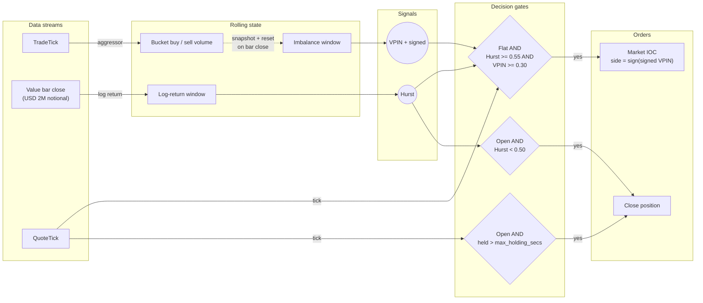

# Hurst/VPIN 方向性策略（Kraken Futures）

:::note
这是一个**仅使用 Rust** 的教程。策略、回测配置及测试全部位于
已编译的核心代码中。
:::

本教程在 [Kraken Futures](https://futures.kraken.com) 的
**PF_XBTUSD**（以美元计保证金的比特币永续合约）上回测一个方向性策略。
该策略结合了**Hurst 指数机制过滤器**与 **VPIN**（成交量同步的知情
交易概率，Volume-synchronized Probability of Informed Trading）
流量信号。历史成交和报价数据来自 [Tardis.dev](https://tardis.dev)，
并通过 Rust `BacktestEngine` 进行回放。

## 简介

该策略结合了三个组成部分：一个从 K 线派生的**慢速机制过滤器**、
一个从成交数据派生的**快速知情流量信号**，以及仅在两者一致时才
触发的**报价驱动型入场**。

- **美元 K 线上的 Hurst 指数。** 在固定名义价值（value）K 线上采样，
  遵循 Lopez de Prado 的方法（*Advances in Financial Machine
  Learning*，第 2 章）。当重标极差（R/S）估计值高于 `0.55`
  时表示存在持续性的趋势行为；低于 `0.50` 时序列表现为均值回归
  或噪声。

- **来自成交主动方流量的 VPIN。** 每根完成的美元 K 线被视为一个
  成交量桶（bucket）。主动买入和主动卖出成交量之间的绝对失衡，
  在最近五十个桶上取平均，即得到 VPIN 水平。带符号的失衡则给出
  净知情方向。

- **报价驱动型入场。** 一旦两个信号达成一致，策略会在下一个报价
  tick 开仓。入场时机与实时最优挂单（top of book）绑定，而非与
  K 线收盘绑定。

出场基于相同的要素驱动：当 Hurst 估计值回落穿越下阈值，或达到
持仓时间上限时，持仓会被平掉。

该策略以
[`HurstVpinDirectional`](https://github.com/nautechsystems/nautilus_trader/tree/develop/crates/trading/src/examples/strategies/hurst_vpin_directional)
的形式随附于 `nautilus_trading::examples::strategies` 模块中。
与所有随附的示例策略一样，它刻意保持简单，本身不具备任何 alpha
优势。

### 为什么选择 Kraken Futures

Kraken Futures 以两种形式列出比特币和以太坊的永续合约：

- **`PI_` 反向永续合约**：以美元计价，以标的资产计保证金和结算。
- **`PF_` 线性永续合约**：以美元计价，以美元计保证金和结算
  （通过多抵押品机制）。

本教程使用 **`PF_XBTUSD`**，因此账户货币、报价货币和美元 K 线的
采样框架都统一为美元。

### 为什么将美元 K 线与 VPIN 结合使用

VPIN 是定义在*成交量*桶上而非*时间*桶上的。美元 K 线（NautilusTrader
中的 `VALUE` 聚合方式）在达到固定名义成交额后收盘，因此采样框架
会随市场活跃度自适应。将每个 VPIN 桶定义为一根美元 K 线，可以使
两个信号处于同一时钟基准下，Hurst 指数也在相同的 K 线上采样。

## 前提条件

- 一个可用的 Rust 工具链（参见 [rustup.rs](https://rustup.rs)）。
- 已克隆并可构建的 NautilusTrader 代码仓库。
- 可以联网下载免费的 Tardis 样本数据（每月第一天无需 API 密钥）。

## 数据准备

Kraken Futures 数据在 Tardis 中以历史标识符 `cryptofacilities`
发布。每月第一天的数据无需 API 密钥即可免费获取，足以进行单日的
链路检查。完整的回测至少需要两个交易时段的数据才能预热 128 根
K 线的 Hurst 窗口，这需要付费的 Tardis API 密钥（见下方提示）。

```bash
mkdir -p /tmp/tardis_kraken

curl -L -o /tmp/tardis_kraken/PF_XBTUSD_trades.csv.gz \
  https://datasets.tardis.dev/v1/cryptofacilities/trades/2024/01/01/PF_XBTUSD.csv.gz

curl -L -o /tmp/tardis_kraken/PF_XBTUSD_quotes.csv.gz \
  https://datasets.tardis.dev/v1/cryptofacilities/quotes/2024/01/01/PF_XBTUSD.csv.gz
```

本教程后文展示的可运行示例二进制程序默认从 `/tmp/tardis_kraken/`
读取数据，因此提前下载到该目录意味着 `cargo run` 无需覆盖
`KRAKEN_TRADES` 或 `KRAKEN_QUOTES` 即可运行。

:::tip
完整的历史数据范围需要付费的 Tardis API 密钥。当您需要超越单日样本
的批量抓取时，请使用
[Tardis 下载工具](https://docs.tardis.dev/downloadable-csv-files)。
:::

Rust 版 Tardis 加载器直接解析 `.csv.gz` 文件，并使用我们提供的
交易品种 ID 为每条记录打标签，因此在策略层面无需进行符号映射：

```rust
use nautilus_model::identifiers::InstrumentId;
use nautilus_tardis::csv::load::{load_quotes, load_trades};

let instrument_id = InstrumentId::from("PF_XBTUSD.KRAKEN");
let trades = load_trades(
    "PF_XBTUSD_trades.csv.gz",
    Some(1),               // price_precision
    Some(4),               // size_precision
    Some(instrument_id),
    None,                  // limit
)?;
let quotes = load_quotes(
    "PF_XBTUSD_quotes.csv.gz",
    Some(1),
    Some(4),
    Some(instrument_id),
    None,
)?;
```

请显式传入交易品种的 `price_precision` 和 `size_precision`。否则，
加载器会根据前几条记录推断精度，而没有小数价格的样本日数据可能会
推断出 `0`，撮合引擎在看到与交易品种声明精度不符的报价 tick 时
会将其拒绝。

## 交易品种定义

由于我们是直接加载 CSV 数据而非通过实盘 Kraken 适配器，我们需要
手动定义 `PF_XBTUSD` 作为
[`CryptoPerpetual`](https://github.com/nautechsystems/nautilus_trader/blob/develop/crates/model/src/instruments/crypto_perpetual.rs)。
Kraken Futures 上的线性永续合约以美元计价并以美元计保证金：

```rust
use nautilus_model::{
    identifiers::{InstrumentId, Symbol},
    instruments::CryptoPerpetual,
    types::{Currency, Price, Quantity},
};
use rust_decimal_macros::dec;

let instrument = CryptoPerpetual::builder()
    .instrument_id(InstrumentId::from("PF_XBTUSD.KRAKEN"))
    .raw_symbol(Symbol::from("PF_XBTUSD"))
    .base_currency(Currency::BTC())       // base
    .quote_currency(Currency::USD())      // quote
    .settlement_currency(Currency::USD()) // settlement (linear)
    .is_inverse(false)
    .price_precision(1)
    .size_precision(4)
    .price_increment(Price::from("0.5"))
    .size_increment(Quantity::from("0.0001"))
    .margin_init(dec!(0.02))
    .margin_maint(dec!(0.01))
    .maker_fee(dec!(0.0002))
    .taker_fee(dec!(0.0005))
    .ts_event(0.into())
    .ts_init(0.into())
    .build()
    .unwrap();
```

手续费和保证金是明确的回测假设。请查阅
[Kraken Futures 费率表](https://futures.kraken.com/features/fee-schedule)
获取当前费率。

## 美元 K 线采样

NautilusTrader 提供了 AFML 第 2 章中全部的信息驱动型 K 线聚合器：
tick、volume、value（美元）K 线，以及各自对应的 imbalance 和 runs
变体。这里我们使用普通的 `VALUE` K 线，在带子上达到固定名义成交额
后收盘。

K 线类型以字符串形式表示。`INTERNAL` 后缀告知引擎从底层的成交
数据流（价格类型 `LAST`）内部进行聚合：

```rust
use nautilus_model::data::BarType;

let bar_type = BarType::from("PF_XBTUSD.KRAKEN-2000000-VALUE-LAST-INTERNAL");
```

每根 K 线在 **2,000,000 USD** 的成交名义额之后收盘。在该规模下，
一个交易时段通常打印不足 150 根 K 线，达不到 128 根 K 线的 Hurst
窗口要求，因此预热默认参数需要多个交易时段的数据。若要进行单日
运行，可将 K 线规模缩小到 **500,000 USD**，或相应地降低
`hurst_window` 和 `vpin_window`。完整的多日回测应使用默认值。

:::note
`VALUE` K 线是对成交带子的一种*视图*。回测引擎消费与驱动 VPIN
相同的数据流，因此不存在重复计数问题。
:::

## 策略概述

`HurstVpinDirectional` 策略运行三条并发的流水线，在 K 线收盘时
同步：成交数据流入桶累加器，K 线收盘触发信号重新计算，报价驱动
入场和超时检查。



1. **每笔成交**：使用 `TradeTick::aggressor_side` 为当前美元
   K 线桶累加主动买入和主动卖出成交量。
2. **每根 K 线**（桶收盘时）：将该 K 线的对数收益率追加到 Hurst
   窗口，计算该桶的带符号和绝对失衡值，重置累加器，重新估计滚动
   Hurst 和 VPIN，清除 `exit_cooldown`，并检查机制退出条件。
3. **每次报价**：如果处于空仓状态且两个信号均一致（Hurst 处于
   趋势状态、VPIN 高于阈值、带符号失衡非零），则下达市价 IOC
   订单。如果已持仓，检查持仓时间上限。

机制退出由 K 线流水线在 Hurst 跌破 `hurst_exit` 时触发。持仓超时
由报价流水线在持仓时间超过 `max_holding_secs` 时触发。


**图 1。** *2024-01-16 14:09-16:15 UTC 期间的信号仪表盘：收盘价、
Hurst、VPIN。标记位于实际成交价处；虚线连接线显示相对于 K 线收盘
价格线的滑点。*

### Hurst 估计器

该策略使用经典的重标极差（R/S）回归方法。对于 `(4, 8, 16, 32)`
中的每个滞后期 `k`，收益率窗口被切分为长度为 `k` 的不重叠区块，
计算每个区块的重标极差，并记录 R/S 均值。在整个滞后期集合上，
`log(R/S)` 对 `log(k)` 的斜率即为 Hurst 估计值。


**图 2。** *PF_XBTUSD 14 天（2024-01-15 至 2024-01-28）期间的滚动
Hurst 指数，标出入场阈值 0.55 和出场阈值 0.50。*

### VPIN 估计器

由于交易场所数据流直接提供了明确的成交主动方，VPIN 可简化为：

```
VPIN = mean_k ( |V_B_k - V_S_k| / (V_B_k + V_S_k) )
```

在最近 `k` 个已完成的美元 K 线桶上计算。带符号变体保留
`V_B - V_S` 的符号，用于选择方向。这比原始 Easley/Lopez de
Prado 公式中使用的批量成交量分类法更准确，后者只有在无法直接
观测主动方时才有必要使用。


**图 3。** *所有 K 线上的 VPIN 分布，标出 0.30 的入场阈值。*

### 配置

| 参数          | 值            | 描述                                          |
| ------------------ | ---------------- | ---------------------------------------------------- |
| `bar_type`         | `2M-VALUE-LAST`  | 每 2,000,000 USD 名义成交额收盘一次的美元 K 线。 |
| `trade_size`       | `0.0100`         | 每笔交易 0.0100 XBT（与交易品种精度一致）。 |
| `hurst_window`     | `128`            | 美元 K 线对数收益率的滚动窗口。            |
| `hurst_lags`       | `[4, 8, 16, 32]` | R/S 回归中使用的滞后期集合。                  |
| `hurst_enter`      | `0.55`           | 高于此值，机制被视为趋势状态。       |
| `hurst_exit`       | `0.50`           | 低于此值，已开仓的持仓会被平掉。            |
| `vpin_window`      | `50`             | 用于计算 VPIN 均值的已完成成交量桶数。          |
| `vpin_threshold`   | `0.30`           | 流量被视为知情流量所需的最小 VPIN。     |
| `max_holding_secs` | `1800`           | 持仓可保持的最长秒数（默认为 `3600`；此处被覆盖）。 |

:::tip
美元 K 线规模、Hurst 滞后期和 VPIN 窗口三者是相互耦合的。较小的
K 线响应更快，但 Hurst 更嘈杂；较大的 K 线能平滑两个信号，但在
单日回测中可能样本数不足。
:::

## 回测设置

配置一个带有 Kraken 交易场所和美元起始余额的 `BacktestEngine`：

```rust
use nautilus_backtest::{
    config::{BacktestEngineConfig, SimulatedVenueConfig},
    engine::BacktestEngine,
};
use nautilus_model::{
    data::Data,
    enums::{AccountType, BookType, OmsType},
    identifiers::Venue,
    instruments::{Instrument, InstrumentAny},
    types::Money,
};

let mut engine = BacktestEngine::new(BacktestEngineConfig::default())?;

engine.add_venue(
    SimulatedVenueConfig::builder()
        .venue(Venue::from("KRAKEN"))
        .oms_type(OmsType::Netting)
        .account_type(AccountType::Margin)
        .book_type(BookType::L1_MBP)
        .starting_balances(vec![Money::from("100_000 USD")])
        .build()?,
)?;

engine.add_instrument(&InstrumentAny::CryptoPerpetual(instrument))?;
```

将已加载的成交和报价数据以 `Data` 枚举变体的形式送入：

```rust
let mut data: Vec<Data> = trades.into_iter().map(Data::Trade).collect();
data.extend(quotes.into_iter().map(Data::Quote));
engine.add_data(data, None, true, true)?;
```

### 添加策略

```rust
use nautilus_model::types::Quantity;
use nautilus_trading::examples::strategies::{
    HurstVpinDirectional, HurstVpinDirectionalConfig,
};

let config = HurstVpinDirectionalConfig::builder()
    .instrument_id(instrument_id)
    .bar_type(bar_type)
    .trade_size(Quantity::from("0.0100")) // match instrument size_precision
    .max_holding_secs(1800)
    .build();

engine.add_strategy(HurstVpinDirectional::new(config))?;
```

### 运行回测

```rust
engine.run(None, None, None, false)?;
```

使用默认的 128/50 窗口和 2,000,000 USD 的 K 线规模时，单日样本
在整个运行期间都处于预热阶段。该次运行会显示引擎聚合美元 K 线，
并以成交和报价的粒度驱动策略，但在窗口填满之前 Hurst 和 VPIN
不会产生输出。若要在单日数据上看到信号更新和入场/出场逻辑被触发，
请按上文所述缩小 K 线规模或窗口，或提供两个或更多交易时段的数据。

在该配置下运行 14 天数据（2024-01-15 至 2024-01-28），会打印
1,224 根 K 线，仅触发 2 次入场、1 次部分平仓和 1 次完全平仓。
入场信号本就设计得较为稀疏：`hurst_enter` 和 `vpin_threshold`
必须在同一个报价上同时满足。部分 IOC 平仓后的剩余持仓会在该
交易时段的剩余时间内保持开仓状态，这正是净额（Netting）持仓
管理系统在退出 IOC 订单只成交部分挂单时的处理方式。

上述配置以可运行的二进制程序形式提供：

```bash
cargo run -p nautilus-kraken --features examples \
  --example kraken-hurst-vpin-backtest --release
```

默认情况下它从 `/tmp/tardis_kraken/` 读取
`PF_XBTUSD_trades.csv.gz` 和 `PF_XBTUSD_quotes.csv.gz`。可通过
`KRAKEN_TRADES` 和 `KRAKEN_QUOTES` 环境变量覆盖。


**图 4。** *2024-01-16 14:09-16:15 UTC 期间的收盘价。青色区间标出
`Hurst >= 0.55` 的 K 线；金色区间标出持仓开启的时期。标记位于
实际成交价处；虚线连接线显示相对于 K 线收盘价格线的滑点。*


**图 5。** *整个回测期间每根 K 线的 Hurst 与 VPIN 对照，颜色表示
带符号 VPIN。阴影象限标出可入场的信号区域。*

### 重新生成面板图

回测策略会在每次 K 线收盘时记录
`Hurst=… VPIN=… signed=… bar_close=…`，并在入场和出场时记录标准
的 `OrderFilled` 事件，因此上述面板图可以完全从该次运行的标准
输出中复现：

```bash
RUST_LOG=info cargo run -p nautilus-kraken --features examples \
    --example kraken-hurst-vpin-backtest --release > /tmp/backtest.log 2>&1

uv sync --extra visualization
BACKTEST_LOG=/tmp/backtest.log \
    python3 docs/tutorials/assets/hurst_vpin_kraken/render_panels.py
```

渲染脚本使用共享的 `nautilus_dark` tearsheet 主题，并通过
Plotly 的 Kaleido 导出器写入静态 PNG 图片。

## 后续步骤

- **调整采样框架**。尝试更大或更小的美元 K 线阈值。
  `VALUE_IMBALANCE` 和 `VALUE_RUNS` 聚合器会在信息到达本身时
  收盘 K 线，这可能是替代恒定美元采样的一种有趣方案。
- **收紧阈值**。`hurst_enter`、`hurst_exit` 和 `vpin_threshold`
  三者相互影响：更高的入场阈值会使信号更稀少但更具针对性；更紧的
  出场阈值会缩短平均持仓时间。
- **添加波动率过滤**。在相同的 K 线上叠加一个已实现波动率
  估计器，以在明显混乱的交易时段抑制入场。
- **在 Kraken Futures 演示环境上实盘运行**。一旦回测行为符合预期，
  可通过 Kraken 实盘客户端工厂，在
  [demo-futures.kraken.com](https://demo-futures.kraken.com) 上
  运行同一个策略。已提供可运行的实盘配置：

  ```bash
  cargo run -p nautilus-kraken --features examples \
    --example kraken-hurst-vpin-live
  ```

  运行前请在环境中设置 `KRAKEN_FUTURES_API_KEY` 和
  `KRAKEN_FUTURES_API_SECRET`。

## 延伸阅读

- [`HurstVpinDirectional` 策略源码](https://github.com/nautechsystems/nautilus_trader/tree/develop/crates/trading/src/examples/strategies/hurst_vpin_directional)
- [数据概念：K 线类型与聚合方式](../concepts/data/)
- [Tardis 集成指南](../integrations/tardis.md)
- [Kraken 集成指南](../integrations/kraken.md)
- [Kraken Futures 文档](https://docs.kraken.com/api/docs/futures-api)
- Lopez de Prado, M. (2018)。*Advances in Financial Machine
  Learning*，Wiley。第 2 章（信息驱动型 K 线）与第 19 章（VPIN）。
