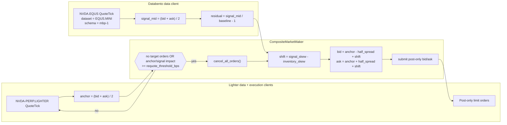

# 基于 Databento 美股 NVDA 数据的 Lighter RWA 组合做市

本教程在 Lighter 的 `NVDA-PERP.LIGHTER` RWA（现实世界资产，
real-world asset）市场上运行随附的 [`CompositeMarketMaker`][composite-market-maker]
策略，使用 Databento 的 `NVDA.EQUS` 报价作为外部信号。该策略在
Lighter 中间价周围报出一个 post-only 买价和一个 post-only 卖价，
然后根据标准化的 Databento 残差和当前 Lighter 库存对双边报价进行
偏移。

该设置使用 Rust [`LiveNode`][live-node]，策略本身以原生 Rust
`CompositeMarketMaker` 策略的形式运行。如果您是首次接触 Lighter
适配器，请先阅读[Lighter 入门指南][lighter-get-started]。该指南在
本教程引入 Databento 信号数据和实盘订单流之前，先独立介绍了 Rust
和 Python v2 数据客户端路径。

## 简介

Lighter 上市了连续交易的现实世界资产（RWA）永续合约，包括单一
股票市场。有关当前交易场所的详情，请参见 Lighter 的
[RWA 文档][RWA docs]和[市场规格说明][market specifications]。
Databento 的[美国股票][Databento US Equities]数据集提供 `NVDA`
的美股最优挂单数据，通过 Nautilus Databento 适配器可获取
`mbp-1` 数据。

`CompositeMarketMaker` 是一个精简的双输入做市策略：

- **目标交易品种**是待报价的 Lighter 市场：`NVDA-PERP.LIGHTER`。
- **信号交易品种**是 Databento 的参考数据流：`NVDA.EQUS`。
- **锚点**是 Lighter 的中间价。
- **信号残差**为 `(databento_mid / baseline) - 1.0`。
- **报价偏移量**为
  `signal_skew_factor * residual - inventory_skew_factor * net_position`。

在未配置基准价（baseline）的情况下，策略会以首次观测到的
`NVDA.EQUS` 中间价作为参考价格。残差从零开始，衡量的是 NVDA
相对于该首次信号中间价的变动，而非 Lighter/Databento 之间的基差。
可在示例源码中设置 `SIGNAL_BASELINE` 常量，为确定性的运行固定
参考价格。

在此设置中，Lighter 的 BBO（最优买卖报价）始终作为价差锚点。
Databento 通过标准化残差上下移动报价中心。



本教程的重点在于适配器的连接方式：单个引擎同时消费一条直接的美股
数据流和一个加密原生的 RWA 交易场所，而订单生命周期、库存和报价
状态都保持在同一个事件驱动的运行时中。

## 前提条件

- 一个 Rust 工具链（MSRV 1.97.0 或更新版本）。
- 一个以 Nautilus、Lighter 和 Databento crate 为依赖的 Cargo
  项目（参见[项目设置](#项目设置)）。
- Python 3.12+，用于重新生成渲染的面板图。
- 一个具有 Databento 美国股票 Mini（`EQUS.MINI`）实时访问权限
  的 Databento API 密钥，这是随附的 `NVDA.EQUS` 路由所使用的
  默认数据集。更高级别的数据集（如 `EQUS.PLUS`）需要单独的
  Databento 许可；如果您的账户具备相应权限，可通过
  `venue_dataset_map` 进行选择。
- Lighter API 凭据（数字账户索引、API 密钥索引和 API 密钥）
  用于所配置的环境（默认为测试网），仅在需要连接和提交订单时
  才需要。
- Lighter 集成指南：[Lighter](../integrations/lighter.md)。
- Databento 集成指南：[Databento](../integrations/databento.md)。

该示例从环境变量中读取凭据，并将策略参数保留为可编辑的 Rust
常量。它默认使用 `LighterEnvironment::Testnet`，因此请设置
Lighter 测试网凭据：

```bash
export DATABENTO_API_KEY="your-databento-api-key"
export LIGHTER_TESTNET_ACCOUNT_INDEX="123456"
export LIGHTER_TESTNET_API_KEY_INDEX="0"
export LIGHTER_TESTNET_API_SECRET="your-lighter-api-secret"
```

若要使用主网，请将源码中的 `LIGHTER_ENVIRONMENT` 改为
`LighterEnvironment::Mainnet`，并使用集成指南中所述的主网
`LIGHTER_*` 凭据变量。运行示例前请设置 `DATABENTO_API_KEY`。

## 项目设置

策略、节点和适配器都以 crate 形式发布，因此您可以在自己的
Cargo 项目中依赖它们，而无需在 NautilusTrader 检出的代码仓库内
工作。将以下内容添加到您的 `Cargo.toml` 中，让每个 Nautilus 依赖
都指向同一个 `develop` git 源，以确保各个 crate 解析为一致的
版本：

```toml
[dependencies]
nautilus-common = { git = "https://github.com/nautechsystems/nautilus_trader.git", branch = "develop", features = ["live"] }
nautilus-core = { git = "https://github.com/nautechsystems/nautilus_trader.git", branch = "develop" }
nautilus-databento = { git = "https://github.com/nautechsystems/nautilus_trader.git", branch = "develop", features = ["high-precision", "live"] }
nautilus-lighter = { git = "https://github.com/nautechsystems/nautilus_trader.git", branch = "develop", features = ["examples", "high-precision"] }
nautilus-live = { git = "https://github.com/nautechsystems/nautilus_trader.git", branch = "develop", features = ["node"] }
nautilus-model = { git = "https://github.com/nautechsystems/nautilus_trader.git", branch = "develop", features = ["high-precision"] }
nautilus-trading = { git = "https://github.com/nautechsystems/nautilus_trader.git", branch = "develop", features = ["examples", "high-precision"] }

tokio = { version = "1", features = ["full"] }
```

`nautilus-trading` 上的 `examples` 特性提供了 `CompositeMarketMaker`
策略，而 `high-precision` 是 Lighter 加密原生定价所必需的。有关
一般的 crate 结构、特性标志，以及使用 crates.io 替代 git 源的
方式，请参见 Rust [项目设置指南][project-setup]。

Databento 客户端还需要一个将交易场所映射到数据集的发布方文件。
请从 Databento 适配器 crate 下载 [`publishers.json`][databento-publishers]，
并将 `publishers_filepath` 指向您本地的副本。随附的示例会相对于
检出目录解析同一个文件，因此该步骤仅适用于您自己的项目。

## 为什么选择 NVDA

`NVDA` 是纳斯达克上市的一支流动性良好的单一股票，Lighter 将其
RWA 永续合约映射为 `NVDA-PERP.LIGHTER`。这将一个授权的 Databento
信号与一个 Lighter 交易市场配对起来：

| 角色              | 交易品种 ID       | 来源    | 备注                                      |
| ----------------- | ------------------- | --------- | ------------------------------------------ |
| 信号交易品种 | `NVDA.EQUS`         | Databento | EQUS.MINI 最优挂单报价更新。       |
| 目标交易品种 | `NVDA-PERP.LIGHTER` | Lighter   | 通过 Lighter 交易的 RWA 永续合约。      |

订阅 `NVDA.EQUS` 默认会从 Databento 的 `EQUS.MINI` 数据集请求
`NVDA` 的最优挂单（`mbp-1`）报价，以单一 `QuoteTick` 数据流形式
交付。`EQUS.MINI` 是成本最低的合并美股数据层级；更丰富的层级
如 `EQUS.PLUS` 需要单独的 Databento 许可，一旦您的账户具备相应
权限，可通过客户端的 `venue_dataset_map`（例如
`{"EQUS": "EQUS.PLUS"}`）进行选择。适配器通过发布方文件解析
`EQUS` 交易场所：该示例将 `DatabentoLiveClientConfig` 指向了
Databento 适配器随附的 `publishers.json`。映射规则参见
[交易品种 ID 与符号规范][databento-symbology]。

较旧的 Databento Equities Basic（`DBEQ.BASIC`）数据集名称在一些
沿用历史设置的账户和历史示例中仍会出现。新的 Databento 订阅使用
Databento 美国股票产品线，因此本教程使用合并的 `EQUS` 交易场所。
请将该最优挂单数据流视为本教程连接方式中的一个授权信号代理，
而非完整深度的纳斯达克 TotalView 订单簿。

该示例以 `trade_size=0.05` 起步，这与教程验证过程中观测到的
Lighter NVDA 最小基础数量一致。在增大数量或更换交易品种前，
请查阅[市场详情端点][market details endpoint]。

## 交易时段限制

Lighter 的 RWA 市场连续交易。`NVDA.EQUS` 则遵循美股市场数据的
交易时段。首次实盘测试应在常规现金交易时段
（13:30-20:00 UTC，美国夏令时）内进行，并对节假日和半日交易
时段做特殊处理。

`CompositeMarketMaker` 不包含内置的交易时段限制或信号时效性
检查。对于生产环境使用，应添加一个 Actor 或策略变体，在
Databento 信号变得过时时取消报价。本教程示例刻意将这一点显式
呈现出来，而不是隐藏在自定义策略内部。

## 示例节点

有两种方式可以运行本示例：从 NautilusTrader 检出的代码仓库中，
通过随附的 [Lighter NVDA 组合做市示例][example-script] 二进制程序
运行；或者将下方的节点连接代码复制到您自己项目的 `main`
函数中（该项目依赖于[项目设置](#项目设置)中的 crate）。还有一个
对应的 Python v2 版本，位于
[`python/examples/lighter/nvda_composite_mm.py`][python-example-script]；
它通过 PyO3 使用相同的 Rust 策略。

在检出的代码仓库中，设置好凭据变量后，随附的二进制程序会连接
数据和执行客户端。它默认使用 `DRY_RUN = true`，即启动客户端时
不添加提交订单的策略：

```bash
cargo run --bin lighter-nvda-composite-mm --package nautilus-tutorials --features examples
```

Databento 是一个没有固定交易场所路由的多交易场所数据客户端，
因此引擎将其作为 `NVDA.EQUS` 的默认路由。Lighter 则注册为
`LIGHTER` 交易场所路由，接收 `NVDA-PERP.LIGHTER` 的订阅。

该设置的核心是三客户端节点加上 `CompositeMarketMaker`：

```rust
let lighter_environment = LIGHTER_ENVIRONMENT;
let trader_id = TraderId::from(TRADER_ID);
let account_id = AccountId::from(ACCOUNT_ID);
let instrument_id = InstrumentId::from(INSTRUMENT_ID);
let signal_instrument_id = InstrumentId::from(SIGNAL_INSTRUMENT_ID);

let databento_api_key = get_env_var("DATABENTO_API_KEY")?;
let databento_config =
    DatabentoLiveClientConfig::new(databento_api_key, publishers_filepath, true, true);
let lighter_data_config = LighterDataClientConfig::builder()
    .environment(lighter_environment)
    .build();
let lighter_exec_config = LighterExecClientConfig::builder()
    .trader_id(trader_id)
    .account_id(account_id)
    .environment(lighter_environment)
    .build();

let mut strategy_config = CompositeMarketMakerConfig::builder()
    .instrument_id(instrument_id)
    .signal_instrument_id(signal_instrument_id)
    .max_position(max_position)
    .trade_size(trade_size)
    .half_spread_bps(HALF_SPREAD_BPS)
    .inventory_skew_factor(INVENTORY_SKEW_FACTOR)
    .signal_skew_factor(SIGNAL_SKEW_FACTOR)
    .requote_threshold_bps(REQUOTE_THRESHOLD_BPS)
    .on_cancel_resubmit(ON_CANCEL_RESUBMIT)
    .build();
strategy_config.base.strategy_id = Some(StrategyId::from("NVDA_COMPOSITE_MM-001"));
strategy_config.base.order_id_tag = Some("001".to_string());

let mut node = LiveNode::builder(trader_id, Environment::Live)?
    .with_name("LIGHTER-NVDA-COMPOSITE-MM-001".to_string())
    .with_reconciliation(!DRY_RUN)
    .add_data_client(
        None,
        Box::new(DatabentoDataClientFactory::new()),
        Box::new(databento_config),
    )?
    .add_data_client(
        None,
        Box::new(LighterDataClientFactory::new()),
        Box::new(lighter_data_config),
    )?
    .add_exec_client(
        None,
        Box::new(LighterExecutionClientFactory::new()),
        Box::new(lighter_exec_config),
    )?
    .build()?;

if !DRY_RUN {
    node.add_strategy(CompositeMarketMaker::new(strategy_config))?;
}
```

若要允许提交订单，请编辑示例源码顶部附近的常量：

```rust
const DRY_RUN: bool = false;
```

然后运行相同的命令：

```bash
cargo run --bin lighter-nvda-composite-mm --package nautilus-tutorials --features examples
```

:::warning
当 `DRY_RUN` 为 `false` 时，此命令可能提交实盘订单。请先在已注资的
测试账户或规模适合承受损失的主网账户上，使用可接受的最小数量运行。
在更改之前，请确认当前使用的交易品种 ID、账户 ID、数字账户索引
以及 Lighter 凭据。
:::

若进行测试网冒烟测试，请将 `LIGHTER_ENVIRONMENT` 保持为
`LighterEnvironment::Testnet`，并使用 `LIGHTER_TESTNET_*`
凭据变量。如果运行时间不在 Databento 美股现金交易时段内，
该次运行仍可用于验证节点启动、路由、Lighter 数据以及订单生命周期。
在首个 `NVDA.EQUS` 报价到达之前，Databento 残差将保持为零。

## 策略参数

| 参数               | 值               | 描述                                                    |
| ----------------------- | ------------------- | -------------------------------------------------------------- |
| `instrument_id`         | `NVDA-PERP.LIGHTER` | 要报价的 Lighter RWA 永续合约。                                |
| `signal_instrument_id`  | `NVDA.EQUS`         | Databento 美国股票 Mini 信号数据流。                        |
| `trade_size`            | `0.05`              | 每个买价或卖价的数量。                                          |
| `max_position`          | `0.20`              | Lighter 净敞口的硬性上限。                              |
| `half_spread_bps`       | `25`                | 围绕 Lighter 锚点的半价差。                         |
| `inventory_skew_factor` | `2.0`               | 每单位净持仓对应的价格单位数。                          |
| `signal_skew_factor`    | `55.0`              | 每单位标准化 Databento 残差对应的价格单位数。         |
| `signal_baseline`       | 首个信号中间价    | Databento 残差的可选参考价格。           |
| `requote_threshold_bps` | `5`                 | 触发取消并重新报价的锚点或信号影响力变动幅度。 |

以 Lighter 中间价 `207.00`、`half_spread_bps=25` 为例，未偏斜的
半价差为 `0.5175` 美元。若 Databento 相对于其基准价高出 30
基点，`signal_skew_factor` 为 `55.0` 会在库存偏斜生效前将双边
上移 `0.165` 美元。若净多头持仓为 `0.05`，
`inventory_skew_factor=2.0` 会将双边下移 `0.10` 美元。

## 重新报价行为

信号 tick 会更新内部状态，但本身不会提交订单。在首个 Databento
报价到达之前，残差为零。下一个 Lighter 报价 tick 会读取最新的
信号残差并检查报价状态。以下情况会触发一次报价周期：

- 没有未成交或正在处理中的目标订单；
- Lighter 锚点移动幅度至少达到 `requote_threshold_bps`；或
- 信号残差变动所产生的价格影响达到同一阈值。

随后策略会取消未成交订单，从缓存中读取当前净持仓和待处理敞口，
计算一个买价和一个卖价，剔除任何会突破 `max_position` 的一侧，
并以 post-only 限价单的形式提交剩余的一侧或两侧。

## 面板图

下方面板使用确定性的回放数据。它们展示了报价机制和现金交易时段
限制，并非从实盘 Lighter 成交记录中采集得来。


**图 1。** *Databento `NVDA.EQUS` 中间价、Lighter
`NVDA-PERP.LIGHTER` 中间价、组合买价、组合卖价以及报价中心。*


**图 2。** *以基点计的 Databento 残差、Lighter 基差与报价中心
偏移。*


**图 3。** *在 NVDA 交易数量为 `0.05`、NVDA 持仓上限为 `0.20`
条件下的净持仓、信号偏移、库存调整及总偏移量。*


**图 4。** *Lighter 连续 RWA 市场时钟与 Databento 美股现金交易
时段信号的对比，以及常规交易时段结束后的信号时效性。*

## 重新生成面板图

```bash
uv sync --extra visualization
python3 docs/tutorials/assets/lighter_rwa_composite_mm/render_panels.py
```

渲染脚本会将四张 PNG 图片写入
`docs/tutorials/assets/lighter_rwa_composite_mm/`。它使用
`nautilus_dark` Plotly 主题和确定性的回放数据，因此文档构建
不依赖供应商数据许可或实盘交易所访问。

## 扩展

下一个有用的改进方向是信号时效性限制。例如，在现金交易时段内，
当最新的 `NVDA.EQUS` 报价距今超过 30 秒时，或在现金交易时段结束
后立即取消所有 Lighter 订单。这样可以将 Databento 信号变成一个
显式的运行依赖，而非隐式依赖。

对于纯粹的公允价值策略，可以将本教程作为客户端连接方式的基础，
再编写一个精简变体，直接以 Databento 中间价作为买卖锚点，
仅将 Lighter 的 BBO 用于 post-only 和基差限制检查。

[composite-market-maker]: https://github.com/nautechsystems/nautilus_trader/blob/develop/crates/trading/src/examples/strategies/composite_market_maker/strategy.rs
[live-node]: ../how_to/run_rust_live_trading.md
[project-setup]: ../concepts/rust.md#project-setup
[lighter-get-started]: ../how_to/get_started_lighter.md
[databento-symbology]: ../integrations/databento.md#instrument-ids-and-symbology
[databento-publishers]: https://github.com/nautechsystems/nautilus_trader/blob/develop/crates/adapters/databento/publishers.json
[RWA docs]: https://docs.lighter.xyz/trading/real-world-assets-rwas
[market specifications]: https://docs.lighter.xyz/trading/real-world-assets-rwas/market-specifications
[market details endpoint]: https://mainnet.zklighter.elliot.ai/api/v1/orderBookDetails
[Databento US Equities]: https://databento.com/blog/introducing-databento-us-equities
[example-script]: https://github.com/nautechsystems/nautilus_trader/blob/develop/examples/tutorials/src/bin/lighter_nvda_composite_mm.rs
[python-example-script]: https://github.com/nautechsystems/nautilus_trader/blob/develop/python/examples/lighter/nvda_composite_mm.py
