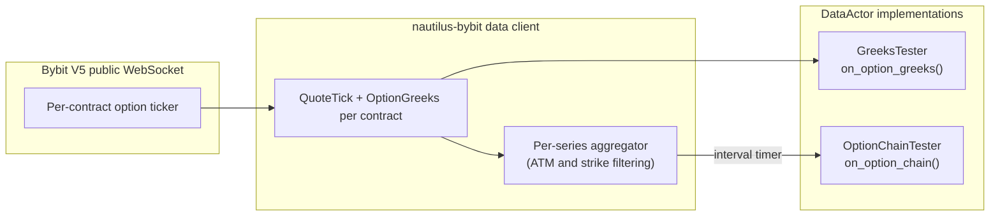

# 期权数据与希腊值（Bybit）

:::note
这是一个**仅使用 Rust** 的 v2 系统教程。它使用带有 Bybit 适配器的
Rust `LiveNode` 来流式获取实时期权希腊值和聚合的期权链快照。
:::

本教程连接到 Bybit 的实时期权市场，并通过两个 `DataActor` 示例
消费希腊值和期权链数据。内容涵盖交易品种发现、交易场所提供的
希腊值订阅，以及带 ATM（平值）相对行权价过滤的定期期权链快照。

## 简介

Bybit 在每次期权行情更新中都会随附发布希腊值（Delta、Gamma、
Vega、Theta）和隐含波动率。NautilusTrader 在两个层面暴露该数据：

- **逐交易品种希腊值**：订阅单个期权合约，在每次行情更新时
  接收一个 `OptionGreeks` 事件。
- **期权链快照**：订阅整个到期日系列，定期接收聚合了所有活跃
  行权价的报价和希腊值的 `OptionChainSlice` 事件。

有两个示例二进制程序支撑这些模式：第一个订阅单个希腊值数据流，
第二个订阅带 ATM 相对行权价过滤的聚合链。



## 前提条件

- 一个可用的 Rust 工具链（[rustup.rs](https://rustup.rs)）。
- 已克隆并可构建的 NautilusTrader 代码仓库。
- 一个具有读取权限的 Bybit API 密钥。仅用于数据获取时无需交易
  权限。在 [bybit.com](https://www.bybit.com/app/user/api-management)
  创建密钥。
- 为身份验证设置的环境变量：

```bash
export BYBIT_API_KEY="your-api-key"
export BYBIT_API_SECRET="your-api-secret"
```

在代码仓库根目录放置一个 `.env` 文件也同样有效。示例通过
`dotenvy` 加载它。

:::warning
Bybit 模拟盘交易仅在私有数据流中使用 `stream-demo.bybit.com`。
公开的期权市场数据使用主网公开数据流
`wss://stream.bybit.com/v5/public/option`。
:::

## DataActor 模式

Rust 的 `DataActor` 需要三个部分：

1. 一个带有 `core: DataActorCore` 字段以及您自己状态的结构体。
2. `nautilus_actor!(YourType)` 宏加上一个 `Debug` 实现。
3. 一个 `DataActor` trait 实现，包含您所需的回调。

该宏提供了通用 `Actor` 和 `Component` 实现所需的原生运行时连接，
因此您只需实现所需的回调。每个回调都有默认的空操作实现。

## 第一部分：逐交易品种希腊值

`bybit-greeks-tester` 示例为最近到期日的所有 BTC CALL（看涨）
期权订阅 `OptionGreeks`，并记录每次更新。

### Actor 结构

```rust
#[derive(Debug)]
struct GreeksTester {
    core: DataActorCore,
    client_id: ClientId,
    subscribed_instruments: Vec<InstrumentId>,
}

nautilus_actor!(GreeksTester);

impl GreeksTester {
    fn new(client_id: ClientId) -> Self {
        Self {
            core: DataActorCore::new(DataActorConfig {
                actor_id: Some("GREEKS_TESTER-001".into()),
                ..Default::default()
            }),
            client_id,
            subscribed_instruments: Vec::new(),
        }
    }
}
```

`core` 字段是宏所要求的。`client_id` 标识应将订阅路由到哪个数据
客户端。`subscribed_instruments` 向量跟踪我们订阅了哪些内容，
以便在停止时进行清理。

### 发现交易品种

启动时，该 Actor 会在缓存中查询所有期权交易品种，过滤出尚未
到期的 BTC CALL，并找出最近的到期日：

```rust
fn on_start(&mut self) -> anyhow::Result<()> {
    let venue = Venue::new("BYBIT");
    let underlying_filter = Ustr::from("BTC");

    let mut options: Vec<(InstrumentId, f64, u64)> = {
        let cache = self.cache();
        let instruments = cache.instruments(&venue, Some(&underlying_filter));

        instruments
            .iter()
            .filter_map(|inst| {
                if inst.option_kind() == Some(OptionKind::Call) {
                    let expiry = inst.expiration_ns()?.as_u64();
                    let strike = inst.strike_price()?.as_f64();
                    Some((inst.id(), strike, expiry))
                } else {
                    None
                }
            })
            .collect()
    }; // cache borrow dropped here

    let now_ns = self.timestamp_ns().as_u64();
    options.retain(|(_, _, exp)| *exp > now_ns);

    let nearest_expiry = options.iter().map(|(_, _, exp)| *exp).min().unwrap();
    options.retain(|(_, _, exp)| *exp == nearest_expiry);
    options.sort_by(|(_, a, _), (_, b, _)| a.partial_cmp(b).unwrap());

    // ...subscribe to each
}
```

:::warning
在调用任何订阅方法之前，请先释放缓存借用。缓存内部使用
`Rc<RefCell<...>>`，订阅方法可能需要借用它。将拥有所有权的数据
收集到一个本地 `Vec` 中，释放缓存引用，然后再订阅。
:::

### 订阅希腊值

发现交易品种后，为每个交易品种订阅：

```rust
let client_id = self.client_id;
for (instrument_id, _, _) in &options {
    self.subscribe_option_greeks(*instrument_id, Some(client_id), None);
    self.subscribed_instruments.push(*instrument_id);
}
```

### 处理更新

来自 Bybit 的每次行情更新都会触发带有 `OptionGreeks` 事件的
`on_option_greeks`：

```rust
fn on_option_greeks(&mut self, greeks: &OptionGreeks) -> anyhow::Result<()> {
    log::info!(
        "GREEKS | {} | delta={:.4} gamma={:.6} vega={:.4} theta={:.4} rho={:.6} | \
         mark_iv={} bid_iv={} ask_iv={} | underlying={} oi={}",
        greeks.instrument_id,
        greeks.delta,
        greeks.gamma,
        greeks.vega,
        greeks.theta,
        greeks.rho,
        greeks.mark_iv.map_or("-".to_string(), |v| format!("{v:.2}")),
        greeks.bid_iv.map_or("-".to_string(), |v| format!("{v:.2}")),
        greeks.ask_iv.map_or("-".to_string(), |v| format!("{v:.2}")),
        greeks.underlying_price.map_or("-".to_string(), |v| format!("{v:.2}")),
        greeks.open_interest.map_or("-".to_string(), |v| format!("{v:.1}")),
    );
    Ok(())
}
```

`OptionGreeks` 的字段：

| 字段              | 类型           | 描述                                        |
|--------------------|----------------|----------------------------------------------------|
| `instrument_id`    | `InstrumentId` | 该期权合约。                               |
| `delta`            | `f64`          | 相对标的价格的敏感度。                   |
| `gamma`            | `f64`          | Delta 相对标的价格的敏感度。                   |
| `vega`             | `f64`          | 波动率变化 1% 时价格的敏感度。    |
| `theta`            | `f64`          | 每日时间价值衰减。                                  |
| `rho`              | `f64`          | 相对利率变化的敏感度。                   |
| `mark_iv`          | `Option<f64>`  | 标记价格隐含波动率。                     |
| `bid_iv`           | `Option<f64>`  | 买价隐含波动率。                            |
| `ask_iv`           | `Option<f64>`  | 卖价隐含波动率。                            |
| `underlying_price` | `Option<f64>`  | 该到期日对应标的的当前远期价格。  |
| `open_interest`    | `Option<f64>`  | 该合约的未平仓合约量。                   |

`delta`、`gamma`、`vega`、`theta` 和 `rho` 的值位于一个嵌套的
`greeks: OptionGreekValues` 结构体中。`OptionGreeks` 实现了
`Deref<Target = OptionGreekValues>`，因此像上面那样使用
`greeks.delta` 等字段是可行的。

Bybit 不提供 rho；适配器将其设置为 `0.0`。

### 清理

停止时，取消订阅所有交易品种：

```rust
fn on_stop(&mut self) -> anyhow::Result<()> {
    let ids: Vec<InstrumentId> = self.subscribed_instruments.drain(..).collect();
    let client_id = self.client_id;
    for instrument_id in ids {
        self.unsubscribe_option_greeks(instrument_id, Some(client_id), None);
    }
    log::info!("Unsubscribed from all option greeks");
    Ok(())
}
```

## 第二部分：期权链快照

`bybit-option-chain` 示例订阅一个聚合的期权链，并定期记录每个
行权价上的看涨和看跌期权及其报价和希腊值的快照。

### 为什么使用期权链

逐交易品种订阅提供了细粒度的控制，但要监控整个期权曲面就意味着
需要管理各个独立的数据流并跨行权价关联更新。期权链订阅可以处理
这一点：`DataEngine` 会聚合一个系列中所有行权价的报价和希腊值，
并在定时器上发布单一的 `OptionChainSlice`。

这种聚合发生在 NautilusTrader 内部。Bybit 发布逐合约的期权市场
数据，V5 公开 WebSocket 文档中并未暴露原生的期权链数据流。

### 关键类型

**`OptionSeriesId`** 标识单个到期日系列：

```rust
let series_id = OptionSeriesId::new(
    Venue::new("BYBIT"),    // venue
    Ustr::from("BTC"),      // underlying
    Ustr::from("USDT"),     // settlement currency
    UnixNanos::from(expiry), // expiration timestamp
);
```

**`StrikeRange`** 控制哪些行权价处于活跃状态：

| 变体       | 描述                                            |
|---------------|--------------------------------------------------------|
| `Fixed`       | 一组固定的行权价。                          |
| `AtmRelative` | ATM 之上 `strikes_above` 个、之下 `strikes_below` 个。   |
| `AtmPercent`  | ATM 价格 `pct` 范围内的所有行权价。             |

对于基于 ATM 的变体，订阅会延迟到从交易场所提供的远期价格中
确定出 ATM 价格之后才生效。

### 订阅

```rust
let strike_range = StrikeRange::AtmRelative {
    strikes_above: 3,
    strikes_below: 3,
};

let snapshot_interval_ms = Some(5_000); // snapshot every 5 seconds

self.subscribe_option_chain(
    series_id,
    strike_range,
    snapshot_interval_ms,
    Some(client_id),
    None, // params
);
```

将 `snapshot_interval_ms` 传入 `None` 表示使用原始模式，此时
每次报价或希腊值更新都会立即发布一个切片。

### 处理快照

`on_option_chain` 回调接收一个 `OptionChainSlice`，其中包含所有
活跃行权价及其看涨和看跌数据：

```rust
fn on_option_chain(&mut self, slice: &OptionChainSlice) -> anyhow::Result<()> {
    log::info!(
        "OPTION_CHAIN | {} | atm={} | calls={} puts={} | strikes={}",
        slice.series_id,
        slice.atm_strike.map_or("-".to_string(), |p| format!("{p}")),
        slice.call_count(),
        slice.put_count(),
        slice.strike_count(),
    );

    for strike in slice.strikes() {
        let call_info = slice.get_call(&strike).map(|d| {
            let greeks_str = d.greeks.as_ref().map_or("-".to_string(), |g| {
                format!(
                    "d={:.3} g={:.5} v={:.2} iv={:.1}%",
                    g.delta, g.gamma, g.vega,
                    g.mark_iv.unwrap_or(0.0) * 100.0,
                )
            });
            format!("bid={} ask={} [{}]", d.quote.bid_price, d.quote.ask_price, greeks_str)
        });

        let put_info = slice.get_put(&strike).map(|d| {
            let greeks_str = d.greeks.as_ref().map_or("-".to_string(), |g| {
                format!(
                    "d={:.3} g={:.5} v={:.2} iv={:.1}%",
                    g.delta, g.gamma, g.vega,
                    g.mark_iv.unwrap_or(0.0) * 100.0,
                )
            });
            format!("bid={} ask={} [{}]", d.quote.bid_price, d.quote.ask_price, greeks_str)
        });

        log::info!(
            "  K={} | CALL: {} | PUT: {}",
            strike,
            call_info.unwrap_or_else(|| "-".to_string()),
            put_info.unwrap_or_else(|| "-".to_string()),
        );
    }

    Ok(())
}
```

`OptionChainSlice` 的字段和方法：

| 名称             | 类型 / 返回值              | 描述                          |
|------------------|-----------------------------|--------------------------------------|
| `series_id`      | `OptionSeriesId`            | 该快照所覆盖的系列。     |
| `atm_strike`     | `Option<Price>`             | 根据远期价格得出的 ATM 行权价。   |
| `call_count()`   | `usize`                     | 有数据的看涨行权价数量。    |
| `put_count()`    | `usize`                     | 有数据的看跌行权价数量。    |
| `strike_count()` | `usize`                     | 所有行权价的并集。                |
| `strikes()`      | `Vec<Price>`                | 所有行权价的排序列表。    |
| `get_call(k)`    | `Option<&OptionStrikeData>` | 行权价 `k` 处的看涨报价和希腊值。 |
| `get_put(k)`     | `Option<&OptionStrikeData>` | 行权价 `k` 处的看跌报价和希腊值。  |

每个 `OptionStrikeData` 包含一个 `quote: QuoteTick`（买卖价）
以及一个可选的 `greeks: Option<OptionGreeks>`。

## 节点设置

两个示例都使用相同的 `LiveNode` 模式。仅用于数据获取时无需
执行客户端：

```rust
#[tokio::main]
async fn main() -> Result<(), Box<dyn std::error::Error>> {
    dotenvy::dotenv().ok();

    let environment = Environment::Live;
    let trader_id = TraderId::test_default();
    let client_id = ClientId::new("BYBIT");

    let bybit_config = BybitDataClientConfig {
        api_key: None,    // loaded from BYBIT_API_KEY env var
        api_secret: None, // loaded from BYBIT_API_SECRET env var
        product_types: vec![BybitProductType::Option],
        ..Default::default()
    };

    let client_factory = BybitDataClientFactory::new();

    let mut node = LiveNode::builder(trader_id, environment)?
        .with_name("BYBIT-OPTIONS-001".to_string())
        .add_data_client(None, Box::new(client_factory), Box::new(bybit_config))?
        .with_delay_post_stop_secs(5)
        .build()?;

    let actor = GreeksTester::new(client_id); // or OptionChainTester
    node.add_actor(actor)?;
    node.run().await?;

    Ok(())
}
```

将 `product_types` 设置为 `[BybitProductType::Option]` 仅会加载
期权交易品种。在交易品种提供程序获取并解析每个已上市期权时，
启动过程会阻塞等待。

## 运行示例

```bash
# 逐交易品种希腊值
cargo run --example bybit-greeks-tester --package nautilus-bybit --features examples

# 期权链快照
cargo run --example bybit-option-chain --package nautilus-bybit --features examples
```

使用 Ctrl+C 停止任一示例。在关闭前，Actor 的 `on_stop` 回调会
取消订阅所有数据流。

## 示例产生的结果

在 4 月 28 日进行的 30 秒主网运行（BTC 接近 76,800 USDT，到期日为
2026-04-28 08:00 UTC）中，逐交易品种测试器捕获了跨 22 个 BTC
CALL 合约的 **938 次希腊值更新**，链测试器捕获了每次覆盖 7 个
行权价的 **5 次链快照**。

### 逐交易品种希腊值输出

```
Found 22 BTC CALL options at nearest expiry (ts=1777359600000000000)
Subscribed to option greeks for 22 instruments
GREEKS | BTC-28APR26-72000-C-USDT-OPTION.BYBIT | delta=0.4733 gamma=0.000000 vega=0.0000 theta=-0.0000 rho=0.000000 | mark_iv=0.66 bid_iv=0.00 ask_iv=5.00 | underlying=76782.43 oi=0.0
GREEKS | BTC-28APR26-71000-C-USDT-OPTION.BYBIT | delta=0.4733 gamma=0.000000 vega=0.0000 theta=-0.0000 rho=0.000000 | mark_iv=0.74 bid_iv=0.00 ask_iv=5.00 | underlying=76782.43 oi=0.1
GREEKS | BTC-28APR26-73000-C-USDT-OPTION.BYBIT | delta=0.4733 gamma=0.000000 vega=0.0000 theta=-0.0000 rho=0.000000 | mark_iv=0.57 bid_iv=0.00 ask_iv=5.00 | underlying=76782.43 oi=0.0
```

### 期权链输出

```
OPTION_CHAIN | BYBIT:BTC:USDT:2026-04-28T08:00:00Z | atm=77000 | calls=7 puts=7 | strikes=7
  K=75500 | CALL: bid=1210 ask=1430 [d=0.445 g=0.00000 v=0.00 iv=36.2%] | PUT: bid=0 ask=5 [d=0.000 g=0.00000 v=0.00 iv=36.2%]
  K=76000 | CALL: bid=700 ask=850 [d=0.445 g=0.00000 v=0.00 iv=32.5%] | PUT: bid=0 ask=5 [d=0.000 g=0.00000 v=0.00 iv=32.5%]
  K=76500 | CALL: bid=265 ask=370 [d=0.442 g=0.00000 v=0.07 iv=29.9%] | PUT: bid=0 ask=5 [d=-0.003 g=0.00000 v=0.07 iv=29.9%]
```

### 面板图


**图 1。** *最近到期日各 BTC CALL 行权价的最新 Delta，标出了约
77,000 USDT 的标的价格。Delta 从标的价格以下的约 0.45 降至标的
价格以上接近于零。Bybit 在临近到期、Gamma 接近零的合约上，
Delta 会在远期价格附近压缩成阶梯状的分布。*


**图 2。** *最新链快照中每个行权价的标记隐含波动率（看涨和看跌
叠加显示）。微笑曲线以 77,000 USDT 的 ATM 为中心对称，隐含
波动率从 75,500 处的 36% 下降到 77,000 处的 30%，再回升到
78,500 处的 38%。*


**图 3。** *每次希腊值更新中报告的标的远期价格（上方）以及
最后一次更新时按行权价划分的未平仓合约量（下方）。未平仓合约量
集中在 70,000-76,000 USDT 区间：平值到略微虚值的行权价。*


**图 4。** *每次链快照中以 USDT 计的平均 CALL 买卖价差。快照
每五秒到达一次（`snapshot_interval_ms=5000`）。*

### 重新生成面板图

```bash
timeout 30 ./target/release/examples/bybit-greeks-tester > /tmp/bybit_greeks.log 2>&1
timeout 30 ./target/release/examples/bybit-option-chain > /tmp/bybit_chain.log 2>&1

uv sync --extra visualization
GREEKS_LOG=/tmp/bybit_greeks.log CHAIN_LOG=/tmp/bybit_chain.log \
    python3 docs/tutorials/assets/options_data_bybit/render_panels.py
```

## 完整源码

- [`crates/adapters/bybit/examples/node_greeks.rs`](https://github.com/nautechsystems/nautilus_trader/tree/develop/crates/adapters/bybit/examples/node_greeks.rs)
- [`crates/adapters/bybit/examples/node_option_chain.rs`](https://github.com/nautechsystems/nautilus_trader/tree/develop/crates/adapters/bybit/examples/node_option_chain.rs)

## 后续步骤

- **结合两种模式**。在单个 Actor 中同时使用逐交易品种希腊值来
  跟踪近 ATM 合约，并结合聚合的链视图。为您想单独跟踪的合约订阅
  希腊值，为整体曲面视图订阅链。
- **添加报价和深度订阅**。调用 `subscribe_quotes` 以获取单个
  期权合约的最优挂单 `QuoteTick` 更新。当您需要专用的期权订单簿
  数据流时，调用 `subscribe_order_book_deltas`。Bybit 支持
  25 档和 100 档的期权深度。
- **期权执行**。[Delta 中性策略教程](delta_neutral_options_bybit.md)
  详细介绍了一个带永续合约对冲的空头宽跨式策略，包括通过 Bybit
  的 `order_iv` 参数进行基于隐含波动率的下单。

## 另请参阅

- [期权](../concepts/options.md)：期权交易品种类型、希腊值数据
  类型以及期权链架构。
- [Bybit 集成](../integrations/bybit.md)：完整的 Bybit 适配器
  参考，包括期权订单参数及限制。
